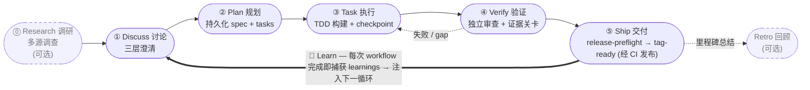
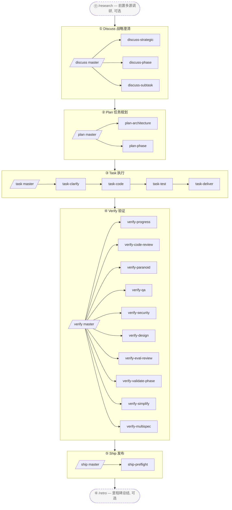

<p align="center">
  
</p>

[English](./README.md) | **简体中文** | [繁體中文](./README-tw.md) | [日本語](./README-ja.md) | [한국어](./README-ko.md) | [Português (Brasil)](./README-pt-BR.md) | [Türkçe](./README-tr.md) | [Русский](./README-ru.md) | [Tiếng Việt](./README-vi.md) | [ไทย](./README-th.md)

> _AI coding harness 包管理器 + composition orchestrator_ —— 它把开源生态最优秀的组件装配成一个可执行的 engine，由三层 **BDD → SDD → TDD** 方法论接线。

> **harnessed 是 orchestration brain + prompt library**，通过三个秒级纯函数 CLI 驱动 native subagent spawn —— `harnessed gates`（哪些子工作流触发）、`harnessed prompt`（子工作流的 spawn-ready prompt）、`harnessed checkpoint`（记录进度）。

[](https://npmjs.com/package/harnessed)
[](./LICENSE)
[](https://github.com/sponsors/easyinplay)

> Not affiliated with, endorsed by, or sponsored by Harness Inc. (见 [NOTICE](./NOTICE))

---

## ✨ TL;DR

**它怎么运作**: harnessed **装配** 市面上最优秀的开源 Claude Code agent (gstack、GSD、superpowers、planning-with-files),再用强意见 composition skill 把它们 **编排** 成一条工作流。它 **不** vendor 上游代码 —— manifest 描述 install/check,composition skill 指挥多上游协作 (所以上游升级只是一次 re-install,从不需要手动 sync code)。

### 🔁 运转循环 (operating loop)

> **Discuss → Plan → Build → Verify → Ship**,由一个 **Learn** 循环闭合 —— 跨三层栈机器化执行 (gstack 治理 · GSD 编排 · superpowers TDD · checkpoint 证据)。原始 agent 工作会漂移;harnessed 把它变成一条 source-of-truth 路径,进度和证据落盘留存,而不是活在对话里。**学习是自动的**: 每条完成的 workflow 都会把它的 failure/loop/reject 信号追加进 `.planning/LEARNINGS.md`,并注入下一轮循环 —— 这是 always-on 的,**不** 取决于可选的 Retro。Retro (`/retro`) 是独立的、可选的里程碑总结。



---

## 🧱 什么是三层栈?

harnessed 的三层栈方案是软件工程上既有的 **BDD → SDD → TDD** 嵌套的实现: 三个嵌套的反馈循环,各回答一个不同的问题。**三层就是这三个循环** (稳定的理论);harnessed 把开源生态 **组合 (compose)** 进每个循环 —— 而这些组件 **彼此重叠**,这正是 composition orchestrator 要去仲裁的地方。

| 层 | 循环 | 它回答的问题 | 组合自 (彼此重叠) |
|---|---|---|---|
| **① Behavior** | BDD | 做 *什么* + 怎么算做完 | gstack `/office-hours` 治理 · GSD discuss · superpowers brainstorming → 验收标准 |
| **② Spec** | SDD | *如何* 组织结构 | GSD plan-phase → requirements / design / tasks · 契约 (Spec Kit / ECC patterns) |
| **③ Implementation** | TDD | 它到底能不能 *跑* | superpowers TDD red-green · subagent 执行 · GSD verify-work · ralph-loop completion |

这些循环是 **嵌套的镜头,不是阶段** —— 经典的 Cucumber BDD-外环 + TDD-内环双环,在 GenAI 时代再加一道 SDD spec 环扩展成三环。harnessed 把默认的外→内遍历跑成它的 5-stage cadence,外加 **它今天就已经落地的 back-edge**: Verify 把失败工作踢回 Task,撞上灰色地带的 subagent 在继续前先 round-trip 回澄清,每条 shipped 的循环把 learnings 喂回下一轮 Discuss。(更细粒度的结构化 back-edge —— 例如契约矛盾直接路由回 Spec、模糊需求回 Behavior —— 在 roadmap 上,尚未 ship。harnessed 是三环的线性-cadence 实现;完整的 routed graph 是它的演进路径。)

**组件重叠 —— 这正是重点。** **GSD** 作为编排骨干贯穿全部三个循环,**gstack** 横跨 Behavior + Review,**superpowers** 横跨 Behavior (brainstorm) + Implementation (TDD)。harnessed 把它们接线 —— 并仲裁重叠 —— 进一个 engine。两条 **横切纪律 (cross-cutting disciplines)** 贯穿每一层: **karpathy 心法** (*怎么* 写代码 —— simplicity-first、surgical diff) + **mattpocock 招式** (按需的战术工具,如 `/diagnose`、`/zoom-out`)。

对应到上面的 runtime 循环: **Discuss = Behavior (BDD) · Plan = Spec (SDD) · Build = Implementation (TDD)**,然后 **Verify + Ship** 用证据关卡闭合。

---

> 等等 — harnessed 真能跟 superpowers / gstack / GSD 这种上游巨头分庭抗礼?
> 当然 —— 我们**站在巨人的肩膀上**。牛顿说,这样看得更远。🧐
> ……*(小声)* 不过仔细看,更像肩上那只鹦鹉。
> 算了 —— 鹦鹉学舌,我们至少**会编排**。🦜

---

## 🎯 关键差异化

- **三层栈机器化执行** —— 即 **BDD→SDD→TDD 嵌套三环** ([那是什么?](#-什么是三层栈)),组合自 `gstack` + `GSD` + `superpowers` (彼此重叠,GSD 作骨干),并以 `karpathy 4 心法` + `mattpocock 23 招式` 作为横切纪律
- **不 vendor 上游** —— manifest 描述 install/check;上游升级时用户只需 re-install 即获最新版
- **Composition Skill** —— 自家 workflow skill 当指挥棒,调度多个上游协同演奏。**1 个 super-master `/auto` + 5 个 stage master + 20 个 sub-workflow + 2 个 standalone = 28 个 namespace-layered workflow**,完整 5-stage 机器化 (`/auto` 跨 stage 一键 / `/discuss /plan /task /verify /ship` 单 stage / 20 个三层栈 sub / `/research /retro` 2 个 standalone)
- **L0 Discipline Substrate** —— 全局 cross-stage 行为基准 (karpathy 心法 + output-style + language + operational + priority + protocols),applied universally
- **包管理器思维** —— install dependency graph 自动解析、doctor 健康检查、install-base 一键装齐
- **统一入口** —— 用户面对 `/discuss /plan /task /verify /ship` 等 master slash command,不需学每家上游术语;sub command 显式调用单 stage (例如 `/discuss-strategic` 只跑战略层澄清)
- **Forward continuation (前向接续)** —— `harnessed next` / `harnessed advance` 带你跨越 task 与 phase: 一个完成时,下一个 **从 `.planning/` 磁盘状态派生** (一个 phase 完成 = 它的 `PLAN` 有了匹配的 `SUMMARY`) —— 没有队列要维护,所以中途新增的 phase 会被自动拾取,resume 时从磁盘重新派生。每一轮的 `NEXT-UNIT` breadcrumb 指向下一步该做什么

---

## 🆚 harnessed vs 原生 Claude Code / Codex

原生 agent 给你原语 (primitive);harnessed 把它们接线成方法论。原生那一格说某个原语「存在」的地方,你仍要每个项目自己去设计、接线、维护它 —— harnessed 把它预先组合好、由 engine 驱动地交付。

| 维度 | 原生 Claude Code | 原生 Codex | harnessed |
|---|---|---|---|
| **工作流 / 方法论** | 只有原语 —— 每次自己设计流程 | 原语更少 —— 每条 prompt 即兴发挥 | 编码化的 **Discuss→Ship** 5-stage 三层栈 engine —— BDD + SDD + TDD 循环 + 2 横切 (Review + Ship) |
| **指令注入** | `CLAUDE.md` + skill + hook 存在,但静态、得手工接线 | 只有 `AGENTS.md` —— 无 skill/hook | 每轮 breadcrumb hook + task-scoped 路由 + 每轮注入 learnings |
| **状态 / 进度** | 对话 context —— `/clear` / compaction 即丢失 | 对话 context —— 无持久化层 | 落盘 `.planning/` + `current-workflow.json` ledger + checkpoint 证据 |
| **跨 session 恢复** | 手工重新解释 context | 手工重新解释 context | `harnessed status --recover`: you-are-here + 下一步 |
| **验证 / 「完成」** | agent 自报「完成」 | agent 自报「完成」 | 独立审查 subagent + **fail-CLOSED 证据 guard** (缺产物 = 没完成) |
| **Subagent 编排** | 有 subagent + Agent Teams,但得手工编排 | 无 subagent/team 原语 | `gates → prompt → spawn → checkpoint`;Agent Teams 按任务自动启用 |
| **学习循环** | 无 | 无 | `LEARNINGS.md` 自动捕获 + 注入下一轮 |
| **平台覆盖** | 仅 Claude Code | 仅 Codex | **Cross-harness** —— Claude Code 主力,Codex 经 platform 层 |

> 原生 agent 在零配置、零开销的琐碎一次性改动上取胜。一旦工作跨越多步骤、多 session 或多 subagent —— 即兴漂移和迷失在对话里的状态开始让你付出代价 —— harnessed 就开始挣回它的价值。

---

## 📦 快速安装

**走 npm**(推荐 —— 两条通道同为一等公民,版本保持同步):

```bash
npm install -g harnessed && harnessed setup
```

> Windows PowerShell 5.x 不支持 `&&` 链接 —— 改用 `;` 或分两行 (`npm install -g harnessed; harnessed setup`)。bash / zsh / PowerShell 7+ / cmd.exe 都正常。

**没有 Node.js?独立二进制** —— 分平台安装,后续用 `harnessed update` 自更新:

```bash
# macOS (Apple Silicon) / Linux (x64)
curl -fsSL https://raw.githubusercontent.com/easyinplay/harnessed/main/install.sh | bash
```

```powershell
# Windows (x64)
irm https://raw.githubusercontent.com/easyinplay/harnessed/main/install.ps1 | iex
```

🤖 **或让 AI 帮你装** —— 把下面这句话发给 Claude Code (或任何 AI 助手):

> Install harnessed for me following the guide at `https://github.com/easyinplay/harnessed/blob/main/INSTALL-WITH-AI.md`

AI 会自动 fetch 文档 + 跑安装,处理 OS / 权限 / PATH / corepack 等 edge case —— 无需复制大段文字。

> [!TIP]
> 🚀 **很多人喜爱的 Agent Teams 和 Subagent 功能,在 harnessed 中会根据任务自动启用!**
> 无需手动配置 `CLAUDE_CODE_EXPERIMENTAL_AGENT_TEAMS` —— `harnessed setup` 会自动写入 `~/.claude/settings.json`。Pattern A 全栈三路 / Pattern C 4-specialist 等 multi-agent workflow 即开即用。

---

## ⏱️ First 5 Minutes

从零到一条运转中的 workflow,最短路径:

```bash
# 1. 安装 (任选通道 —— 见上方快速安装)
npm install -g harnessed && harnessed setup
# 或二进制(无需 Node.js): curl -fsSL https://raw.githubusercontent.com/easyinplay/harnessed/main/install.sh | bash && harnessed setup
```

```
# 2. 在 Claude Code 内 —— 启动你的第一条 workflow
/auto "你的第一个需求"               # 新手默认: 端到端跑完所有 stage
```

```bash
# 3. 迷路了? 不带参数跑 harnessed —— 它会告诉你身在何处 + 下一步是什么
harnessed
#   → you-are-here 仪表盘 (active phase + 每步状态) + 一行 NEXT: auto|manual|done
#   不必记 status / next / resume —— 一个命令 (comet `/comet` 类比,read-only)
#   加 --json 输出机器可读格式
```

```bash
# 4. 中断后随时恢复
harnessed            # 同一个 you-are-here 视图
harnessed resume     # 从最近 checkpoint 继续
```

> 想更精细地控制哪个 stage 何时跑? 看下面 3 种模式。

---

## 🚀 快捷使用 — 3 种选择

按用户介入程度由低到高:

### 🎯 Auto Mode (推荐新手 / 不想动脑子)

```
/auto "需求 X"

# 大需求可显式分阶段 (一般不需要 —— AI 自动判断并路由进入;
# 若你自认是大需求可强制):
/auto "需求 X" --staged
```

> 不想动脑子,或者刚入门 —— 一切交给 harnessed。自动跑完全部 6 stage (research conditional → discuss → plan → task → verify → retro mandatory),中间不停。AI 1-shot 自动判断需求复杂度,大需求建议切 `--staged` 模式 (每 stage 完停下 review);开始前 prompt「你对需求有清晰认知吗?」—— 若否 → 自动加跑 `/research` 多源调研;末尾以强制 `/retro` 总结收尾。失败 fail-fast,经 `harnessed resume` 续。

### 📂 Stage Mode (推荐熟手 / 想 review 中间结果)

```
/discuss "需求 X"          # 战略 + Phase + 子任务 3 层澄清
/plan "需求 X"             # 架构 (conditional) + 计划持久化
/task "subtask-1"          # 4 sub 串行 (clarify → code → test → deliver)
/verify "phase-1"          # 10 sub conditional 验证
```

> 想自己决定从哪个 stage 开始 / review 中间产出 —— 5 个 master 可独立调用,每个 master 内部仍自动 fan-out 该 stage 所有 sub。

### 🔬 Surgical Mode (专家模式 / 知道自己要什么)

```
/discuss-phase "..."        # 单跑 Phase 层澄清
/plan-architecture "..."    # 单跑架构审查
/verify-paranoid "..."      # 单跑 Paranoid Staff Engineer 审查
# ... 其他 20 个 sub-workflow 任选
```

> 「我是专家,我自己决定」—— 跳过 master,直接调某 sub-workflow。适合已知精确需要哪个 sub 的高级用户 / 复用某单一环节。

---

## 📐 5-stage 流程图



> 虚框 = 可选 standalone (`/research` 战略前调研 / `/retro` 里程碑后总结);实框 = 主流程 5-stage cadence (Ship 停在 tag-ready;由 `publish.yml` CI 完成真正的 publish)。

### 28-Workflow 总览表

| Slash cmd | Stage | Type | Capability / Upstream | Brief |
|-----------|-------|------|----------------------|-------|
| `/auto` | All | **Super-master** | masterOrchestrator (跨 6 stage) | 一键完整跑 6 stage (research conditional → discuss → plan → task → verify → retro mandatory);AI 1-shot 复杂度 judge + 理解度 check + retro mandatory;`--staged` opt-in stage gate |
| `/discuss` | ① Discuss | Master | masterOrchestrator | 3 sub 并行 gate-eval (chain-isolation 铁律) |
| `/discuss-strategic` | ① Discuss | Sub | gstack `/office-hours` + `/plan-ceo-review` + planning-with-files | 战略层 —— 新功能 / 新 milestone / 产品方向的强制治理 (findings.md 持久化) |
| `/discuss-phase` | ① Discuss | Sub | GSD `/gsd-discuss-phase` + planning-with-files | Phase 层 —— ≥2 个 open decision / 灰色地带澄清 (findings.md + knowledge.md 持久化) |
| `/discuss-subtask` | ① Discuss | Sub | superpowers brainstorming + `/grill-with-docs` | 子任务层 —— ≥2 种 approach / 核心算法 / API contract (ephemeral 短讨论, 不持久化) |
| `/plan` | ② Plan | Master | masterOrchestrator | 串行 invoke 2 sub (architecture conditional → phase always) |
| `/plan-architecture` | ② Plan | Sub | gstack `/plan-eng-review` | 架构层 —— 复杂架构的强制治理关卡 |
| `/plan-phase` | ② Plan | Sub | GSD `/gsd-plan-phase` + planning-with-files `/plan` | 计划层 —— 持久化 `task_plan.md` + `progress.md` |
| `/task` | ③ Task | Master | masterOrchestrator | 每子任务串行 invoke 4 sub (clarify → code → test → deliver) |
| `/task-clarify` | ③ Task | Sub | superpowers brainstorming + `/grill-with-docs` conditional | 子任务起步澄清 gate |
| `/task-code` | ③ Task | Sub | karpathy 4 心法 + `/zoom-out` / `/improve-codebase-architecture` / `/diagnose` conditional | 子任务编码 + 跨 session progress.md 同步 |
| `/task-test` | ③ Task | Sub | superpowers TDD red-green-refactor + `/diagnose` conditional | 核心逻辑 TDD 强制 (alias mattpocock `/tdd`) |
| `/task-deliver` | ③ Task | Sub | `ralph-loop` SDK wrapper + Agent Teams conditional | 至 verbatim `COMPLETE` + R20.10 max_iter fallback |
| `/verify` | ④ Verify | Master | masterOrchestrator | 10 sub 按场景 conditional dispatch |
| `/verify-progress` | ④ Verify | Sub | GSD `/gsd-verify-work` + `/gsd-progress` | 必跑串行起点 —— UAT 验收 + 状态同步 |
| `/verify-code-review` | ④ Verify | Sub | `code-review` 多 subagent fan-out | 高置信度 finding 并行 |
| `/verify-paranoid` | ④ Verify | Sub | gstack `/review` (Paranoid Staff Engineer) | 关键模块 PR 前强制 |
| `/verify-qa` | ④ Verify | Sub | gstack `/qa` + playwright-cli / `@playwright/test` / webapp-testing | 端到端 QA (has_ui_changes conditional) |
| `/verify-security` | ④ Verify | Sub | gstack `/cso` | OWASP / auth / secrets (has_auth_or_secrets conditional) |
| `/verify-design` | ④ Verify | Sub | gstack `/design-review` + ui-ux-pro-max + design-taste-frontend | 设计系统一致性 (has_design_changes conditional) |
| `/verify-eval-review` | ④ Verify | Sub | GSD `/gsd-eval-review` | AI phase eval 覆盖审计 (has_ai_phase conditional;配 plan 侧 gsd-ai-integration-phase) |
| `/verify-validate-phase` | ④ Verify | Sub | GSD `/gsd-validate-phase` | Nyquist requirement→test 覆盖查漏 (requires_coverage_audit conditional) |
| `/verify-simplify` | ④ Verify | Sub | `code-simplifier` | 末尾串行简化 |
| `/verify-multispec` | ④ Verify | Sub | 4-specialist Agent Team Pattern C | 关键发布 / 大重构 PR 升级 (互相 SendMessage 质询) |
| `/ship` | ⑤ Ship | Master | masterOrchestrator | Verify 之后的发布 stage —— preflight → 委派 PR/deploy 给 gstack `/ship` → 经 CI publish (tag-ready 边界) |
| `/ship-preflight` | ⑤ Ship | Sub | `harnessed release-preflight` | Read-only 发布就绪关卡 (CHANGELOG `[Unreleased]` / version / git-clean / tag-absent);失败即 block |
| `/research` | Standalone | Standalone | Tavily / Exa MCP + ctx7 + GSD `/gsd-discuss-phase` | 多源调研 (Stage ① alternate) |
| `/retro` | Standalone | Standalone | gstack `/retro` + planning-with-files RETROSPECTIVE.md | 项目 / 里程碑结束总结 |

> Master orchestrator 自动 gate-route 到合适的 sub (chain-isolation 铁律 —— 不 fire 的 sub 透明声明跳过)。
> 直接调用 sub 也可绕过 master 单跑某 stage,例如 `/discuss-strategic "新功能 X"`。

---

## ⚡ 使用流程

5-stage 三层栈方法论 —— 推荐用 5 个 master orchestrator 串行驱动:

```
/discuss  →  /plan  →  /task  →  /verify  →  /ship
   ①         ②        ③         ④           ⑤
```

| Stage | Master | 主要 sub-workflow | 上游协同 |
| ---- | ---- | ---- | ---- |
| ① **Discuss** | `/discuss` | strategic / phase / subtask (3 并行) | gstack `/office-hours` + GSD `/gsd-discuss-phase` + superpowers brainstorming |
| ② **Plan** | `/plan` | architecture (conditional) → phase | gstack `/plan-eng-review` + GSD `/gsd-plan-phase` + planning-with-files |
| ③ **Task** | `/task` | clarify → code → test → deliver (每子任务 4 串行) | karpathy 心法 + mattpocock 招式 + superpowers TDD + `ralph-loop` |
| ④ **Verify** | `/verify` | progress → 5 并行 conditional → simplify (+ multispec critical) | GSD `/gsd-verify-work` + code-review + gstack `/review` / `/qa` / `/cso` / `/design-review` + code-simplifier |
| ⑤ **Ship** | `/ship` | preflight (发布就绪关卡) → 委派 PR/deploy | `harnessed release-preflight` + gstack `/ship` + `publish.yml` CI (tag-ready 边界) |

实操示例:

```bash
# 1. 装 workflow 上游 (一行装齐 gstack + GSD + superpowers + planning-with-files)
harnessed setup

# 2. 在 Claude Code 内跑 5-stage cadence
/discuss "新功能 X"               # 战略 + Phase + 子任务 3 层澄清
/plan "新功能 X"                  # 架构 (conditional) + 计划 (任务图持久化)
/task "subtask-1: API contract"   # 每子任务 4 sub 串行
/verify "phase-1"                 # 10 sub conditional
/ship                             # release-preflight 关卡 → PR/deploy (tag-ready;经 CI publish)

# 3. 中断后恢复 (任何时候)
harnessed resume
```

> 也可直接调 sub 绕过 master 单跑某一层,例如 `/verify-paranoid` 只跑 Paranoid Staff Engineer 审查。

📊 详细 mermaid + 各 stage 完整说明:[docs/WORKFLOW.md](./docs/WORKFLOW.md)

---

## 🗂️ 架构 (5-stage namespace-layered)

### 1. 目录结构

```
harnessed/
├── manifests/                  # L1: 上游描述层 (NOT vendored)
├── workflows/                  # L6: composition skill (5-stage 指挥棒)
│   ├── discuss/                # Stage ① 3 layer (strategic + phase + subtask)
│   │   ├── auto/               # /discuss master gate-route
│   │   ├── strategic/          # /discuss-strategic (gstack /office-hours + /plan-ceo-review)
│   │   ├── phase/              # /discuss-phase (GSD /gsd-discuss-phase)
│   │   └── subtask/            # /discuss-subtask (superpowers brainstorming)
│   ├── plan/                   # Stage ② (architecture + phase 任务图)
│   ├── task/                   # Stage ③ (clarify + code + test + deliver)
│   ├── verify/                 # Stage ④ (progress + code-review + paranoid + qa + cso + design + simplify + multispec)
│   ├── ship/                   # Stage ⑤ (preflight 发布就绪关卡 → 委派 PR/deploy 给 gstack /ship;tag-ready)
│   ├── research/               # standalone Stage ① alternate
│   ├── retro/                  # standalone post-⑤ milestone close
│   ├── capabilities.yaml       # L5a: ~100 entry, 7 category SoT
│   ├── defaults.yaml           # ralph_max_iterations per workflow phase
│   ├── judgments/              # L5a: 三层栈判据 + parallelism + tdd + fallback + rules-routing
│   │   ├── strategic-gate.yaml
│   │   ├── phase-gate.yaml
│   │   ├── subtask-gate.yaml
│   │   ├── parallelism-gate.yaml         # L5b execution mechanism routing
│   │   ├── tdd-gate.yaml
│   │   ├── fallback.yaml                 # 3 铁律: skip_with_transparency + override + chain_isolation
│   │   ├── web-design-routing.yaml       # UI 设计工具路由
│   │   ├── web-testing-routing.yaml      # E2E / 浏览器测试工具路由
│   │   ├── web-search-routing.yaml       # 网页搜索 / 文档抓取路由
│   │   └── stage-routing.yaml            # master orchestrator sub-stage 路由
│   └── disciplines/            # L0: 全局 cross-stage 行为基准
│       ├── karpathy.yaml       # 4 心法 + ≤200L
│       ├── output-style.yaml   # BLUF + no-emoji + no-em-dash
│       ├── language.yaml       # zh-Hans default + English preserve
│       ├── operational.yaml    # biome preempt + A7 + commit safety
│       ├── priority.yaml       # skill conflict 仲裁
│       └── protocols.yaml      # cc-handoff design doc 自包含
├── routing/                    # L4: routing engine SSOT (decision_rules.yaml)
├── schemas/                    # L3: JSON Schema (IDE / CI consume)
├── src/                        # L4: TS engine (workflow + routing + cli + installers + checkpoint + audit + state)
├── tests/                      # vitest unit + integration + dogfood (R8.1 dogfood-first)
├── scripts/                    # CI gate (check-workflow-schema, transparency-verdict, state-archive)
├── .planning/                  # project memory (STATE + ROADMAP + REQUIREMENTS + per-phase + milestones)
└── docs/adr/                   # 架构决策记录
```

### 2. 逻辑分层 (8 层)

```
┌────────────────────────────────────────────────────────────┐
│ L7 User-facing slash cmd + harnessed CLI                    │
│   /discuss /plan /task /verify /ship (master) + 20 sub + /research /retro + /auto super-master
│   + direct gstack invoke (30+ optional): /office-hours /review /qa /...
├────────────────────────────────────────────────────────────┤
│ L6 Workflow orchestration (workflows/<stage>/<sub>/)         │
├────────────────────────────────────────────────────────────┤
│ L5b Execution Mechanism (orthogonal): subagent / Agent Teams │
│   / 主 session + ralph-loop wrapper                         │
│   parallelism-gate.yaml: 默认 subagent → escalate 5 触发     │
│   Pattern A 全栈三路 / B 对立假设 / C 多维度审查              │
├────────────────────────────────────────────────────────────┤
│ L5a Capability + Judgment + Defaults SoT                    │
│   capabilities.yaml (7 category) + judgments/ (10 file) +    │
│   defaults.yaml                                              │
├────────────────────────────────────────────────────────────┤
│ L4  Runtime engine (workflow / routing / handlers)           │
├────────────────────────────────────────────────────────────┤
│ L3  TypeBox schema + CI gate                                 │
├────────────────────────────────────────────────────────────┤
│ L2  Installer + Manifest engine                              │
├────────────────────────────────────────────────────────────┤
│ L1  Upstream components (NOT vendored)                       │
├────────────────────────────────────────────────────────────┤
│ L0  Discipline Substrate (全局生效)                          │
│   karpathy 心法 + output-style + language + operational +    │
│   priority + protocols (applied universally to L1-L7)       │
└────────────────────────────────────────────────────────────┘
```

### 3. Cross-cutting Capabilities (capabilities.yaml — 7 category, ~100 entry)

```
behavioral (6):       karpathy-guidelines + output-style + language + operational + priority + protocols
tool-slash-cmd (~60): gstack 30+ optional + gsd 10+ + mattpocock 12 高频 + 等
tool-mcp (3):         chrome-devtools-mcp / tavily-mcp / exa-mcp
tool-cli (2):         ctx7 / gws
tool-plugin (2):      planning-with-files / @playwright/test
tool-bundled (3):     ralph-loop / webapp-testing / playwright-cli
agent-platform (3):   agent-teams-create / send-message / shutdown
```

### 4. 数据流示例 (用户调用 `/discuss "新功能 X"`)

```
[L7] User invokes /discuss "新功能 X"
  ↓
[L6] workflows/discuss/auto/workflow.yaml master orchestrator
  ↓
[L5a] judgments.strategic-gate.fires + phase-gate.fires + subtask-gate.fires (3-way 并行 eval)
  ↓
[L4] judgmentResolver.ts (4-level ref split) + exprBuilder.ts (expr-eval evaluate)
  ↓
[L0] discipline.priority-hierarchy 仲裁工具冲突 / output-style 格式化输出
  ↓
[fires=true sub] → invoke sub-workflow (/discuss-strategic / /discuss-phase / /discuss-subtask)
  ↓ for each sub:
      ├─ behavioral_layer: karpathy-guidelines (always-on)
      ├─ tools_available: planning-with-files / ctx7 / mattpocock by-condition
      ├─ parallelism: judgments.parallelism-gate.<route>.fires (L5b mechanism)
      └─ phase invocations execute via capability template interpolation
  ↓
[fallback.yaml chain-isolation] 三层独立判断, 不串行依赖
[Skip 透明声明] 不 fire 的 sub → "⚠️ 跳过 <sub>, 因为 <reason>"
  ↓
planning-with-files /plan (cross-cutting tool) → write artifacts to .planning/<phase-id>/
  ↓
[L4] state.ts writeCurrentWorkflow (proper-lockfile) + audit.append (12-field JSONL)
```

### 5. 抉择路由矩阵 (rules-based, codified in judgments + capabilities)

| 场景 | Default → Escalate |
|------|---------------------|
| 并行机制 | subagent → Agent Teams Pattern A/B/C (5 触发) |
| UI 设计主方案 | **两段式**:ui-ux-pro-max(受众 / 交互逻辑 / 设计主轴 — 结构骨架)→ design-taste-frontend(anti-slop 视觉打磨 overlay,跨 agent taste-skill) |
| E2E 浏览器探查 | playwright-cli (Bash 一行, token 省) |
| E2E commit-able TS | @playwright/test 默认 |
| E2E Python 后端联动 | webapp-testing |
| 性能 / a11y / 内存诊断 | chrome-devtools-mcp |
| Web 搜索 (关键词) | Tavily MCP 默认 |
| Web 搜索 (描述式 / 学术) | Exa MCP |
| 库 API 文档 | ctx7 CLI |
| GitHub URL | gh CLI |
| 单 URL 抓取 | WebFetch 内置 |
| Gmail / Drive / Calendar | gws CLI |
| 架构审查 (复杂) | gstack /plan-eng-review |
| TDD 强制 (核心算法) | superpowers TDD OR mattpocock /tdd |
| 关键模块 PR | gstack /review |
| 大重构 PR 多维度审查 | 4-specialist Agent Team Pattern C |
| 跨 session hand-off | discipline.protocols self-contained design doc |
| `/auto` 复杂度大需求 | AI 1-shot judge → 自动建议 `--staged` (n abort 建议手动 `/discuss`) |
| `/auto` 需求理解度 | 开始前 prompt → n 自动加 `/research` 多源调研 |

---

## 🛠️ 维护命令 (Operational)

> 这些是 harnessed 自身的维护命令 (setup / 健康检查 / 备份回滚 / 状态恢复等)。日常 feature 开发用上面的 slash command 即可,这块通常用不到。

**v4.0 — 编排大脑。** slash command 在 Claude Code 主 session 内跑澄清 (让问题能触达你),再 spawn CC-native subagent (启用 Agent Teams + 澄清 round-trip)。harnessed 负责 gate 评估 (`harnessed gates`) 和 spawn-ready prompt (`harnessed prompt`),由主 session 完成 spawn。`harnessed run` 保留供 CI/headless 使用。

### CLI 命令

| 命令 | 说明 |
| ---- | ---- |
| `harnessed setup` | 一次性 setup,装 workflow skills 到 `~/.claude/skills/` + MCP 到 `~/.claude.json` |
| `harnessed gates <master>` | 评估某 master stage 下哪些 sub-workflow 会 fire (JSON: fire/skip/parallelism)。供 slash command 编排 native spawn |
| `harnessed prompt <sub>` | 输出某 sub-workflow 的 spawn-ready prompt (role + checklist + disciplines + completion/clarification 协议) |
| `harnessed checkpoint <action> <sub>` | 记录 sub-workflow 的 start/complete/fail 到 `~/.claude/harnessed/checkpoints/` |
| `harnessed` (无参数) | Zero-arg you-are-here: active-workflow 仪表盘 + `NEXT: auto\|manual\|done` + run hint;`--json` 机器可读;无 active workflow → onboarding hint (comet `/comet` 类比,read-only) |
| `harnessed next` | 确定性的下一步契约。workflow 内: `NEXT: auto\|manual\|done`。当 workflow 的所有 sub 都已解决,它会落到下一 **cross-unit** (下一 phase/task,从 `.planning/` 磁盘状态派生),带 exit-code 契约 (`0` advance · `2` done · `10` blocked) |
| `harnessed advance` | Forward continuation —— 打印跨 milestone 的下一工作单元 (下一 phase/task) 及运行它的命令。Print-only (由主 session 运行下一个 `/auto`);拒绝越过未完成的更早 phase (`--force` 覆盖);`--json` 驱动 `while harnessed advance --json; do :; done` 循环 |
| `harnessed reject <sub>` | 标记某 sub 为 user-rejected (terminal,与 `failed` 不同) |
| `harnessed compact [--tokens <n>]` | 汇总+逐出已解决的 ledger 条目 (G6-safe: `fail_count>0` 永不逐出);`checkpoint complete --tokens` 时自动触发 |
| `harnessed workflows` | 列出 in-flight workflow (每仓库一条) |
| `harnessed learn "<lesson>"` | 把一条 prose learning 追加到本仓库的 `.planning/LEARNINGS.md` |
| `harnessed run <name>` | 通过 in-process SDK spawn 运行 workflow (CI/headless 模式)。slash command 改用 CC-native spawn |
| `harnessed resume` | session 中断后从最近 checkpoint 恢复 |
| `harnessed status` | 当前 phase + lock holder |
| `harnessed doctor` | 健康检查 (Node / MCP / jq / Win bash / routing / token budget / skill 完整性 / GateGuard 冲突 / update-available 等) |
| `harnessed update [--check\|--upstreams\|--migration-report]` | 自更新,按安装通道分流:二进制安装从 GitHub releases 原地自替换(sha256 校验,保留上一版可回滚);npm 安装执行 `npm i -g harnessed@latest`。`--check` 报告最新版本;`--upstreams` 重跑基础 manifests;`--migration-report` 为只读陈旧状态盘点 |
| `harnessed release-preflight` | Read-only 发布就绪关卡 (CHANGELOG `[Unreleased]` / version / git-clean / tag-absent);未就绪则 exit 1。即 Ship-stage 关卡 |
| `harnessed retro --done` | 跑完 `/retro` 后重置 retro-reminder phase 计数器 (清掉每轮的 RETRO-DUE 提醒) |
| `harnessed install <name>` | 装上游 manifest |
| `harnessed uninstall [name]` | 反向卸载 |
| `harnessed backup` | snapshot 备份管理 |
| `harnessed rollback <timestamp>` | 一行回滚 (EOL preserve + sha1 verify) |
| `harnessed gc` | 清理过期 backup |
| `harnessed audit-log` | 路由透明日志 query (支持 `--filter` jq 表达式) |

### 参数 (Flags)

> 所有命令默认 **apply (immediate write)**,无需加 flag。高级用户可加 `--dry-run` 预览。

| Flag | 说明 |
| ---- | ---- |
| `--dry-run` | 预览不写盘 (高级用户 opt-in) |
| `--non-interactive` | CI / 脚本场景 |
| `--system` | 允许 L4 全局装 (否则降级 L1 npx ephemeral) |
| `--yes` | 卸载时跳过交互确认 |
| `--full-diff` | 展开 > 200 行的 diff 折叠 |
| `--no-color` | 强制 nocolor (即使 TTY) |
| `--task <text>` | `run` —— 任务描述 (传入 workflow `gateContext.task`) |
| `--task-stdin` | `run` —— 从 stdin 读任务描述直到 EOF (避免 shell 转义引号/$/`) |


---

## ❓ FAQ

<details>
<summary><b>Q1. 装了 harnessed 还需要装 superpowers / gstack / GSD 上游吗?</b></summary>

<br>

需要,但**用户感知 = 一行命令**:

```bash
harnessed setup  # 自动装齐 gstack + GSD + superpowers + planning-with-files;28 个 workflow skill 一并落到 ~/.claude/skills/ + Agent Teams env var 自动写 ~/.claude/settings.json
```

类比 `brew install <formula>` 拉取全套依赖集 —— 你不需要单独 `brew install` 每个依赖项。

</details>

<details>
<summary><b>Q2. 为什么不直接 vendor superpowers / gstack 进 harnessed 仓库?</b></summary>

<br>

4 条理由:

1. **差异化哲学** —— harnessed 是「装配主义包管理器」对位「all-in-one 自建派」。vendor = 失去 wedge → 沦为又一个 plugin pack
2. **License + attribution 噩梦** —— vendor 4-5 个主动维护的上游 = 复杂 license 拼盘
3. **上游升级方向反转** —— 当前 manifest 描述方式,上游升级用户 re-install 即得新版;vendor 后被迫手动 sync code,永远落后
4. **Bus factor 1** —— 单 maintainer 维护 vendor 的 4-5 上游 = 加速 burnout

</details>

<details>
<summary><b>Q3. gstack / GSD / superpowers 看起来都是 plan/discuss 类,是不是重叠?</b></summary>

<br>

**不是**。它们是三层栈的不同阶段:

| 阶段 | 上游 | 职责 |
| ---- | ---- | ---- |
| Governance | gstack | 多角色决策关卡 (CEO / EM / Designer / Paranoid Engineer) |
| Brainstorming | superpowers | 子任务设计澄清、方案对比 |
| Orchestration | GSD | 高层 phase 任务图 + 依赖分析 |
| Persistence | planning-with-files | 持久化 `task_plan.md` / `progress.md` / `findings.md` |

`/discuss /plan /task /verify /ship` —— 5 个 master 把 5 阶段串起来;每个 master 内部再 delegate 到对应 sub。每个阶段做不同的事,输出喂给下一阶段。**没有合并**。

</details>

<details>
<summary><b>Q4. workflow phase 之间是自动跑还是等用户?</b></summary>

<br>

看 `workflows/<name>/SKILL.md` frontmatter 的 `pause` 字段:

- `pause: human_review` → 阻塞等用户 approve (governance gate / final lock,如 `/discuss-strategic` gstack `/office-hours` + `/plan-architecture` `/plan-eng-review` 锁定关卡)
- 无 `pause` → 自动 chain 到下一 phase

每个 phase 输出写到 `~/.claude/harnessed/checkpoints/`,session 中断后 `harnessed resume` 从最近 checkpoint 继续。

</details>

<details>
<summary><b>Q5. harnessed 自己是 CC plugin 吗?</b></summary>

<br>

混合体:

- `npx harnessed@latest setup` 跑的是 **Node.js CLI** (`bin/harnessed`) —— 或使用一行安装器的独立二进制(无需 Node.js)
- setup 装的 **workflow skills** (markdown) 进 `~/.claude/skills/`,由 Claude Code 运行时加载
- `/discuss` / `/plan` / `/task` / `/verify` 等是 CC 内的 slash command,触发 skill 执行
- CLI 和 CC skill 共享 `~/.claude/harnessed/checkpoints/` 状态目录

</details>

---


## License

[Apache-2.0](./LICENSE) —— 见 [NOTICE](./NOTICE) (含 Harness Inc. 商标 disclaimer)

支持开发: [](https://github.com/sponsors/easyinplay)
