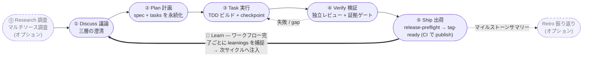
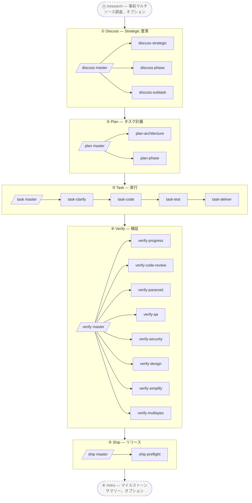

# harnessed

[English](./README.md) | [简体中文](./README-cn.md) | [繁體中文](./README-tw.md) | **日本語** | [한국어](./README-ko.md) | [Português (Brasil)](./README-pt-BR.md) | [Türkçe](./README-tr.md) | [Русский](./README-ru.md) | [Tiếng Việt](./README-vi.md) | [ไทย](./README-th.md)

> **Note (best-effort translation):** This translation is generated/best-effort and may lag behind the English [README.md](./README.md). For the latest and authoritative content, refer to the English version.

> **生の Claude Code を、規律ある一流のエンジニアリングチームに変える。** 一度のインストールで、ガバナンス (governance)、プランニング (planning)、TDD、レビュー (review) を一本の Discuss→Ship ワークフローに織り込む。進捗と証拠はチャットではなくディスク上に残る。

> _AI coding harness パッケージマネージャー + composition orchestrator_ —— 三層スタック協働メソドロジー（gstack ガバナンス + GSD プロジェクトマネージャー + superpowers シニアエンジニア + karpathy 原則 + mattpocock ムーブ）を実行可能な engine として機械実行する

[](https://npmjs.com/package/harnessed)
[](./LICENSE)
[](https://github.com/sponsors/easyinplay)

> Harness Inc. との提携・推薦・スポンサー関係は一切ありません（[NOTICE](./NOTICE) 参照）

---

## ✨ TL;DR

**仕組み**：harnessed は、最良のオープンソース Claude Code agent（gstack、GSD、superpowers、planning-with-files）を **集め**、独自の composition skill を通じて一本のワークフローへと **Orchestrate** します。上流コードを **Vendor しません** —— manifest が install/check を記述し、composition skill が複数上流の協働を指揮します（だから上流のアップグレードは単なる re-install であり、手動の sync code は決して必要ありません）。

### 🔁 オペレーティングループ (operating loop)

> **Discuss → Plan → Build → Verify → Ship**、これを **Learn** ループが閉じる —— 三層スタックを横断して機械実行されます（gstack ガバナンス · GSD オーケストレーション · superpowers TDD · checkpoint 証拠）。生の agent 作業はドリフトしますが、harnessed はそれを source-of-truth な経路に変え、進捗と証拠はチャットに留まらずディスクに残ります。**学習は自動です**：完了したすべてのワークフローは、その failure/loop/reject シグナルを `.planning/LEARNINGS.md` に追記し、次のサイクルへ注入します —— これは always-on であり、オプションの Retro に **依存しません**。Retro (`/retro`) は独立した、オプションのマイルストーンサマリーです。



---

## 🧱 三層スタックとは？

harnessed の三層スタックは、ソフトウェアエンジニアリングで確立された **BDD → SDD → TDD** のネストの実装です：3 つのネストしたフィードバックループが、それぞれ異なる問いに答えます。**三層とはこのループそのもの**（安定した理論）であり、harnessed はオープンソースエコシステムを各ループへと **コンポーズ (compose)** します —— そしてこれらのコンポーネントは **重なり合います**。それこそが composition orchestrator が調停する対象です。

| 層 | ループ | 答える問い | 構成元（重なり合う） |
|---|---|---|---|
| **① Behavior** | BDD | *何* を作るか + どうなれば完了か | gstack `/office-hours` ガバナンス · GSD discuss · superpowers brainstorming → 受け入れ基準 |
| **② Spec** | SDD | *どのように* 構造化するか | GSD plan-phase → requirements / design / tasks · 契約（Spec Kit / ECC patterns） |
| **③ Implementation** | TDD | それは実際に *動く* か | superpowers TDD red-green · subagent 実行 · GSD verify-work · ralph-loop completion |

これらのループは **ネストしたレンズであって、フェーズではありません** —— 古典的な Cucumber の BDD-外側 + TDD-内側の二重ループを、GenAI 時代の SDD spec リングで拡張した三重ループです。harnessed はデフォルトの外→内の走査を 5-stage cadence として実行し、加えて **今日すでに出荷している back-edge** を備えます：Verify は失敗した作業を Task へ差し戻し、グレーゾーンに当たった subagent は続行前に澄清へ round-trip し、出荷された各サイクルは learnings を次の Discuss へ送り返します。（より細粒度の構造化された back-edge —— 例えば契約矛盾を直接 Spec へ、曖昧な要件を Behavior へルーティングする —— は roadmap 上にあり、まだ出荷されていません。harnessed は三重ループの線形-cadence な実現形であり、完全な routed graph はその進化経路です。）

**コンポーネントが重なり合う —— それが要点です。** **GSD** はオーケストレーションのバックボーンとして三つのループすべてを貫き、**gstack** は Behavior + Review にまたがり、**superpowers** は Behavior（brainstorm）+ Implementation（TDD）にまたがります。harnessed はそれらを接続し —— 重なりを調停し —— 一つの engine にまとめます。2 つの **横断的な規律 (cross-cutting disciplines)** が各層を貫きます：**karpathy 原則**（*どのように* コードを書くか —— simplicity-first、surgical diff）+ **mattpocock ムーブ**（`/diagnose`、`/zoom-out` などのオンデマンドな戦術ツール）。

上の runtime ループへの対応：**Discuss = Behavior (BDD) · Plan = Spec (SDD) · Build = Implementation (TDD)**、そして **Verify + Ship** が証拠ゲートで閉じます。

---

> ちょっと待って — harnessed は superpowers / gstack / GSD のような上流の巨人と本当に張り合えるの?
> もちろん — 私たちは**巨人の肩の上に立っている**。より遠くが見える、とニュートンは言った。🧐
> ... *(ひそひそ)* よく見ると、肩に止まったオウムに近いけど。
> まあいい — オウムは真似るが、私たちは **Orchestrate** する。🦜

---

## 🎯 Key Differentiators

- **三層スタックを機械実行** —— すなわち **BDD→SDD→TDD のネスト三重ループ**（[それは何?](#-三層スタックとは)）、`gstack` + `GSD` + `superpowers` から構成（重なり合い、GSD がバックボーン）、`karpathy 4 原則` + `mattpocock 23 ムーブ` を横断的な規律として
- **上流を Vendor しない** —— manifest は install/check を記述するのみ。上流がアップグレードされたら再インストールするだけで最新版を入手できる
- **Composition Skill** —— 自社製 workflow skill が指揮棒として機能し、複数の上流を協調させる。**1 つのスーパーマスター `/auto` + 5 つのステージマスター + 19 サブ workflow + 2 スタンドアロン = 27 の名前空間階層型 workflow**、5 ステージを完全機械実行（`/auto` でステージ横断ワンショット / `/discuss /plan /task /verify /ship` で単一ステージ / 19 の三層スタックサブ / `/research /retro` の 2 スタンドアロン）
- **L0 Discipline Substrate** —— グローバルなクロスステージ行動ベースライン（karpathy 原則 + output-style + language + operational + priority + protocols）、全体に適用
- **パッケージマネージャーの発想** —— install 依存グラフの自動解決、doctor ヘルスチェック、install-base によるワンショット一括インストール
- **統一エントリーポイント** —— ユーザーは `/discuss /plan /task /verify /ship` マスタースラッシュコマンドに向き合うだけで、各上流の用語を覚える必要はない。サブコマンドで単一ステージを明示実行（例: `/discuss-strategic` はストラテジーレイヤーの澄清のみ実行）
- **Forward continuation（前方継続）** —— `harnessed next` / `harnessed advance` が task と phase をまたいで案内する：一つが完了すると、次は **`.planning/` ディスク状態から導出される**（phase の完了 = その `PLAN` に対応する `SUMMARY` が存在する）—— 維持すべきキューがないので、途中で追加された phase も自動的に拾われ、resume はディスクから再導出する。各ターンの `NEXT-UNIT` breadcrumb が次に何をすべきかを指し示す

---

## 🆚 harnessed vs 原生 Claude Code / Codex

原生 agent は原語 (primitive) を与えます。harnessed はそれらをメソドロジーへと接続します。原生のセルが原語は「存在する」と言う箇所でも、あなたは依然としてプロジェクトごとに自分で設計・接続・保守する必要があります —— harnessed はそれを事前にコンポーズし、engine 駆動で提供します。

| 次元 | 原生 Claude Code | 原生 Codex | harnessed |
|---|---|---|---|
| **ワークフロー / メソドロジー** | 原語のみ —— 毎回フローを自分で設計 | 原語が少ない —— プロンプトごとに自由形式 | コード化された **Discuss→Ship** 5-stage 三層スタック engine —— BDD + SDD + TDD ループ + 2 つの横断（Review + Ship） |
| **命令の注入** | `CLAUDE.md` + skill + hook は存在するが、静的で手作業の接続 | `AGENTS.md` のみ —— skill/hook なし | 各ターンの breadcrumb hook + task-scoped ルーティング + 各サイクルに注入される learnings |
| **状態 / 進捗** | チャット context —— `/clear` / compaction で消失 | チャット context —— 永続化レイヤーなし | ディスク上の `.planning/` + `current-workflow.json` ledger + checkpoint 証拠 |
| **クロスセッション回復** | 手作業で context を説明し直す | 手作業で context を説明し直す | `harnessed status --recover`: you-are-here + 次のステップ |
| **検証 /「完了」** | agent が「完了」を自己申告 | agent が「完了」を自己申告 | 独立レビュー subagent + **fail-CLOSED 証拠ガード**（成果物の欠如 = 未完了） |
| **Subagent オーケストレーション** | subagent + Agent Teams は利用可能だが手作業でオーケストレーション | subagent/team 原語なし | `gates → prompt → spawn → checkpoint`；Agent Teams はタスクごとに自動有効化 |
| **学習ループ** | なし | なし | `LEARNINGS.md` を自動捕捉 + 次サイクルへ注入 |
| **プラットフォーム到達** | Claude Code のみ | Codex のみ | **Cross-harness** —— Claude Code が主力、Codex は platform レイヤー経由 |

> 原生 agent は、ゼロ設定・ゼロオーバーヘッドで済む些細な一度きりの編集で勝ちます。作業が複数のステップ・セッション・subagent にまたがった瞬間 —— 自由形式のドリフトとチャットに埋もれた状態がコストになり始める地点で —— harnessed は自らの価値を稼ぎ始めます。

---

## 📦 Quick Install

```bash
npm install -g harnessed && harnessed setup
```

> Windows PowerShell 5.x は `&&` チェーンに対応していません —— `;` を使うか 2 行に分けてください（`npm install -g harnessed; harnessed setup`）。bash / zsh / PowerShell 7+ / cmd.exe はすべて正常に動作します。

🤖 **または AI にインストールさせる** —— Claude Code（または任意の AI アシスタント）に以下の文を貼り付けてください:

> Install harnessed for me following the guide at `https://github.com/easyinplay/harnessed/blob/main/INSTALL-WITH-AI.md`

AI がドキュメントを自動取得してインストールを実行します。OS / パーミッション / PATH / corepack のエッジケースも対処するので、長いテキストをコピペする必要はありません。

> [!TIP]
> 🚀 **大好評の Agent Teams と Subagent 機能は、harnessed がタスクに応じて自動で有効化します!**
> `CLAUDE_CODE_EXPERIMENTAL_AGENT_TEAMS` を手動で設定する必要はありません —— `harnessed setup` が `~/.claude/settings.json` に自動書き込みします。Pattern A フルスタック三方向 / Pattern C 4-specialist などのマルチエージェント workflow がすぐに動作します。

---

## ⏱️ First 5 Minutes

ゼロから動作するワークフローまでの最短経路:

```bash
# 1. インストール（1 行）
npm install -g harnessed && harnessed setup
```

```
# 2. Claude Code 内で —— 最初のワークフローを開始
/auto "あなたの最初の要件"           # 初心者デフォルト: 全ステージを端から端まで実行
```

```bash
# 3. 迷った? 引数なしで harnessed を実行 —— 今どこにいるか + 次に何をするかを教えてくれる
harnessed
#   → you-are-here ダッシュボード（active phase + ステップごとのステータス）+ 一行の NEXT: auto|manual|done
#   status / next / resume を覚える必要はない —— 一つのコマンド（comet `/comet` 相当、read-only）
#   --json を付けると機械可読出力
```

```bash
# 4. 中断後はいつでも再開
harnessed            # 同じ you-are-here ビュー
harnessed resume     # 最新の checkpoint から続行
```

> どのステージをいつ実行するか、もっと細かく制御したい? 下の 3 つのモードを参照してください。

---

## 🚀 Quick Start — 3 つのオプション

ユーザー介入が少ない順に:

### 🎯 Auto Mode（初心者 / あまり考えたくない方におすすめ）

```
/auto "requirement X"

# 大きな要件の場合はステージを明示できます（通常は不要 —— AI が自動判断してルーティングします;
# 大きな要件だと判断した場合に強制してください）:
/auto "requirement X" --staged
```

> 考えたくない方や始めたばかりの方は、harnessed に任せましょう。途中で止まらずに全 6 ステージを実行します（research conditional → discuss → plan → task → verify → retro mandatory）。AI がワンショットで要件の複雑さを自動判断し、大きな要件では `--staged` モードへの切り替えを提案（各ステージ後にレビューのために停止）。開始前に「要件を明確に理解していますか?」とプロンプト —— いいえの場合 → `/research` マルチソース調査を自動実行。必須の `/retro` サマリーで終了。失敗した場合は即座に停止し、`harnessed resume` で再開。

### 📂 Stage Mode（パワーユーザー / 中間結果をレビューしたい方におすすめ）

```
/discuss "requirement X"          # Strategic + Phase + Subtask 3 層の澄清
/plan "requirement X"             # Architecture（条件付き）+ plan（タスクグラフ永続化）
/task "subtask-1"                 # サブタスクごとに 4 サブを直列（clarify → code → test → deliver）
/verify "phase-1"                 # 7 サブを条件付きで実行
```

> どのステージから始めるかを決めたい / 中間出力をレビューしたい場合 —— 5 つのマスターを独立して呼び出せ、各マスターは内部でそのステージのすべてのサブを自動ファンアウトします。

### 🔬 Surgical Mode（エキスパートモード / 何が必要か分かっている方向け）

```
/discuss-phase "..."        # Phase レイヤーの澄清のみ実行
/plan-architecture "..."    # Architecture レビューのみ実行
/verify-paranoid "..."      # Paranoid Staff Engineer レビューのみ実行
# ... 他の 19 のサブ workflow から選択
```

> 「私はエキスパート、自分で決める」—— マスターをスキップして、サブ workflow を直接呼び出す。必要なサブを正確に知っている上級ユーザーや、単一ステップの再利用に適しています。

---

## 📐 5-stage フロー図



> 破線ボックス = オプションのスタンドアロン（`/research` 事前 Strategic 調査 / `/retro` マイルストーン後サマリー）。実線ボックス = メイン 5 ステージ（Ship は tag-ready で停止。`publish.yml` CI が実際の publish を行う）。

### 27 Workflow 概要テーブル

| スラッシュコマンド | ステージ | タイプ | 機能 / 上流 | 概要 |
|-----------|-------|------|----------------------|-------|
| `/auto` | 全体 | **スーパーマスター** | masterOrchestrator（6 ステージ横断） | ワンショットで全 6 ステージ実行（research conditional → discuss → plan → task → verify → retro mandatory）。AI ワンショット複雑度判断 + 理解チェック + 必須 retro。`--staged` オプトインステージゲート |
| `/discuss` | ① Discuss | マスター | masterOrchestrator | 3 サブの並列ゲート評価（chain-isolation ルール） |
| `/discuss-strategic` | ① Discuss | サブ | gstack `/office-hours` + `/plan-ceo-review` + planning-with-files | Strategic レイヤー —— 新機能 / 新マイルストーン / プロダクト方向性への必須ガバナンス（findings.md 永続化） |
| `/discuss-phase` | ① Discuss | サブ | GSD `/gsd-discuss-phase` + planning-with-files | Phase レイヤー —— ≥2 のオープン決定 / グレーゾーン澄清（findings.md + knowledge.md 永続化） |
| `/discuss-subtask` | ① Discuss | サブ | superpowers brainstorming + `/grill-with-docs` | Subtask レイヤー —— ≥2 のアプローチ / コアアルゴリズム / API コントラクト（短いエフェメラルな議論、永続化なし） |
| `/plan` | ② Plan | マスター | masterOrchestrator | 2 サブを直列呼び出し（architecture 条件付き → phase 常時） |
| `/plan-architecture` | ② Plan | サブ | gstack `/plan-eng-review` | Architecture レイヤー —— 複雑なアーキテクチャへの必須ガバナンスゲート |
| `/plan-phase` | ② Plan | サブ | GSD `/gsd-plan-phase` + planning-with-files `/plan` | Plan レイヤー —— `task_plan.md` + `progress.md` を永続化 |
| `/task` | ③ Task | マスター | masterOrchestrator | サブタスクごとに 4 サブを直列呼び出し（clarify → code → test → deliver） |
| `/task-clarify` | ③ Task | サブ | superpowers brainstorming + `/grill-with-docs` 条件付き | サブタスク開始時の澄清ゲート |
| `/task-code` | ③ Task | サブ | karpathy 4 原則 + `/zoom-out` / `/improve-codebase-architecture` / `/diagnose` 条件付き | サブタスクコーディング + クロスセッション progress.md 同期 |
| `/task-test` | ③ Task | サブ | superpowers TDD red-green-refactor + `/diagnose` 条件付き | コアロジックに TDD 必須（mattpocock `/tdd` のエイリアス） |
| `/task-deliver` | ③ Task | サブ | `ralph-loop` SDK ラッパー + Agent Teams 条件付き | 逐語的 `COMPLETE` まで + R20.10 max_iter フォールバック |
| `/verify` | ④ Verify | マスター | masterOrchestrator | シナリオ別に 7 サブを条件付きディスパッチ |
| `/verify-progress` | ④ Verify | サブ | GSD `/gsd-verify-work` + `/gsd-progress` | 必須の直列スタート地点 —— UAT 受け入れ + 状態同期 |
| `/verify-code-review` | ④ Verify | サブ | `code-review` マルチ subagent ファンアウト | 並列での高信頼度ファインディング |
| `/verify-paranoid` | ④ Verify | サブ | gstack `/review`（Paranoid Staff Engineer） | クリティカルモジュールの PR 前に必須 |
| `/verify-qa` | ④ Verify | サブ | gstack `/qa` + playwright-cli / `@playwright/test` / webapp-testing | エンドツーエンド QA（has_ui_changes 条件付き） |
| `/verify-security` | ④ Verify | サブ | gstack `/cso` | OWASP / 認証 / シークレット（has_auth_or_secrets 条件付き） |
| `/verify-design` | ④ Verify | サブ | gstack `/design-review` + ui-ux-pro-max + frontend-design | デザインシステムの一貫性（has_design_changes 条件付き） |
| `/verify-simplify` | ④ Verify | サブ | `code-simplifier` | 最終直列シンプリファイ |
| `/verify-multispec` | ④ Verify | サブ | 4-specialist Agent Team Pattern C | クリティカルリリース / 大規模リファクタ PR のエスカレーション（相互 SendMessage クロス検証） |
| `/ship` | ⑤ Ship | マスター | masterOrchestrator | Verify 後のリリースステージ —— preflight → PR/deploy を gstack `/ship` に委譲 → CI で publish（tag-ready 境界） |
| `/ship-preflight` | ⑤ Ship | サブ | `harnessed release-preflight` | Read-only のリリース準備ゲート（CHANGELOG `[Unreleased]` / version / git-clean / tag-absent）。失敗時は block |
| `/research` | スタンドアロン | スタンドアロン | Tavily / Exa MCP + ctx7 + GSD `/gsd-discuss-phase` | マルチソース調査（ステージ ① の代替） |
| `/retro` | スタンドアロン | スタンドアロン | gstack `/retro` + planning-with-files RETROSPECTIVE.md | プロジェクト / マイルストーンのクローズアウトサマリー |

> マスター Orchestrator は適切なサブへの自動ゲートルーティングを行います（chain-isolation ルール —— 発火しなかったサブは透過的にスキップ宣言されます）。
> サブを直接呼び出して、マスターをバイパスして単一ステージを実行することもできます（例: `/discuss-strategic "new feature X"`）。

---

## ⚡ 使用フロー

5-stage 三層スタックメソドロジー —— 5 つのマスター Orchestrator を直列に駆動することを推奨:

```
/discuss  →  /plan  →  /task  →  /verify  →  /ship
   ①         ②        ③         ④           ⑤
```

| ステージ | マスター | メインサブ workflow | 上流の協働 |
| ---- | ---- | ---- | ---- |
| ① **Discuss** | `/discuss` | strategic / phase / subtask（3 並列） | gstack `/office-hours` + GSD `/gsd-discuss-phase` + superpowers brainstorming |
| ② **Plan** | `/plan` | architecture（条件付き）→ phase | gstack `/plan-eng-review` + GSD `/gsd-plan-phase` + planning-with-files |
| ③ **Task** | `/task` | clarify → code → test → deliver（サブタスクごとに 4 直列） | karpathy 原則 + mattpocock ムーブ + superpowers TDD + `ralph-loop` |
| ④ **Verify** | `/verify` | progress → 5 並列条件付き → simplify（+ multispec クリティカル） | GSD `/gsd-verify-work` + code-review + gstack `/review` / `/qa` / `/cso` / `/design-review` + code-simplifier |
| ⑤ **Ship** | `/ship` | preflight（リリース準備ゲート）→ PR/deploy を委譲 | `harnessed release-preflight` + gstack `/ship` + `publish.yml` CI（tag-ready 境界） |

実践例:

```bash
# 1. Workflow 上流をインストール（1 行で gstack + GSD + superpowers + planning-with-files をインストール）
harnessed setup

# 2. Claude Code 内で 5 ステージを実行
/discuss "new feature X"          # Strategic + Phase + Subtask 3 層の澄清
/plan "new feature X"             # Architecture（条件付き）+ plan（タスクグラフ永続化）
/task "subtask-1: API contract"   # サブタスクごとに 4 サブを直列
/verify "phase-1"                 # 7 サブを条件付きで実行
/ship                             # release-preflight ゲート → PR/deploy（tag-ready；CI で publish）

# 3. 中断後の再開（いつでも）
harnessed resume
```

> サブを直接呼び出してマスターをバイパスし、1 つのレイヤーのみを実行することもできます（例: `/verify-paranoid` は Paranoid Staff Engineer レビューのみ実行）。

📊 詳細な mermaid + 全ステージウォークスルー: [docs/WORKFLOW.md](./docs/WORKFLOW.md)

---

## 🗂️ アーキテクチャ（5-stage 名前空間階層型）

### 1. ディレクトリ構成

```
harnessed/
├── manifests/                  # L1: 上流記述レイヤー（Vendor しない）
├── workflows/                  # L6: composition skill（5 ステージの指揮棒）
│   ├── discuss/                # Stage ① 3 レイヤー（strategic + phase + subtask）
│   │   ├── auto/               # /discuss master ゲートルート
│   │   ├── strategic/          # /discuss-strategic（gstack /office-hours + /plan-ceo-review）
│   │   ├── phase/              # /discuss-phase（GSD /gsd-discuss-phase）
│   │   └── subtask/            # /discuss-subtask（superpowers brainstorming）
│   ├── plan/                   # Stage ②（architecture + phase タスクグラフ）
│   ├── task/                   # Stage ③（clarify + code + test + deliver）
│   ├── verify/                 # Stage ④（progress + code-review + paranoid + qa + cso + design + simplify + multispec）
│   ├── ship/                   # Stage ⑤（preflight リリース準備ゲート → PR/deploy を gstack /ship に委譲；tag-ready）
│   ├── research/               # スタンドアロン Stage ① 代替
│   ├── retro/                  # スタンドアロン ⑤ 後のマイルストーンクローズ
│   ├── capabilities.yaml       # L5a: ~100 エントリー、7 カテゴリーの SoT
│   ├── defaults.yaml           # Workflow フェーズごとの ralph_max_iterations
│   ├── judgments/              # L5a: 三層スタック基準 + 並列化 + tdd + フォールバック + ルールルーティング
│   │   ├── strategic-gate.yaml
│   │   ├── phase-gate.yaml
│   │   ├── subtask-gate.yaml
│   │   ├── parallelism-gate.yaml         # L5b 実行メカニズムルーティング
│   │   ├── tdd-gate.yaml
│   │   ├── fallback.yaml                 # 3 ルール: skip_with_transparency + override + chain_isolation
│   │   ├── web-design-routing.yaml       # UI デザインツールルーティング
│   │   ├── web-testing-routing.yaml      # E2E / ブラウザテストツールルーティング
│   │   ├── web-search-routing.yaml       # Web 検索 / ドキュメント取得ルーティング
│   │   └── stage-routing.yaml            # マスター Orchestrator サブステージルーティング
│   └── disciplines/            # L0: グローバルクロスステージ行動ベースライン
│       ├── karpathy.yaml       # 4 原則 + ≤200L
│       ├── output-style.yaml   # BLUF + no-emoji + no-em-dash
│       ├── language.yaml       # zh-Hans デフォルト + English 保持
│       ├── operational.yaml    # biome preempt + A7 + コミット安全性
│       ├── priority.yaml       # Skill 競合調停
│       └── protocols.yaml      # cc-handoff 設計ドキュメント自己完結
├── routing/                    # L4: ルーティングエンジン SSOT（decision_rules.yaml）
├── schemas/                    # L3: JSON Schema（IDE / CI で使用）
├── src/                        # L4: TS エンジン（workflow + routing + cli + installers + checkpoint + audit + state）
├── tests/                      # vitest ユニット + インテグレーション + dogfood（R8.1 dogfood-first）
├── scripts/                    # CI ゲート（check-workflow-schema, transparency-verdict, state-archive）
├── .planning/                  # プロジェクトメモリ（STATE + ROADMAP + REQUIREMENTS + フェーズ別 + マイルストーン）
└── docs/adr/                   # アーキテクチャ決定記録
```

### 2. 論理レイヤリング（8 レイヤー）

```
┌────────────────────────────────────────────────────────────┐
│ L7 ユーザー向けスラッシュコマンド + harnessed CLI            │
│   /discuss /plan /task /verify /ship（マスター）+ 19 サブ + /research /retro + /auto スーパーマスター
│   + 直接 gstack 呼び出し（30+ オプション）: /office-hours /review /qa /...
├────────────────────────────────────────────────────────────┤
│ L6 Workflow Orchestration（workflows/<stage>/<sub>/）        │
├────────────────────────────────────────────────────────────┤
│ L5b 実行メカニズム（直交）: subagent / Agent Teams            │
│   / メインセッション + ralph-loop ラッパー                   │
│   parallelism-gate.yaml: デフォルト subagent → 5 トリガーでエスカレート │
│   Pattern A フルスタック三方向 / B 対立仮説 / C 多次元レビュー │
├────────────────────────────────────────────────────────────┤
│ L5a 機能 + 判断 + デフォルト SoT                             │
│   capabilities.yaml（7 カテゴリー）+ judgments/（10 ファイル）+ │
│   defaults.yaml                                              │
├────────────────────────────────────────────────────────────┤
│ L4  ランタイムエンジン（workflow / routing / handlers）       │
├────────────────────────────────────────────────────────────┤
│ L3  TypeBox スキーマ + CI ゲート                             │
├────────────────────────────────────────────────────────────┤
│ L2  インストーラー + Manifest エンジン                       │
├────────────────────────────────────────────────────────────┤
│ L1  上流コンポーネント（Vendor しない）                       │
├────────────────────────────────────────────────────────────┤
│ L0  Discipline Substrate（グローバル適用）                   │
│   karpathy 原則 + output-style + language + operational +    │
│   priority + protocols（L1-L7 全体に適用）                   │
└────────────────────────────────────────────────────────────┘
```

### 3. クロスカッティング機能（capabilities.yaml — 7 カテゴリー、~100 エントリー）

```
behavioral（6）:       karpathy-guidelines + output-style + language + operational + priority + protocols
tool-slash-cmd（~60）: gstack 30+ オプション + gsd 10+ + mattpocock 12 高頻度 + その他
tool-mcp（3）:         chrome-devtools-mcp / tavily-mcp / exa-mcp
tool-cli（2）:         ctx7 / gws
tool-plugin（2）:      planning-with-files / @playwright/test
tool-bundled（3）:     ralph-loop / webapp-testing / playwright-cli
agent-platform（3）:   agent-teams-create / send-message / shutdown
```

### 4. データフロー例（ユーザーが `/discuss "new feature X"` を実行）

```
[L7] ユーザーが /discuss "new feature X" を実行
  ↓
[L6] workflows/discuss/auto/workflow.yaml マスター Orchestrator
  ↓
[L5a] judgments.strategic-gate.fires + phase-gate.fires + subtask-gate.fires（3 方向並列評価）
  ↓
[L4] judgmentResolver.ts（4 レベル ref 分割）+ exprBuilder.ts（expr-eval 評価）
  ↓
[L0] discipline.priority-hierarchy がツール競合を調停 / output-style が出力をフォーマット
  ↓
[fires=true のサブ] → サブ workflow を呼び出し（/discuss-strategic / /discuss-phase / /discuss-subtask）
  ↓ 各サブについて:
      ├─ behavioral_layer: karpathy-guidelines（常時オン）
      ├─ tools_available: planning-with-files / ctx7 / mattpocock 条件付き
      ├─ parallelism: judgments.parallelism-gate.<route>.fires（L5b メカニズム）
      └─ フェーズ呼び出しは機能テンプレート補間経由で実行
  ↓
[fallback.yaml chain-isolation] 3 レイヤーを独立して判断、直列依存なし
[スキップ透過宣言] 発火しなかったサブ → "⚠️ Skipped <sub> because <reason>"
  ↓
planning-with-files /plan（クロスカッティングツール）→ アーティファクトを .planning/<phase-id>/ に書き込み
  ↓
[L4] state.ts writeCurrentWorkflow（proper-lockfile）+ audit.append（12 フィールド JSONL）
```

### 5. 決定ルーティングマトリクス（ルールベース、judgments + capabilities にコード化）

| シナリオ | デフォルト → エスカレート |
|------|---------------------|
| 並列化メカニズム | subagent → Agent Teams Pattern A/B/C（5 トリガー） |
| UI デザインのプライマリプラン | ui-ux-pro-max → frontend-design（ユーザーがスタイルを明示要求） |
| E2E ブラウザ探索 | playwright-cli（1 行 Bash、トークン効率） |
| E2E コミット可能 TS | @playwright/test デフォルト |
| E2E Python バックエンド連携 | webapp-testing |
| パフォーマンス / a11y / メモリ診断 | chrome-devtools-mcp |
| Web 検索（キーワード） | Tavily MCP デフォルト |
| Web 検索（記述式 / 学術） | Exa MCP |
| ライブラリ API ドキュメント | ctx7 CLI |
| GitHub URL | gh CLI |
| 単一 URL フェッチ | WebFetch 組み込み |
| Gmail / Drive / Calendar | gws CLI |
| アーキテクチャレビュー（複雑） | gstack /plan-eng-review |
| TDD 必須（コアアルゴリズム） | superpowers TDD または mattpocock /tdd |
| クリティカルモジュール PR | gstack /review |
| 大規模リファクタ PR 多次元レビュー | 4-specialist Agent Team Pattern C |
| クロスセッションハンドオフ | discipline.protocols 自己完結設計ドキュメント |
| 大きな要件に対する `/auto` 複雑度 | AI ワンショット判断 → `--staged` 自動提案（n の中断は手動 `/discuss` を提案） |
| `/auto` 要件理解 | 開始前にプロンプト → n の場合 `/research` マルチソース調査を自動追加 |

---

## 🛠️ 運用コマンド

> これらは harnessed 自身のメンテナンスコマンドです（setup / ヘルスチェック / バックアップロールバック / 状態回復など）。日常の機能開発には上のスラッシュコマンドを使うだけで、通常これらは必要ありません。

**v4.0 — オーケストレーションの頭脳。** slash コマンドは Claude Code のメイン session 内で明確化を実行し（質問があなたに届く）、続いて CC-native subagent を spawn する（Agent Teams + 明確化の round-trip を可能にする）。harnessed は gate 評価（`harnessed gates`）と spawn-ready prompt（`harnessed prompt`）を提供し、spawn はメイン session が行う。`harnessed run` は CI/headless 用途のために残されている。

### CLI コマンド

| コマンド | 説明 |
| ---- | ---- |
| `harnessed setup` | 初回セットアップ。`~/.claude/skills/` に workflow skill をインストール + `~/.claude.json` に MCP を設定 |
| `harnessed gates <master>` | ある master stage でどの sub-workflow が fire するかを評価（JSON: fire/skip/parallelism）。slash コマンドが native spawn をオーケストレーションするために使用 |
| `harnessed prompt <sub>` | ある sub-workflow の spawn-ready prompt（role + checklist + disciplines + completion/clarification プロトコル）を出力 |
| `harnessed checkpoint <action> <sub>` | sub-workflow の start/complete/fail を `~/.claude/harnessed/checkpoints/` に記録 |
| `harnessed`（引数なし） | Zero-arg you-are-here: active-workflow ダッシュボード + `NEXT: auto\|manual\|done` + run hint；`--json` 機械可読；active workflow なし → onboarding hint（comet `/comet` 相当、read-only） |
| `harnessed next` | 決定論的な次ステップ契約。workflow 内: `NEXT: auto\|manual\|done`。workflow のサブがすべて解決すると、次の **cross-unit**（次の phase/task、`.planning/` ディスク状態から導出）へ落ち、exit-code 契約（`0` advance · `2` done · `10` blocked）を持つ |
| `harnessed advance` | Forward continuation —— マイルストーンを横断する次の作業ユニット（次の phase/task）とそれを実行するコマンドを出力。Print-only（次の `/auto` はメイン session が実行）；未完了の早い phase を越えることを拒否（`--force` で上書き）；`--json` は `while harnessed advance --json; do :; done` ループを駆動 |
| `harnessed reject <sub>` | あるサブを user-rejected としてマーク（terminal、`failed` とは区別） |
| `harnessed compact [--tokens <n>]` | 解決済みの ledger エントリを要約+追い出し（G6-safe: `fail_count>0` は決して追い出さない）；`checkpoint complete --tokens` で自動トリガー |
| `harnessed workflows` | in-flight workflow を一覧（リポジトリごとに 1 つ） |
| `harnessed learn "<lesson>"` | このリポジトリの `.planning/LEARNINGS.md` に prose learning を追記 |
| `harnessed run <name>` | in-process SDK spawn で workflow を実行（CI/headless モード）。slash コマンドは代わりに CC-native spawn を使用 |
| `harnessed resume` | セッション中断後に最新チェックポイントから再開 |
| `harnessed status` | 現在の phase + ロックホルダー |
| `harnessed doctor` | 14 項目のヘルスチェック（Node / MCP / jq / Win bash / routing / token budget / mattpocock / CodeGraph / update-available など） |
| `harnessed update [--check\|--upstreams\|--migration-report]` | Self-update（`npm i -g harnessed@latest`）；`--check` は最新バージョンを報告；`--upstreams` は base manifest を再実行；`--migration-report` は read-only の陳腐化状態インベントリ |
| `harnessed release-preflight` | Read-only のリリース準備ゲート（CHANGELOG `[Unreleased]` / version / git-clean / tag-absent）；準備未完了なら exit 1。Ship-stage のゲート |
| `harnessed retro --done` | `/retro` 実行後に retro-reminder フェーズカウンターをリセット（各ターンの RETRO-DUE ナッジをクリア） |
| `harnessed install <name>` | 上流 manifest をインストール |
| `harnessed uninstall [name]` | リバースアンインストール |
| `harnessed backup` | スナップショットバックアップ管理 |
| `harnessed rollback <timestamp>` | ワンラインロールバック（EOL 保持 + sha1 検証） |
| `harnessed gc` | 期限切れバックアップのクリーンアップ |
| `harnessed audit-log` | ルーティング透過ログのクエリ（`--filter` jq 式に対応） |

### フラグ

> すべてのコマンドはデフォルトで**即時適用（即時書き込み）**されます —— フラグは不要です。高度なユーザーは `--dry-run` でプレビューできます。

| フラグ | 説明 |
| ---- | ---- |
| `--dry-run` | ディスクへの書き込みなしでプレビュー（上級オプトイン） |
| `--non-interactive` | CI / スクリプトシナリオ |
| `--system` | L4 グローバルインストールを許可（指定がない場合は L1 npx エフェメラルにダウングレード） |
| `--yes` | アンインストール時の対話確認をスキップ |
| `--full-diff` | 200 行以上で折り畳まれた diff を展開 |
| `--no-color` | TTY であっても強制的に色なし |
| `--task <text>` | `run` サブコマンド —— タスク記述（workflow `gateContext.task` に渡される） |
| `--task-stdin` | `run` サブコマンド —— stdin から EOF までタスク記述を読み込む（引用符/$/`のシェルエスケープを回避） |


---

## ❓ FAQ

<details>
<summary><b>Q1. harnessed をインストールした後、superpowers / gstack / GSD の上流もインストールする必要がありますか?</b></summary>

<br>

はい、ただし**ユーザー体験 = 1 コマンド**:

```bash
harnessed setup  # gstack + GSD + superpowers + planning-with-files を自動インストール。26 の workflow skill が ~/.claude/skills/ に配置 + Agent Teams 環境変数が ~/.claude.json に自動書き込み
```

`brew install <formula>` が依存セット全体を引き込むのと同じで、各依存を個別に `brew install` する必要はありません。

</details>

<details>
<summary><b>Q2. なぜ superpowers / gstack を harnessed リポジトリに Vendor しないのですか?</b></summary>

<br>

4 つの理由:

1. **差別化の哲学** —— harnessed は「オールインワン自社製作」陣営に対置する「装配主義パッケージマネージャー」です。Vendor すること = 差別化の楔を失う → ただの Plugin パックになる
2. **ライセンス + 帰属のナイトメア** —— 活発にメンテされている 4-5 の上流を Vendor すること = 複雑なライセンスパッチワーク
3. **上流アップグレードの方向性が逆転する** —— 現在の manifest 記述方式では、上流アップグレード時にユーザーは再インストールするだけで最新版を入手できます。Vendor すると手動でのコード同期が必要になり、永遠に遅れを取る
4. **バスファクター 1** —— シングルメンテナーが 4-5 の Vendor 上流を同期し続けること = 燃え尽きの加速

</details>

<details>
<summary><b>Q3. gstack / GSD / superpowers はどれも plan/discuss ツールに見えますが、重複していませんか?</b></summary>

<br>

**していません**。三層スタックの異なるステージです:

| ステージ | 上流 | 責務 |
| ---- | ---- | ---- |
| ガバナンス | gstack | マルチロール決定ゲート（CEO / EM / Designer / Paranoid Engineer） |
| Brainstorming | superpowers | Subtask 設計の澄清、代替案比較 |
| Orchestration | GSD | 高レベル phase タスクグラフ + 依存関係分析 |
| 永続化 | planning-with-files | `task_plan.md` / `progress.md` / `findings.md` を永続化 |

`/discuss /plan /task /verify /ship` —— 5 つのマスターが 5 ステージをつなぐ。各マスターは内部でそのサブに委譲します。各ステージは異なることを行い、次に受け渡します。**統合しません**。

</details>

<details>
<summary><b>Q4. Workflow フェーズは自動で実行されますか、それともユーザーの入力を待ちますか?</b></summary>

<br>

`workflows/<name>/SKILL.md` フロントマターの `pause` フィールドによります:

- `pause: human_review` → ユーザーの承認を待ってブロック（ガバナンスゲート / 最終ロック。例: `/discuss-strategic` gstack `/office-hours` + `/plan-architecture` `/plan-eng-review` ロックインゲート）
- `pause` なし → 次のフェーズへ自動チェーン

各フェーズの出力は `.harnessed/checkpoints/` に書き込まれます。セッション中断後は `harnessed resume` で最新チェックポイントから再開します。

</details>

<details>
<summary><b>Q5. harnessed 自体は CC Plugin ですか?</b></summary>

<br>

ハイブリッドです:

- `npx harnessed@latest setup` は **Node.js CLI**（`bin/harnessed`）を実行します
- setup は **workflow skill**（Markdown）を `~/.claude/skills/` にインストールし、Claude Code ランタイムが読み込みます
- `/discuss` / `/plan` / `/task` / `/verify` などは CC 内のスラッシュコマンドで、Skill 実行をトリガーします
- CLI と CC Skill は `.harnessed/checkpoints/` 状態ディレクトリを共有します

</details>

---


## License

[Apache-2.0](./LICENSE) —— [NOTICE](./NOTICE) 参照（Harness Inc. 商標免責事項を含む）

開発を支援する: [](https://github.com/sponsors/easyinplay)
