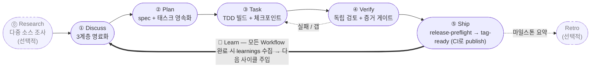
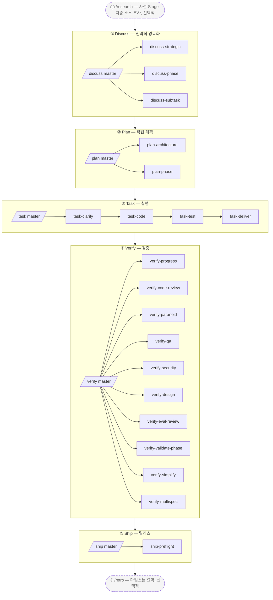

# harnessed

[English](./README.md) | [简体中文](./README-cn.md) | [繁體中文](./README-tw.md) | [日本語](./README-ja.md) | **한국어** | [Português (Brasil)](./README-pt-BR.md) | [Türkçe](./README-tr.md) | [Русский](./README-ru.md) | [Tiếng Việt](./README-vi.md) | [ไทย](./README-th.md)

> **Note (best-effort translation):** This translation is generated/best-effort and may lag behind the English [README.md](./README.md). For the latest and authoritative content, refer to the English version.

> **순수한 Claude Code를 규율 있는 시니어 엔지니어링 팀으로 바꿉니다.** 한 번의 설치로 governance, 계획, TDD, 검토가 하나의 Discuss→Ship Workflow로 엮이며, 진행 상황과 증거가 채팅이 아니라 디스크에 영속됩니다.

> _AI coding harness 패키지 매니저 + composition orchestrator_ — 3계층 스택 협업 방법론(gstack governance + GSD 프로젝트 매니저 + superpowers 시니어 엔지니어 + karpathy 원칙 + mattpocock 기법)을 실행 가능한 엔진으로 기계 실행합니다

[](https://npmjs.com/package/harnessed)
[](./LICENSE)
[](https://github.com/sponsors/easyinplay)

> Harness Inc.와 제휴, 보증, 후원 관계가 없습니다. ([NOTICE](./NOTICE) 참고)

---

## ✨ TL;DR

**작동 방식**: harnessed는 최고의 오픈소스 Claude Code 에이전트(gstack, GSD, superpowers, planning-with-files)를 **조립**하고, 독자적인 composition skill을 통해 하나의 Workflow로 **orchestrate**합니다. 상위 코드를 vendor하지 **않습니다** — manifest가 install/check를 기술하고, composition skill이 다중 상위 협업을 지휘합니다(따라서 상위 업그레이드는 단순 재설치이며, 수동 코드 동기화가 결코 아닙니다).

### 🔁 작동 루프

> **Discuss → Plan → Build → Verify → Ship**, 그리고 이를 닫는 **Learn** 루프 — 3계층 스택 전반에 걸쳐 기계 실행됩니다(gstack governance · GSD orchestration · superpowers TDD · checkpoint 증거). 순수한 에이전트 작업은 표류하지만, harnessed는 이를 진행 상황과 증거가 채팅 속에 머무는 대신 영속되는 source-of-truth 경로로 바꿉니다. **학습은 자동입니다**: 완료된 모든 Workflow는 자신의 failure/loop/reject 신호를 `.planning/LEARNINGS.md`에 추가하며, 이는 다음 사이클에 주입됩니다 — 이는 항상 활성화되어 있으며, 선택적 Retro에 **게이팅되지 않습니다**. Retro(`/retro`)는 별도의 선택적 마일스톤 요약입니다.



---

## 🧱 3계층 스택이란?

harnessed의 3계층 스택은 확립된 **BDD → SDD → TDD** 중첩의 소프트웨어 엔지니어링 구현입니다: 세 개의 중첩된 피드백 루프로, 각각 서로 다른 질문에 답합니다. **3계층이 곧 루프입니다**(안정적인 이론). harnessed는 오픈소스 생태계를 각 루프에 **조합**하며 — 컴포넌트들은 **중첩**되는데, 바로 이 중첩을 composition orchestrator가 중재합니다.

| 계층 | 루프 | 답하는 질문 | 조합 출처 (중첩) |
|---|---|---|---|
| **① Behavior** | BDD | *무엇*을 만들지 + 완료를 어떻게 아는지 | gstack `/office-hours` governance · GSD discuss · superpowers brainstorming → 인수 기준 |
| **② Spec** | SDD | *어떻게* 구조화하는지 | GSD plan-phase → requirements / design / tasks · contracts (Spec Kit / ECC 패턴) |
| **③ Implementation** | TDD | 실제로 *동작*하는지 | superpowers TDD red-green · subagent 실행 · GSD verify-work · ralph-loop completion |

이 루프들은 Phase가 아니라 **중첩된 렌즈**입니다 — 고전적인 Cucumber BDD-외부 + TDD-내부 이중 루프에, GenAI 시대의 SDD spec 링을 더해 삼중 루프로 확장한 것입니다. harnessed는 기본 외부→내부 순회를 5-Stage 케이던스로 실행하며, 여기에 **오늘 실제로 제공하는 back-edge들**을 더합니다: Verify는 실패한 작업을 Task로 되돌리고, 회색지대에 부딪힌 subagent는 계속하기 전에 명료화로 round-trip하며, 출시된 모든 사이클은 learnings를 다음 Discuss로 되돌려 공급합니다. (더 세분화된 구조적 back-edge — 예: contract 모순이 곧장 Spec으로 라우팅되거나, 모호한 requirement가 Behavior로 라우팅되는 것 — 은 로드맵에 있으며 아직 제공되지 않습니다. harnessed는 삼중 루프의 선형 케이던스 구현이며, 완전히 라우팅된 그래프는 그 진화 경로입니다.)

**컴포넌트들은 중첩됩니다 — 그게 핵심입니다.** **GSD**는 orchestration 백본으로 세 루프 전체를 관통하고, **gstack**은 Behavior + Review에 걸치며, **superpowers**는 Behavior(brainstorm) + Implementation(TDD)에 걸칩니다. harnessed는 이들을 엮고 — 중첩을 중재하여 — 하나의 엔진으로 만듭니다. 두 가지 **cross-cutting 규율**이 모든 계층을 관통합니다: **karpathy 원칙**(*어떻게* 코딩할지 — simplicity-first, surgical diff) + **mattpocock 기법**(`/diagnose`, `/zoom-out` 같은 온디맨드 전술 도구).

위의 런타임 루프에 매핑하면: **Discuss = Behavior (BDD) · Plan = Spec (SDD) · Build = Implementation (TDD)**, 그다음 **Verify + Ship**이 증거 게이트로 이를 닫습니다.

---

> 잠깐 — harnessed가 정말 superpowers / gstack / GSD 같은 상위 거인들과 어깨를 나란히 할 수 있을까요?
> 물론입니다 — 우리는 **거인의 어깨 위에 서 있으니까요**. 더 멀리 보라고 뉴턴이 말했죠. 🧐
> ... *(속삭임)* 가까이서 보면 어깨 위에 앉은 앵무새에 더 가깝지만요.
> 뭐 어때요 — 앵무새는 따라 하고, 우리는 **orchestrate**합니다. 🦜

---

## 🎯 핵심 차별점

- **3계층 스택 기계 실행** — **BDD→SDD→TDD 중첩 삼중 루프**([그게 뭔가요?](#-3계층-스택이란)), `gstack` + `GSD` + `superpowers`로 조합되고(중첩, GSD가 백본) `karpathy 4 원칙` + `mattpocock 23 기법`을 cross-cutting 규율로 가집니다
- **상위 코드 vendoring 없음** — manifest가 install/check를 기술하므로, 상위 업그레이드 시 사용자는 재설치만 하면 최신 버전을 얻습니다
- **Composition Skill** — 자체 Workflow skill이 지휘봉 역할을 하며 다수의 상위를 협주합니다. **1개 슈퍼 마스터 `/auto` + 5개 Stage 마스터 + 20개 서브 Workflow + 2개 독립형 = 28개 네임스페이스 계층 Workflow**, 완전한 5-Stage 기계 실행(`/auto` 전 Stage 원샷 / `/discuss /plan /task /verify /ship` 단일 Stage / 20개 3계층 스택 서브 / `/research /retro` 2개 독립형)
- **L0 Discipline Substrate** — 전역 Cross-Stage 행동 기준선(karpathy 원칙 + output-style + language + operational + priority + protocols), 모든 곳에 적용
- **패키지 매니저 마인드셋** — install 의존성 그래프 자동 해석, doctor 건강 체크, install-base 원샷 전체 설치
- **통합 진입점** — 사용자는 각 상위의 용어를 배우지 않고 `/discuss /plan /task /verify /ship` 마스터 slash command만 사용하면 됩니다. 서브 명령어는 단일 Stage를 명시적으로 호출합니다(예: `/discuss-strategic`은 전략 계층 명료화만 실행)
- **Forward continuation** — `harnessed next` / `harnessed advance`가 태스크와 Phase를 가로질러 당신을 이끕니다: 하나가 끝나면 다음은 **`.planning/` 디스크 상태에서 파생됩니다**(어떤 Phase는 그 `PLAN`에 대응하는 `SUMMARY`가 있으면 완료됨) — 유지할 큐가 없으므로 중간에 추가된 새 Phase도 자동으로 잡히고, resume은 디스크에서 다시 파생합니다. turn마다 `NEXT-UNIT` breadcrumb이 다음 작업을 가리킵니다

---

## 🆚 Native Claude Code / Codex 대비

Native 에이전트는 primitive를 제공하고, harnessed는 그것을 방법론으로 엮습니다. Native 셀이 primitive가 "존재한다"고 말하는 곳에서도, 당신은 여전히 프로젝트마다 직접 설계하고 엮고 유지해야 합니다 — harnessed는 그것을 사전 조합되고 엔진 구동되는 형태로 제공합니다.

| 차원 | Native Claude Code | Native Codex | harnessed |
|---|---|---|---|
| **Workflow / 방법론** | primitive만 — 매번 흐름을 직접 설계 | 더 적은 primitive — 프롬프트마다 자유 형식 | 코드화된 **Discuss→Ship** 5-Stage 3계층 스택 엔진 — BDD + SDD + TDD 루프 + 2개 cross-cutting (Review + Ship) |
| **지시 주입** | `CLAUDE.md` + skills + hooks 존재하나 정적이며 수동으로 엮어야 함 | `AGENTS.md`만 — skills/hooks 없음 | turn마다 breadcrumb hook + 태스크 범위 라우팅 + 사이클마다 learnings 주입 |
| **상태 / 진행** | 채팅 컨텍스트 — `/clear` / compaction 시 손실 | 채팅 컨텍스트 — 영속화 계층 없음 | 디스크 상의 `.planning/` + `current-workflow.json` 원장 + checkpoint 증거 |
| **크로스 세션 복구** | 컨텍스트를 직접 다시 설명 | 컨텍스트를 직접 다시 설명 | `harnessed status --recover`: 현재 위치 + 다음 단계 |
| **검증 / "완료"** | 에이전트가 "완료"를 자가 보고 | 에이전트가 "완료"를 자가 보고 | 독립 검토 subagent + **fail-CLOSED 증거 가드**(아티팩트 누락 = 미완료) |
| **Subagent orchestration** | Subagent + Agent Teams 사용 가능하나 수동 오케스트레이션 | subagent/team primitive 없음 | `gates → prompt → spawn → checkpoint`; 태스크별 Agent Teams 자동 활성화 |
| **학습 루프** | 없음 | 없음 | `LEARNINGS.md` 자동 수집 + 다음 사이클에 주입 |
| **플랫폼 도달 범위** | Claude Code 전용 | Codex 전용 | **Cross-harness** — Claude Code 주력, 플랫폼 계층 통해 Codex |

> Native 에이전트는 사소한 일회성 편집에서 제로 셋업, 제로 오버헤드로 승리합니다. harnessed는 작업이 여러 단계, 세션, subagent에 걸치는 순간 — 자유 형식 표류와 채팅 속에서 길 잃은 상태가 비용을 부과하기 시작하는 순간 — 제값을 합니다.

---

## 📦 빠른 설치

```bash
npm install -g harnessed && harnessed setup
```

> Windows PowerShell 5.x는 `&&` 체이닝을 지원하지 않습니다 — `;` 또는 두 줄로 나눠서 사용하세요 (`npm install -g harnessed; harnessed setup`). bash / zsh / PowerShell 7+ / cmd.exe는 모두 정상 동작합니다.

🤖 **또는 AI에게 설치를 맡기세요** — Claude Code(또는 다른 AI 어시스턴트)에 이 문장을 붙여 넣으세요:

> Install harnessed for me following the guide at `https://github.com/easyinplay/harnessed/blob/main/INSTALL-WITH-AI.md`

AI가 문서를 자동으로 가져와 설치를 실행하며, OS / 권한 / PATH / corepack 엣지 케이스까지 처리해 줍니다 — 긴 텍스트를 복사할 필요가 없습니다.

> [!TIP]
> 🚀 **많은 사랑을 받는 Agent Teams와 Subagent 기능이 harnessed에서 작업에 따라 자동으로 활성화됩니다!**
> `CLAUDE_CODE_EXPERIMENTAL_AGENT_TEAMS`를 수동으로 설정할 필요 없습니다 — `harnessed setup`이 `~/.claude/settings.json`에 자동으로 작성합니다. Pattern A 풀스택 3방향 / Pattern C 4-specialist 등 멀티 에이전트 Workflow가 바로 동작합니다.

---

## ⏱️ 처음 5분

제로에서 실행 중인 Workflow까지의 최단 경로:

```bash
# 1. 설치 (한 줄)
npm install -g harnessed && harnessed setup
```

```
# 2. Claude Code 안에서 — 첫 Workflow 시작
/auto "당신의 첫 요구사항"        # 입문자 기본값: 모든 Stage를 끝까지 실행
```

```bash
# 3. 길을 잃었나요? 인자 없이 harnessed 실행 — 현재 위치 + 다음 할 일을 알려줍니다
harnessed
#   → 현재 위치 대시보드 (활성 Phase + 단계별 상태) + NEXT: auto|manual|done 줄
#   status / next / resume 를 기억할 필요 없음 — 명령어 하나 (comet `/comet` 유사, 읽기 전용)
#   기계 판독 출력은 --json 추가
```

```bash
# 4. 중단 후 언제든지 재개
harnessed            # 동일한 현재 위치 뷰
harnessed resume     # 가장 최근 체크포인트에서 계속
```

> 어느 Stage가 언제 실행되는지 더 세밀하게 제어하고 싶나요? 아래 3가지 모드를 참고하세요.

---

## 🚀 빠른 시작 — 3가지 옵션

사용자 개입이 적은 순서부터:

### 🎯 Auto Mode (입문자 / 깊이 생각하기 싫을 때 권장)

```
/auto "요구사항 X"

# 대형 요구사항은 Stage를 명시할 수 있습니다 (보통 불필요 — AI가 자동 판단하여 라우팅하지만,
# 대형 요구사항이라고 확신하면 강제 적용):
/auto "요구사항 X" --staged
```

> 깊이 생각하기 싫거나 처음 시작하는 경우 — harnessed가 모든 것을 처리합니다. 6 Stage 전체(research 조건부 → discuss → plan → task → verify → retro 필수)를 멈추지 않고 실행합니다. AI가 원샷으로 요구사항 복잡도를 자동 판단하고, 대형 요구사항은 `--staged` 모드 전환을 제안합니다(각 Stage 후 리뷰를 위해 멈춤). 시작 전 "요구사항을 명확히 이해하고 계십니까?"를 묻습니다 — 아니오이면 `/research` 다중 소스 조사를 자동 실행합니다. 마지막으로 필수 `/retro` 요약을 실행합니다. 실패 시 빠른 실패, `harnessed resume`으로 재개합니다.

### 📂 Stage Mode (파워 유저 / 중간 결과를 검토하고 싶을 때 권장)

```
/discuss "요구사항 X"          # Strategic + Phase + Subtask 3계층 명료화
/plan "요구사항 X"             # Architecture (조건부) + 계획 영속화
/task "서브태스크-1"           # 4개 서브 직렬 실행 (clarify → code → test → deliver)
/verify "phase-1"              # 10개 서브 조건부 검증
```

> 어느 Stage부터 시작할지 결정하거나 중간 출력을 검토하고 싶은 경우 — 5개 마스터를 독립적으로 호출할 수 있으며, 각 마스터는 해당 Stage의 모든 서브를 내부에서 자동 팬아웃합니다.

### 🔬 Surgical Mode (전문가 모드 / 원하는 것이 명확한 경우)

```
/discuss-phase "..."        # Phase 계층 명료화만 실행
/plan-architecture "..."    # Architecture 검토만 실행
/verify-paranoid "..."      # Paranoid Staff Engineer 검토만 실행
# ... 나머지 20개 서브 Workflow 중 원하는 것 선택
```

> "나는 전문가니까 내가 직접 결정한다" — 마스터를 건너뛰고 서브 Workflow를 직접 호출합니다. 어떤 서브가 필요한지 정확히 아는 상급 사용자나 단일 단계 재사용에 적합합니다.

---

## 📐 5-Stage 흐름 다이어그램



> 점선 박스 = 선택적 독립 실행형(`/research` 전략 전 조사 / `/retro` 마일스톤 후 요약). 실선 박스 = 메인 5-Stage 케이던스(Ship은 tag-ready에서 멈춤. 실제 publish는 `publish.yml` CI가 수행).

### 28-Workflow 개요 테이블

| Slash 명령어 | Stage | 유형 | 기능 / Upstream | 요약 |
|------------|-------|------|----------------|------|
| `/auto` | 전체 | **슈퍼 마스터** | masterOrchestrator (6 Stage 전체) | 원샷 6-Stage 전체 실행 (research 조건부 → discuss → plan → task → verify → retro 필수). AI 원샷 복잡도 판단 + 이해도 확인 + 필수 retro. `--staged` 옵트인 Stage 게이트 |
| `/discuss` | ① Discuss | 마스터 | masterOrchestrator | 3개 서브 병렬 게이트 평가 (chain-isolation 규칙) |
| `/discuss-strategic` | ① Discuss | 서브 | gstack `/office-hours` + `/plan-ceo-review` + planning-with-files | 전략 계층 — 신규 기능 / 신규 마일스톤 / 제품 방향에 대한 필수 governance (findings.md 영속화) |
| `/discuss-phase` | ① Discuss | 서브 | GSD `/gsd-discuss-phase` + planning-with-files | Phase 계층 — ≥2개 열린 결정 / 회색지대 명료화 (findings.md + knowledge.md 영속화) |
| `/discuss-subtask` | ① Discuss | 서브 | superpowers brainstorming + `/grill-with-docs` | 서브태스크 계층 — ≥2개 접근법 / 핵심 알고리즘 / API contract (단기 토론, 영속화 없음) |
| `/plan` | ② Plan | 마스터 | masterOrchestrator | 2개 서브 직렬 호출 (architecture 조건부 → phase 항상) |
| `/plan-architecture` | ② Plan | 서브 | gstack `/plan-eng-review` | Architecture 계층 — 복잡한 아키텍처에 대한 필수 governance 게이트 |
| `/plan-phase` | ② Plan | 서브 | GSD `/gsd-plan-phase` + planning-with-files `/plan` | 계획 계층 — `task_plan.md` + `progress.md` 영속화 |
| `/task` | ③ Task | 마스터 | masterOrchestrator | 서브태스크당 4개 서브 직렬 호출 (clarify → code → test → deliver) |
| `/task-clarify` | ③ Task | 서브 | superpowers brainstorming + `/grill-with-docs` 조건부 | 서브태스크 시작 명료화 게이트 |
| `/task-code` | ③ Task | 서브 | karpathy 4 원칙 + `/zoom-out` / `/improve-codebase-architecture` / `/diagnose` 조건부 | 서브태스크 코딩 + 크로스 세션 progress.md 동기화 |
| `/task-test` | ③ Task | 서브 | superpowers TDD red-green-refactor + `/diagnose` 조건부 | 핵심 로직에 TDD 필수 (별칭: mattpocock `/tdd`) |
| `/task-deliver` | ③ Task | 서브 | `ralph-loop` SDK 래퍼 + Agent Teams 조건부 | verbatim `COMPLETE`까지 + R20.10 max_iter 폴백 |
| `/verify` | ④ Verify | 마스터 | masterOrchestrator | 시나리오별 조건부 디스패치로 10개 서브 실행 |
| `/verify-progress` | ④ Verify | 서브 | GSD `/gsd-verify-work` + `/gsd-progress` | 필수 직렬 시작점 — UAT 인수 + 상태 동기화 |
| `/verify-code-review` | ④ Verify | 서브 | `code-review` 멀티 Subagent 팬아웃 | 병렬 고신뢰 발견 사항 |
| `/verify-paranoid` | ④ Verify | 서브 | gstack `/review` (Paranoid Staff Engineer) | 중요 모듈 PR 전 필수 |
| `/verify-qa` | ④ Verify | 서브 | gstack `/qa` + playwright-cli / `@playwright/test` / webapp-testing | 엔드투엔드 QA (has_ui_changes 조건부) |
| `/verify-security` | ④ Verify | 서브 | gstack `/cso` | OWASP / 인증 / 시크릿 (has_auth_or_secrets 조건부) |
| `/verify-design` | ④ Verify | 서브 | gstack `/design-review` + ui-ux-pro-max + design-taste-frontend | 디자인 시스템 일관성 (has_design_changes 조건부) |
| `/verify-eval-review` | ④ Verify | 서브 | GSD `/gsd-eval-review` | AI phase eval 커버리지 감사 (has_ai_phase 조건부; plan 측 gsd-ai-integration-phase와 짝) |
| `/verify-validate-phase` | ④ Verify | 서브 | GSD `/gsd-validate-phase` | Nyquist requirement→test 커버리지 보완 (requires_coverage_audit 조건부) |
| `/verify-simplify` | ④ Verify | 서브 | `code-simplifier` | 최종 직렬 단순화 |
| `/verify-multispec` | ④ Verify | 서브 | 4-specialist Agent Team Pattern C | 중요 릴리스 / 대형 리팩터링 PR 에스컬레이션 (상호 SendMessage 교차 검토) |
| `/ship` | ⑤ Ship | 마스터 | masterOrchestrator | Verify 이후 릴리스 Stage — preflight → PR/deploy를 gstack `/ship`에 위임 → CI로 publish (tag-ready 경계) |
| `/ship-preflight` | ⑤ Ship | 서브 | `harnessed release-preflight` | 읽기 전용 릴리스 준비 게이트 (CHANGELOG `[Unreleased]` / 버전 / git-clean / tag-absent). 실패 시 차단 |
| `/research` | 독립 실행형 | 독립 실행형 | Tavily / Exa MCP + ctx7 + GSD `/gsd-discuss-phase` | 다중 소스 조사 (Stage ① 대안) |
| `/retro` | 독립 실행형 | 독립 실행형 | gstack `/retro` + planning-with-files RETROSPECTIVE.md | 프로젝트 / 마일스톤 마무리 요약 |

> 마스터 orchestrator가 자동으로 올바른 서브에 게이트 라우팅합니다 (chain-isolation 규칙 — 발화하지 않은 서브는 투명하게 스킵 선언).
> 서브를 직접 호출하면 마스터를 우회하여 단일 Stage만 실행합니다. 예: `/discuss-strategic "신규 기능 X"`.

---

## ⚡ 사용 흐름

5-Stage 3계층 스택 방법론 — 5개 마스터 orchestrator를 직렬로 구동하는 것을 권장합니다:

```
/discuss  →  /plan  →  /task  →  /verify  →  /ship
   ①         ②        ③         ④           ⑤
```

| Stage | 마스터 | 주요 서브 Workflow | Upstream 협업 |
| ---- | ---- | ---- | ---- |
| ① **Discuss** | `/discuss` | strategic / phase / subtask (3개 병렬) | gstack `/office-hours` + GSD `/gsd-discuss-phase` + superpowers brainstorming |
| ② **Plan** | `/plan` | architecture (조건부) → phase | gstack `/plan-eng-review` + GSD `/gsd-plan-phase` + planning-with-files |
| ③ **Task** | `/task` | clarify → code → test → deliver (서브태스크당 4개 직렬) | karpathy 원칙 + mattpocock 기법 + superpowers TDD + `ralph-loop` |
| ④ **Verify** | `/verify` | progress → 5개 병렬 조건부 → simplify (+ multispec 중요 릴리스) | GSD `/gsd-verify-work` + code-review + gstack `/review` / `/qa` / `/cso` / `/design-review` + code-simplifier |
| ⑤ **Ship** | `/ship` | preflight (릴리스 준비 게이트) → PR/deploy 위임 | `harnessed release-preflight` + gstack `/ship` + `publish.yml` CI (tag-ready 경계) |

실제 사용 예:

```bash
# 1. Workflow upstream 설치 (한 줄로 gstack + GSD + superpowers + planning-with-files 설치)
harnessed setup

# 2. Claude Code 내에서 5-Stage 케이던스 실행
/discuss "신규 기능 X"          # Strategic + Phase + Subtask 3계층 명료화
/plan "신규 기능 X"             # Architecture (조건부) + 계획 (작업 그래프 영속화)
/task "서브태스크-1: API contract"   # 서브태스크당 4개 서브 직렬 실행
/verify "phase-1"                 # 10개 서브 조건부 실행
/ship                             # release-preflight 게이트 → PR/deploy (tag-ready. publish는 CI)

# 3. 중단 후 재개 (언제든지)
harnessed resume
```

> 마스터를 우회하여 단일 계층만 실행하기 위해 서브를 직접 호출할 수도 있습니다. 예: `/verify-paranoid`는 Paranoid Staff Engineer 검토만 실행합니다.

📊 상세 mermaid + 전체 Stage 워크스루: [docs/WORKFLOW.md](./docs/WORKFLOW.md)

---

## 🗂️ 아키텍처 (5-Stage 네임스페이스 계층형)

### 1. 디렉터리 구조

```
harnessed/
├── manifests/                  # L1: upstream 기술 계층 (vendored 아님)
├── workflows/                  # L6: composition skill (5-Stage 지휘봉)
│   ├── discuss/                # Stage ① 3계층 (strategic + phase + subtask)
│   │   ├── auto/               # /discuss 마스터 게이트 라우팅
│   │   ├── strategic/          # /discuss-strategic (gstack /office-hours + /plan-ceo-review)
│   │   ├── phase/              # /discuss-phase (GSD /gsd-discuss-phase)
│   │   └── subtask/            # /discuss-subtask (superpowers brainstorming)
│   ├── plan/                   # Stage ② (architecture + phase 작업 그래프)
│   ├── task/                   # Stage ③ (clarify + code + test + deliver)
│   ├── verify/                 # Stage ④ (progress + code-review + paranoid + qa + cso + design + simplify + multispec)
│   ├── ship/                   # Stage ⑤ (preflight 릴리스 준비 게이트 → PR/deploy를 gstack /ship에 위임; tag-ready)
│   ├── research/               # 독립 실행형 Stage ① 대안
│   ├── retro/                  # 독립 실행형 Stage ⑤ 이후 마일스톤 마무리
│   ├── capabilities.yaml       # L5a: ~100개 항목, 7개 카테고리 SoT
│   ├── defaults.yaml           # Workflow Phase별 ralph_max_iterations
│   ├── judgments/              # L5a: 3계층 스택 기준 + 병렬성 + tdd + fallback + rules-routing
│   │   ├── strategic-gate.yaml
│   │   ├── phase-gate.yaml
│   │   ├── subtask-gate.yaml
│   │   ├── parallelism-gate.yaml         # L5b 실행 메커니즘 라우팅
│   │   ├── tdd-gate.yaml
│   │   ├── fallback.yaml                 # 3가지 규칙: skip_with_transparency + override + chain_isolation
│   │   ├── web-design-routing.yaml       # UI 디자인 도구 라우팅
│   │   ├── web-testing-routing.yaml      # E2E / 브라우저 테스팅 도구 라우팅
│   │   ├── web-search-routing.yaml       # 웹 검색 / 문서 가져오기 라우팅
│   │   └── stage-routing.yaml            # 마스터 orchestrator 서브 Stage 라우팅
│   └── disciplines/            # L0: 전역 Cross-Stage 행동 기준선
│       ├── karpathy.yaml       # 4 원칙 + ≤200L
│       ├── output-style.yaml   # BLUF + no-emoji + no-em-dash
│       ├── language.yaml       # zh-Hans 기본값 + 영어 보존
│       ├── operational.yaml    # biome preempt + A7 + commit safety
│       ├── priority.yaml       # skill 충돌 중재
│       └── protocols.yaml      # cc-handoff 설계 문서 자기 완결
├── routing/                    # L4: 라우팅 엔진 SSOT (decision_rules.yaml)
├── schemas/                    # L3: JSON Schema (IDE / CI 사용)
├── src/                        # L4: TS 엔진 (workflow + routing + cli + installers + checkpoint + audit + state)
├── tests/                      # vitest 단위 + 통합 + dogfood (R8.1 dogfood-first)
├── scripts/                    # CI 게이트 (check-workflow-schema, transparency-verdict, state-archive)
├── .planning/                  # 프로젝트 메모리 (STATE + ROADMAP + REQUIREMENTS + per-phase + milestones)
└── docs/adr/                   # 아키텍처 결정 기록
```

### 2. 논리적 계층화 (8계층)

```
┌────────────────────────────────────────────────────────────┐
│ L7 사용자 대면 slash 명령어 + harnessed CLI                   │
│   /discuss /plan /task /verify /ship (마스터) + 20 서브 + /research /retro + /auto 슈퍼 마스터
│   + 직접 gstack 호출 (30+ 선택): /office-hours /review /qa /...
├────────────────────────────────────────────────────────────┤
│ L6 Workflow orchestration (workflows/<stage>/<sub>/)         │
├────────────────────────────────────────────────────────────┤
│ L5b 실행 메커니즘 (직교): subagent / Agent Teams              │
│   / 메인 세션 + ralph-loop 래퍼                              │
│   parallelism-gate.yaml: 기본 subagent → 5가지 트리거로 에스컬레이션 │
│   Pattern A 풀스택 3방향 / B 대립 가설 / C 다차원 검토          │
├────────────────────────────────────────────────────────────┤
│ L5a 기능 + 판단 + 기본값 SoT                                  │
│   capabilities.yaml (7 카테고리) + judgments/ (10 파일) +    │
│   defaults.yaml                                              │
├────────────────────────────────────────────────────────────┤
│ L4  런타임 엔진 (workflow / routing / handlers)               │
├────────────────────────────────────────────────────────────┤
│ L3  TypeBox 스키마 + CI 게이트                                │
├────────────────────────────────────────────────────────────┤
│ L2  Installer + Manifest 엔진                                │
├────────────────────────────────────────────────────────────┤
│ L1  Upstream 컴포넌트 (vendored 아님)                         │
├────────────────────────────────────────────────────────────┤
│ L0  Discipline Substrate (전역 적용)                          │
│   karpathy 원칙 + output-style + language + operational +    │
│   priority + protocols (L1-L7 전체에 적용)                   │
└────────────────────────────────────────────────────────────┘
```

### 3. Cross-cutting 기능 (capabilities.yaml — 7 카테고리, ~100개 항목)

```
behavioral (6):       karpathy-guidelines + output-style + language + operational + priority + protocols
tool-slash-cmd (~60): gstack 30+ 선택 + gsd 10+ + mattpocock 12 고빈도 + etc.
tool-mcp (3):         chrome-devtools-mcp / tavily-mcp / exa-mcp
tool-cli (2):         ctx7 / gws
tool-plugin (2):      planning-with-files / @playwright/test
tool-bundled (3):     ralph-loop / webapp-testing / playwright-cli
agent-platform (3):   agent-teams-create / send-message / shutdown
```

### 4. 데이터 흐름 예시 (사용자가 `/discuss "신규 기능 X"` 호출)

```
[L7] 사용자가 /discuss "신규 기능 X" 호출
  ↓
[L6] workflows/discuss/auto/workflow.yaml 마스터 orchestrator
  ↓
[L5a] judgments.strategic-gate.fires + phase-gate.fires + subtask-gate.fires (3방향 병렬 평가)
  ↓
[L4] judgmentResolver.ts (4레벨 ref 분할) + exprBuilder.ts (expr-eval 평가)
  ↓
[L0] discipline.priority-hierarchy가 도구 충돌 중재 / output-style이 출력 포맷
  ↓
[fires=true 서브] → 서브 Workflow 호출 (/discuss-strategic / /discuss-phase / /discuss-subtask)
  ↓ 각 서브:
      ├─ behavioral_layer: karpathy-guidelines (항상 활성화)
      ├─ tools_available: planning-with-files / ctx7 / mattpocock 조건부
      ├─ parallelism: judgments.parallelism-gate.<route>.fires (L5b 메커니즘)
      └─ phase 호출이 기능 템플릿 보간을 통해 실행
  ↓
[fallback.yaml chain-isolation] 3계층이 독립적으로 판단, 직렬 의존 없음
[Skip 투명성 선언] 발화하지 않은 서브 → "⚠️ Skipped <sub> because <reason>"
  ↓
planning-with-files /plan (cross-cutting 도구) → .planning/<phase-id>/에 아티팩트 기록
  ↓
[L4] state.ts writeCurrentWorkflow (proper-lockfile) + audit.append (12필드 JSONL)
```

### 5. 결정 라우팅 매트릭스 (규칙 기반, judgments + capabilities에 코드화)

| 시나리오 | 기본 → 에스컬레이션 |
|---------|------------------|
| 병렬성 메커니즘 | subagent → Agent Teams Pattern A/B/C (5가지 트리거) |
| UI 디자인 주요 계획 | **2단계**: ui-ux-pro-max (대상 / 인터랙션 로직 / 디자인 축 — 구조) → design-taste-frontend (anti-slop 비주얼 폴리시 overlay, 크로스 에이전트 taste-skill) |
| E2E 브라우저 탐색 | playwright-cli (한 줄 Bash, 토큰 효율) |
| E2E 커밋 가능 TS | @playwright/test 기본값 |
| E2E Python 백엔드 연동 | webapp-testing |
| 성능 / a11y / 메모리 진단 | chrome-devtools-mcp |
| 웹 검색 (키워드) | Tavily MCP 기본값 |
| 웹 검색 (서술형 / 학술) | Exa MCP |
| 라이브러리 API 문서 | ctx7 CLI |
| GitHub URL | gh CLI |
| 단일 URL 가져오기 | WebFetch 내장 |
| Gmail / Drive / Calendar | gws CLI |
| 아키텍처 검토 (복잡) | gstack /plan-eng-review |
| TDD 필수 (핵심 알고리즘) | superpowers TDD 또는 mattpocock /tdd |
| 중요 모듈 PR | gstack /review |
| 대형 리팩터링 PR 다차원 검토 | 4-specialist Agent Team Pattern C |
| 크로스 세션 hand-off | discipline.protocols 자기 완결 설계 문서 |
| `/auto` 대형 요구사항 복잡도 | AI 원샷 판단 → `--staged` 자동 제안 (n 선택 시 수동 `/discuss` 권장) |
| `/auto` 요구사항 이해도 | 시작 전 확인 → n이면 `/research` 다중 소스 조사 자동 추가 |

---

## 🛠️ 운영 명령어

> 이것들은 harnessed 자체의 유지보수 명령어입니다 (setup / 건강 체크 / 백업-롤백 / 상태 복구 등). 일상적인 기능 개발에는 위의 slash 명령어를 사용하세요 — 보통 이 명령어들은 필요하지 않습니다.

**v4.0 — 오케스트레이션 두뇌.** slash command는 Claude Code 메인 session 내에서 명확화를 실행하고(질문이 당신에게 도달함), 이어서 CC-native subagent를 spawn합니다(Agent Teams + 명확화 round-trip 활성화). harnessed는 gate 평가(`harnessed gates`)와 spawn-ready prompt(`harnessed prompt`)를 제공하며, spawn은 메인 session이 수행합니다. `harnessed run`은 CI/headless 용도로 유지됩니다.

### CLI 명령어

| 명령어 | 설명 |
| ---- | ---- |
| `harnessed setup` | 최초 설정. Workflow skill을 `~/.claude/skills/`에 설치 + MCP를 `~/.claude.json`에 설치 |
| `harnessed gates <master>` | 특정 master stage에서 어떤 sub-workflow가 fire하는지 평가 (JSON: fire/skip/parallelism). slash command가 native spawn을 오케스트레이션하는 데 사용 |
| `harnessed prompt <sub>` | 특정 sub-workflow의 spawn-ready prompt (role + checklist + disciplines + completion/clarification 프로토콜) 출력 |
| `harnessed checkpoint <action> <sub>` | sub-workflow의 start/complete/fail을 `~/.claude/harnessed/checkpoints/`에 기록 |
| `harnessed` (인자 없음) | 인자 없는 현재 위치: 활성 Workflow 대시보드 + `NEXT: auto\|manual\|done` + 실행 힌트. `--json` 기계 판독. 활성 Workflow 없음 → 온보딩 힌트 (comet `/comet` 유사, 읽기 전용) |
| `harnessed next` | 결정론적 다음 단계 contract. Workflow 내부: `NEXT: auto\|manual\|done`. Workflow의 서브가 모두 해소되면 다음 **cross-unit**(`.planning/` 디스크 상태에서 파생한 다음 phase/task)으로 fall through하며 exit-code contract (`0` 진행 · `2` 완료 · `10` 차단) |
| `harnessed advance` | Forward continuation — 마일스톤 전반의 다음 작업 단위(다음 phase/task)와 그 실행 명령을 출력. 출력 전용(다음 `/auto`는 메인 session이 실행); 완료되지 않은 이전 Phase를 건너뛰는 것을 거부 (`--force`로 덮어쓰기); `--json`은 `while harnessed advance --json; do :; done` 루프를 구동 |
| `harnessed reject <sub>` | 서브를 사용자 거부됨으로 표시 (terminal, `failed`와 구별) |
| `harnessed compact [--tokens <n>]` | 해소된 원장 항목 요약+제거 (G6-safe: `fail_count>0`은 결코 제거되지 않음); `checkpoint complete --tokens`에서 자동 트리거 |
| `harnessed workflows` | 진행 중인 Workflow 목록 (저장소당 하나) |
| `harnessed learn "<lesson>"` | 이 저장소의 `.planning/LEARNINGS.md`에 산문형 learning 추가 |
| `harnessed run <name>` | in-process SDK spawn으로 workflow 실행 (CI/headless 모드). slash command는 대신 CC-native spawn 사용 |
| `harnessed resume` | 세션 중단 후 가장 최근 체크포인트에서 재개 |
| `harnessed status` | 현재 Phase + 잠금 보유자 |
| `harnessed doctor` | 14항목 건강 체크 (Node / MCP / jq / Win bash / routing / token budget / mattpocock / CodeGraph / update-available 등) |
| `harnessed update [--check\|--upstreams\|--migration-report]` | 자가 업데이트 (`npm i -g harnessed@latest`); `--check`는 최신 버전 보고; `--upstreams`는 base manifest 재실행; `--migration-report`는 읽기 전용 stale-state 인벤토리 |
| `harnessed release-preflight` | 읽기 전용 릴리스 준비 게이트 (CHANGELOG `[Unreleased]` / 버전 / git-clean / tag-absent); 준비되지 않으면 exit 1. Ship Stage 게이트 |
| `harnessed retro --done` | `/retro` 실행 후 retro 알림 Phase 카운터 리셋 (turn마다 뜨는 RETRO-DUE nudge 해제) |
| `harnessed install <name>` | Upstream manifest 설치 |
| `harnessed uninstall [name]` | 통합 제거 |
| `harnessed backup` | 스냅샷 백업 관리 |
| `harnessed rollback <timestamp>` | 원라인 롤백 (EOL 보존 + sha1 검증) |
| `harnessed gc` | 만료된 백업 정리 |
| `harnessed audit-log` | 라우팅 투명성 로그 조회 (`--filter` jq 표현식 지원) |

### 플래그

> 모든 명령어는 기본적으로 **즉시 적용(디스크 기록)**됩니다 — 플래그가 필요하지 않습니다. 상급 사용자는 `--dry-run`을 추가하여 미리 볼 수 있습니다.

| 플래그 | 설명 |
| ---- | ---- |
| `--dry-run` | 디스크에 기록하지 않고 미리 보기 (상급 사용자 옵트인) |
| `--non-interactive` | CI / 스크립트 시나리오 |
| `--system` | L4 전역 설치 허용 (그렇지 않으면 L1 npx 임시로 다운그레이드) |
| `--yes` | uninstall 시 대화형 확인 건너뛰기 |
| `--full-diff` | 200줄 이상 접힌 diff 펼치기 |
| `--no-color` | TTY에서도 색상 강제 비활성화 |
| `--task <text>` | `run` — 태스크 설명 (workflow `gateContext.task`에 전달됨) |
| `--task-stdin` | `run` — stdin에서 EOF까지 태스크 설명 읽기 (따옴표/$/` shell-escape 회피) |


---

## ❓ FAQ

<details>
<summary><b>Q1. harnessed를 설치한 후에도 superpowers / gstack / GSD upstream을 별도로 설치해야 하나요?</b></summary>

<br>

네, 하지만 **사용자 경험 = 명령어 하나**입니다:

```bash
harnessed setup  # gstack + GSD + superpowers + planning-with-files 자동 설치; 26개 Workflow skill이 ~/.claude/skills/에 배치 + Agent Teams 환경 변수가 ~/.claude.json에 자동 기록
```

`brew install <formula>`가 전체 의존성 세트를 가져오는 것처럼 생각하세요 — 각 의존성을 별도로 `brew install`할 필요가 없습니다.

</details>

<details>
<summary><b>Q2. superpowers / gstack을 harnessed 저장소에 vendor하지 않는 이유는?</b></summary>

<br>

4가지 이유:

1. **차별화 철학** — harnessed는 "올인원 자체 구축" 캠프에 대응하는 "조립주의 패키지 매니저"입니다. Vendoring = 차별성 상실 → 또 다른 Plugin 팩이 됨
2. **라이선스 + 저작권 악몽** — 활발히 유지보수되는 4~5개 upstream을 vendoring = 복잡한 라이선스 패치워크
3. **Upstream 업그레이드 방향 역전** — 현재 manifest 기술 방식은 사용자가 upstream 업그레이드 시 재설치만 하면 최신 버전을 얻습니다. Vendoring은 수동 코드 동기화를 강제하며 영구적으로 뒤처지게 됩니다
4. **버스 팩터 1** — 4~5개의 vendored upstream을 동기화하는 단일 유지보수자 = 가속화된 번아웃

</details>

<details>
<summary><b>Q3. gstack / GSD / superpowers가 모두 plan/discuss 도구처럼 보이는데 — 겹치지 않나요?</b></summary>

<br>

**아닙니다**. 이들은 3계층 스택의 서로 다른 Stage입니다:

| Stage | Upstream | 책임 |
| ---- | ---- | ---- |
| Governance | gstack | 다중 역할 결정 게이트 (CEO / EM / Designer / Paranoid Engineer) |
| Brainstorming | superpowers | 서브태스크 설계 명료화, 대안 비교 |
| Orchestration | GSD | 고수준 Phase 작업 그래프 + 의존성 분석 |
| Persistence | planning-with-files | `task_plan.md` / `progress.md` / `findings.md` 영속화 |

`/discuss /plan /task /verify /ship` — 5개 마스터가 5개 Stage를 연결합니다. 각 마스터는 내부에서 서브에 위임합니다. 각 Stage는 다른 일을 하고 다음 Stage로 이어집니다. **통합 없음**.

</details>

<details>
<summary><b>Q4. Workflow Phase가 자동으로 실행되나요, 아니면 사용자를 기다리나요?</b></summary>

<br>

`workflows/<name>/SKILL.md` frontmatter의 `pause` 필드에 따라 다릅니다:

- `pause: human_review` → 사용자 승인을 기다리며 차단 (governance 게이트 / 최종 잠금. 예: `/discuss-strategic` gstack `/office-hours` + `/plan-architecture` `/plan-eng-review` 잠금 게이트)
- `pause` 없음 → 다음 Phase로 자동 체이닝

각 Phase 출력은 `.harnessed/checkpoints/`에 기록됩니다. 세션 중단 후 `harnessed resume`이 가장 최근 체크포인트에서 재개합니다.

</details>

<details>
<summary><b>Q5. harnessed 자체가 CC Plugin인가요?</b></summary>

<br>

하이브리드입니다:

- `npx harnessed@latest setup`이 **Node.js CLI** (`bin/harnessed`)를 실행합니다
- setup이 **Workflow skill** (markdown)을 `~/.claude/skills/`에 설치하며, Claude Code 런타임이 이를 로드합니다
- `/discuss` / `/plan` / `/task` / `/verify` 등은 CC 내부의 slash 명령어로 skill 실행을 트리거합니다
- CLI와 CC skill은 `.harnessed/checkpoints/` 상태 디렉터리를 공유합니다

</details>

---


## License

[Apache-2.0](./LICENSE) — [NOTICE](./NOTICE) 참고 (Harness Inc. 상표 면책 조항 포함)

개발 지원: [](https://github.com/sponsors/easyinplay)
