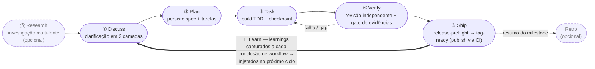
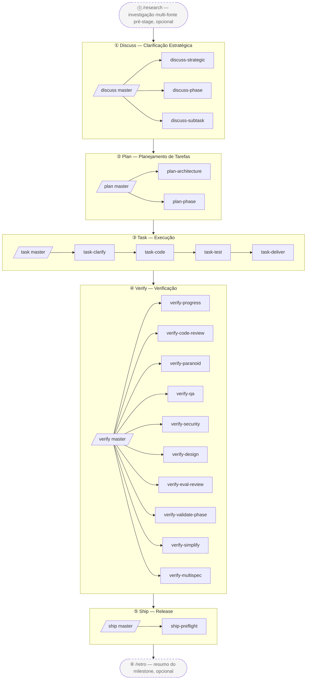

<p align="center">
  
</p>

[English](./README.md) | [简体中文](./README-cn.md) | [繁體中文](./README-tw.md) | [日本語](./README-ja.md) | [한국어](./README-ko.md) | **Português (Brasil)** | [Türkçe](./README-tr.md) | [Русский](./README-ru.md) | [Tiếng Việt](./README-vi.md) | [ไทย](./README-th.md)

> **Note (best-effort translation):** This translation is generated/best-effort and may lag behind the English [README.md](./README.md). For the latest and authoritative content, refer to the English version.

> _Gerenciador de pacotes de AI coding harness + composition orchestrator_ — ele monta os melhores componentes do ecossistema open-source em um único engine executável, conectado pela metodologia de três camadas **BDD → SDD → TDD**.

> **harnessed é um orchestration brain + prompt library**, orquestrando o native subagent spawn por meio de três CLIs rápidas e de função pura — `harnessed gates` (quais sub-workflows disparam), `harnessed prompt` (prompt spawn-ready para um sub) e `harnessed checkpoint` (registrar o progresso).

[](https://npmjs.com/package/harnessed)
[](./LICENSE)
[](https://github.com/sponsors/easyinplay)

> Não é afiliado, endossado nem patrocinado pela Harness Inc. (veja [NOTICE](./NOTICE))

---

## ✨ TL;DR

**Como funciona**: o harnessed **monta** os melhores agentes open-source do Claude Code (gstack, GSD, superpowers, planning-with-files) e os **orquestra** em um único workflow por meio de skills de composition opinativas. Ele **não** faz vendor do código upstream — os manifests descrevem install/check, e as skills de composition conduzem a colaboração entre múltiplos upstreams (então um upgrade de upstream é apenas uma reinstalação, nunca uma sincronização manual de código).

### 🔁 O loop operacional

> **Discuss → Plan → Build → Verify → Ship**, fechado por um loop de **Learn** — executado mecanicamente através da stack de três camadas (governança gstack · orquestração GSD · TDD superpowers · evidências de checkpoint). O trabalho cru de um agente deriva; o harnessed o transforma em um caminho com fonte da verdade onde o progresso e as evidências persistem em vez de viverem no chat. **O aprendizado é automático**: cada workflow concluído anexa seus sinais de falha/loop/reject ao `.planning/LEARNINGS.md`, que são injetados no próximo ciclo — isso é sempre ativo, **não** está condicionado ao Retro opcional. O Retro (`/retro`) é um resumo de milestone separado e opcional.



---

## 🧱 O que é a stack de três camadas?

A stack de três camadas do harnessed é uma implementação de engenharia de software do aninhamento estabelecido **BDD → SDD → TDD**: três loops de feedback aninhados, cada um respondendo a uma pergunta diferente. As **três camadas são os loops** (a teoria estável); o harnessed **compõe** o ecossistema open-source dentro de cada loop — e os componentes **se sobrepõem**, que é exatamente o que um composition orchestrator arbitra.

| Camada | Loop | Pergunta que responde | Composto a partir de (com sobreposição) |
|---|---|---|---|
| **① Behavior** | BDD | *O que* construir + como sabemos que está pronto | governança gstack `/office-hours` · GSD discuss · superpowers brainstorming → critérios de aceitação |
| **② Spec** | SDD | *Como* está estruturado | GSD plan-phase → requirements / design / tasks · contracts (padrões Spec Kit / ECC) |
| **③ Implementation** | TDD | Será que *funciona* de verdade | superpowers TDD red-green · execução de subagent · GSD verify-work · conclusão ralph-loop |

Os loops são **lentes aninhadas, não fases** — o clássico duplo-loop Cucumber BDD-externo + TDD-interno, estendido com um anel de spec SDD da era GenAI em um triplo-loop. O harnessed roda a travessia padrão externo→interno como sua cadência de 5 stages, mais as **back-edges que ele já entrega hoje**: o Verify chuta o trabalho que falhou de volta ao Task, um subagent que atinge uma área cinzenta faz round-trip até a clarificação antes de continuar, e cada ciclo entregue realimenta os learnings no próximo Discuss. (Back-edges estruturadas mais granulares — por exemplo, uma contradição de contract roteando direto para o Spec, um requisito ambíguo para o Behavior — estão no roadmap, não foram entregues. O harnessed é a realização de cadência linear do triplo-loop; o grafo roteado completo é o seu caminho de evolução.)

**Os componentes se sobrepõem — esse é o ponto.** O **GSD** atravessa todos os três loops como a espinha dorsal de orquestração, o **gstack** abrange Behavior + Review, o **superpowers** abrange Behavior (brainstorm) + Implementation (TDD). O harnessed os conecta — e arbitra a sobreposição — em um único motor. Duas **disciplinas transversais** percorrem cada camada: **princípios karpathy** (*como* codificar — simplicity-first, diffs cirúrgicos) + **movimentos mattpocock** (ferramentas táticas sob demanda como `/diagnose`, `/zoom-out`).

Mapeado ao loop de runtime acima: **Discuss = Behavior (BDD) · Plan = Spec (SDD) · Build = Implementation (TDD)**, e então **Verify + Ship** o fecham com gates de evidência.

---

> Espera — o harnessed realmente consegue competir de igual para igual com os gigantes upstream como superpowers / gstack / GSD?
> Claro — nós **estamos nos ombros de gigantes**. Ver mais longe, disse Newton. 🧐
> ... *(sussurrando)* Mas, olhando de perto, parece mais o papagaio empoleirado nesse ombro.
> Bom — papagaios imitam; nós **orquestramos**. 🦜

---

## 🎯 Key Differentiators

- **Stack de três camadas executada mecanicamente** — o **triplo-loop aninhado BDD→SDD→TDD** ([o que é isso?](#-o-que-é-a-stack-de-três-camadas)), composto a partir de `gstack` + `GSD` + `superpowers` (com sobreposição, GSD como espinha dorsal) com `karpathy 4 principles` + `mattpocock 23 moves` como disciplinas transversais
- **Sem Vendor do upstream** — Manifests descrevem install/check; quando o upstream é atualizado, os usuários simplesmente reinstalam para obter a versão mais recente
- **Composition Skill** — Skills de Workflow internas funcionam como a batuta do maestro, orquestrando múltiplos upstreams em conjunto. **1 super-master `/auto` + 5 masters de stage + 20 sub-workflows + 2 standalone = 28 Workflows em namespace hierárquico**, execução mecânica completa de 5 stages (`/auto` one-shot entre stages / `/discuss /plan /task /verify /ship` por stage individual / 20 subs da three-layer-stack / `/research /retro` 2 standalones)
- **L0 Discipline Substrate** — linha de base de comportamento global entre stages (princípios karpathy + estilo de output + linguagem + operacional + prioridade + protocolos), aplicada universalmente
- **Mentalidade de gerenciador de pacotes** — grafo de dependências de instalação com resolução automática, health check com doctor, instalação base completa em um comando
- **Ponto de entrada unificado** — os usuários interagem com os master slash commands `/discuss /plan /task /verify /ship` sem precisar aprender a terminologia de cada upstream; sub-commands invocam explicitamente um único stage (por exemplo, `/discuss-strategic` executa apenas a clarificação da camada estratégica)
- **Forward continuation** — `harnessed next` / `harnessed advance` te carregam através de tarefas e phases: quando uma termina, a próxima é **derivada do estado em disco do `.planning/`** (uma phase está concluída quando seu `PLAN` tem um `SUMMARY` correspondente) — sem fila para manter, então uma nova phase no meio do caminho é capturada automaticamente, e o resume re-deriva do disco. Um breadcrumb `NEXT-UNIT` por turno aponta para o que vem a seguir

---

## 🆚 vs Claude Code / Codex nativos

Os agentes nativos te dão primitivos; o harnessed os conecta em uma metodologia. Onde uma célula nativa diz que um primitivo "existe", você ainda precisa projetá-lo, conectá-lo e mantê-lo você mesmo em cada projeto — o harnessed o entrega pré-composto e movido a motor.

| Dimensão | Claude Code nativo | Codex nativo | harnessed |
|---|---|---|---|
| **Workflow / metodologia** | Apenas primitivos — você projeta o fluxo toda vez | Menos primitivos — freestyle por prompt | Motor three-layer-stack codificado de 5 stages **Discuss→Ship** — loops BDD + SDD + TDD + 2 transversais (Review + Ship) |
| **Injeção de instrução** | `CLAUDE.md` + skills + hooks existem, mas estáticos e conectados à mão | Apenas `AGENTS.md` — sem skills/hooks | Hook de breadcrumb por turno + roteamento task-scoped + learnings injetados a cada ciclo |
| **Estado / progresso** | Contexto do chat — perdido em `/clear` / compaction | Contexto do chat — sem camada de persistência | `.planning/` em disco + ledger `current-workflow.json` + evidências de checkpoint |
| **Recuperação entre sessões** | Re-explicar o contexto à mão | Re-explicar o contexto à mão | `harnessed status --recover`: você-está-aqui + próximo passo |
| **Verificação / "concluído"** | O agente se auto-reporta "concluído" | O agente se auto-reporta "concluído" | Subagents de revisão independentes + **guard de evidências fail-CLOSED** (artifact ausente = não concluído) |
| **Orquestração de subagents** | Subagents + Agent Teams disponíveis, mas orquestrados à mão | Sem primitivo de subagent/team | `gates → prompt → spawn → checkpoint`; Agent Teams auto-habilitados por tarefa |
| **Loop de aprendizado** | Nenhum | Nenhum | `LEARNINGS.md` auto-capturado + injetado no próximo ciclo |
| **Alcance de plataforma** | Apenas Claude Code | Apenas Codex | **Cross-harness** — Claude Code primário, Codex via platform layer |

> Os agentes nativos vencem em zero-setup, zero-overhead para edições triviais e pontuais. O harnessed se paga no momento em que o trabalho abrange múltiplos passos, sessões ou subagents — onde a deriva do freestyle e o estado perdido no chat começam a te custar caro.

---

## 📦 Quick Install

**Via npm** (recomendado — ambos os canais são de primeira classe e ficam em sincronia):

```bash
npm install -g harnessed && harnessed setup
```

> O Windows PowerShell 5.x não suporta encadeamento com `&&` — use `;` ou duas linhas (`npm install -g harnessed; harnessed setup`). bash / zsh / PowerShell 7+ / cmd.exe funcionam normalmente.

**Sem Node.js? Binário independente** — por plataforma, auto-atualiza via `harnessed update`:

```bash
# macOS (Apple Silicon) / Linux (x64)
curl -fsSL https://raw.githubusercontent.com/easyinplay/harnessed/main/install.sh | bash
```

```powershell
# Windows (x64)
irm https://raw.githubusercontent.com/easyinplay/harnessed/main/install.ps1 | iex
```

🤖 **Ou peça para uma IA instalar por você** — cole esta frase no Claude Code (ou em qualquer assistente de IA):

> Install harnessed for me following the guide at `https://github.com/easyinplay/harnessed/blob/main/INSTALL-WITH-AI.md`

A IA vai buscar automaticamente o documento + executar a instalação, lidando com casos de borda de OS / permissões / PATH / corepack — sem necessidade de copiar grandes blocos de texto.

> [!TIP]
> 🚀 **Os adorados recursos Agent Teams e Subagents são habilitados automaticamente no harnessed com base na tarefa!**
> Não é necessário configurar manualmente `CLAUDE_CODE_EXPERIMENTAL_AGENT_TEAMS` — `harnessed setup` grava o valor em `~/.claude/settings.json` automaticamente. O Pattern A de três vias full-stack / Pattern C de 4 especialistas e outros Workflows multi-agente funcionam imediatamente.

---

## ⏱️ Primeiros 5 Minutos

O caminho mais curto do zero a um workflow em execução:

```bash
# 1. Instale (escolha um canal — veja Quick Install acima)
npm install -g harnessed && harnessed setup
# ou binário (sem Node.js): curl -fsSL https://raw.githubusercontent.com/easyinplay/harnessed/main/install.sh | bash && harnessed setup
```

```
# 2. Dentro do Claude Code — dispare seu primeiro workflow
/auto "seu primeiro requisito"        # padrão para iniciantes: roda todos os stages de ponta a ponta
```

```bash
# 3. Perdido? Execute harnessed sem argumentos — ele te diz onde você está + o que vem a seguir
harnessed
#   → dashboard você-está-aqui (phase ativa + status por step) + uma linha NEXT: auto|manual|done
#   sem precisar lembrar status / next / resume — um único comando (análogo ao comet `/comet`, somente leitura)
#   adicione --json para output legível por máquina
```

```bash
# 4. Retome a qualquer momento após uma interrupção
harnessed            # mesma visão você-está-aqui
harnessed resume     # continua a partir do checkpoint mais recente
```

> Quer um controle mais fino sobre qual stage roda e quando? Veja os 3 modos abaixo.

---

## 🚀 Quick Start — 3 Opções

Em ordem crescente de intervenção do usuário:

### 🎯 Modo Auto (Recomendado para iniciantes / quem não quer pensar muito)

```
/auto "requisito X"

# Para requisitos grandes você pode ativar os stages explicitamente (geralmente desnecessário — a IA julga e roteia automaticamente;
# force se acreditar tratar-se de um requisito grande):
/auto "requisito X" --staged
```

> Não quer pensar muito, ou está começando agora — deixe o harnessed cuidar de tudo. Executa os 6 stages completos (research condicional → discuss → plan → task → verify → retro obrigatório) sem pausas. A IA julga a complexidade do requisito em 1-shot, sugere mudar para o modo `--staged` em requisitos grandes (para após cada stage para revisão); antes de iniciar pergunta "Você tem um entendimento claro do requisito?" — se não → executa automaticamente `/research` com investigação multi-fonte; finaliza com `/retro` obrigatório. Falha rápida em caso de erro; retome com `harnessed resume`.

### 📂 Modo Stage (Recomendado para power users / quem quer revisar resultados intermediários)

```
/discuss "requisito X"          # Clarificação em 3 camadas: Strategic + Phase + Subtask
/plan "requisito X"             # Architecture (condicional) + persistência do plano
/task "subtask-1"               # 4 subs em série (clarify → code → test → deliver)
/verify "phase-1"               # 10 subs com verificação condicional
```

> Quer decidir de qual stage partir / revisar outputs intermediários — os 5 masters podem ser chamados de forma independente, e cada master ainda expande automaticamente todos os subs daquele stage internamente.

### 🔬 Modo Cirúrgico (Modo expert / você sabe o que quer)

```
/discuss-phase "..."        # Executa apenas a clarificação da camada Phase
/plan-architecture "..."    # Executa apenas a revisão de arquitetura
/verify-paranoid "..."      # Executa apenas a revisão do Paranoid Staff Engineer
# ... escolha qualquer um dos outros 20 sub-workflows
```

> "Sou expert, vou decidir eu mesmo" — pule o master e invoque um sub-workflow diretamente. Adequado para usuários avançados que sabem exatamente qual sub precisam, ou para reutilização de um único step.

---

## 📐 Diagrama do Fluxo de 5 Stages



> Caixas tracejadas = standalones opcionais (`/research` investigação pré-estratégica / `/retro` resumo pós-milestone); caixas sólidas = cadência principal dos 5 stages (Ship para em tag-ready; o CI `publish.yml` faz a publicação real).

### Tabela de Visão Geral dos 28 Workflows

| Slash cmd | Stage | Tipo | Capacidade / Upstream | Resumo |
|-----------|-------|------|----------------------|-------|
| `/auto` | Todos | **Super-master** | masterOrchestrator (entre 6 stages) | Execução completa de 6 stages em 1-shot (research condicional → discuss → plan → task → verify → retro obrigatório); julgamento de complexidade em 1-shot + verificação de entendimento + retro obrigatório; `--staged` opt-in com gate por stage |
| `/discuss` | ① Discuss | Master | masterOrchestrator | 3 subs com avaliação de gate em paralelo (regra chain-isolation) |
| `/discuss-strategic` | ① Discuss | Sub | gstack `/office-hours` + `/plan-ceo-review` + planning-with-files | Camada estratégica — governança obrigatória para novos recursos / novos milestones / direção do produto (findings.md persistido) |
| `/discuss-phase` | ① Discuss | Sub | GSD `/gsd-discuss-phase` + planning-with-files | Camada de Phase — ≥2 decisões abertas / clarificação de área cinzenta (findings.md + knowledge.md persistidos) |
| `/discuss-subtask` | ① Discuss | Sub | superpowers brainstorming + `/grill-with-docs` | Camada de Subtask — ≥2 abordagens / algoritmo central / API contract (discussão curta efêmera, não persistida) |
| `/plan` | ② Plan | Master | masterOrchestrator | Invocação serial de 2 subs (architecture condicional → phase sempre) |
| `/plan-architecture` | ② Plan | Sub | gstack `/plan-eng-review` | Camada de arquitetura — gate de governança obrigatório para arquiteturas complexas |
| `/plan-phase` | ② Plan | Sub | GSD `/gsd-plan-phase` + planning-with-files `/plan` | Camada de plano — persiste `task_plan.md` + `progress.md` |
| `/task` | ③ Task | Master | masterOrchestrator | Invocação serial de 4 subs por subtask (clarify → code → test → deliver) |
| `/task-clarify` | ③ Task | Sub | superpowers brainstorming + `/grill-with-docs` condicional | Gate de clarificação no início da subtask |
| `/task-code` | ③ Task | Sub | karpathy 4 principles + `/zoom-out` / `/improve-codebase-architecture` / `/diagnose` condicional | Codificação da subtask + sincronização cross-session de progress.md |
| `/task-test` | ③ Task | Sub | superpowers TDD red-green-refactor + `/diagnose` condicional | TDD obrigatório para lógica central (alias mattpocock `/tdd`) |
| `/task-deliver` | ③ Task | Sub | wrapper SDK `ralph-loop` + Agent Teams condicional | Até `COMPLETE` verbatim + fallback max_iter R20.10 |
| `/verify` | ④ Verify | Master | masterOrchestrator | 10 subs com Dispatcher condicional por cenário |
| `/verify-progress` | ④ Verify | Sub | GSD `/gsd-verify-work` + `/gsd-progress` | Ponto de partida serial obrigatório — aceitação UAT + sincronização de estado |
| `/verify-code-review` | ④ Verify | Sub | `code-review` multi-subagent fan-out | Descobertas de alta confiança em paralelo |
| `/verify-paranoid` | ④ Verify | Sub | gstack `/review` (Paranoid Staff Engineer) | Obrigatório para módulos críticos antes de PR |
| `/verify-qa` | ④ Verify | Sub | gstack `/qa` + playwright-cli / `@playwright/test` / webapp-testing | QA end-to-end (condicional has_ui_changes) |
| `/verify-security` | ④ Verify | Sub | gstack `/cso` | OWASP / auth / secrets (condicional has_auth_or_secrets) |
| `/verify-design` | ④ Verify | Sub | gstack `/design-review` + ui-ux-pro-max + design-taste-frontend | Consistência do sistema de design (condicional has_design_changes) |
| `/verify-eval-review` | ④ Verify | Sub | GSD `/gsd-eval-review` | Auditoria de cobertura de eval da AI phase (condicional has_ai_phase; pareia com gsd-ai-integration-phase do lado plan) |
| `/verify-validate-phase` | ④ Verify | Sub | GSD `/gsd-validate-phase` | Backfill de cobertura Nyquist requirement→test (condicional requires_coverage_audit) |
| `/verify-simplify` | ④ Verify | Sub | `code-simplifier` | Simplificação serial final |
| `/verify-multispec` | ④ Verify | Sub | Agent Team Pattern C com 4 especialistas | Escalada para PR de release crítico / grande refatoração (cross-examination mútuo via SendMessage) |
| `/ship` | ⑤ Ship | Master | masterOrchestrator | Stage de release após o Verify — preflight → delega PR/deploy ao gstack `/ship` → publica via CI (fronteira tag-ready) |
| `/ship-preflight` | ⑤ Ship | Sub | `harnessed release-preflight` | Gate de prontidão para release somente leitura (CHANGELOG `[Unreleased]` / versão / git-clean / tag-absent); bloqueia em caso de falha |
| `/research` | Standalone | Standalone | Tavily / Exa MCP + ctx7 + GSD `/gsd-discuss-phase` | Investigação multi-fonte (alternativa ao Stage ①) |
| `/retro` | Standalone | Standalone | gstack `/retro` + planning-with-files RETROSPECTIVE.md | Resumo de encerramento de projeto / milestone |

> O orquestrador master roteia automaticamente via gate para o sub correto (regra chain-isolation — subs que não disparam são declarados como ignorados de forma transparente).
> A invocação direta de um sub também ignora o master para executar um único stage, por exemplo `/discuss-strategic "novo recurso X"`.

---

## ⚡ Fluxo de Uso

Metodologia three-layer-stack de 5 stages — recomendado conduzir pelos 5 master orchestrators em série:

```
/discuss  →  /plan  →  /task  →  /verify  →  /ship
   ①         ②        ③         ④           ⑤
```

| Stage | Master | Principais sub-workflows | Colaboração com upstreams |
| ---- | ---- | ---- | ---- |
| ① **Discuss** | `/discuss` | strategic / phase / subtask (3 em paralelo) | gstack `/office-hours` + GSD `/gsd-discuss-phase` + superpowers brainstorming |
| ② **Plan** | `/plan` | architecture (condicional) → phase | gstack `/plan-eng-review` + GSD `/gsd-plan-phase` + planning-with-files |
| ③ **Task** | `/task` | clarify → code → test → deliver (4 em série por subtask) | karpathy principles + mattpocock moves + superpowers TDD + `ralph-loop` |
| ④ **Verify** | `/verify` | progress → 5 paralelos condicionais → simplify (+ multispec crítico) | GSD `/gsd-verify-work` + code-review + gstack `/review` / `/qa` / `/cso` / `/design-review` + code-simplifier |
| ⑤ **Ship** | `/ship` | preflight (gate de prontidão para release) → delega PR/deploy | `harnessed release-preflight` + gstack `/ship` + CI `publish.yml` (fronteira tag-ready) |

Exemplo prático:

```bash
# 1. Instala os upstreams do Workflow (uma linha instala gstack + GSD + superpowers + planning-with-files)
harnessed setup

# 2. Executa a cadência de 5 stages dentro do Claude Code
/discuss "novo recurso X"          # Clarificação em 3 camadas: Strategic + Phase + Subtask
/plan "novo recurso X"             # Architecture (condicional) + plano (grafo de tarefas persistido)
/task "subtask-1: API contract"    # 4 subs em série por subtask
/verify "phase-1"                  # 10 subs condicionais
/ship                              # gate release-preflight → PR/deploy (tag-ready; publica via CI)

# 3. Retomar após interrupção (a qualquer momento)
harnessed resume
```

> Você também pode invocar subs diretamente para ignorar o master e executar apenas uma camada, por exemplo `/verify-paranoid` executa apenas a revisão do Paranoid Staff Engineer.

📊 Mermaid detalhado + walkthroughs completos de cada stage: [docs/WORKFLOW.md](./docs/WORKFLOW.md)

---

## 🗂️ Arquitetura (5 stages em namespace hierárquico)

### 1. Estrutura de Diretórios

```
harnessed/
├── manifests/                  # L1: camada de descrição upstream (NÃO vendored)
├── workflows/                  # L6: Skills de Composition (batuta do maestro dos 5 stages)
│   ├── discuss/                # Stage ① 3 camadas (strategic + phase + subtask)
│   │   ├── auto/               # gate-route do master /discuss
│   │   ├── strategic/          # /discuss-strategic (gstack /office-hours + /plan-ceo-review)
│   │   ├── phase/              # /discuss-phase (GSD /gsd-discuss-phase)
│   │   └── subtask/            # /discuss-subtask (superpowers brainstorming)
│   ├── plan/                   # Stage ② (architecture + grafo de tarefas da phase)
│   ├── task/                   # Stage ③ (clarify + code + test + deliver)
│   ├── verify/                 # Stage ④ (progress + code-review + paranoid + qa + cso + design + simplify + multispec)
│   ├── ship/                   # Stage ⑤ (gate de prontidão para release preflight → delega PR/deploy ao gstack /ship; tag-ready)
│   ├── research/               # Stage ① alternativo standalone
│   ├── retro/                  # encerramento de milestone standalone pós-⑤
│   ├── capabilities.yaml       # L5a: ~100 entradas, 7 categorias SoT
│   ├── defaults.yaml           # ralph_max_iterations por fase de workflow
│   ├── judgments/              # L5a: critérios three-layer-stack + paralelismo + tdd + fallback + rules-routing
│   │   ├── strategic-gate.yaml
│   │   ├── phase-gate.yaml
│   │   ├── subtask-gate.yaml
│   │   ├── parallelism-gate.yaml         # L5b roteamento do mecanismo de execução
│   │   ├── tdd-gate.yaml
│   │   ├── fallback.yaml                 # 3 regras: skip_with_transparency + override + chain_isolation
│   │   ├── web-design-routing.yaml       # roteamento de ferramentas de design UI
│   │   ├── web-testing-routing.yaml      # roteamento de ferramentas E2E / browser testing
│   │   ├── web-search-routing.yaml       # roteamento de busca web / fetch de docs
│   │   └── stage-routing.yaml            # roteamento sub-stage do master orchestrator
│   └── disciplines/            # L0: linha de base de comportamento global entre stages
│       ├── karpathy.yaml       # 4 princípios + ≤200L
│       ├── output-style.yaml   # BLUF + no-emoji + no-em-dash
│       ├── language.yaml       # zh-Hans padrão + preservação do inglês
│       ├── operational.yaml    # biome preempt + A7 + commit safety
│       ├── priority.yaml       # arbitragem de conflitos entre Skills
│       └── protocols.yaml      # cc-handoff design doc self-contained
├── routing/                    # L4: SSOT do engine de roteamento (decision_rules.yaml)
├── schemas/                    # L3: JSON Schema (consumido por IDE / CI)
├── src/                        # L4: engine TS (workflow + routing + cli + installers + checkpoint + audit + state)
├── tests/                      # vitest unit + integration + dogfood (R8.1 dogfood-first)
├── scripts/                    # gate CI (check-workflow-schema, transparency-verdict, state-archive)
├── .planning/                  # Memory do projeto (STATE + ROADMAP + REQUIREMENTS + por-phase + milestones)
└── docs/adr/                   # registros de decisão de arquitetura
```

### 2. Camadas Lógicas (8 camadas)

```
┌────────────────────────────────────────────────────────────┐
│ L7 Slash cmd voltado ao usuário + harnessed CLI             │
│   /discuss /plan /task /verify /ship (master) + 20 sub + /research /retro + /auto super-master
│   + invocação direta gstack (30+ opcionais): /office-hours /review /qa /...
├────────────────────────────────────────────────────────────┤
│ L6 Orquestração de Workflow (workflows/<stage>/<sub>/)       │
├────────────────────────────────────────────────────────────┤
│ L5b Mecanismo de Execução (ortogonal): subagent / Agent Teams│
│   / sessão principal + wrapper ralph-loop                   │
│   parallelism-gate.yaml: subagent padrão → escalada com 5 gatilhos │
│   Pattern A three-way full-stack / B hipóteses opostas / C revisão multi-dimensional │
├────────────────────────────────────────────────────────────┤
│ L5a Capability + Judgment + Defaults SoT                    │
│   capabilities.yaml (7 categorias) + judgments/ (10 arquivos) + │
│   defaults.yaml                                              │
├────────────────────────────────────────────────────────────┤
│ L4  Engine de runtime (workflow / routing / handlers)        │
├────────────────────────────────────────────────────────────┤
│ L3  TypeBox schema + gate CI                                 │
├────────────────────────────────────────────────────────────┤
│ L2  Installer + engine de Manifest                           │
├────────────────────────────────────────────────────────────┤
│ L1  Componentes upstream (NÃO vendored)                      │
├────────────────────────────────────────────────────────────┤
│ L0  Discipline Substrate (aplicado globalmente)              │
│   karpathy principles + output-style + language + operational + │
│   priority + protocols (aplicados universalmente em L1-L7)  │
└────────────────────────────────────────────────────────────┘
```

### 3. Capacidades Transversais (capabilities.yaml — 7 categorias, ~100 entradas)

```
behavioral (6):       karpathy-guidelines + output-style + language + operational + priority + protocols
tool-slash-cmd (~60): gstack 30+ opcionais + gsd 10+ + mattpocock 12 alta-frequência + etc.
tool-mcp (3):         chrome-devtools-mcp / tavily-mcp / exa-mcp
tool-cli (2):         ctx7 / gws
tool-plugin (2):      planning-with-files / @playwright/test
tool-bundled (3):     ralph-loop / webapp-testing / playwright-cli
agent-platform (3):   agent-teams-create / send-message / shutdown
```

### 4. Exemplo de Fluxo de Dados (usuário invoca `/discuss "novo recurso X"`)

```
[L7] Usuário invoca /discuss "novo recurso X"
  ↓
[L6] workflows/discuss/auto/workflow.yaml master orchestrator
  ↓
[L5a] judgments.strategic-gate.fires + phase-gate.fires + subtask-gate.fires (avaliação paralela em 3 vias)
  ↓
[L4] judgmentResolver.ts (split de ref em 4 níveis) + exprBuilder.ts (avaliação expr-eval)
  ↓
[L0] discipline.priority-hierarchy arbitra conflitos de ferramentas / output-style formata o output
  ↓
[sub com fires=true] → invoca sub-workflow (/discuss-strategic / /discuss-phase / /discuss-subtask)
  ↓ para cada sub:
      ├─ behavioral_layer: karpathy-guidelines (sempre ativo)
      ├─ tools_available: planning-with-files / ctx7 / mattpocock por condição
      ├─ parallelism: judgments.parallelism-gate.<route>.fires (mecanismo L5b)
      └─ invocações de phase executam via interpolação de template de capability
  ↓
[fallback.yaml chain-isolation] 3 camadas julgadas de forma independente, sem dependência serial
[Declaração de transparência de skip] subs que não disparam → "⚠️ Skipped <sub> because <reason>"
  ↓
planning-with-files /plan (ferramenta transversal) → grava artifacts em .planning/<phase-id>/
  ↓
[L4] state.ts writeCurrentWorkflow (proper-lockfile) + audit.append (JSONL de 12 campos)
```

### 5. Matriz de Roteamento de Decisões (baseada em regras, codificada em judgments + capabilities)

| Cenário | Padrão → Escalada |
|------|---------------------|
| Mecanismo de paralelismo | subagent → Agent Teams Pattern A/B/C (5 gatilhos) |
| Plano primário de design UI | **duas etapas**: ui-ux-pro-max (público / lógica de interação / eixo de design — estrutura) → design-taste-frontend (overlay de polimento visual anti-slop, taste-skill cross-agent) |
| Exploração E2E no browser | playwright-cli (uma linha Bash, eficiente em Token) |
| E2E commitável em TS | @playwright/test padrão |
| E2E com linkage de backend Python | webapp-testing |
| Diagnósticos de performance / a11y / memória | chrome-devtools-mcp |
| Busca web (por palavras-chave) | Tavily MCP padrão |
| Busca web (descritiva / acadêmica) | Exa MCP |
| Docs de API de bibliotecas | ctx7 CLI |
| URL do GitHub | gh CLI |
| Fetch de URL única | WebFetch built-in |
| Gmail / Drive / Calendar | gws CLI |
| Revisão de arquitetura (complexa) | gstack /plan-eng-review |
| TDD obrigatório (algoritmo central) | superpowers TDD OU mattpocock /tdd |
| PR de módulo crítico | gstack /review |
| Revisão multi-dimensional de PR com grande refatoração | Agent Team Pattern C com 4 especialistas |
| Hand-off entre sessões | discipline.protocols design doc self-contained |
| Complexidade de `/auto` para requisitos grandes | julgamento 1-shot da IA → sugere automaticamente `--staged` (resposta "n" sugere `/discuss` manual) |
| Entendimento do requisito em `/auto` | pergunta antes de iniciar → "n" adiciona automaticamente investigação multi-fonte via `/research` |

---

## 🛠️ Comandos Operacionais

> Estes são os comandos de manutenção próprios do harnessed (setup / health check / backup-rollback / recuperação de estado, etc.). Para o desenvolvimento diário de recursos, use apenas os slash commands acima — normalmente você não precisará destes.

**v4.0 — cérebro de orquestração.** Slash commands executam a clarificação na sessão principal do Claude Code (para que as perguntas cheguem até você), depois fazem spawn de subagents CC-native (habilitando Agent Teams + round-trips de clarificação). O harnessed fornece a avaliação de gates (`harnessed gates`) e prompts prontos para spawn (`harnessed prompt`); a sessão principal faz o spawn. `harnessed run` permanece para uso em CI/headless.

### Comandos CLI

| Comando | Descrição |
| ---- | ---- |
| `harnessed setup` | Setup inicial; instala Skills de Workflow em `~/.claude/skills/` + MCP em `~/.claude.json` |
| `harnessed gates <master>` | Avalia quais sub-workflows disparam para um master stage (JSON: fire/skip/parallelism). Usado por slash commands para orquestrar spawns nativos. |
| `harnessed prompt <sub>` | Gera um prompt pronto para spawn (role + checklist + disciplines + protocolos de completion/clarification) para um sub-workflow. |
| `harnessed checkpoint <action> <sub>` | Registra start/complete/fail de um sub-workflow em `~/.claude/harnessed/checkpoints/`. |
| `harnessed` (sem args) | Você-está-aqui com zero argumentos: dashboard de workflow ativo + `NEXT: auto\|manual\|done` + hint de execução; `--json` legível por máquina; sem workflow ativo → hint de onboarding (análogo ao comet `/comet`, somente leitura). |
| `harnessed next` | Contrato determinístico de próximo-passo. Dentro de um workflow: `NEXT: auto\|manual\|done`. Quando todos os subs do workflow estão resolvidos, ele cai para a próxima **cross-unit** (próxima phase/task derivada do estado em disco do `.planning/`) com um contrato de exit-code (`0` avança · `2` concluído · `10` bloqueado). |
| `harnessed advance` | Forward continuation — imprime a próxima unidade de trabalho (próxima phase/task) ao longo do milestone e o comando para executá-la. Apenas imprime (a sessão principal roda o próximo `/auto`); recusa-se a pular uma phase anterior incompleta (`--force` sobrescreve); `--json` aciona um loop `while harnessed advance --json; do :; done`. |
| `harnessed reject <sub>` | Marca um sub como rejeitado pelo usuário (terminal, distinto de `failed`). |
| `harnessed compact [--tokens <n>]` | Resume+despeja entradas de ledger resolvidas (G6-safe: `fail_count>0` nunca é despejado); auto-dispara em `checkpoint complete --tokens`. |
| `harnessed workflows` | Lista os workflows em andamento (um por repo). |
| `harnessed learn "<lesson>"` | Anexa um aprendizado em prosa ao `.planning/LEARNINGS.md` deste repo. |
| `harnessed run <name>` | Executa um workflow via spawn SDK in-process (modo CI/headless). Slash commands usam spawn CC-native em vez disso. |
| `harnessed resume` | Retoma a partir do checkpoint mais recente após interrupção de sessão |
| `harnessed status` | Phase atual + detentor do lock |
| `harnessed doctor` | Health check (Node / MCP / jq / Win bash / routing / token budget / integridade de skills / conflito GateGuard / update-available etc.) |
| `harnessed update [--check\|--upstreams\|--migration-report]` | Auto-atualização por canal: instalações binárias se substituem no local a partir dos GitHub releases (verificação sha256, versão anterior mantida para rollback); instalações npm executam `npm i -g harnessed@latest`. `--check` informa a versão mais recente; `--upstreams` reexecuta os manifests base; `--migration-report` é um inventário read-only de estado obsoleto |
| `harnessed release-preflight` | Gate de prontidão para release somente leitura (CHANGELOG `[Unreleased]` / versão / git-clean / tag-absent); sai com 1 se não estiver pronto. O gate do stage Ship. |
| `harnessed retro --done` | Reseta o contador de phases do lembrete de retro após rodar `/retro` (limpa o nudge RETRO-DUE por turno). |
| `harnessed install <name>` | Instala um Manifest upstream |
| `harnessed uninstall [name]` | Desinstalação reversa |
| `harnessed backup` | Gerenciamento de snapshots de backup |
| `harnessed rollback <timestamp>` | Rollback em um único comando (preservação de EOL + verificação sha1) |
| `harnessed gc` | Limpa backups expirados |
| `harnessed audit-log` | Consulta do log de transparência de roteamento (suporta expressão jq com `--filter`) |

### Flags

> Todos os comandos **aplicam (escrita imediata)** por padrão — nenhuma flag é necessária. Usuários avançados podem adicionar `--dry-run` para visualizar prévia.

| Flag | Descrição |
| ---- | ---- |
| `--dry-run` | Visualiza sem gravar em disco (opt-in para usuários avançados) |
| `--non-interactive` | Cenários CI / scripted |
| `--system` | Permite instalação global L4 (caso contrário, faz downgrade para npx efêmero L1) |
| `--yes` | Pula a confirmação interativa na desinstalação |
| `--full-diff` | Expande diffs recolhidos acima de 200 linhas |
| `--no-color` | Força sem cor (mesmo em TTY) |
| `--task <text>` | Subcomando `run` — descrição da tarefa (passada como `gateContext.task` do workflow) |
| `--task-stdin` | Subcomando `run` — lê a descrição da tarefa do stdin até EOF (evita escape de shell em aspas/$/`) |


---

## ❓ FAQ

<details>
<summary><b>Q1. Ainda preciso instalar os upstreams superpowers / gstack / GSD após instalar o harnessed?</b></summary>

<br>

Sim, mas **a experiência do usuário = um único comando**:

```bash
harnessed setup  # Instala automaticamente gstack + GSD + superpowers + planning-with-files; 28 Skills de Workflow vão para ~/.claude/skills/ + variável de ambiente Agent Teams gravada automaticamente em ~/.claude/settings.json
```

Pense no `brew install <formula>` puxando o conjunto completo de dependências — você não precisa fazer `brew install` de cada dependência separadamente.

</details>

<details>
<summary><b>Q2. Por que não fazer Vendor de superpowers / gstack no repositório do harnessed?</b></summary>

<br>

4 motivos:

1. **Filosofia de diferenciação** — o harnessed é o "gerenciador de pacotes assembleísta" em contraponto ao campo "all-in-one auto-construído". Fazer Vendor = perder o diferencial → tornar-se mais um pacote de Plugins
2. **Pesadelo de licença + atribuição** — fazer Vendor de 4-5 upstreams ativamente mantidos = um mosaico complexo de licenças
3. **Upgrades upstream invertem a direção** — a descrição via Manifest atual permite que os usuários reinstale para obter a versão mais recente no upgrade do upstream; fazer Vendor força sincronização manual de código e fica perpetuamente desatualizado
4. **Bus factor 1** — um único mantenedor mantendo 4-5 upstreams em sync = aceleração do burnout

</details>

<details>
<summary><b>Q3. gstack / GSD / superpowers parecem todos ferramentas de plan/discuss — não há sobreposição?</b></summary>

<br>

**Não**. Eles representam stages diferentes da three-layer-stack:

| Stage | Upstream | Responsabilidade |
| ---- | ---- | ---- |
| Governance | gstack | Gates de decisão multi-papel (CEO / EM / Designer / Paranoid Engineer) |
| Brainstorming | superpowers | Clarificação de design de Subtask, comparação de alternativas |
| Orchestration | GSD | Grafo de tarefas de alto nível por Phase + análise de dependências |
| Persistência | planning-with-files | Persiste `task_plan.md` / `progress.md` / `findings.md` |

`/discuss /plan /task /verify /ship` — os 5 masters encadeiam os 5 stages; cada master delega internamente ao seu sub. Cada stage faz uma coisa diferente e alimenta o próximo. **Sem fusão**.

</details>

<details>
<summary><b>Q4. As fases do Workflow rodam automaticamente ou aguardam o usuário?</b></summary>

<br>

Depende do campo `pause` no frontmatter de `workflows/<name>/SKILL.md`:

- `pause: human_review` → bloqueia aguardando aprovação do usuário (gate de governança / lock final, por exemplo `/discuss-strategic` gstack `/office-hours` + `/plan-architecture` gate de lock-in `/plan-eng-review`)
- Sem `pause` → encadeia automaticamente para a próxima fase

O output de cada fase é gravado em `~/.claude/harnessed/checkpoints/`; após uma interrupção de sessão, `harnessed resume` continua a partir do checkpoint mais recente.

</details>

<details>
<summary><b>Q5. O harnessed em si é um Plugin de CC?</b></summary>

<br>

É um híbrido:

- `npx harnessed@latest setup` executa o **CLI Node.js** (`bin/harnessed`) — ou use o binário independente do instalador de uma linha (sem Node.js)
- o setup instala **Skills de Workflow** (markdown) em `~/.claude/skills/`, carregadas pelo runtime do Claude Code
- `/discuss` / `/plan` / `/task` / `/verify` etc. são slash commands dentro do CC que disparam a execução das Skills
- O CLI e as Skills do CC compartilham o diretório de estado `~/.claude/harnessed/checkpoints/`

</details>

---


## Licença

[Apache-2.0](./LICENSE) — veja [NOTICE](./NOTICE) (inclui disclaimer de marca registrada da Harness Inc.)

Apoie o desenvolvimento: [](https://github.com/sponsors/easyinplay)
