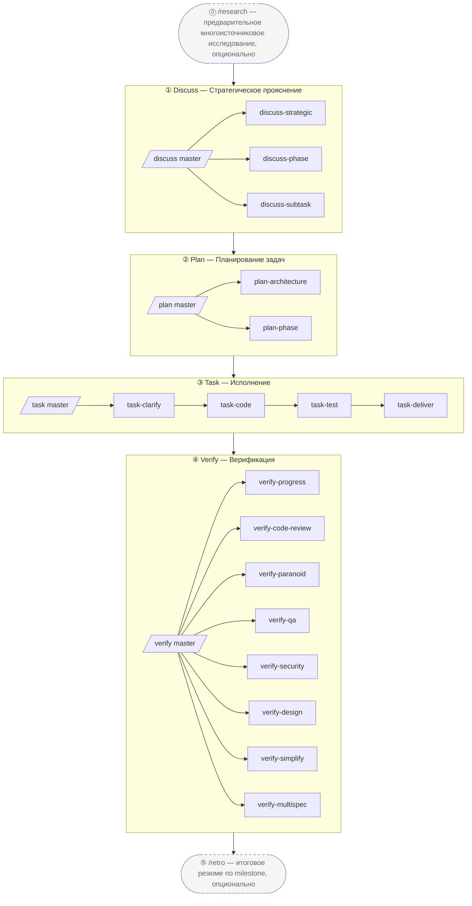

# harnessed

[English](./README.md) | [简体中文](./README-cn.md) | [繁體中文](./README-tw.md) | [日本語](./README-ja.md) | [한국어](./README-ko.md) | [Português (Brasil)](./README-pt-BR.md) | [Türkçe](./README-tr.md) | **Русский** | [Tiếng Việt](./README-vi.md) | [ไทย](./README-th.md)

> AI coding harness — пакетный менеджер + composition orchestrator
> Машинно-исполняемая трёхуровневая методология совместной работы (gstack governance + GSD project manager + superpowers senior engineer + karpathy principles + mattpocock moves) в виде работающего движка

[](https://npmjs.com/package/harnessed)
[](./LICENSE)
[](https://github.com/sponsors/easyinplay)

> Не аффилирован с Harness Inc., не одобрен и не спонсируется ею (см. [NOTICE](./NOTICE))

---

## ✨ TL;DR

**Лучшие практики оркестрации для разработки на Claude Code** — собирает лучшие open-source компоненты экосистемы Claude Code и сплетает их в единый Workflow через опinionated composition skills; не vendoring-ит код апстримов — Manifest-ы описывают установку/проверку, а composition skills оркестрируют многоапстримное взаимодействие.

---

> Постойте — неужели harnessed реально может тягаться с апстримными гигантами вроде superpowers / gstack / GSD?
> Конечно — мы **стоим на плечах гигантов**. Смотришь дальше, говорил Ньютон. 🧐
> ... *(шёпотом)* Хотя если присмотреться — скорее попугай на том самом плече.
> Ну и что — попугаи подражают; мы **оркестрируем**. 🦜

---

## 🎯 Key Differentiators

- **Трёхуровневый стек, исполняемый машиной** — `gstack governance` + `GSD project manager` + `superpowers senior engineer` + `karpathy 4 principles` + `mattpocock 23 moves`, 5 столпов с охватом 100%
- **Без vendoring апстримов** — Manifest-ы описывают установку/проверку; при обновлении апстрима пользователи просто переустанавливают и получают последнюю версию
- **Composition Skill** — собственные Workflow-скиллы играют роль дирижёрской палочки, оркестрируя несколько апстримов в унисон. **1 супер-мастер `/auto` + 4 мастера стадий + 18 суб-воркфлоу + 2 standalone = 25 Workflow с неймспейс-иерархией**, полное 4-стадийное машинное исполнение (`/auto` одним выстрелом по всем стадиям / `/discuss /plan /task /verify` по одной стадии / 18 суб-воркфлоу трёхуровневого стека / `/research /retro` 2 standalone)
- **L0 Discipline Substrate** — глобальный базовый уровень поведения для всех стадий (karpathy principles + output-style + language + operational + priority + protocols), применяется универсально
- **Мышление пакетного менеджера** — граф зависимостей установки разрешается автоматически, health check через doctor, одна команда для полной установки базы
- **Единая точка входа** — пользователи работают с мастер-командами `/discuss /plan /task /verify` без необходимости знать терминологию каждого апстрима; суб-команды явно вызывают конкретную стадию (например, `/discuss-strategic` запускает только стратегический уровень прояснения)

---

## 📦 Quick Install

```bash
npm install -g harnessed && harnessed setup
```

> Windows PowerShell 5.x не поддерживает цепочку `&&` — используйте `;` или две строки (`npm install -g harnessed; harnessed setup`). bash / zsh / PowerShell 7+ / cmd.exe работают нормально.

🤖 **Или пусть AI установит за вас** — вставьте это предложение в Claude Code (или любой AI-ассистент):

> Install harnessed for me following the guide at `https://github.com/easyinplay/harnessed/blob/main/INSTALL-WITH-AI.md`

AI автоматически скачает документ и выполнит установку, обработав крайние случаи с ОС / правами / PATH / corepack — не нужно копировать большие блоки текста.

> [!TIP]
> 🚀 **Любимые всеми Agent Teams и Subagent-функции в harnessed включаются автоматически в зависимости от задачи!**
> Нет необходимости вручную настраивать `CLAUDE_CODE_EXPERIMENTAL_AGENT_TEAMS` — `harnessed setup` записывает это в `~/.claude/settings.json` автоматически. Pattern A полностековая трёхсторонняя / Pattern C 4-специалиста и другие multi-agent Workflow работают «из коробки».

---

## 🚀 Quick Start — 3 варианта

В порядке возрастания участия пользователя:

### 🎯 Auto Mode (рекомендуется для новичков / не хочется думать)

```
/auto "требование X"

# Для крупных требований можно явно указать режим стадий (обычно не нужно — AI сам судит и маршрутизирует;
# применяйте принудительно, если считаете, что требование крупное):
/auto "требование X" --staged
```

> Не хочется думать или только начинаете — пусть harnessed возьмёт всё на себя. Запускает полные 6 стадий (research опционально → discuss → plan → task → verify → retro обязательно) без остановок. AI одним выстрелом оценивает сложность требования и предлагает переключиться в режим `--staged` для крупных требований (останавливается после каждой стадии для проверки); перед запуском спрашивает «Есть ли у вас чёткое понимание требования?» — если нет → автоматически запускает `/research` для многоисточникового исследования; завершается обязательным `/retro`. При сбое — fail-fast, продолжение через `harnessed resume`.

### 📂 Stage Mode (рекомендуется для опытных пользователей / нужен контроль промежуточных результатов)

```
/discuss "требование X"          # Стратегический + Phase + Subtask — 3-уровневое прояснение
/plan "требование X"             # Архитектура (опционально) + планирование
/task "подзадача-1"              # 4 суб-воркфлоу последовательно (clarify → code → test → deliver)
/verify "фаза-1"                 # 7 суб-воркфлоу условно
```

> Хотите выбирать с какой стадии начать / просматривать промежуточные результаты — 4 мастера вызываются независимо, и каждый мастер всё равно автоматически разворачивает все суб-воркфлоу своей стадии.

### 🔬 Surgical Mode (экспертный режим / вы знаете, что хотите)

```
/discuss-phase "..."        # Запустить только прояснение на уровне Phase
/plan-architecture "..."    # Запустить только архитектурный обзор
/verify-paranoid "..."      # Запустить только ревью Paranoid Staff Engineer
# ... выберите любой из 18 суб-воркфлоу
```

> «Я эксперт, я сам решу» — пропускаете мастера и вызываете суб-воркфлоу напрямую. Подходит для опытных пользователей, которые точно знают, какой суб нужен, или для повторного использования одного шага.

---

## 📐 Схема 4-стадийного потока



> Пунктирные блоки = опциональные standalone-ы (`/research` предварительное исследование / `/retro` итоговое резюме по milestone); сплошные блоки = основной 4-стадийный цикл.

### Сводная таблица 25 Workflow

| Slash cmd | Стадия | Тип | Возможности / Апстримы | Краткое описание |
|-----------|--------|------|------------------------|-----------------|
| `/auto` | Все | **Супер-мастер** | masterOrchestrator (по 6 стадиям) | Полный прогон 6 стадий одним выстрелом (research опционально → discuss → plan → task → verify → retro обязательно); AI оценивает сложность одним выстрелом + проверка понимания + обязательный retro; opt-in стадийные ворота через `--staged` |
| `/discuss` | ① Discuss | Мастер | masterOrchestrator | 3 суб-воркфлоу параллельно с gate-eval (правило chain-isolation) |
| `/discuss-strategic` | ① Discuss | Суб | gstack `/office-hours` + `/plan-ceo-review` + planning-with-files | Стратегический уровень — обязательный governance для новых функций / milestone / направления продукта (findings.md сохраняется) |
| `/discuss-phase` | ① Discuss | Суб | GSD `/gsd-discuss-phase` + planning-with-files | Уровень Phase — ≥2 открытых решений / прояснение серых зон (findings.md + knowledge.md сохраняются) |
| `/discuss-subtask` | ① Discuss | Суб | superpowers brainstorming + `/grill-with-docs` | Уровень Subtask — ≥2 подходов / основной алгоритм / API contract (краткое эфемерное обсуждение, не сохраняется) |
| `/plan` | ② Plan | Мастер | masterOrchestrator | Последовательный вызов 2 суб-воркфлоу (архитектура условно → фаза всегда) |
| `/plan-architecture` | ② Plan | Суб | gstack `/plan-eng-review` | Уровень архитектуры — обязательный governance gate для сложной архитектуры |
| `/plan-phase` | ② Plan | Суб | GSD `/gsd-plan-phase` + planning-with-files `/plan` | Уровень плана — сохраняет `task_plan.md` + `progress.md` |
| `/task` | ③ Task | Мастер | masterOrchestrator | Последовательный вызов 4 суб-воркфлоу на подзадачу (clarify → code → test → deliver) |
| `/task-clarify` | ③ Task | Суб | superpowers brainstorming + `/grill-with-docs` условно | Ворота прояснения при запуске подзадачи |
| `/task-code` | ③ Task | Суб | karpathy 4 principles + `/zoom-out` / `/improve-codebase-architecture` / `/diagnose` условно | Написание кода для подзадачи + синхронизация progress.md между сессиями |
| `/task-test` | ③ Task | Суб | superpowers TDD red-green-refactor + `/diagnose` условно | TDD обязателен для основной логики (псевдоним mattpocock `/tdd`) |
| `/task-deliver` | ③ Task | Суб | `ralph-loop` SDK wrapper + Agent Teams условно | До verbatim `COMPLETE` + R20.10 откат при max_iter |
| `/verify` | ④ Verify | Мастер | masterOrchestrator | 7 суб-воркфлоу с условной диспетчеризацией по сценарию |
| `/verify-progress` | ④ Verify | Суб | GSD `/gsd-verify-work` + `/gsd-progress` | Обязательная последовательная точка входа — приёмка UAT + синхронизация состояния |
| `/verify-code-review` | ④ Verify | Суб | `code-review` с параллельным fan-out по Subagent-ам | Высокодостоверные находки параллельно |
| `/verify-paranoid` | ④ Verify | Суб | gstack `/review` (Paranoid Staff Engineer) | Обязателен для критических модулей перед PR |
| `/verify-qa` | ④ Verify | Суб | gstack `/qa` + playwright-cli / `@playwright/test` / webapp-testing | End-to-end QA (условно при has_ui_changes) |
| `/verify-security` | ④ Verify | Суб | gstack `/cso` | OWASP / auth / secrets (условно при has_auth_or_secrets) |
| `/verify-design` | ④ Verify | Суб | gstack `/design-review` + ui-ux-pro-max + frontend-design | Консистентность дизайн-системы (условно при has_design_changes) |
| `/verify-simplify` | ④ Verify | Суб | `code-simplifier` | Финальное последовательное упрощение |
| `/verify-multispec` | ④ Verify | Суб | 4-специалиста Agent Team Pattern C | Эскалация критического релиза / крупного рефакторинга PR (взаимный перекрёстный допрос через SendMessage) |
| `/research` | Standalone | Standalone | Tavily / Exa MCP + ctx7 + GSD `/gsd-discuss-phase` | Многоисточниковое исследование (альтернатива стадии ①) |
| `/retro` | Standalone | Standalone | gstack `/retro` + planning-with-files RETROSPECTIVE.md | Итоговое резюме по завершении проекта / milestone |

> Мастер-оркестратор автоматически маршрутизирует к нужному суб-воркфлоу через gate (правило chain-isolation — незапустившиеся суб-воркфлоу прозрачно объявляются пропущенными).
> Прямой вызов суб-воркфлоу также обходит мастера и запускает одну стадию, например `/discuss-strategic "новая функция X"`.

---

## ⚡ Поток использования

4-стадийная методология трёхуровневого стека — рекомендуется последовательно запускать через 4 мастера-оркестратора:

```
/discuss  →  /plan  →  /task  →  /verify
   ①         ②        ③         ④
```

| Стадия | Мастер | Основные суб-воркфлоу | Взаимодействие с апстримами |
| ------ | ------ | ---------------------- | --------------------------- |
| ① **Discuss** | `/discuss` | strategic / phase / subtask (3 параллельно) | gstack `/office-hours` + GSD `/gsd-discuss-phase` + superpowers brainstorming |
| ② **Plan** | `/plan` | architecture (условно) → phase | gstack `/plan-eng-review` + GSD `/gsd-plan-phase` + planning-with-files |
| ③ **Task** | `/task` | clarify → code → test → deliver (4 последовательно на подзадачу) | karpathy principles + mattpocock moves + superpowers TDD + `ralph-loop` |
| ④ **Verify** | `/verify` | progress → 5 параллельных условных → simplify (+ multispec критический) | GSD `/gsd-verify-work` + code-review + gstack `/review` / `/qa` / `/cso` / `/design-review` + code-simplifier |

Практический пример:

```bash
# 1. Установить Workflow-апстримы (одна строка устанавливает gstack + GSD + superpowers + planning-with-files)
harnessed setup

# 2. Запустить 4-стадийный цикл внутри Claude Code
/discuss "новая функция X"          # Стратегический + Phase + Subtask — 3-уровневое прояснение
/plan "новая функция X"             # Архитектура (условно) + план (граф задач сохраняется)
/task "подзадача-1: API contract"   # 4 суб-воркфлоу последовательно на подзадачу
/verify "фаза-1"                    # 7 суб-воркфлоу условно

# 3. Продолжить после прерывания (в любой момент)
harnessed resume
```

> Можно также вызывать суб-воркфлоу напрямую, минуя мастера, чтобы запустить только один уровень, например `/verify-paranoid` запускает только ревью Paranoid Staff Engineer.

📊 Подробная диаграмма mermaid + полные описания всех стадий: [docs/WORKFLOW.md](./docs/WORKFLOW.md)

---

## 🗂️ Архитектура (4-стадийная, с неймспейс-иерархией)

### 1. Структура каталогов

```
harnessed/
├── manifests/                  # L1: слой описания апстримов (НЕ vendored)
├── workflows/                  # L6: composition skills (дирижёрская палочка 4-стадийного цикла)
│   ├── discuss/                # Стадия ① — 3 уровня (strategic + phase + subtask)
│   │   ├── auto/               # /discuss мастер gate-route
│   │   ├── strategic/          # /discuss-strategic (gstack /office-hours + /plan-ceo-review)
│   │   ├── phase/              # /discuss-phase (GSD /gsd-discuss-phase)
│   │   └── subtask/            # /discuss-subtask (superpowers brainstorming)
│   ├── plan/                   # Стадия ② (архитектура + граф задач фазы)
│   ├── task/                   # Стадия ③ (clarify + code + test + deliver)
│   ├── verify/                 # Стадия ④ (progress + code-review + paranoid + qa + cso + design + simplify + multispec)
│   ├── research/               # standalone — альтернатива стадии ①
│   ├── retro/                  # standalone — подведение итогов после стадии ④
│   ├── capabilities.yaml       # L5a: ~70 записей, 7 категорий SoT
│   ├── defaults.yaml           # ralph_max_iterations на каждую фазу Workflow
│   ├── judgments/              # L5a: критерии трёхуровневого стека + параллелизм + tdd + fallback + rules-routing
│   │   ├── strategic-gate.yaml
│   │   ├── phase-gate.yaml
│   │   ├── subtask-gate.yaml
│   │   ├── parallelism-gate.yaml         # L5b маршрутизация механизма исполнения
│   │   ├── tdd-gate.yaml
│   │   ├── fallback.yaml                 # 3 правила: skip_with_transparency + override + chain_isolation
│   │   ├── web-design-routing.yaml       # маршрутизация инструментов UI-дизайна
│   │   ├── web-testing-routing.yaml      # маршрутизация E2E / браузерного тестирования
│   │   ├── web-search-routing.yaml       # маршрутизация веб-поиска / загрузки документации
│   │   └── stage-routing.yaml            # маршрутизация суб-стадий мастера-оркестратора
│   └── disciplines/            # L0: глобальный базовый уровень поведения для всех стадий
│       ├── karpathy.yaml       # 4 принципа + ≤200L
│       ├── output-style.yaml   # BLUF + no-emoji + no-em-dash
│       ├── language.yaml       # zh-Hans по умолчанию + сохранение английского
│       ├── operational.yaml    # biome preempt + A7 + commit safety
│       ├── priority.yaml       # разрешение конфликтов скиллов
│       └── protocols.yaml      # самодостаточный дизайн-документ cc-handoff
├── routing/                    # L4: движок маршрутизации SSOT (decision_rules.yaml)
├── schemas/                    # L3: JSON Schema (потребляется IDE / CI)
├── src/                        # L4: TS-движок (workflow + routing + cli + installers + checkpoint + audit + state)
├── tests/                      # vitest unit + integration + dogfood (R8.1 dogfood-first)
├── scripts/                    # CI gate (check-workflow-schema, transparency-verdict, state-archive)
├── .planning/                  # память проекта (STATE + ROADMAP + REQUIREMENTS + на каждую фазу + milestone-ы)
└── docs/adr/                   # записи об архитектурных решениях
```

### 2. Логическое многоуровневое разделение (8 уровней)

```
┌────────────────────────────────────────────────────────────┐
│ L7 Пользовательские slash cmd + harnessed CLI               │
│   /discuss /plan /task /verify (мастер) + 18 суб + /research /retro + /auto супер-мастер
│   + прямой вызов gstack (30+ опциональных): /office-hours /review /qa /...
├────────────────────────────────────────────────────────────┤
│ L6 Оркестрация Workflow (workflows/<stage>/<sub>/)           │
├────────────────────────────────────────────────────────────┤
│ L5b Механизм исполнения (ортогональный): subagent / Agent Teams │
│   / основная сессия + ralph-loop wrapper                    │
│   parallelism-gate.yaml: по умолчанию subagent → эскалация по 5 триггерам │
│   Pattern A полностековая трёхсторонняя / B противостоящие гипотезы / C многомерное ревью │
├────────────────────────────────────────────────────────────┤
│ L5a Capability + Judgment + Defaults SoT                    │
│   capabilities.yaml (7 категорий) + judgments/ (10 файлов) + │
│   defaults.yaml                                              │
├────────────────────────────────────────────────────────────┤
│ L4  Runtime-движок (workflow / routing / handlers)           │
├────────────────────────────────────────────────────────────┤
│ L3  TypeBox schema + CI gate                                 │
├────────────────────────────────────────────────────────────┤
│ L2  Установщик + движок Manifest                             │
├────────────────────────────────────────────────────────────┤
│ L1  Компоненты апстримов (НЕ vendored)                       │
├────────────────────────────────────────────────────────────┤
│ L0  Discipline Substrate (применяется глобально)             │
│   karpathy principles + output-style + language + operational + │
│   priority + protocols (применяется универсально к L1-L7)  │
└────────────────────────────────────────────────────────────┘
```

### 3. Сквозные возможности (capabilities.yaml — 7 категорий, ~83 записи)

```
behavioral (6):       karpathy-guidelines + output-style + language + operational + priority + protocols
tool-slash-cmd (~60): gstack 30+ опциональных + gsd 10+ + mattpocock 12 высокочастотных + и т.д.
tool-mcp (3):         chrome-devtools-mcp / tavily-mcp / exa-mcp
tool-cli (2):         ctx7 / gws
tool-plugin (2):      planning-with-files / @playwright/test
tool-bundled (3):     ralph-loop / webapp-testing / playwright-cli
agent-platform (3):   agent-teams-create / send-message / shutdown
```

### 4. Пример потока данных (пользователь вызывает `/discuss "новая функция X"`)

```
[L7] Пользователь вызывает /discuss "новая функция X"
  ↓
[L6] workflows/discuss/auto/workflow.yaml мастер-оркестратор
  ↓
[L5a] judgments.strategic-gate.fires + phase-gate.fires + subtask-gate.fires (параллельная оценка в 3 потока)
  ↓
[L4] judgmentResolver.ts (4-уровневое разбиение ref) + exprBuilder.ts (expr-eval evaluate)
  ↓
[L0] discipline.priority-hierarchy разрешает конфликты инструментов / output-style форматирует вывод
  ↓
[fires=true суб] → вызов суб-воркфлоу (/discuss-strategic / /discuss-phase / /discuss-subtask)
  ↓ для каждого суба:
      ├─ behavioral_layer: karpathy-guidelines (всегда включён)
      ├─ tools_available: planning-with-files / ctx7 / mattpocock по условию
      ├─ parallelism: judgments.parallelism-gate.<route>.fires (механизм L5b)
      └─ вызовы фазы выполняются через интерполяцию шаблона capability
  ↓
[fallback.yaml chain-isolation] 3 уровня оцениваются независимо, не последовательно
[Объявление прозрачности пропуска] незапустившиеся субы → "⚠️ Пропущен <суб>, потому что <причина>"
  ↓
planning-with-files /plan (сквозной инструмент) → записывает артефакты в .planning/<phase-id>/
  ↓
[L4] state.ts writeCurrentWorkflow (proper-lockfile) + audit.append (12-поле JSONL)
```

### 5. Матрица маршрутизации решений (на основе правил, закодирована в judgments + capabilities)

| Сценарий | По умолчанию → Эскалация |
|----------|--------------------------|
| Механизм параллелизма | subagent → Agent Teams Pattern A/B/C (5 триггеров) |
| Основной план UI-дизайна | ui-ux-pro-max → frontend-design (пользователь явно просит стиль) |
| E2E браузерное исследование | playwright-cli (однострочный Bash, экономия Token) |
| E2E коммитируемый TS | @playwright/test по умолчанию |
| E2E привязка к Python-бэкенду | webapp-testing |
| Диагностика производительности / a11y / памяти | chrome-devtools-mcp |
| Веб-поиск (ключевые слова) | Tavily MCP по умолчанию |
| Веб-поиск (описательный / академический) | Exa MCP |
| Документация к API библиотеки | ctx7 CLI |
| GitHub URL | gh CLI |
| Загрузка одного URL | встроенный WebFetch |
| Gmail / Drive / Calendar | gws CLI |
| Архитектурный обзор (сложный) | gstack /plan-eng-review |
| TDD обязателен (основной алгоритм) | superpowers TDD ИЛИ mattpocock /tdd |
| PR критического модуля | gstack /review |
| PR крупного рефакторинга, многомерное ревью | 4-специалиста Agent Team Pattern C |
| Передача между сессиями | discipline.protocols самодостаточный дизайн-документ |
| Сложность `/auto` для крупных требований | AI одним выстрелом оценивает → автоматически предлагает `--staged` (отказ предлагает ручной `/discuss`) |
| Понимание требования для `/auto` | запрос перед стартом → отказ автоматически добавляет `/research` многоисточниковое исследование |

---

## 🛠️ Операционные команды

> Это собственные команды обслуживания harnessed (установка / health check / резервное копирование и откат / восстановление состояния и т.д.). Для повседневной разработки функций используйте slash-команды выше — обычно эти команды не нужны.

### CLI-команды

| Команда | Описание |
| ------- | -------- |
| `harnessed setup` | Единоразовая настройка; устанавливает Workflow-скиллы в `~/.claude/skills/` + MCP в `~/.claude.json` |
| `harnessed resume` | Продолжить с последней контрольной точки после прерывания сессии |
| `harnessed status` | Текущая фаза + владелец блокировки |
| `harnessed doctor` | Health check с 8 проверками (Node / MCP / jq / Win bash / routing / token budget и т.д.) |
| `harnessed install <name>` | Установить Manifest апстрима |
| `harnessed uninstall <name>` | Обратная деинсталляция |
| `harnessed backup` | Управление резервными копиями (снимки состояния) |
| `harnessed rollback <timestamp>` | Откат одной командой (сохранение EOL + проверка sha1) |
| `harnessed gc` | Очистить устаревшие резервные копии |
| `harnessed audit-log` | Запрос лога прозрачности маршрутизации (поддерживает `--filter` jq-выражение) |

### Флаги

> Все команды **применяются (немедленная запись)** по умолчанию — флаг не нужен. Опытные пользователи могут добавить `--dry-run` для предварительного просмотра.

| Флаг | Описание |
| ---- | -------- |
| `--dry-run` | Предварительный просмотр без записи на диск (opt-in для опытных) |
| `--non-interactive` | Сценарии CI / скриптового запуска |
| `--system` | Разрешить глобальную установку L4 (иначе понизить до L1 npx ephemeral) |
| `--yes` | Пропустить интерактивное подтверждение при деинсталляции |
| `--full-diff` | Развернуть diff-ы, свёрнутые выше 200 строк |
| `--no-color` | Принудительно отключить цвет (даже на TTY) |


---

## ❓ FAQ

<details>
<summary><b>Q1. Нужно ли устанавливать апстримы superpowers / gstack / GSD после установки harnessed?</b></summary>

<br>

Да, но **пользовательский опыт = одна команда**:

```bash
harnessed setup  # Автоматически устанавливает gstack + GSD + superpowers + planning-with-files; 25 Workflow-скиллов попадают в ~/.claude/skills/ + переменная окружения Agent Teams автоматически записывается в ~/.claude.json
```

Думайте об этом как о `brew install <formula>`, который вытягивает полный набор зависимостей — не нужно отдельно делать `brew install` для каждой зависимости.

</details>

<details>
<summary><b>Q2. Почему бы просто не vendoring-ить superpowers / gstack в репозиторий harnessed?</b></summary>

<br>

4 причины:

1. **Философия дифференциации** — harnessed — это «пакетный менеджер-ассемблист», противопоставленный лагерю «всё-в-одном с собственной сборкой». Vendoring = потеря преимущества → превращение в очередной набор Plugin-ов
2. **Кошмар лицензирования + атрибуции** — vendoring 4-5 активно поддерживаемых апстримов = сложная лицензионная мозаика
3. **Апстримные обновления меняют направление** — текущее описание через Manifest позволяет пользователям переустановить и получить последнюю версию при обновлении апстрима; vendoring вынуждает вручную синхронизировать код и вечно отставать
4. **Bus factor 1** — один мейнтейнер, поддерживающий синхронизацию 4-5 vendored апстримов = ускоренное выгорание

</details>

<details>
<summary><b>Q3. gstack / GSD / superpowers выглядят как инструменты для плана/обсуждения — они не пересекаются?</b></summary>

<br>

**Нет**. Это разные уровни трёхуровневого стека:

| Уровень | Апстрим | Ответственность |
| ------- | ------- | --------------- |
| Governance | gstack | Многоролевые ворота принятия решений (CEO / EM / Designer / Paranoid Engineer) |
| Brainstorming | superpowers | Прояснение дизайна подзадачи, сравнение альтернатив |
| Orchestration | GSD | Высокоуровневый граф задач фазы + анализ зависимостей |
| Persistence | planning-with-files | Сохраняет `task_plan.md` / `progress.md` / `findings.md` |

`/discuss /plan /task /verify` — 4 мастера связывают 4 стадии вместе; каждый мастер делегирует своему субу. Каждая стадия делает разное и передаёт эстафету следующей. **Никакого слияния**.

</details>

<details>
<summary><b>Q4. Фазы Workflow запускаются автоматически или ждут пользователя?</b></summary>

<br>

Зависит от поля `pause` в frontmatter файла `workflows/<name>/SKILL.md`:

- `pause: human_review` → блокирует и ждёт одобрения пользователя (ворота governance / финальная блокировка, например `/discuss-strategic` gstack `/office-hours` + `/plan-architecture` ворота блокировки `/plan-eng-review`)
- Без `pause` → автоматически переходит к следующей фазе

Вывод каждой фазы записывается в `.harnessed/checkpoints/`; после прерывания сессии `harnessed resume` продолжает с последней контрольной точки.

</details>

<details>
<summary><b>Q5. Является ли harnessed сам по себе CC Plugin-ом?</b></summary>

<br>

Гибрид:

- `npx harnessed@latest setup` запускает **Node.js CLI** (`bin/harnessed`)
- setup устанавливает **Workflow-скиллы** (markdown) в `~/.claude/skills/`, загружаемые runtime Claude Code
- `/discuss` / `/plan` / `/task` / `/verify` и т.д. — это slash-команды внутри CC, запускающие выполнение скилла
- CLI и CC-скиллы разделяют каталог состояния `.harnessed/checkpoints/`

</details>

---


## Лицензия

[Apache-2.0](./LICENSE) — см. [NOTICE](./NOTICE) (включает отказ от ответственности по товарному знаку Harness Inc.)

Поддержать разработку: [](https://github.com/sponsors/easyinplay)
