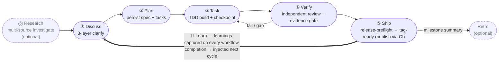
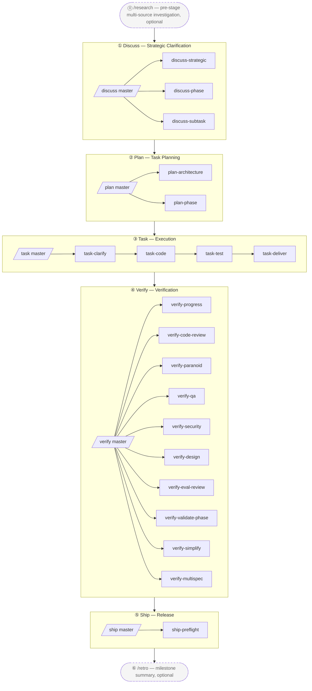

<p align="center">
  
</p>

[English](./README.md) | [简体中文](./README-cn.md) | [繁體中文](./README-tw.md) | [日本語](./README-ja.md) | [한국어](./README-ko.md) | [Português (Brasil)](./README-pt-BR.md) | [Türkçe](./README-tr.md) | **Русский** | [Tiếng Việt](./README-vi.md) | [ไทย](./README-th.md)

> **Примечание (best-effort перевод):** Этот перевод сгенерирован / выполнен по принципу best-effort и может отставать от английского [README.md](./README.md). Для самой свежей и авторитетной версии обращайтесь к английскому README.

> _Менеджер пакетов AI coding harness + composition orchestrator_ — собирает лучшие компоненты open-source-экосистемы в единый исполняемый engine, связанный трёхслойной методологией **BDD → SDD → TDD**.

> **harnessed — это orchestration brain + prompt library**, управляющий native subagent spawn через три быстрых CLI на чистых функциях — `harnessed gates` (какие sub-workflow срабатывают), `harnessed prompt` (spawn-ready prompt для sub) и `harnessed checkpoint` (запись прогресса).

[](https://npmjs.com/package/harnessed)
[](./LICENSE)
[](https://github.com/sponsors/easyinplay)

> Не аффилирован с Harness Inc., не одобрен и не спонсируется ею (см. [NOTICE](./NOTICE))

---

## ✨ TL;DR

**Как это работает**: harnessed **собирает** лучшие open-source агенты Claude Code (gstack, GSD, superpowers, planning-with-files) и **оркестрирует** их в единый workflow через opinionated composition skills. Он **не** vendoring-ит код апстримов — manifest-ы описывают install/check, а composition skills дирижируют многоапстримным взаимодействием (поэтому обновление апстрима — это просто переустановка, а не ручная синхронизация кода).

### 🔁 Рабочий цикл

> **Discuss → Plan → Build → Verify → Ship**, замкнутый циклом **Learn** — машинно исполняемый поверх three-layer stack (gstack governance · GSD orchestration · superpowers TDD · checkpoint evidence). «Сырая» работа агента дрейфует; harnessed превращает её в source-of-truth путь, где прогресс и доказательства сохраняются, а не живут в чате. **Обучение автоматическое**: каждый завершённый workflow дописывает свои сигналы failure/loop/reject в `.planning/LEARNINGS.md`, которые инжектятся в следующий цикл — это always-on, **не** зависит от опционального Retro. Retro (`/retro`) — это отдельное, опциональное резюме по milestone.



---

## 🧱 What is the three-layer stack?

Three-layer stack у harnessed — это программно-инженерная реализация устоявшегося вложения **BDD → SDD → TDD**: три вложенных цикла обратной связи, каждый из которых отвечает на свой вопрос. **Три уровня — это циклы** (стабильная теория); harnessed **компонует** open-source экосистему в каждый цикл — и компоненты **пересекаются**, а именно это и арбитрирует composition orchestrator.

| Уровень | Цикл | На какой вопрос отвечает | Скомпонован из (с пересечениями) |
|---|---|---|---|
| **① Behavior** | BDD | *Что* строить + как мы поймём, что готово | gstack `/office-hours` governance · GSD discuss · superpowers brainstorming → критерии приёмки |
| **② Spec** | SDD | *Как* это структурировано | GSD plan-phase → requirements / design / tasks · контракты (Spec Kit / ECC patterns) |
| **③ Implementation** | TDD | Оно действительно *работает* | superpowers TDD red-green · subagent execution · GSD verify-work · ralph-loop completion |

Циклы — это **вложенные линзы, а не фазы**: классический Cucumber-овский двойной цикл BDD-снаружи + TDD-внутри, расширенный кольцом SDD-spec эпохи GenAI до тройного цикла. harnessed запускает обход по умолчанию outer→inner как свой 5-стадийный ритм, плюс **обратные рёбра, которые он поставляет уже сегодня**: Verify отбрасывает провалившуюся работу обратно в Task, subagent, наткнувшийся на серую зону, делает round-trip к прояснению перед продолжением, а каждый отгруженный цикл возвращает learnings в следующий Discuss. (Более мелкозернистые структурированные обратные рёбра — например, противоречие контракта, маршрутизируемое прямо в Spec, или неоднозначное требование в Behavior — на roadmap, но ещё не поставлены. harnessed — это реализация тройного цикла в линейном ритме; полный маршрутизируемый граф — его эволюционный путь.)

**Компоненты пересекаются — в этом и суть.** **GSD** проходит сквозь все три цикла как orchestration-хребет, **gstack** охватывает Behavior + Review, **superpowers** охватывает Behavior (brainstorm) + Implementation (TDD). harnessed связывает их — и арбитрирует пересечение — в один движок. Две **сквозные дисциплины** проходят через каждый уровень: **karpathy principles** (*как* писать код — simplicity-first, surgical diffs) + **mattpocock moves** (тактические инструменты по требованию, такие как `/diagnose`, `/zoom-out`).

Соотнесено с рантайм-циклом выше: **Discuss = Behavior (BDD) · Plan = Spec (SDD) · Build = Implementation (TDD)**, затем **Verify + Ship** замыкают всё с evidence-воротами.

---

> Постойте — неужели harnessed реально может тягаться с апстримными гигантами вроде superpowers / gstack / GSD?
> Конечно — мы **стоим на плечах гигантов**. Смотришь дальше, говорил Ньютон. 🧐
> ... *(шёпотом)* Хотя если присмотреться — скорее попугай на том самом плече.
> Ну и что — попугаи подражают; мы **оркестрируем**. 🦜

---

## 🎯 Key Differentiators

- **Three-layer stack, исполняемый машиной** — **вложенный тройной цикл BDD→SDD→TDD** ([что это?](#-what-is-the-three-layer-stack)), скомпонованный из `gstack` + `GSD` + `superpowers` (с пересечениями, GSD как хребет) плюс `karpathy 4 principles` + `mattpocock 23 moves` как сквозные дисциплины
- **Без vendoring апстримов** — manifest-ы описывают install/check; при обновлении апстрима пользователи просто переустанавливают и получают последнюю версию
- **Composition Skill** — собственные workflow-скиллы играют роль дирижёрской палочки, оркестрируя несколько апстримов в унисон. **1 супер-мастер `/auto` + 5 мастеров стадий + 20 суб-воркфлоу + 2 standalone = 28 workflow с неймспейс-иерархией**, полное 5-стадийное машинное исполнение (`/auto` одним выстрелом по всем стадиям / `/discuss /plan /task /verify /ship` по одной стадии / 20 суб-воркфлоу three-layer-stack / `/research /retro` 2 standalone)
- **L0 Discipline Substrate** — глобальный базовый уровень поведения для всех стадий (karpathy principles + output-style + language + operational + priority + protocols), применяется универсально
- **Мышление пакетного менеджера** — граф зависимостей установки разрешается автоматически, health check через doctor, одна команда для полной установки базы
- **Единая точка входа** — пользователи работают с мастер-командами `/discuss /plan /task /verify /ship` без необходимости знать терминологию каждого апстрима; суб-команды явно вызывают конкретную стадию (например, `/discuss-strategic` запускает только стратегический уровень прояснения)
- **Forward continuation** — `harnessed next` / `harnessed advance` переносят вас через задачи и фазы: когда одна завершается, следующая **выводится из дискового состояния `.planning/`** (фаза готова, когда у её `PLAN` есть совпадающий `SUMMARY`) — никакой очереди для поддержки, поэтому новая фаза, добавленная в середине, подхватывается автоматически, а resume пере-выводит из диска. Per-turn breadcrumb `NEXT-UNIT` указывает, что дальше

---

## 🆚 vs Native Claude Code / Codex

Нативные агенты дают примитивы; harnessed связывает их в методологию. Там, где нативная ячейка говорит, что примитив «существует», вы всё равно проектируете, связываете и поддерживаете его сами в каждом проекте — harnessed поставляет его уже скомпонованным и приводимым в движение движком.

| Измерение | Native Claude Code | Native Codex | harnessed |
|---|---|---|---|
| **Workflow / методология** | Только примитивы — вы каждый раз проектируете поток | Меньше примитивов — фристайл по каждому промпту | Кодифицированный 5-стадийный движок **Discuss→Ship** three-layer-stack — циклы BDD + SDD + TDD + 2 сквозных (Review + Ship) |
| **Инъекция инструкций** | `CLAUDE.md` + skills + hooks существуют, но статичны и связываются вручную | Только `AGENTS.md` — без skills/hooks | Per-turn breadcrumb hook + маршрутизация в пределах задачи + learnings инжектятся каждый цикл |
| **Состояние / прогресс** | Контекст чата — теряется при `/clear` / compaction | Контекст чата — нет слоя персистентности | Дисковый `.planning/` + ledger `current-workflow.json` + checkpoint evidence |
| **Восстановление между сессиями** | Объяснять контекст заново вручную | Объяснять контекст заново вручную | `harnessed status --recover`: «вы здесь» + следующий шаг |
| **Верификация / «готово»** | Агент сам сообщает «готово» | Агент сам сообщает «готово» | Независимые review-subagent-ы + **fail-CLOSED evidence guard** (нет артефакта = не готово) |
| **Оркестрация subagent-ов** | Subagent-ы + Agent Teams доступны, но оркестрируются вручную | Нет примитива subagent/team | `gates → prompt → spawn → checkpoint`; Agent Teams включаются автоматически по задаче |
| **Цикл обучения** | Нет | Нет | `LEARNINGS.md` авто-захват + инъекция в следующий цикл |
| **Охват платформ** | Только Claude Code | Только Codex | **Cross-harness** — Claude Code основной, Codex через platform layer |

> Нативные агенты выигрывают на zero-setup, zero-overhead для тривиальных разовых правок. harnessed начинает окупаться в тот момент, когда работа охватывает несколько шагов, сессий или subagent-ов — там, где фристайл-дрейф и потерянное-в-чате состояние начинают стоить вам дорого.

---

## 📦 Quick Install

**Через npm** (рекомендуется — оба канала полноценны и синхронизированы):

```bash
npm install -g harnessed && harnessed setup
```

> Windows PowerShell 5.x не поддерживает цепочку `&&` — используйте `;` или две строки (`npm install -g harnessed; harnessed setup`). bash / zsh / PowerShell 7+ / cmd.exe работают нормально.

**Нет Node.js? Автономный бинарник** — по платформам, далее самообновляется через `harnessed update`:

```bash
# macOS (Apple Silicon) / Linux (x64)
curl -fsSL https://raw.githubusercontent.com/easyinplay/harnessed/main/install.sh | bash
```

```powershell
# Windows (x64)
irm https://raw.githubusercontent.com/easyinplay/harnessed/main/install.ps1 | iex
```

🤖 **Или пусть AI установит за вас** — вставьте это предложение в Claude Code (или любой AI-ассистент):

> Install harnessed for me following the guide at `https://github.com/easyinplay/harnessed/blob/main/INSTALL-WITH-AI.md`

AI автоматически скачает документ и выполнит установку, обработав крайние случаи с ОС / правами / PATH / corepack — не нужно копировать большие блоки текста.

> [!TIP]
> 🚀 **Любимые всеми функции Agent Teams и Subagent в harnessed включаются автоматически в зависимости от задачи!**
> Нет необходимости вручную настраивать `CLAUDE_CODE_EXPERIMENTAL_AGENT_TEAMS` — `harnessed setup` записывает это в `~/.claude/settings.json` автоматически. Pattern A полностековая трёхсторонняя / Pattern C 4-специалиста и другие multi-agent workflow работают «из коробки».

---

## ⏱️ First 5 Minutes

Кратчайший путь от нуля до работающего workflow:

```
# 1. Внутри Claude Code — запустите первый workflow
/auto "ваше первое требование"        # дефолт для новичка: прогоняет все стадии end-to-end
```

```bash
# 2. Потерялись? Запустите harnessed без аргументов — он скажет, где вы и что дальше
harnessed
#   → дашборд «вы здесь» (активная фаза + статус по каждому шагу) + строка NEXT: auto|manual|done
#   не нужно помнить status / next / resume — одна команда (аналог comet `/comet`, read-only)
#   добавьте --json для машиночитаемого вывода
```

```bash
# 3. Возобновляйте в любой момент после прерывания
harnessed            # тот же вид «вы здесь»
harnessed resume     # продолжить с последней контрольной точки
```

> Нужен более тонкий контроль над тем, какая стадия запускается и когда? См. 3 режима ниже.

---

## 🚀 Quick Start — 3 варианта

В порядке возрастания участия пользователя:

### 🎯 Auto Mode (рекомендуется для новичков / не хочется напрягаться)

```
/auto "требование X"

# Для крупных требований можно явно указать режим стадий (обычно не нужно — AI сам судит и маршрутизирует;
# применяйте принудительно, если считаете, что требование крупное):
/auto "требование X" --staged
```

> Не хочется напрягаться или только начинаете — пусть harnessed возьмёт всё на себя. Запускает полные 6 стадий (research опционально → discuss → plan → task → verify → retro обязательно) без остановок. AI одним выстрелом оценивает сложность требования и предлагает переключиться в режим `--staged` для крупных требований (останавливается после каждой стадии для проверки); перед запуском спрашивает «Есть ли у вас чёткое понимание требования?» — если нет → автоматически запускает `/research` многоисточниковое исследование; завершается обязательным резюме `/retro`. При сбое — fail-fast, продолжение через `harnessed resume`.

### 📂 Stage Mode (рекомендуется для опытных пользователей / нужен контроль промежуточных результатов)

```
/discuss "требование X"          # Стратегический + Phase + Subtask — 3-уровневое прояснение
/plan "требование X"             # Архитектура (условно) + персистентность плана
/task "подзадача-1"              # 4 суб-воркфлоу последовательно (clarify → code → test → deliver)
/verify "фаза-1"                 # 10 суб-воркфлоу условно
```

> Хотите выбирать, с какой стадии начать / просматривать промежуточные результаты — 5 мастеров вызываются независимо, и каждый мастер всё равно автоматически разворачивает все суб-воркфлоу своей стадии внутри себя.

### 🔬 Surgical Mode (экспертный режим / вы знаете, что хотите)

```
/discuss-phase "..."        # Запустить только прояснение на уровне Phase
/plan-architecture "..."    # Запустить только архитектурный обзор
/verify-paranoid "..."      # Запустить только ревью Paranoid Staff Engineer
# ... выберите любой из остальных 20 суб-воркфлоу
```

> «Я эксперт, я сам решу» — пропускаете мастера и вызываете суб-воркфлоу напрямую. Подходит для продвинутых пользователей, которые точно знают, какой суб нужен, или для повторного использования одного шага.

---

## 📐 5-Stage Flow Diagram



> Пунктирные блоки = опциональные standalone-ы (`/research` предварительное pre-strategic исследование / `/retro` резюме после milestone); сплошные блоки = основной 5-стадийный ритм (Ship останавливается на tag-ready; реальную публикацию делает CI `publish.yml`).

### Сводная таблица 28 Workflow

| Slash cmd | Стадия | Тип | Возможности / Апстримы | Краткое описание |
|-----------|--------|------|------------------------|-----------------|
| `/auto` | Все | **Супер-мастер** | masterOrchestrator (по 6 стадиям) | Полный прогон 6 стадий одним выстрелом (research опционально → discuss → plan → task → verify → retro обязательно); AI оценивает сложность одним выстрелом + проверка понимания + обязательный retro; opt-in стадийные ворота через `--staged` |
| `/discuss` | ① Discuss | Мастер | masterOrchestrator | 3 суб-воркфлоу параллельно с gate-eval (правило chain-isolation) |
| `/discuss-strategic` | ① Discuss | Суб | gstack `/office-hours` + `/plan-ceo-review` + planning-with-files | Стратегический уровень — обязательный governance для новых функций / milestone / направления продукта (findings.md сохраняется) |
| `/discuss-phase` | ① Discuss | Суб | GSD `/gsd-discuss-phase` + planning-with-files | Уровень Phase — ≥2 открытых решений / прояснение серых зон (findings.md + knowledge.md сохраняются) |
| `/discuss-subtask` | ① Discuss | Суб | superpowers brainstorming + `/grill-with-docs` | Уровень Subtask — ≥2 подходов / основной алгоритм / API contract (краткое эфемерное обсуждение, не сохраняется) |
| `/plan` | ② Plan | Мастер | masterOrchestrator | Последовательный вызов 2 суб-воркфлоу (архитектура условно → фаза всегда) |
| `/plan-architecture` | ② Plan | Суб | gstack `/plan-eng-review` | Уровень архитектуры — обязательный governance gate для сложной архитектуры |
| `/plan-phase` | ② Plan | Суб | GSD `/gsd-plan-phase` + planning-with-files `/plan` | Уровень плана — сохраняет `task_plan.md` + `progress.md` |
| `/task` | ③ Task | Мастер | masterOrchestrator | Последовательный вызов 4 суб-воркфлоу на подзадачу (clarify → code → test → deliver) |
| `/task-clarify` | ③ Task | Суб | superpowers brainstorming + `/grill-with-docs` условно | Ворота прояснения при запуске подзадачи |
| `/task-code` | ③ Task | Суб | karpathy 4 principles + `/zoom-out` / `/improve-codebase-architecture` / `/diagnose` условно | Написание кода для подзадачи + синхронизация progress.md между сессиями |
| `/task-test` | ③ Task | Суб | superpowers TDD red-green-refactor + `/diagnose` условно | TDD обязателен для основной логики (псевдоним mattpocock `/tdd`) |
| `/task-deliver` | ③ Task | Суб | `ralph-loop` SDK wrapper + Agent Teams условно | До verbatim `COMPLETE` + R20.10 откат при max_iter |
| `/verify` | ④ Verify | Мастер | masterOrchestrator | 10 суб-воркфлоу с условной диспетчеризацией по сценарию |
| `/verify-progress` | ④ Verify | Суб | GSD `/gsd-verify-work` + `/gsd-progress` | Обязательная последовательная точка входа — приёмка UAT + синхронизация состояния |
| `/verify-code-review` | ④ Verify | Суб | `code-review` с параллельным fan-out по subagent-ам | Высокодостоверные находки параллельно |
| `/verify-paranoid` | ④ Verify | Суб | gstack `/review` (Paranoid Staff Engineer) | Обязателен для критических модулей перед PR |
| `/verify-qa` | ④ Verify | Суб | gstack `/qa` + playwright-cli / `@playwright/test` / webapp-testing | End-to-end QA (условно при has_ui_changes) |
| `/verify-security` | ④ Verify | Суб | gstack `/cso` | OWASP / auth / secrets (условно при has_auth_or_secrets) |
| `/verify-design` | ④ Verify | Суб | gstack `/design-review` + ui-ux-pro-max + design-taste-frontend | Консистентность дизайн-системы (условно при has_design_changes) |
| `/verify-eval-review` | ④ Verify | Суб | GSD `/gsd-eval-review` | Аудит покрытия eval для AI phase (условно при has_ai_phase; в паре с gsd-ai-integration-phase на стороне plan) |
| `/verify-validate-phase` | ④ Verify | Суб | GSD `/gsd-validate-phase` | Дозаполнение покрытия Nyquist requirement→test (условно при requires_coverage_audit) |
| `/verify-simplify` | ④ Verify | Суб | `code-simplifier` | Финальное последовательное упрощение |
| `/verify-multispec` | ④ Verify | Суб | 4-специалиста Agent Team Pattern C | Эскалация критического релиза / крупного рефакторинга PR (взаимный перекрёстный допрос через SendMessage) |
| `/ship` | ⑤ Ship | Мастер | masterOrchestrator | Стадия релиза после Verify — preflight → делегирование PR/deploy в gstack `/ship` → публикация через CI (граница tag-ready) |
| `/ship-preflight` | ⑤ Ship | Суб | `harnessed release-preflight` | Read-only ворота готовности к релизу (CHANGELOG `[Unreleased]` / версия / git-clean / отсутствие тега); блокирует при сбое |
| `/research` | Standalone | Standalone | Tavily / Exa MCP + ctx7 + GSD `/gsd-discuss-phase` | Многоисточниковое исследование (альтернатива стадии ①) |
| `/retro` | Standalone | Standalone | gstack `/retro` + planning-with-files RETROSPECTIVE.md | Итоговое резюме по завершении проекта / milestone |

> Мастер-оркестратор автоматически маршрутизирует к нужному суб-воркфлоу через gate (правило chain-isolation — незапустившиеся суб-воркфлоу прозрачно объявляются пропущенными).
> Прямой вызов суб-воркфлоу также обходит мастера и запускает одну стадию, например `/discuss-strategic "новая функция X"`.

---

## ⚡ Usage Flow

5-стадийная методология three-layer-stack — рекомендуется последовательно запускать через 5 мастеров-оркестраторов:

```
/discuss  →  /plan  →  /task  →  /verify  →  /ship
   ①         ②        ③         ④           ⑤
```

| Стадия | Мастер | Основные суб-воркфлоу | Взаимодействие с апстримами |
| ------ | ------ | ---------------------- | --------------------------- |
| ① **Discuss** | `/discuss` | strategic / phase / subtask (3 параллельно) | gstack `/office-hours` + GSD `/gsd-discuss-phase` + superpowers brainstorming |
| ② **Plan** | `/plan` | architecture (условно) → phase | gstack `/plan-eng-review` + GSD `/gsd-plan-phase` + planning-with-files |
| ③ **Task** | `/task` | clarify → code → test → deliver (4 последовательно на подзадачу) | karpathy principles + mattpocock moves + superpowers TDD + `ralph-loop` |
| ④ **Verify** | `/verify` | progress → 5 параллельных условных → simplify (+ multispec критический) | GSD `/gsd-verify-work` + code-review + gstack `/review` / `/qa` / `/cso` / `/design-review` + code-simplifier |
| ⑤ **Ship** | `/ship` | preflight (ворота готовности к релизу) → делегирование PR/deploy | `harnessed release-preflight` + gstack `/ship` + CI `publish.yml` (граница tag-ready) |

Практический пример:

```bash
# 1. Установить workflow-апстримы (одна строка устанавливает gstack + GSD + superpowers + planning-with-files)
harnessed setup

# 2. Запустить 5-стадийный цикл внутри Claude Code
/discuss "новая функция X"          # Стратегический + Phase + Subtask — 3-уровневое прояснение
/plan "новая функция X"             # Архитектура (условно) + план (граф задач сохраняется)
/task "подзадача-1: API contract"   # 4 суб-воркфлоу последовательно на подзадачу
/verify "фаза-1"                    # 10 суб-воркфлоу условно
/ship                               # ворота release-preflight → PR/deploy (tag-ready; публикация через CI)

# 3. Продолжить после прерывания (в любой момент)
harnessed resume
```

> Можно также вызывать суб-воркфлоу напрямую, минуя мастера, чтобы запустить только один уровень, например `/verify-paranoid` запускает только ревью Paranoid Staff Engineer.

📊 Подробная диаграмма mermaid + полные описания всех стадий: [docs/WORKFLOW.md](./docs/WORKFLOW.md)

---

## 🗂️ Architecture (5-stage namespace-layered)

### 1. Структура каталогов

```
harnessed/
├── manifests/                  # L1: слой описания апстримов (НЕ vendored)
├── workflows/                  # L6: composition skills (дирижёрская палочка 5-стадийного цикла)
│   ├── discuss/                # Стадия ① — 3 уровня (strategic + phase + subtask)
│   │   ├── auto/               # /discuss мастер gate-route
│   │   ├── strategic/          # /discuss-strategic (gstack /office-hours + /plan-ceo-review)
│   │   ├── phase/              # /discuss-phase (GSD /gsd-discuss-phase)
│   │   └── subtask/            # /discuss-subtask (superpowers brainstorming)
│   ├── plan/                   # Стадия ② (архитектура + граф задач фазы)
│   ├── task/                   # Стадия ③ (clarify + code + test + deliver)
│   ├── verify/                 # Стадия ④ (progress + code-review + paranoid + qa + cso + design + simplify + multispec)
│   ├── ship/                   # Стадия ⑤ (preflight ворота готовности к релизу → делегирование PR/deploy в gstack /ship; tag-ready)
│   ├── research/               # standalone — альтернатива стадии ①
│   ├── retro/                  # standalone — закрытие milestone после стадии ⑤
│   ├── capabilities.yaml       # L5a: ~100 записей, 7 категорий SoT
│   ├── defaults.yaml           # ralph_max_iterations на каждую фазу workflow
│   ├── judgments/              # L5a: критерии three-layer-stack + параллелизм + tdd + fallback + rules-routing
│   │   ├── strategic-gate.yaml
│   │   ├── phase-gate.yaml
│   │   ├── subtask-gate.yaml
│   │   ├── parallelism-gate.yaml         # L5b маршрутизация механизма исполнения
│   │   ├── tdd-gate.yaml
│   │   ├── fallback.yaml                 # 3 правила: skip_with_transparency + override + chain_isolation
│   │   ├── web-design-routing.yaml       # маршрутизация инструментов UI-дизайна
│   │   ├── web-testing-routing.yaml      # маршрутизация E2E / браузерного тестирования
│   │   ├── web-search-routing.yaml       # маршрутизация веб-поиска / загрузки документации
│   │   └── stage-routing.yaml            # маршрутизация суб-стадий мастера-оркестратора
│   └── disciplines/            # L0: глобальный базовый уровень поведения для всех стадий
│       ├── karpathy.yaml       # 4 принципа + ≤200L
│       ├── output-style.yaml   # BLUF + no-emoji + no-em-dash
│       ├── language.yaml       # zh-Hans по умолчанию + сохранение английского
│       ├── operational.yaml    # biome preempt + A7 + commit safety
│       ├── priority.yaml       # разрешение конфликтов скиллов
│       └── protocols.yaml      # самодостаточный дизайн-документ cc-handoff
├── routing/                    # L4: движок маршрутизации SSOT (decision_rules.yaml)
├── schemas/                    # L3: JSON Schema (потребляется IDE / CI)
├── src/                        # L4: TS-движок (workflow + routing + cli + installers + checkpoint + audit + state)
├── tests/                      # vitest unit + integration + dogfood (R8.1 dogfood-first)
├── scripts/                    # CI gate (check-workflow-schema, transparency-verdict, state-archive)
├── .planning/                  # память проекта (STATE + ROADMAP + REQUIREMENTS + на каждую фазу + milestone-ы)
└── docs/adr/                   # записи об архитектурных решениях
```

### 2. Логическое многоуровневое разделение (8 уровней)

```
┌────────────────────────────────────────────────────────────┐
│ L7 Пользовательские slash cmd + harnessed CLI               │
│   /discuss /plan /task /verify /ship (мастер) + 20 суб + /research /retro + /auto супер-мастер
│   + прямой вызов gstack (30+ опциональных): /office-hours /review /qa /...
├────────────────────────────────────────────────────────────┤
│ L6 Оркестрация workflow (workflows/<stage>/<sub>/)           │
├────────────────────────────────────────────────────────────┤
│ L5b Механизм исполнения (ортогональный): subagent / Agent Teams │
│   / основная сессия + ralph-loop wrapper                    │
│   parallelism-gate.yaml: по умолчанию subagent → эскалация по 5 триггерам │
│   Pattern A полностековая трёхсторонняя / B противостоящие гипотезы / C многомерное ревью │
├────────────────────────────────────────────────────────────┤
│ L5a Capability + Judgment + Defaults SoT                    │
│   capabilities.yaml (7 категорий) + judgments/ (10 файлов) + │
│   defaults.yaml                                              │
├────────────────────────────────────────────────────────────┤
│ L4  Runtime-движок (workflow / routing / handlers)           │
├────────────────────────────────────────────────────────────┤
│ L3  TypeBox schema + CI gate                                 │
├────────────────────────────────────────────────────────────┤
│ L2  Установщик + движок Manifest                             │
├────────────────────────────────────────────────────────────┤
│ L1  Компоненты апстримов (НЕ vendored)                       │
├────────────────────────────────────────────────────────────┤
│ L0  Discipline Substrate (применяется глобально)             │
│   karpathy principles + output-style + language + operational + │
│   priority + protocols (применяется универсально к L1-L7)  │
└────────────────────────────────────────────────────────────┘
```

### 3. Сквозные возможности (capabilities.yaml — 7 категорий, ~100 записей)

```
behavioral (6):       karpathy-guidelines + output-style + language + operational + priority + protocols
tool-slash-cmd (~60): gstack 30+ опциональных + gsd 10+ + mattpocock 12 высокочастотных + и т.д.
tool-mcp (3):         chrome-devtools-mcp / tavily-mcp / exa-mcp
tool-cli (2):         ctx7 / gws
tool-plugin (2):      planning-with-files / @playwright/test
tool-bundled (3):     ralph-loop / webapp-testing / playwright-cli
agent-platform (3):   agent-teams-create / send-message / shutdown
```

### 4. Пример потока данных (пользователь вызывает `/discuss "новая функция X"`)

```
[L7] Пользователь вызывает /discuss "новая функция X"
  ↓
[L6] workflows/discuss/auto/workflow.yaml мастер-оркестратор
  ↓
[L5a] judgments.strategic-gate.fires + phase-gate.fires + subtask-gate.fires (параллельная оценка в 3 потока)
  ↓
[L4] judgmentResolver.ts (4-уровневое разбиение ref) + exprBuilder.ts (expr-eval evaluate)
  ↓
[L0] discipline.priority-hierarchy разрешает конфликты инструментов / output-style форматирует вывод
  ↓
[fires=true суб] → вызов суб-воркфлоу (/discuss-strategic / /discuss-phase / /discuss-subtask)
  ↓ для каждого суба:
      ├─ behavioral_layer: karpathy-guidelines (всегда включён)
      ├─ tools_available: planning-with-files / ctx7 / mattpocock по условию
      ├─ parallelism: judgments.parallelism-gate.<route>.fires (механизм L5b)
      └─ вызовы фазы выполняются через интерполяцию шаблона capability
  ↓
[fallback.yaml chain-isolation] 3 уровня оцениваются независимо, не последовательно
[Объявление прозрачности пропуска] незапустившиеся субы → "⚠️ Пропущен <суб>, потому что <причина>"
  ↓
planning-with-files /plan (сквозной инструмент) → записывает артефакты в .planning/<phase-id>/
  ↓
[L4] state.ts writeCurrentWorkflow (proper-lockfile) + audit.append (12-поле JSONL)
```

### 5. Матрица маршрутизации решений (на основе правил, закодирована в judgments + capabilities)

| Сценарий | По умолчанию → Эскалация |
|----------|--------------------------|
| Механизм параллелизма | subagent → Agent Teams Pattern A/B/C (5 триггеров) |
| Основной план UI-дизайна | **два этапа**: ui-ux-pro-max (аудитория / логика взаимодействия / ось дизайна — структура) → design-taste-frontend (оверлей визуальной полировки anti-slop, кросс-агентный taste-skill) |
| E2E браузерное исследование | playwright-cli (однострочный Bash, экономия token) |
| E2E коммитируемый TS | @playwright/test по умолчанию |
| E2E привязка к Python-бэкенду | webapp-testing |
| Диагностика производительности / a11y / памяти | chrome-devtools-mcp |
| Веб-поиск (ключевые слова) | Tavily MCP по умолчанию |
| Веб-поиск (описательный / академический) | Exa MCP |
| Документация к API библиотеки | ctx7 CLI |
| GitHub URL | gh CLI |
| Загрузка одного URL | встроенный WebFetch |
| Gmail / Drive / Calendar | gws CLI |
| Архитектурный обзор (сложный) | gstack /plan-eng-review |
| TDD обязателен (основной алгоритм) | superpowers TDD ИЛИ mattpocock /tdd |
| PR критического модуля | gstack /review |
| PR крупного рефакторинга, многомерное ревью | 4-специалиста Agent Team Pattern C |
| Передача между сессиями | discipline.protocols самодостаточный дизайн-документ |
| Сложность `/auto` для крупных требований | AI одним выстрелом оценивает → автоматически предлагает `--staged` (отказ предлагает ручной `/discuss`) |
| Понимание требования для `/auto` | запрос перед стартом → отказ автоматически добавляет `/research` многоисточниковое исследование |

---

## 🛠️ Operational Commands

> Это собственные команды обслуживания harnessed (setup / health check / резервное копирование и откат / восстановление состояния и т.д.). Для повседневной разработки функций используйте slash-команды выше — обычно эти команды не нужны.

**v4.0 — мозг оркестрации.** Slash-команды выполняют уточнение в основной сессии Claude Code (чтобы вопросы дошли до вас), затем spawn'ят CC-native subagent'ы (включая Agent Teams + round-trip'ы уточнения). harnessed предоставляет оценку gate (`harnessed gates`) и готовые к spawn промпты (`harnessed prompt`); сам spawn выполняет основная сессия. `harnessed run` сохранён для использования в CI/headless.

### CLI-команды

| Команда | Описание |
| ------- | -------- |
| `harnessed setup` | Единоразовая настройка; устанавливает workflow-скиллы в `~/.claude/skills/` + MCP в `~/.claude.json` |
| `harnessed gates <master>` | Оценивает, какие sub-workflow срабатывают для master stage (JSON: fire/skip/parallelism). Используется slash-командами для оркестрации нативных spawn'ов. |
| `harnessed prompt <sub>` | Выводит готовый к spawn промпт (role + checklist + disciplines + протоколы completion/clarification) для sub-workflow. |
| `harnessed checkpoint <action> <sub>` | Записывает start/complete/fail sub-workflow в `~/.claude/harnessed/checkpoints/`. |
| `harnessed` (без аргументов) | «Вы здесь» с zero-arg: дашборд активного workflow + `NEXT: auto\|manual\|done` + подсказка запуска; `--json` машиночитаемый; нет активного workflow → onboarding-подсказка (аналог comet `/comet`, read-only). |
| `harnessed next` | Детерминированный контракт следующего шага. Внутри workflow: `NEXT: auto\|manual\|done`. Когда все субы workflow разрешены, проваливается к следующей **cross-unit** (следующая фаза/задача выводится из дискового состояния `.planning/`) с контрактом по exit-коду (`0` advance · `2` done · `10` blocked). |
| `harnessed advance` | Forward continuation — печатает следующую рабочую единицу (следующая фаза/задача) по milestone и команду для её запуска. Только печать (следующий `/auto` запускает основная сессия); отказывается шагать через незавершённую более раннюю фазу (`--force` переопределяет); `--json` приводит в движение цикл `while harnessed advance --json; do :; done`. |
| `harnessed reject <sub>` | Помечает суб как отклонённый пользователем (терминальное, отлично от `failed`). |
| `harnessed compact [--tokens <n>]` | Суммирует+вытесняет разрешённые записи ledger (G6-safe: `fail_count>0` никогда не вытесняется); авто-триггер на `checkpoint complete --tokens`. |
| `harnessed workflows` | Список workflow в полёте (по одному на репозиторий). |
| `harnessed learn "<lesson>"` | Дописывает прозу-learning в `.planning/LEARNINGS.md` этого репозитория. |
| `harnessed run <name>` | Запускает workflow через in-process SDK spawn (режим CI/headless). Slash-команды вместо этого используют CC-native spawn. |
| `harnessed resume` | Продолжить с последней контрольной точки после прерывания сессии |
| `harnessed status` | Текущая фаза + владелец блокировки |
| `harnessed doctor` | Проверка здоровья (Node / MCP / jq / Win bash / routing / token budget / целостность скиллов / конфликт GateGuard / update-available и др.) |
| `harnessed update [--check\|--upstreams\|--migration-report]` | Самообновление с учётом канала установки: бинарная установка заменяет себя на месте из GitHub releases (проверка sha256, предыдущая версия сохраняется для отката); npm-установка выполняет `npm i -g harnessed@latest`. `--check` сообщает последнюю версию; `--upstreams` перезапускает базовые manifests; `--migration-report` — read-only инвентаризация устаревшего состояния |
| `harnessed release-preflight` | Read-only ворота готовности к релизу (CHANGELOG `[Unreleased]` / версия / git-clean / отсутствие тега); выход 1, если не готово. Ворота стадии Ship. |
| `harnessed retro --done` | Сбрасывает счётчик фаз retro-напоминания после запуска `/retro` (очищает per-turn подсказку RETRO-DUE). |
| `harnessed install <name>` | Установить Manifest апстрима |
| `harnessed uninstall [name]` | Обратное удаление |
| `harnessed backup` | Управление резервными копиями (снимки состояния) |
| `harnessed rollback <timestamp>` | Откат одной командой (сохранение EOL + проверка sha1) |
| `harnessed gc` | Очистить устаревшие резервные копии |
| `harnessed audit-log` | Запрос лога прозрачности маршрутизации (поддерживает `--filter` jq-выражение) |

### Флаги

> Все команды **применяются (немедленная запись)** по умолчанию — флаг не нужен. Опытные пользователи могут добавить `--dry-run` для предварительного просмотра.

| Флаг | Описание |
| ---- | -------- |
| `--dry-run` | Предварительный просмотр без записи на диск (opt-in для опытных) |
| `--non-interactive` | Сценарии CI / скриптового запуска |
| `--system` | Разрешить глобальную установку L4 (иначе понизить до L1 npx ephemeral) |
| `--yes` | Пропустить интерактивное подтверждение при uninstall |
| `--full-diff` | Развернуть diff-ы, свёрнутые выше 200 строк |
| `--no-color` | Принудительно отключить цвет (даже на TTY) |
| `--task <text>` | `run` — описание задачи (передаётся как `gateContext.task` workflow) |
| `--task-stdin` | `run` — читает описание задачи из stdin до EOF (избегает shell-escape для кавычек/$/`) |


---

## ❓ FAQ

<details>
<summary><b>Q1. Нужно ли устанавливать апстримы superpowers / gstack / GSD после установки harnessed?</b></summary>

<br>

Да, но **пользовательский опыт = одна команда**:

```bash
harnessed setup  # Автоматически устанавливает gstack + GSD + superpowers + planning-with-files; 28 workflow-скиллов попадают в ~/.claude/skills/ + переменная окружения Agent Teams автоматически записывается в ~/.claude/settings.json
```

Думайте об этом как о `brew install <formula>`, который вытягивает полный набор зависимостей — не нужно отдельно делать `brew install` для каждой зависимости.

</details>

<details>
<summary><b>Q2. Почему бы просто не vendoring-ить superpowers / gstack в репозиторий harnessed?</b></summary>

<br>

4 причины:

1. **Философия дифференциации** — harnessed — это «пакетный менеджер-ассемблист», противопоставленный лагерю «всё-в-одном с собственной сборкой». Vendoring = потеря преимущества → превращение в очередной набор плагинов
2. **Кошмар лицензирования + атрибуции** — vendoring 4-5 активно поддерживаемых апстримов = сложная лицензионная мозаика
3. **Апстримные обновления меняют направление** — текущее описание через manifest позволяет пользователям переустановить и получить последнюю версию при обновлении апстрима; vendoring вынуждает вручную синхронизировать код и вечно отставать
4. **Bus factor 1** — один мейнтейнер, поддерживающий синхронизацию 4-5 vendored апстримов = ускоренное выгорание

</details>

<details>
<summary><b>Q3. gstack / GSD / superpowers выглядят как инструменты для плана/обсуждения — они не пересекаются?</b></summary>

<br>

**Нет**. Это разные стадии three-layer stack:

| Стадия | Апстрим | Ответственность |
| ------ | ------- | --------------- |
| Governance | gstack | Многоролевые ворота принятия решений (CEO / EM / Designer / Paranoid Engineer) |
| Brainstorming | superpowers | Прояснение дизайна подзадачи, сравнение альтернатив |
| Orchestration | GSD | Высокоуровневый граф задач фазы + анализ зависимостей |
| Persistence | planning-with-files | Сохраняет `task_plan.md` / `progress.md` / `findings.md` |

`/discuss /plan /task /verify /ship` — 5 мастеров связывают 5 стадий вместе; каждый мастер внутри себя делегирует своему субу. Каждая стадия делает разное и передаёт эстафету следующей. **Никакого слияния**.

</details>

<details>
<summary><b>Q4. Фазы workflow запускаются автоматически или ждут пользователя?</b></summary>

<br>

Зависит от поля `pause` во frontmatter файла `workflows/<name>/SKILL.md`:

- `pause: human_review` → блокирует и ждёт одобрения пользователя (ворота governance / финальная блокировка, например `/discuss-strategic` gstack `/office-hours` + `/plan-architecture` ворота блокировки `/plan-eng-review`)
- Без `pause` → автоматически переходит к следующей фазе

Вывод каждой фазы записывается в `~/.claude/harnessed/checkpoints/`; после прерывания сессии `harnessed resume` продолжает с последней контрольной точки.

</details>

<details>
<summary><b>Q5. Является ли harnessed сам по себе CC-плагином?</b></summary>

<br>

Гибрид:

- `npx harnessed@latest setup` запускает **Node.js CLI** (`bin/harnessed`) — или используйте автономный бинарник из однострочного установщика (Node.js не нужен)
- setup устанавливает **workflow-скиллы** (markdown) в `~/.claude/skills/`, загружаемые runtime Claude Code
- `/discuss` / `/plan` / `/task` / `/verify` и т.д. — это slash-команды внутри CC, запускающие выполнение скилла
- CLI и CC-скиллы разделяют каталог состояния `~/.claude/harnessed/checkpoints/`

</details>

---


## License

[Apache-2.0](./LICENSE) — см. [NOTICE](./NOTICE) (включает отказ от ответственности по товарному знаку Harness Inc.)

Поддержать разработку: [](https://github.com/sponsors/easyinplay)
