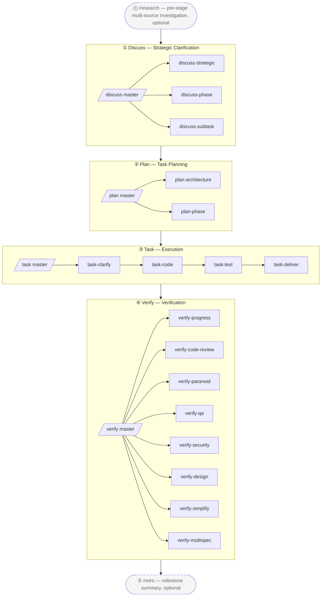

# harnessed

[English](./README.md) | [简体中文](./README-cn.md) | [繁體中文](./README-tw.md) | [日本語](./README-ja.md) | [한국어](./README-ko.md) | [Português (Brasil)](./README-pt-BR.md) | [Türkçe](./README-tr.md) | [Русский](./README-ru.md) | [Tiếng Việt](./README-vi.md) | **ไทย**

> AI coding harness package manager + composition orchestrator
> รันเมธดวิทยาความร่วมมือแบบ three-layer-stack (gstack governance + GSD project manager + superpowers senior engineer + karpathy principles + mattpocock moves) ในรูปแบบ engine ที่ machine-execute ได้จริง

[](https://npmjs.com/package/harnessed)
[](./LICENSE)
[](https://github.com/sponsors/easyinplay)

> ไม่มีความเกี่ยวข้อง ไม่ได้รับการรับรอง หรือได้รับการสนับสนุนจาก Harness Inc. (ดู [NOTICE](./NOTICE))

---

## ✨ TL;DR

**Orchestration ตามแนวปฏิบัติที่ดีที่สุดสำหรับ Harness Engineering บน Claude Code** — รวบรวม component โอเพ่นซอร์สที่ดีที่สุดในระบบนิเวศ Claude Code มาถักทอเป็น workflow เดียวที่เป็นหนึ่งเดียวผ่าน composition skills ที่มีจุดยืนชัดเจน ไม่ vendor โค้ดต้นน้ำ — manifests อธิบาย install/check ส่วน composition skills คือ orchestrator ที่ประสานการทำงานข้าม upstream หลายรายการ

---

> เดี๋ยวก่อน — harnessed สู้ upstream ยักษ์ใหญ่อย่าง superpowers / gstack / GSD ได้จริงหรือ?
> แน่นอน — เรา **ยืนอยู่บนบ่าของยักษ์** ดูได้ไกลกว่า Newton บอก 🧐
> ... *(กระซิบ)* แต่ถ้ามองดี ๆ ก็คล้ายนกแก้วที่เกาะอยู่บนบ่าของยักษ์นั่นแหละ
> เอาน่า — นกแก้วพูดตาม เราแต่ **orchestrate** 🦜

---

## 🎯 Key Differentiators

- **Three-layer stack แบบ machine-executed** — `gstack governance` + `GSD project manager` + `superpowers senior engineer` + `karpathy 4 principles` + `mattpocock 23 moves` ครบทั้ง 5 เสาหลัก 100%
- **ไม่ vendor upstream** — manifests อธิบาย install/check เมื่อ upstream อัปเกรด ผู้ใช้แค่ re-install ก็ได้เวอร์ชันล่าสุดทันที
- **Composition Skill** — workflow skills ภายในทำหน้าที่เหมือนไม้บาตอง ประสาน upstream หลายตัวให้ทำงานพร้อมกัน **1 super-master `/auto` + 4 stage masters + 18 sub-workflows + 2 standalones = 25 workflows แบบ namespace-layered** machine-execute ครบ 4 stage (`/auto` one-shot ข้ามทุก stage / `/discuss /plan /task /verify` ทีละ stage / 18 three-layer-stack subs / `/research /retro` 2 standalones)
- **L0 Discipline Substrate** — baseline พฤติกรรมข้ามทุก stage ระดับ global (karpathy principles + output-style + language + operational + priority + protocols) ใช้งานแบบ universal
- **แนวคิด package manager** — dependency graph ของการติดตั้ง auto-resolve, doctor health check, install-base one-shot full install ครั้งเดียวจบ
- **จุดเข้าเดียว** — ผู้ใช้เห็นแค่ `/discuss /plan /task /verify` master slash commands โดยไม่ต้องเรียนรู้คำศัพท์ของแต่ละ upstream; sub commands เรียกใช้แต่ละ stage โดยตรง (เช่น `/discuss-strategic` รันเฉพาะ strategic-layer clarification)

---

## 📦 Quick Install

```bash
npm install -g harnessed && harnessed setup
```

> Windows PowerShell 5.x ไม่รองรับการเชื่อมคำสั่งด้วย `&&` — ใช้ `;` หรือแยกเป็นสองบรรทัด (`npm install -g harnessed; harnessed setup`) แทน ส่วน bash / zsh / PowerShell 7+ / cmd.exe ใช้งานได้ปกติ

**การถอนการติดตั้ง:**
```bash
harnessed uninstall    # ลบไฟล์ของ harnessed เอง (ไม่กระทบ upstream components)
```

> `harnessed uninstall` จะล้าง commands, workflow skills, settings environment variables และ state directory ส่วน upstream components (npm packages, MCP servers, CC plugins, git-cloned repos, npx skills) จะคงอยู่เหมือนเดิม ใช้ `harnessed uninstall <name>` เพื่อลบ upstream รายตัว เพิ่ม `--dry-run` เพื่อดูตัวอย่าง

🤖 **หรือจะให้ AI ติดตั้งให้แทนก็ได้** — วางประโยคนี้ใน Claude Code (หรือ AI assistant ตัวไหนก็ได้):

> Install harnessed for me following the guide at `https://github.com/easyinplay/harnessed/blob/main/INSTALL-WITH-AI.md`

AI จะดึงเอกสารมาเองแล้วรันการติดตั้ง รองรับ edge case ด้าน OS / permissions / PATH / corepack — ไม่ต้อง copy ข้อความยาว ๆ มาวางเอง

> [!TIP]
> 🚀 **ฟีเจอร์ Agent Teams และ Subagents ที่ทุกคนชื่นชอบ เปิดใช้งานอัตโนมัติใน harnessed ตามประเภทงาน!**
> ไม่จำเป็นต้องกำหนดค่า `CLAUDE_CODE_EXPERIMENTAL_AGENT_TEAMS` เอง — `harnessed setup` เขียนค่านี้ลง `~/.claude/settings.json` ให้อัตโนมัติ Pattern A full-stack three-way / Pattern C 4-specialist และ multi-agent workflows อื่น ๆ พร้อมใช้ทันที

---

## 🚀 Quick Start — 3 ตัวเลือก

เรียงตามระดับการแทรกแซงของผู้ใช้จากน้อยไปมาก:

### 🎯 Auto Mode (แนะนำสำหรับมือใหม่ / ไม่อยากคิดเยอะ)

```
/auto "requirement X"

# สำหรับ requirement ขนาดใหญ่สามารถแบ่ง stage ชัดเจนได้ (ปกติไม่จำเป็น — AI ตัดสินและ route ให้เอง;
# บังคับใช้เมื่อคุณเชื่อว่าเป็น requirement ขนาดใหญ่จริง ๆ):
/auto "requirement X" --staged
```

> ไม่อยากคิดเยอะ หรือเพิ่งเริ่มต้น — ปล่อยให้ harnessed จัดการทุกอย่าง รัน 6 stage เต็ม (research แบบ conditional → discuss → plan → task → verify → retro แบบบังคับ) โดยไม่หยุด AI ตัดสินความซับซ้อนของ requirement แบบ 1-shot แนะนำสลับไป `--staged` สำหรับ requirement ขนาดใหญ่ (หยุดหลังแต่ละ stage เพื่อรอรีวิว) ก่อนเริ่มถามว่า "เข้าใจ requirement ชัดเจนหรือยัง?" — ถ้าไม่ → รัน `/research` สืบค้นหลายแหล่งอัตโนมัติ ปิดท้ายด้วย `/retro` summary แบบบังคับ หาก fail ระหว่างทางใช้ `harnessed resume` ดำเนินการต่อได้

### 📂 Stage Mode (แนะนำสำหรับ power users / อยากรีวิวผลแต่ละ stage)

```
/discuss "requirement X"          # Strategic + Phase + Subtask 3-layer clarification
/plan "requirement X"             # Architecture (conditional) + plan persistence
/task "subtask-1"                 # 4 subs serial (clarify → code → test → deliver)
/verify "phase-1"                 # 7 subs conditional verification
```

> อยากเลือกเองว่าจะเริ่มจาก stage ไหน / รีวิว output กลางทาง — เรียก 4 masters ได้อิสระ และแต่ละ master ก็ยัง auto fan-out subs ทั้งหมดของ stage นั้นภายในตัวเอง

### 🔬 Surgical Mode (Expert mode / รู้ชัดว่าต้องการอะไร)

```
/discuss-phase "..."        # รันเฉพาะ Phase-layer clarification
/plan-architecture "..."    # รันเฉพาะ architecture review
/verify-paranoid "..."      # รันเฉพาะ Paranoid Staff Engineer review
# ... หรือเลือก sub-workflow อื่น ๆ จาก 18 ตัว
```

> "ฉันเชี่ยวชาญพอ จะตัดสินใจเอง" — ข้าม master แล้ว invoke sub-workflow ตรง เหมาะสำหรับ advanced users ที่รู้แน่ว่าต้องการ sub ไหน หรือต้องการใช้ขั้นตอนเดียวซ้ำ

---

## 📐 4-Stage Flow Diagram



> กล่องเส้นประ = standalones แบบ optional (`/research` สืบค้นก่อน strategic / `/retro` สรุปหลัง milestone); กล่องเส้นทึบ = cadence หลัก 4 stage

### ตารางภาพรวม 25 Workflows

| Slash cmd | Stage | ประเภท | ความสามารถ / Upstream | สรุป |
|-----------|-------|--------|----------------------|------|
| `/auto` | ทั้งหมด | **Super-master** | masterOrchestrator (ข้าม 6 stage) | รัน 6 stage เต็มแบบ one-shot (research conditional → discuss → plan → task → verify → retro บังคับ); AI ตัดสินความซับซ้อน 1-shot + ตรวจสอบความเข้าใจ + retro บังคับ; `--staged` opt-in stage gate |
| `/discuss` | ① Discuss | Master | masterOrchestrator | 3 subs parallel gate-eval (chain-isolation rule) |
| `/discuss-strategic` | ① Discuss | Sub | gstack `/office-hours` + `/plan-ceo-review` + planning-with-files | Strategic layer — governance บังคับสำหรับ feature ใหม่ / milestone ใหม่ / ทิศทางผลิตภัณฑ์ (บันทึก findings.md) |
| `/discuss-phase` | ① Discuss | Sub | GSD `/gsd-discuss-phase` + planning-with-files | Phase layer — ≥2 open decisions / gray-area clarification (บันทึก findings.md + knowledge.md) |
| `/discuss-subtask` | ① Discuss | Sub | superpowers brainstorming + `/grill-with-docs` | Subtask layer — ≥2 แนวทาง / core algorithm / API contract (สนทนาสั้นแบบ ephemeral ไม่บันทึก) |
| `/plan` | ② Plan | Master | masterOrchestrator | เรียก 2 subs แบบ serial (architecture conditional → phase เสมอ) |
| `/plan-architecture` | ② Plan | Sub | gstack `/plan-eng-review` | Architecture layer — governance gate บังคับสำหรับ architecture ที่ซับซ้อน |
| `/plan-phase` | ② Plan | Sub | GSD `/gsd-plan-phase` + planning-with-files `/plan` | Plan layer — บันทึก `task_plan.md` + `progress.md` |
| `/task` | ③ Task | Master | masterOrchestrator | เรียก 4 subs แบบ serial ต่อ subtask (clarify → code → test → deliver) |
| `/task-clarify` | ③ Task | Sub | superpowers brainstorming + `/grill-with-docs` conditional | Subtask startup clarification gate |
| `/task-code` | ③ Task | Sub | karpathy 4 principles + `/zoom-out` / `/improve-codebase-architecture` / `/diagnose` conditional | Subtask coding + sync progress.md ข้าม session |
| `/task-test` | ③ Task | Sub | superpowers TDD red-green-refactor + `/diagnose` conditional | TDD บังคับสำหรับ core logic (alias mattpocock `/tdd`) |
| `/task-deliver` | ③ Task | Sub | `ralph-loop` SDK wrapper + Agent Teams conditional | จนกว่าจะได้ `COMPLETE` ตรงตัว + R20.10 max_iter fallback |
| `/verify` | ④ Verify | Master | masterOrchestrator | 7 subs conditional dispatch ตามสถานการณ์ |
| `/verify-progress` | ④ Verify | Sub | GSD `/gsd-verify-work` + `/gsd-progress` | จุดเริ่มต้น serial บังคับ — UAT acceptance + state sync |
| `/verify-code-review` | ④ Verify | Sub | `code-review` multi-subagent fan-out | ค้นพบปัญหา high-confidence แบบ parallel |
| `/verify-paranoid` | ④ Verify | Sub | gstack `/review` (Paranoid Staff Engineer) | บังคับสำหรับ critical-module ก่อน PR |
| `/verify-qa` | ④ Verify | Sub | gstack `/qa` + playwright-cli / `@playwright/test` / webapp-testing | End-to-end QA (has_ui_changes conditional) |
| `/verify-security` | ④ Verify | Sub | gstack `/cso` | OWASP / auth / secrets (has_auth_or_secrets conditional) |
| `/verify-design` | ④ Verify | Sub | gstack `/design-review` + ui-ux-pro-max + frontend-design | ความสอดคล้องของ design system (has_design_changes conditional) |
| `/verify-simplify` | ④ Verify | Sub | `code-simplifier` | Simplification serial ขั้นสุดท้าย |
| `/verify-multispec` | ④ Verify | Sub | 4-specialist Agent Team Pattern C | Escalation สำหรับ critical release / large refactor PR (cross-examination ผ่าน SendMessage) |
| `/research` | Standalone | Standalone | Tavily / Exa MCP + ctx7 + GSD `/gsd-discuss-phase` | สืบค้นหลายแหล่ง (ทางเลือกแทน Stage ①) |
| `/retro` | Standalone | Standalone | gstack `/retro` + planning-with-files RETROSPECTIVE.md | สรุปปิด project / milestone |

> Master orchestrator auto gate-routes ไปยัง sub ที่ถูกต้อง (chain-isolation rule — subs ที่ไม่ fire จะถูกประกาศ skip อย่างโปร่งใส)
> การ invoke sub โดยตรงก็ข้าม master ไปรัน stage เดียวได้ เช่น `/discuss-strategic "new feature X"`

---

## ⚡ Usage Flow

เมธดวิทยา 4-stage three-layer-stack — แนะนำให้ขับเคลื่อนผ่าน 4 master orchestrators ตามลำดับ:

```
/discuss  →  /plan  →  /task  →  /verify
   ①         ②        ③         ④
```

| Stage | Master | Sub-workflows หลัก | ความร่วมมือ Upstream |
| ---- | ---- | ---- | ---- |
| ① **Discuss** | `/discuss` | strategic / phase / subtask (3 แบบ parallel) | gstack `/office-hours` + GSD `/gsd-discuss-phase` + superpowers brainstorming |
| ② **Plan** | `/plan` | architecture (conditional) → phase | gstack `/plan-eng-review` + GSD `/gsd-plan-phase` + planning-with-files |
| ③ **Task** | `/task` | clarify → code → test → deliver (4 แบบ serial ต่อ subtask) | karpathy principles + mattpocock moves + superpowers TDD + `ralph-loop` |
| ④ **Verify** | `/verify` | progress → 5 parallel conditional → simplify (+ multispec critical) | GSD `/gsd-verify-work` + code-review + gstack `/review` / `/qa` / `/cso` / `/design-review` + code-simplifier |

ตัวอย่างการใช้งานจริง:

```bash
# 1. ติดตั้ง workflow upstreams (บรรทัดเดียวติดตั้ง gstack + GSD + superpowers + planning-with-files)
harnessed setup

# 2. รัน 4-stage cadence ภายใน Claude Code
/discuss "new feature X"          # Strategic + Phase + Subtask 3-layer clarification
/plan "new feature X"             # Architecture (conditional) + plan (task graph ถูกบันทึก)
/task "subtask-1: API contract"   # 4 subs serial ต่อ subtask
/verify "phase-1"                 # 7 subs conditional

# 3. ดำเนินการต่อหลังจากถูกขัดจังหวะ (ทำได้ทุกเมื่อ)
harnessed resume
```

> สามารถ invoke sub ตรง ๆ เพื่อข้าม master แล้วรัน layer เดียว เช่น `/verify-paranoid` รันเฉพาะ Paranoid Staff Engineer review

📊 mermaid แบบละเอียด + walkthrough ครบทุก stage: [docs/WORKFLOW.md](./docs/WORKFLOW.md)

---

## 🗂️ Architecture (4-stage namespace-layered)

### 1. โครงสร้างไดเรกทอรี

```
harnessed/
├── manifests/                  # L1: upstream description layer (ไม่ vendor)
├── workflows/                  # L6: composition skills (ไม้บาตอง 4-stage)
│   ├── discuss/                # Stage ① 3 layers (strategic + phase + subtask)
│   │   ├── auto/               # /discuss master gate-route
│   │   ├── strategic/          # /discuss-strategic (gstack /office-hours + /plan-ceo-review)
│   │   ├── phase/              # /discuss-phase (GSD /gsd-discuss-phase)
│   │   └── subtask/            # /discuss-subtask (superpowers brainstorming)
│   ├── plan/                   # Stage ② (architecture + phase task graph)
│   ├── task/                   # Stage ③ (clarify + code + test + deliver)
│   ├── verify/                 # Stage ④ (progress + code-review + paranoid + qa + cso + design + simplify + multispec)
│   ├── research/               # standalone Stage ① alternate
│   ├── retro/                  # standalone post-④ milestone close
│   ├── capabilities.yaml       # L5a: ~100 entries, 7 categories SoT
│   ├── defaults.yaml           # ralph_max_iterations ต่อ workflow phase
│   ├── judgments/              # L5a: three-layer-stack criteria + parallelism + tdd + fallback + rules-routing
│   │   ├── strategic-gate.yaml
│   │   ├── phase-gate.yaml
│   │   ├── subtask-gate.yaml
│   │   ├── parallelism-gate.yaml         # L5b execution mechanism routing
│   │   ├── tdd-gate.yaml
│   │   ├── fallback.yaml                 # 3 rules: skip_with_transparency + override + chain_isolation
│   │   ├── web-design-routing.yaml       # UI design tool routing
│   │   ├── web-testing-routing.yaml      # E2E / browser testing tool routing
│   │   ├── web-search-routing.yaml       # Web search / doc fetch routing
│   │   └── stage-routing.yaml            # master orchestrator sub-stage routing
│   └── disciplines/            # L0: global cross-stage behavior baseline
│       ├── karpathy.yaml       # 4 principles + ≤200L
│       ├── output-style.yaml   # BLUF + no-emoji + no-em-dash
│       ├── language.yaml       # zh-Hans default + English preserve
│       ├── operational.yaml    # biome preempt + A7 + commit safety
│       ├── priority.yaml       # skill conflict arbitration
│       └── protocols.yaml      # cc-handoff design doc self-contained
├── routing/                    # L4: routing engine SSOT (decision_rules.yaml)
├── schemas/                    # L3: JSON Schema (IDE / CI consume)
├── src/                        # L4: TS engine (workflow + routing + cli + installers + checkpoint + audit + state)
├── tests/                      # vitest unit + integration + dogfood (R8.1 dogfood-first)
├── scripts/                    # CI gate (check-workflow-schema, transparency-verdict, state-archive)
├── .planning/                  # project memory (STATE + ROADMAP + REQUIREMENTS + per-phase + milestones)
└── docs/adr/                   # architecture decision records
```

### 2. Logical Layering (8 ชั้น)

```
┌────────────────────────────────────────────────────────────┐
│ L7 User-facing slash cmd + harnessed CLI                    │
│   /discuss /plan /task /verify (master) + 18 sub + /research /retro + /auto super-master
│   + direct gstack invoke (30+ optional): /office-hours /review /qa /...
├────────────────────────────────────────────────────────────┤
│ L6 Workflow orchestration (workflows/<stage>/<sub>/)         │
├────────────────────────────────────────────────────────────┤
│ L5b Execution Mechanism (orthogonal): subagent / Agent Teams │
│   / main session + ralph-loop wrapper                       │
│   parallelism-gate.yaml: default subagent → escalate 5 triggers │
│   Pattern A full-stack three-way / B opposing hypotheses / C multi-dim review │
├────────────────────────────────────────────────────────────┤
│ L5a Capability + Judgment + Defaults SoT                    │
│   capabilities.yaml (7 categories) + judgments/ (10 files) + │
│   defaults.yaml                                              │
├────────────────────────────────────────────────────────────┤
│ L4  Runtime engine (workflow / routing / handlers)           │
├────────────────────────────────────────────────────────────┤
│ L3  TypeBox schema + CI gate                                 │
├────────────────────────────────────────────────────────────┤
│ L2  Installer + Manifest engine                              │
├────────────────────────────────────────────────────────────┤
│ L1  Upstream components (ไม่ vendor)                         │
├────────────────────────────────────────────────────────────┤
│ L0  Discipline Substrate (ใช้งานระดับ global)               │
│   karpathy principles + output-style + language + operational + │
│   priority + protocols (ใช้งานกับ L1-L7 ทั้งหมด)           │
└────────────────────────────────────────────────────────────┘
```

### 3. Cross-cutting Capabilities (capabilities.yaml — 7 หมวดหมู่, ~100 entries)

```
behavioral (6):       karpathy-guidelines + output-style + language + operational + priority + protocols
tool-slash-cmd (~60): gstack 30+ optional + gsd 10+ + mattpocock 12 high-frequency + etc.
tool-mcp (3):         chrome-devtools-mcp / tavily-mcp / exa-mcp
tool-cli (2):         ctx7 / gws
tool-plugin (2):      planning-with-files / @playwright/test
tool-bundled (3):     ralph-loop / webapp-testing / playwright-cli
agent-platform (3):   agent-teams-create / send-message / shutdown
```

### 4. ตัวอย่างการไหลของข้อมูล (ผู้ใช้ invoke `/discuss "new feature X"`)

```
[L7] ผู้ใช้ invoke /discuss "new feature X"
  ↓
[L6] workflows/discuss/auto/workflow.yaml master orchestrator
  ↓
[L5a] judgments.strategic-gate.fires + phase-gate.fires + subtask-gate.fires (3-way parallel eval)
  ↓
[L4] judgmentResolver.ts (4-level ref split) + exprBuilder.ts (expr-eval evaluate)
  ↓
[L0] discipline.priority-hierarchy arbitrates tool conflicts / output-style formats output
  ↓
[fires=true sub] → invoke sub-workflow (/discuss-strategic / /discuss-phase / /discuss-subtask)
  ↓ สำหรับแต่ละ sub:
      ├─ behavioral_layer: karpathy-guidelines (always-on)
      ├─ tools_available: planning-with-files / ctx7 / mattpocock by-condition
      ├─ parallelism: judgments.parallelism-gate.<route>.fires (L5b mechanism)
      └─ phase invocations execute via capability template interpolation
  ↓
[fallback.yaml chain-isolation] 3 layers ตัดสินแยกอิสระ ไม่ขึ้นต่อกันแบบ serial
[Skip transparency declaration] subs ที่ไม่ fire → "⚠️ Skipped <sub> because <reason>"
  ↓
planning-with-files /plan (cross-cutting tool) → เขียน artifacts ไปที่ .planning/<phase-id>/
  ↓
[L4] state.ts writeCurrentWorkflow (proper-lockfile) + audit.append (12-field JSONL)
```

### 5. Decision Routing Matrix (rules-based, codified ใน judgments + capabilities)

| สถานการณ์ | Default → Escalate |
|------|---------------------|
| Parallelism mechanism | subagent → Agent Teams Pattern A/B/C (5 triggers) |
| UI design primary plan | ui-ux-pro-max → frontend-design (ผู้ใช้ขอ style ชัดเจน) |
| E2E browser exploration | playwright-cli (one-line Bash, token-efficient) |
| E2E commit-able TS | @playwright/test default |
| E2E Python backend linkage | webapp-testing |
| Performance / a11y / memory diagnostics | chrome-devtools-mcp |
| Web search (keyword) | Tavily MCP default |
| Web search (descriptive / academic) | Exa MCP |
| Library API docs | ctx7 CLI |
| GitHub URL | gh CLI |
| Single URL fetch | WebFetch built-in |
| Gmail / Drive / Calendar | gws CLI |
| Architecture review (complex) | gstack /plan-eng-review |
| TDD mandatory (core algorithm) | superpowers TDD OR mattpocock /tdd |
| Critical module PR | gstack /review |
| Large refactor PR multi-dim review | 4-specialist Agent Team Pattern C |
| Cross-session hand-off | discipline.protocols self-contained design doc |
| `/auto` complexity for large requirements | AI ตัดสิน 1-shot → แนะนำ `--staged` อัตโนมัติ (ปฏิเสธแนะนำ manual `/discuss`) |
| `/auto` requirement understanding | ถามก่อนเริ่ม → ปฏิเสธ auto-add `/research` สืบค้นหลายแหล่ง |

---

## 🛠️ Operational Commands

> คำสั่งเหล่านี้เป็นคำสั่ง maintenance ของ harnessed เอง (setup / health check / backup-rollback / state recovery ฯลฯ) สำหรับการพัฒนา feature ประจำวันให้ใช้ slash commands ข้างต้นก็พอ — ปกติไม่จำเป็นต้องใช้คำสั่งเหล่านี้

**v4.0 — สมองสำหรับ orchestration** slash command จะรันการ clarification ใน main session ของ Claude Code (เพื่อให้คำถามไปถึงคุณ) จากนั้น spawn subagent แบบ CC-native (เปิดใช้ Agent Teams + การ round-trip เพื่อ clarification) harnessed ทำหน้าที่ประเมิน gate (`harnessed gates`) และให้ prompt ที่พร้อม spawn (`harnessed prompt`); main session เป็นผู้ทำการ spawn ส่วน `harnessed run` ยังคงไว้สำหรับใช้งานแบบ CI/headless

### CLI Commands

| คำสั่ง | คำอธิบาย |
| ---- | ---- |
| `harnessed setup` | Setup ครั้งเดียว; ติดตั้ง workflow skills ไปที่ `~/.claude/skills/` + MCP ไปที่ `~/.claude.json` |
| `harnessed gates <master>` | ประเมินว่า sub-workflow ใดจะ fire สำหรับ master stage หนึ่ง (JSON: fire/skip/parallelism) ใช้โดย slash command เพื่อ orchestrate การ spawn แบบ native |
| `harnessed prompt <sub>` | แสดง prompt ที่พร้อม spawn (role + checklist + disciplines + โปรโตคอล completion/clarification) สำหรับ sub-workflow หนึ่ง |
| `harnessed checkpoint <action> <sub>` | บันทึก start/complete/fail ของ sub-workflow ไปที่ `~/.claude/harnessed/checkpoints/` |
| `harnessed run <name>` | รัน workflow ผ่าน in-process SDK spawn (โหมด CI/headless) — slash command ใช้ CC-native spawn แทน |
| `harnessed resume` | ดำเนินการต่อจาก checkpoint ล่าสุดหลัง session ถูกขัดจังหวะ |
| `harnessed status` | Phase ปัจจุบัน + lock holder |
| `harnessed doctor` | Health check 8 รายการ (Node / MCP / jq / Win bash / routing / token budget ฯลฯ) |
| `harnessed install <name>` | ติดตั้ง upstream manifest |
| `harnessed uninstall [name]` | การถอนการติดตั้งแบบรวม — ไม่ระบุชื่อ: ลบไฟล์ของ harnessed เอง (upstream คงอยู่); ระบุชื่อ: ลบ upstream รายตัว |
| `harnessed backup` | จัดการ snapshot backup |
| `harnessed rollback <timestamp>` | Rollback หนึ่งบรรทัด (EOL preserve + sha1 verify) |
| `harnessed gc` | ล้าง backup ที่หมดอายุ |
| `harnessed audit-log` | Query log ความโปร่งใสของ routing (รองรับ `--filter` jq expression) |

### Flags

> ทุกคำสั่ง **ใช้งานทันที (immediate write)** โดยค่าเริ่มต้น — ไม่ต้องใส่ flag เพิ่ม Advanced users สามารถใส่ `--dry-run` เพื่อ preview ก่อนได้

| Flag | คำอธิบาย |
| ---- | ---- |
| `--dry-run` | Preview โดยไม่เขียนลงดิสก์ (advanced opt-in) |
| `--non-interactive` | สำหรับ CI / scripted scenarios |
| `--system` | อนุญาต L4 global install (ไม่เช่นนั้น downgrade เป็น L1 npx ephemeral) |
| `--full-diff` | ขยาย diff ที่ถูกพับไว้เกิน 200 บรรทัด |
| `--no-color` | บังคับ nocolor (แม้บน TTY) |
| `--task <text>` | Subcommand `run` — task description (ส่งเข้า workflow `gateContext.task`) |
| `--task-stdin` | Subcommand `run` — อ่าน task description จาก stdin จนถึง EOF (หลีกเลี่ยง shell-escape สำหรับ quotes/$/`) |


---

## ❓ FAQ

<details>
<summary><b>Q1. หลังติดตั้ง harnessed แล้วยังต้องติดตั้ง superpowers / gstack / GSD upstreams เองอีกไหม?</b></summary>

<br>

ต้อง แต่ **ประสบการณ์ผู้ใช้ = คำสั่งเดียว**:

```bash
harnessed setup  # ติดตั้ง gstack + GSD + superpowers + planning-with-files อัตโนมัติ; 25 workflow skills ลงใน ~/.claude/skills/ + Agent Teams env var เขียนอัตโนมัติใน ~/.claude.json
```

คิดเหมือน `brew install <formula>` ที่ดึง dependency set ทั้งหมดมาให้ — ไม่ต้อง `brew install` แต่ละ dependency แยกกัน

</details>

<details>
<summary><b>Q2. ทำไมไม่ vendor superpowers / gstack เข้าไปใน harnessed repo เลย?</b></summary>

<br>

4 เหตุผล:

1. **ปรัชญาการสร้างความแตกต่าง** — harnessed คือ "assembly-ist package manager" ที่ตั้งใจอยู่ตรงข้ามกับค่าย "all-in-one self-built" การ vendor = สูญเสีย wedge → กลายเป็น plugin pack ธรรมดา
2. **ฝันร้ายด้าน License + attribution** — การ vendor upstream ที่บำรุงรักษาอยู่ 4-5 ตัว = license patchwork ที่ซับซ้อนมาก
3. **การอัปเกรด upstream เปลี่ยนทิศทาง** — manifest description ปัจจุบันให้ผู้ใช้ re-install เพื่อรับเวอร์ชันล่าสุดเมื่อ upstream อัปเกรด; การ vendor บังคับให้ sync โค้ดด้วยมือและตามหลังตลอดเวลา
4. **Bus factor 1** — maintainer คนเดียวคอยเก็บ vendored upstreams 4-5 ตัวให้ sync อยู่ = burnout เร็วขึ้น

</details>

<details>
<summary><b>Q3. gstack / GSD / superpowers ดูเหมือนเป็น plan/discuss tools เหมือนกัน — ซ้อนทับกันไหม?</b></summary>

<br>

**ไม่**. ทั้งสามเป็นคนละ stage ของ three-layer stack:

| Stage | Upstream | ความรับผิดชอบ |
| ---- | ---- | ---- |
| Governance | gstack | Multi-role decision gates (CEO / EM / Designer / Paranoid Engineer) |
| Brainstorming | superpowers | Subtask design clarification, เปรียบเทียบทางเลือก |
| Orchestration | GSD | High-level phase task graph + dependency analysis |
| Persistence | planning-with-files | บันทึก `task_plan.md` / `progress.md` / `findings.md` |

`/discuss /plan /task /verify` — 4 masters ร้อยเรียง 4 stage เข้าด้วยกัน; แต่ละ master delegate ไปยัง sub ของตัวเอง แต่ละ stage ทำสิ่งที่ต่างกันและส่งต่อไปยัง stage ถัดไป **ไม่มีการรวมกัน**

</details>

<details>
<summary><b>Q4. Workflow phases รันอัตโนมัติหรือรอผู้ใช้?</b></summary>

<br>

ขึ้นอยู่กับ field `pause` ใน frontmatter ของ `workflows/<name>/SKILL.md`:

- `pause: human_review` → บล็อกรอการอนุมัติจากผู้ใช้ (governance gate / final lock เช่น `/discuss-strategic` gstack `/office-hours` + `/plan-architecture` `/plan-eng-review` lock-in gate)
- ไม่มี `pause` → เชื่อมต่อไปยัง phase ถัดไปอัตโนมัติ

Output ของแต่ละ phase ถูกเขียนไปที่ `.harnessed/checkpoints/`; หลัง session ถูกขัดจังหวะ `harnessed resume` ดำเนินการต่อจาก checkpoint ล่าสุด

</details>

<details>
<summary><b>Q5. harnessed เป็น CC plugin ไหม?</b></summary>

<br>

เป็น hybrid:

- `npx harnessed@latest setup` รัน **Node.js CLI** (`bin/harnessed`)
- setup ติดตั้ง **workflow skills** (markdown) ไปที่ `~/.claude/skills/` โหลดโดย Claude Code runtime
- `/discuss` / `/plan` / `/task` / `/verify` ฯลฯ คือ slash commands ภายใน CC ที่ trigger การรัน skill
- CLI และ CC skills ใช้ state directory `.harnessed/checkpoints/` ร่วมกัน

</details>

---


## License

[Apache-2.0](./LICENSE) — ดู [NOTICE](./NOTICE) (รวม Harness Inc. trademark disclaimer)

สนับสนุนการพัฒนา: [](https://github.com/sponsors/easyinplay)
