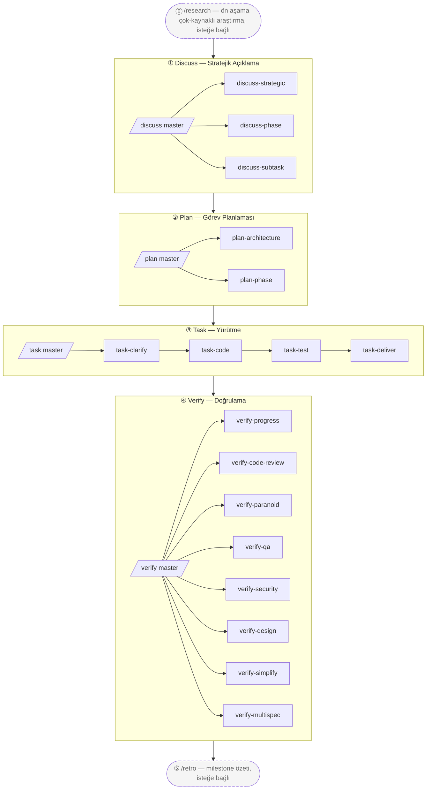

# harnessed

[English](./README.md) | [简体中文](./README-cn.md) | [繁體中文](./README-tw.md) | [日本語](./README-ja.md) | [한국어](./README-ko.md) | [Português (Brasil)](./README-pt-BR.md) | **Türkçe** | [Русский](./README-ru.md) | [Tiếng Việt](./README-vi.md) | [ไทย](./README-th.md)

> AI coding harness paket yöneticisi + Composition Orchestrator
> Üç katmanlı yığın iş birliği metodolojisini (gstack governance + GSD proje yöneticisi + superpowers kıdemli mühendis + karpathy ilkeleri + mattpocock hamleleri) çalıştırılabilir bir motora dönüştürüp makine düzeyinde uygular

[](https://npmjs.com/package/harnessed)
[](./LICENSE)
[](https://github.com/sponsors/easyinplay)

> Harness Inc. ile herhangi bir bağlantısı, onayı veya sponsorluğu yoktur (bkz. [NOTICE](./NOTICE))

---

## ✨ TL;DR

**Claude Code üzerinde Harness Mühendisliği için en iyi uygulama Orchestration'ı** — açık kaynak Claude Code ekosisteminin en iyi bileşenlerini bir araya getirir; görüşlü Composition Skills aracılığıyla bunları birleşik bir Workflow'a dokur. Upstream kodu vendor etmez; Manifest'ler kurulum/kontrol adımlarını tanımlar, Composition Skills ise çok-upstream iş birliğini orkestrale eder.

---

> Bekle — harnessed gerçekten superpowers / gstack / GSD gibi dev upstream'lerle boy ölçüşebilir mi?
> Elbette — biz **devlerin omuzları üzerinde duruyoruz**. Newton'ın dediği gibi, daha uzağı görürsün. 🧐
> ... *(fısıldıyor)* Yakından bakınca, o omuzda tüneyen papağana daha çok benziyoruz aslında.
> Eh — papağanlar taklit eder; biz **orkestrale ederiz**. 🦜

---

## 🎯 Temel Farklılaştırıcılar

- **Üç katmanlı yığın makine düzeyinde uygulanır** — `gstack governance` + `GSD proje yöneticisi` + `superpowers kıdemli mühendis` + `karpathy 4 ilkesi` + `mattpocock 23 hamlesi`, 5 sütun %100 kapsama ile
- **Upstream'lerin vendor edilmemesi** — Manifest'ler kurulum/kontrolü tanımlar; upstream yükseltildiğinde kullanıcılar en son sürümü almak için yalnızca yeniden kurulum yapar
- **Composition Skill** — dahili Workflow Skills, şef sopası gibi birden fazla upstream'i uyum içinde orkestrale eder. **1 süper-ana `/auto` + 4 aşama-ana + 18 alt-workflow + 2 bağımsız = 25 namespace katmanlı Workflow**, tam 4-aşama makine uygulaması (`/auto` aşamalar arası tek atışta / `/discuss /plan /task /verify` tek aşama / 18 adet üç katmanlı yığın alt-workflow / `/research /retro` 2 bağımsız)
- **L0 Discipline Substrate** — global çapraz-aşama davranış temeli (karpathy ilkeleri + çıktı stili + dil + operasyonel + öncelik + protokoller), evrensel olarak uygulanır
- **Paket yöneticisi zihniyeti** — bağımlılık grafiği otomatik çözümlenir, `doctor` sağlık kontrolü, tek seferlik tam kurulum
- **Birleşik giriş noktası** — kullanıcılar her upstream'in terminolojisini öğrenmek zorunda kalmadan `/discuss /plan /task /verify` ana slash komutlarını kullanır; alt komutlar tek bir aşamayı açıkça çağırır (örn. `/discuss-strategic` yalnızca stratejik katman açıklamasını çalıştırır)

---

## 📦 Hızlı Kurulum

```bash
npm install -g harnessed && harnessed setup
```

> Windows PowerShell 5.x `&&` zincirlemesini desteklemez — `;` kullanın ya da iki satıra bölün (`npm install -g harnessed; harnessed setup`). bash / zsh / PowerShell 7+ / cmd.exe normal çalışır.

**Kaldırmak için:**
```bash
harnessed uninstall    # harnessed'ın kendi dosyalarını kaldırır (upstream bileşenler ETKİLENMEZ)
```

> `harnessed uninstall` komutları, workflow skill'leri, settings ortam değişkenlerini ve durum dizinini temizler. Upstream bileşenler (npm paketleri, MCP sunucuları, CC eklentileri, git-klonlanmış depolar, npx skill'leri) olduğu gibi kalır. Tek bir upstream'i kaldırmak için `harnessed uninstall <name>` komutunu çalıştırın. Önizleme için `--dry-run` ekleyin.

🤖 **Veya bir yapay zekaya kurdurun** — bu cümleyi Claude Code'a (ya da herhangi bir yapay zeka asistanına) yapıştırın:

> Install harnessed for me following the guide at `https://github.com/easyinplay/harnessed/blob/main/INSTALL-WITH-AI.md`

Yapay zeka dokümanı otomatik olarak çeker ve kurulumu gerçekleştirir; işletim sistemi / izinler / PATH / corepack uç durumlarını sizin yerinize halleder — büyük metin parçaları kopyalamanıza gerek yoktur.

> [!TIP]
> 🚀 **Çok sevilen Agent Teams ve Subagent özellikleri harnessed'da göreve göre otomatik etkinleştirilir!**
> `CLAUDE_CODE_EXPERIMENTAL_AGENT_TEAMS`'i elle yapılandırmanıza gerek yok — `harnessed setup` bunu `~/.claude/settings.json`'a otomatik olarak yazar. Pattern A tam-yığın üçlü / Pattern C 4-uzman ve diğer çok-ajan Workflow'ları kutudan çıktığı gibi çalışır.

---

## 🚀 Hızlı Başlangıç — 3 Seçenek

Artan kullanıcı müdahalesi sırasıyla:

### 🎯 Otomatik Mod (Yeni başlayanlar / fazla düşünmek istemeyenler için önerilir)

```
/auto "gereksinim X"

# Büyük gereksinimler için aşamaları açıkça belirtebilirsiniz (genellikle gerekmez — yapay zeka
# otomatik değerlendirir ve yönlendirir; büyük gereksinim olduğuna inanıyorsanız zorla kullanın):
/auto "gereksinim X" --staged
```

> Fazla düşünmek istemiyorsanız ya da yeni başlıyorsanız — her şeyi harnessed'a bırakın. Durmaksızın tam 6 aşama çalışır (araştırma koşullu → discuss → plan → task → verify → retro zorunlu). Yapay zeka tek atışta gereksinim karmaşıklığını değerlendirir, büyük gereksinimler için `--staged` moduna geçmeyi önerir (her aşama sonrası inceleme için durur); başlamadan önce "Gereksinimi açıkça anlıyor musunuz?" sorusunu sorar — hayır → `/research` çok-kaynaklı araştırmayı otomatik çalıştırır; zorunlu `/retro` özetiyle biter. Hata durumunda hızlı kesilir, `harnessed resume` ile devam edilir.

### 📂 Aşama Modu (İleri kullanıcılar / ara sonuçları incelemek isteyenler için önerilir)

```
/discuss "gereksinim X"          # Stratejik + Phase + Subtask 3 katmanlı açıklama
/plan "gereksinim X"             # Mimari (koşullu) + plan kalıcılaştırma
/task "alt görev-1"              # 4 alt-workflow seri (clarify → code → test → deliver)
/verify "phase-1"                # 7 alt-workflow koşullu doğrulama
```

> Hangi aşamadan başlayacağınıza karar vermek / ara çıktıları incelemek istiyorsanız — 4 ana bağımsız olarak çağrılabilir ve her ana, dahili olarak o aşamanın tüm alt-workflow'larını otomatik olarak dağıtır.

### 🔬 Cerrahi Mod (Uzman modu / ne istediğinizi biliyorsunuz)

```
/discuss-phase "..."        # Yalnızca Phase katmanı açıklamasını çalıştır
/plan-architecture "..."    # Yalnızca mimari incelemeyi çalıştır
/verify-paranoid "..."      # Yalnızca Paranoid Staff Engineer incelemesini çalıştır
# ... diğer 18 alt-workflow'dan birini seçin
```

> "Ben uzmanum, kendim karar veririm" — ana orchestrator'ı atlayıp doğrudan bir alt-workflow'u çağırın. Tam olarak hangi alt-workflow'a ihtiyaç duyduğunu bilen ileri kullanıcılar için ya da tek adımın yeniden kullanımı için uygundur.

---

## 📐 4-Aşama Akış Diyagramı



> Kesik çizgili kutular = isteğe bağlı bağımsız araçlar (`/research` stratejik öncesi araştırma / `/retro` milestone sonrası özet); düz kutular = ana 4-aşama cadence.

### 25-Workflow Genel Bakış Tablosu

| Slash komutu | Aşama | Tür | Yetenek / Upstream | Kısa açıklama |
|-----------|-------|------|----------------------|-------|
| `/auto` | Tümü | **Süper-ana** | masterOrchestrator (6 aşama boyunca) | Tek atışta tam 6-aşama çalışma (araştırma koşullu → discuss → plan → task → verify → retro zorunlu); yapay zeka tek atışta karmaşıklık değerlendirmesi + anlama kontrolü + zorunlu retro; `--staged` isteğe bağlı aşama kapısı |
| `/discuss` | ① Discuss | Ana | masterOrchestrator | 3 alt-workflow paralel kapı-değerlendirmesi (chain-isolation kuralı) |
| `/discuss-strategic` | ① Discuss | Alt | gstack `/office-hours` + `/plan-ceo-review` + planning-with-files | Stratejik katman — yeni özellikler / yeni milestone'lar / ürün yönü için zorunlu governance (findings.md kalıcılaştırılır) |
| `/discuss-phase` | ① Discuss | Alt | GSD `/gsd-discuss-phase` + planning-with-files | Phase katmanı — ≥2 açık karar / gri alan açıklaması (findings.md + knowledge.md kalıcılaştırılır) |
| `/discuss-subtask` | ① Discuss | Alt | superpowers brainstorming + `/grill-with-docs` | Subtask katmanı — ≥2 yaklaşım / temel algoritma / API contract (geçici kısa tartışma, kalıcılaştırılmaz) |
| `/plan` | ② Plan | Ana | masterOrchestrator | 2 alt-workflow seri çağrısı (mimari koşullu → phase her zaman) |
| `/plan-architecture` | ② Plan | Alt | gstack `/plan-eng-review` | Mimari katman — karmaşık mimari için zorunlu governance kapısı |
| `/plan-phase` | ② Plan | Alt | GSD `/gsd-plan-phase` + planning-with-files `/plan` | Plan katmanı — `task_plan.md` + `progress.md` kalıcılaştırır |
| `/task` | ③ Task | Ana | masterOrchestrator | Her alt görev için 4 alt-workflow seri çağrısı (clarify → code → test → deliver) |
| `/task-clarify` | ③ Task | Alt | superpowers brainstorming + `/grill-with-docs` koşullu | Alt görev başlangıç açıklama kapısı |
| `/task-code` | ③ Task | Alt | karpathy 4 ilkesi + `/zoom-out` / `/improve-codebase-architecture` / `/diagnose` koşullu | Alt görev kodlama + çapraz oturum progress.md senkronizasyonu |
| `/task-test` | ③ Task | Alt | superpowers TDD red-green-refactor + `/diagnose` koşullu | Temel mantık için TDD zorunlu (mattpocock `/tdd` takma adı) |
| `/task-deliver` | ③ Task | Alt | `ralph-loop` SDK sarmalayıcı + Agent Teams koşullu | Verbatim `COMPLETE` alınana kadar + R20.10 max_iter fallback |
| `/verify` | ④ Verify | Ana | masterOrchestrator | 7 alt-workflow senaryoya göre koşullu dağıtım |
| `/verify-progress` | ④ Verify | Alt | GSD `/gsd-verify-work` + `/gsd-progress` | Zorunlu seri başlangıç noktası — UAT kabulü + durum senkronizasyonu |
| `/verify-code-review` | ④ Verify | Alt | `code-review` çok-subagent fan-out | Paralel yüksek-güvenilirlik bulguları |
| `/verify-paranoid` | ④ Verify | Alt | gstack `/review` (Paranoid Staff Engineer) | Kritik modül PR öncesi zorunlu |
| `/verify-qa` | ④ Verify | Alt | gstack `/qa` + playwright-cli / `@playwright/test` / webapp-testing | Uçtan uca QA (has_ui_changes koşullu) |
| `/verify-security` | ④ Verify | Alt | gstack `/cso` | OWASP / auth / secrets (has_auth_or_secrets koşullu) |
| `/verify-design` | ④ Verify | Alt | gstack `/design-review` + ui-ux-pro-max + frontend-design | Tasarım sistemi tutarlılığı (has_design_changes koşullu) |
| `/verify-simplify` | ④ Verify | Alt | `code-simplifier` | Son seri sadeleştirme |
| `/verify-multispec` | ④ Verify | Alt | 4-uzman Agent Team Pattern C | Kritik sürüm / büyük refactor PR tırmanması (karşılıklı SendMessage çapraz sorgulama) |
| `/research` | Bağımsız | Bağımsız | Tavily / Exa MCP + ctx7 + GSD `/gsd-discuss-phase` | Çok-kaynaklı araştırma (Aşama ① alternatifi) |
| `/retro` | Bağımsız | Bağımsız | gstack `/retro` + planning-with-files RETROSPECTIVE.md | Proje / milestone kapanış özeti |

> Ana orchestrator, doğru alt-workflow'a otomatik kapı-yönlendirmesi yapar (chain-isolation kuralı — tetiklenmeyen alt-workflow'lar şeffaf biçimde atlandı olarak bildirilir).
> Alt-workflow'ların doğrudan çağrılması da ana orchestrator'ı atlayıp tek bir aşamayı çalıştırır, örn. `/discuss-strategic "yeni özellik X"`.

---

## ⚡ Kullanım Akışı

4-aşama üç katmanlı yığın metodolojisi — 4 ana orchestrator'ı seri olarak kullanmanız önerilir:

```
/discuss  →  /plan  →  /task  →  /verify
   ①         ②        ③         ④
```

| Aşama | Ana | Ana alt-workflow'lar | Upstream iş birliği |
| ---- | ---- | ---- | ---- |
| ① **Discuss** | `/discuss` | strategic / phase / subtask (3 paralel) | gstack `/office-hours` + GSD `/gsd-discuss-phase` + superpowers brainstorming |
| ② **Plan** | `/plan` | architecture (koşullu) → phase | gstack `/plan-eng-review` + GSD `/gsd-plan-phase` + planning-with-files |
| ③ **Task** | `/task` | clarify → code → test → deliver (her alt görev için 4 seri) | karpathy ilkeleri + mattpocock hamleleri + superpowers TDD + `ralph-loop` |
| ④ **Verify** | `/verify` | progress → 5 paralel koşullu → simplify (+ multispec kritik) | GSD `/gsd-verify-work` + code-review + gstack `/review` / `/qa` / `/cso` / `/design-review` + code-simplifier |

Pratik örnek:

```bash
# 1. Workflow upstream'lerini kurun (tek satır gstack + GSD + superpowers + planning-with-files'ı kurar)
harnessed setup

# 2. Claude Code içinde 4-aşama cadence'ı çalıştırın
/discuss "yeni özellik X"          # Stratejik + Phase + Subtask 3 katmanlı açıklama
/plan "yeni özellik X"             # Mimari (koşullu) + plan (görev grafiği kalıcılaştırılır)
/task "alt görev-1: API contract"  # Her alt görev için 4 seri alt-workflow
/verify "phase-1"                  # 7 koşullu alt-workflow

# 3. Kesintiden sonra devam edin (herhangi bir zamanda)
harnessed resume
```

> Ayrıca ana orchestrator'ı atlayıp yalnızca bir katmanı çalıştırmak için alt-workflow'ları doğrudan çağırabilirsiniz; örn. `/verify-paranoid` yalnızca Paranoid Staff Engineer incelemesini çalıştırır.

📊 Ayrıntılı mermaid + tam aşama açıklamaları: [docs/WORKFLOW.md](./docs/WORKFLOW.md)

---

## 🗂️ Mimari (4-aşama namespace katmanlı)

### 1. Dizin Yapısı

```
harnessed/
├── manifests/                  # L1: upstream tanımlama katmanı (vendor edilmez)
├── workflows/                  # L6: composition skills (4-aşama şef sopası)
│   ├── discuss/                # Aşama ① 3 katman (strategic + phase + subtask)
│   │   ├── auto/               # /discuss master kapı-yönlendirmesi
│   │   ├── strategic/          # /discuss-strategic (gstack /office-hours + /plan-ceo-review)
│   │   ├── phase/              # /discuss-phase (GSD /gsd-discuss-phase)
│   │   └── subtask/            # /discuss-subtask (superpowers brainstorming)
│   ├── plan/                   # Aşama ② (mimari + phase görev grafiği)
│   ├── task/                   # Aşama ③ (clarify + code + test + deliver)
│   ├── verify/                 # Aşama ④ (progress + code-review + paranoid + qa + cso + design + simplify + multispec)
│   ├── research/               # bağımsız Aşama ① alternatifi
│   ├── retro/                  # bağımsız ④ sonrası milestone kapanışı
│   ├── capabilities.yaml       # L5a: ~70 giriş, 7 kategori SoT
│   ├── defaults.yaml           # workflow phase başına ralph_max_iterations
│   ├── judgments/              # L5a: üç katmanlı yığın kriterleri + paralellik + tdd + fallback + rules-routing
│   │   ├── strategic-gate.yaml
│   │   ├── phase-gate.yaml
│   │   ├── subtask-gate.yaml
│   │   ├── parallelism-gate.yaml         # L5b yürütme mekanizması yönlendirmesi
│   │   ├── tdd-gate.yaml
│   │   ├── fallback.yaml                 # 3 kural: skip_with_transparency + override + chain_isolation
│   │   ├── web-design-routing.yaml       # UI tasarım araç yönlendirmesi
│   │   ├── web-testing-routing.yaml      # E2E / tarayıcı test araç yönlendirmesi
│   │   ├── web-search-routing.yaml       # Web arama / belge çekme yönlendirmesi
│   │   └── stage-routing.yaml            # master orchestrator alt-aşama yönlendirmesi
│   └── disciplines/            # L0: global çapraz-aşama davranış temeli
│       ├── karpathy.yaml       # 4 ilke + ≤200L
│       ├── output-style.yaml   # BLUF + no-emoji + no-em-dash
│       ├── language.yaml       # zh-Hans varsayılan + İngilizce koruma
│       ├── operational.yaml    # biome preempt + A7 + commit güvenliği
│       ├── priority.yaml       # skill çatışma tahkimi
│       └── protocols.yaml      # cc-handoff tasarım belgesi öz-içerikli
├── routing/                    # L4: yönlendirme motoru SSOT (decision_rules.yaml)
├── schemas/                    # L3: JSON Schema (IDE / CI tarafından kullanılır)
├── src/                        # L4: TS motoru (workflow + routing + cli + installer'lar + checkpoint + audit + state)
├── tests/                      # vitest unit + integration + dogfood (R8.1 dogfood-first)
├── scripts/                    # CI kapısı (check-workflow-schema, transparency-verdict, state-archive)
├── .planning/                  # proje belleği (STATE + ROADMAP + REQUIREMENTS + phase başına + milestone'lar)
└── docs/adr/                   # mimari karar kayıtları
```

### 2. Mantıksal Katmanlama (8 katman)

```
┌────────────────────────────────────────────────────────────┐
│ L7 Kullanıcıya yönelik slash komutu + harnessed CLI          │
│   /discuss /plan /task /verify (master) + 18 alt + /research /retro + /auto süper-master
│   + doğrudan gstack çağrısı (30+ isteğe bağlı): /office-hours /review /qa /...
├────────────────────────────────────────────────────────────┤
│ L6 Workflow orkestrasyonu (workflows/<aşama>/<alt>/)         │
├────────────────────────────────────────────────────────────┤
│ L5b Yürütme Mekanizması (ortogonal): subagent / Agent Teams  │
│   / ana oturum + ralph-loop sarmalayıcı                     │
│   parallelism-gate.yaml: varsayılan subagent → 5 tetikleyici ile tırmanma │
│   Pattern A tam-yığın üçlü / B karşıt hipotezler / C çok-boyutlu inceleme │
├────────────────────────────────────────────────────────────┤
│ L5a Yetenek + Yargılama + Varsayılanlar SoT                  │
│   capabilities.yaml (7 kategori) + judgments/ (10 dosya) +  │
│   defaults.yaml                                              │
├────────────────────────────────────────────────────────────┤
│ L4  Çalışma zamanı motoru (workflow / routing / handler'lar) │
├────────────────────────────────────────────────────────────┤
│ L3  TypeBox şeması + CI kapısı                               │
├────────────────────────────────────────────────────────────┤
│ L2  Installer + Manifest motoru                              │
├────────────────────────────────────────────────────────────┤
│ L1  Upstream bileşenler (vendor EDİLMEZ)                     │
├────────────────────────────────────────────────────────────┤
│ L0  Discipline Substrate (global olarak uygulanır)           │
│   karpathy ilkeleri + output-style + dil + operasyonel +    │
│   öncelik + protokoller (L1-L7'ye evrensel olarak uygulanır)│
└────────────────────────────────────────────────────────────┘
```

### 3. Çapraz-Kesim Yetenekleri (capabilities.yaml — 7 kategori, ~83 giriş)

```
behavioral (6):       karpathy-guidelines + output-style + language + operational + priority + protocols
tool-slash-cmd (~60): gstack 30+ isteğe bağlı + gsd 10+ + mattpocock 12 yüksek-frekanslı + vb.
tool-mcp (3):         chrome-devtools-mcp / tavily-mcp / exa-mcp
tool-cli (2):         ctx7 / gws
tool-plugin (2):      planning-with-files / @playwright/test
tool-bundled (3):     ralph-loop / webapp-testing / playwright-cli
agent-platform (3):   agent-teams-create / send-message / shutdown
```

### 4. Veri Akışı Örneği (kullanıcı `/discuss "yeni özellik X"` çağırır)

```
[L7] Kullanıcı /discuss "yeni özellik X" çağırır
  ↓
[L6] workflows/discuss/auto/workflow.yaml master orchestrator
  ↓
[L5a] judgments.strategic-gate.fires + phase-gate.fires + subtask-gate.fires (3 yönlü paralel değerlendirme)
  ↓
[L4] judgmentResolver.ts (4 seviyeli ref bölümü) + exprBuilder.ts (expr-eval değerlendirme)
  ↓
[L0] discipline.priority-hierarchy araç çatışmalarını tahkim eder / output-style çıktıyı biçimlendirir
  ↓
[fires=true alt] → alt-workflow çağrısı (/discuss-strategic / /discuss-phase / /discuss-subtask)
  ↓ her alt için:
      ├─ behavioral_layer: karpathy-guidelines (her zaman açık)
      ├─ tools_available: planning-with-files / ctx7 / mattpocock koşula bağlı
      ├─ parallelism: judgments.parallelism-gate.<yol>.fires (L5b mekanizması)
      └─ phase çağrıları yetenek şablonu interpolasyonu ile yürütülür
  ↓
[fallback.yaml chain-isolation] 3 katman bağımsız değerlendirilir, seri bağımlı değil
[Şeffaflık bildirimi atlandı] tetiklenmeyen alt'lar → "⚠️ Skipped <alt> because <neden>"
  ↓
planning-with-files /plan (çapraz-kesim araç) → artifact'ları .planning/<phase-id>/'a yazar
  ↓
[L4] state.ts writeCurrentWorkflow (proper-lockfile) + audit.append (12-alan JSONL)
```

### 5. Karar Yönlendirme Matrisi (kural tabanlı, judgments + capabilities içinde kodlanmış)

| Senaryo | Varsayılan → Tırmanma |
|------|---------------------|
| Paralellik mekanizması | subagent → Agent Teams Pattern A/B/C (5 tetikleyici) |
| UI tasarımı birincil plan | ui-ux-pro-max → frontend-design (kullanıcı açıkça stil isterse) |
| E2E tarayıcı keşfi | playwright-cli (tek satır Bash, token-verimli) |
| E2E commit edilebilir TS | @playwright/test varsayılan |
| E2E Python backend bağlantısı | webapp-testing |
| Performans / a11y / bellek tanılaması | chrome-devtools-mcp |
| Web arama (anahtar kelime) | Tavily MCP varsayılan |
| Web arama (tanımlayıcı / akademik) | Exa MCP |
| Kütüphane API belgeleri | ctx7 CLI |
| GitHub URL | gh CLI |
| Tek URL çekme | WebFetch dahili |
| Gmail / Drive / Calendar | gws CLI |
| Mimari inceleme (karmaşık) | gstack /plan-eng-review |
| TDD zorunlu (temel algoritma) | superpowers TDD VEYA mattpocock /tdd |
| Kritik modül PR | gstack /review |
| Büyük refactor PR çok-boyutlu inceleme | 4-uzman Agent Team Pattern C |
| Çapraz oturum hand-off | discipline.protocols öz-içerikli tasarım belgesi |
| `/auto` büyük gereksinimler için karmaşıklık | yapay zeka tek atışta değerlendirme → `--staged` otomatik öneri (n iptal manuel `/discuss` önerir) |
| `/auto` gereksinim anlayışı | başlamadan önce sor → n otomatik `/research` çok-kaynaklı araştırma ekler |

---

## 🛠️ Operasyonel Komutlar

> Bunlar harnessed'ın kendi bakım komutlarıdır (kurulum / sağlık kontrolü / yedek-geri alma / durum kurtarma vb.). Günlük özellik geliştirme için yukarıdaki slash komutlarını kullanın — bunlara genellikle ihtiyaç duymazsınız.

**v4.0 — orkestrasyon beyni.** Slash command'lar açıklama (clarification) işlemini Claude Code ana session'ında çalıştırır (böylece sorular size ulaşır), ardından CC-native subagent'lar spawn eder (Agent Teams + açıklama round-trip'lerini etkinleştirir). harnessed gate değerlendirmesi (`harnessed gates`) ve spawn'a hazır prompt'lar (`harnessed prompt`) sağlar; spawn işlemini ana session yapar. `harnessed run` CI/headless kullanımı için korunur.

### CLI Komutları

| Komut | Açıklama |
| ---- | ---- |
| `harnessed setup` | Tek seferlik kurulum; workflow skills'i `~/.claude/skills/`'e + MCP'yi `~/.claude.json`'a kurar |
| `harnessed gates <master>` | Bir master stage için hangi sub-workflow'ların tetiklendiğini değerlendirir (JSON: fire/skip/parallelism). Slash command'lar tarafından native spawn'ları orkestre etmek için kullanılır. |
| `harnessed prompt <sub>` | Bir sub-workflow için spawn'a hazır bir prompt (role + checklist + disciplines + completion/clarification protokolleri) üretir. |
| `harnessed checkpoint <action> <sub>` | Bir sub-workflow'un start/complete/fail durumunu `~/.claude/harnessed/checkpoints/`'e kaydeder. |
| `harnessed run <name>` | Bir workflow'u in-process SDK spawn ile çalıştırır (CI/headless modu). Slash command'lar bunun yerine CC-native spawn kullanır. |
| `harnessed resume` | Oturum kesintisinden sonra en son checkpoint'ten devam eder |
| `harnessed status` | Mevcut phase + kilit sahibi |
| `harnessed doctor` | 8 kontrollü sağlık denetimi (Node / MCP / jq / Win bash / routing / token bütçesi vb.) |
| `harnessed install <isim>` | Upstream manifest'i kurar |
| `harnessed uninstall [isim]` | Birleşik kaldırma — isim yok: harnessed'ın kendi dosyalarını kaldırır (upstream'ler korunur); isimle: tek bir upstream'i kaldırır |
| `harnessed backup` | Anlık görüntü yedek yönetimi |
| `harnessed rollback <zaman_damgası>` | Tek satır geri alma (EOL koruma + sha1 doğrulama) |
| `harnessed gc` | Süresi dolmuş yedekleri temizler |
| `harnessed audit-log` | Yönlendirme şeffaflık günlüğü sorgusu (`--filter` jq ifadesini destekler) |

### Bayraklar

> Tüm komutlar varsayılan olarak **uygular (anlık yazma)** — bayrak gerekmez. İleri kullanıcılar önizleme için `--dry-run` ekleyebilir.

| Bayrak | Açıklama |
| ---- | ---- |
| `--dry-run` | Diske yazmadan önizle (ileri kullanıcı isteğe bağlı) |
| `--non-interactive` | CI / betiklenmiş senaryolar |
| `--system` | L4 global kuruluma izin ver (aksi takdirde L1 npx geçici olarak düşürülür) |
| `--full-diff` | 200 satırın üzerinde katlanan farkları genişlet |
| `--no-color` | Rengi zorla kapat (TTY'de bile) |
| `--task <text>` | `run` alt komutu — görev açıklaması (workflow `gateContext.task` olarak iletilir) |
| `--task-stdin` | `run` alt komutu — görev açıklamasını stdin'den EOF'a kadar oku (tırnak/$/` shell escape'inden kaçınır) |


---

## ❓ SSS

<details>
<summary><b>S1. harnessed kurduktan sonra superpowers / gstack / GSD upstream'lerini de ayrıca kurmam gerekiyor mu?</b></summary>

<br>

Evet, ancak **kullanıcı deneyimi = tek komut**:

```bash
harnessed setup  # gstack + GSD + superpowers + planning-with-files'ı otomatik kurar; 25 workflow skill ~/.claude/skills/'e iner + Agent Teams ortam değişkeni ~/.claude.json'a otomatik yazılır
```

`brew install <formula>`'nın tam bağımlılık kümesini çektiğini düşünün — her bağımlılık için ayrı ayrı `brew install` yapmanıza gerek yoktur.

</details>

<details>
<summary><b>S2. Neden superpowers / gstack'i harnessed repo'suna vendor etmiyorsunuz?</b></summary>

<br>

4 neden:

1. **Farklılaşma felsefesi** — harnessed, "hepsi bir arada kendi yapımı" kampına karşı konumlandırılmış "assembly-ist paket yöneticisi"dir. Vendor etmek = kaldıraç noktasını kaybetmek → bir plugin paketi daha olmak
2. **Lisans + atıf kabusu** — aktif olarak geliştirilen 4-5 upstream'i vendor etmek = karmaşık bir lisans yaması
3. **Upstream yükseltmeleri yön tersine çevirir** — mevcut manifest tanımı, upstream yükseltildiğinde kullanıcıların yeniden kurarak en son sürümü almasını sağlar; vendor etmek manuel kod senkronizasyonunu zorlar ve sürekli geride kalır
4. **Tek kişi riski** — 4-5 vendor edilmiş upstream'i senkronize tutan tek bir geliştirici = hızlanmış tükenmişlik

</details>

<details>
<summary><b>S3. gstack / GSD / superpowers hepsi plan/discuss araçları gibi görünüyor — örtüşmüyor mu?</b></summary>

<br>

**Hayır**. Bunlar üç katmanlı yığının farklı aşamalarıdır:

| Aşama | Upstream | Sorumluluk |
| ---- | ---- | ---- |
| Governance | gstack | Çok-rol karar kapıları (CEO / EM / Designer / Paranoid Engineer) |
| Brainstorming | superpowers | Subtask tasarım açıklaması, alternatif karşılaştırması |
| Orchestration | GSD | Üst düzey phase görev grafiği + bağımlılık analizi |
| Kalıcılaştırma | planning-with-files | `task_plan.md` / `progress.md` / `findings.md` kalıcılaştırır |

`/discuss /plan /task /verify` — 4 ana, 4 aşamayı birbirine bağlar; her ana dahili olarak kendi alt-workflow'una devreder. Her aşama farklı bir şey yapar ve bir sonrakini besler. **Birleştirme yok**.

</details>

<details>
<summary><b>S4. Workflow aşamaları otomatik mi çalışır yoksa kullanıcıyı bekler mi?</b></summary>

<br>

`workflows/<isim>/SKILL.md` frontmatter'ındaki `pause` alanına bağlıdır:

- `pause: human_review` → kullanıcı onayını bekleyerek bloklar (governance kapısı / son kilit, örn. `/discuss-strategic` gstack `/office-hours` + `/plan-architecture` `/plan-eng-review` kilit kapısı)
- `pause` yok → bir sonraki aşamaya otomatik zincirler

Her aşama çıktısı `.harnessed/checkpoints/`'a yazılır; oturum kesintisinden sonra `harnessed resume` en son checkpoint'ten devam eder.

</details>

<details>
<summary><b>S5. harnessed'ın kendisi bir CC Plugin mi?</b></summary>

<br>

Karma bir yapı:

- `npx harnessed@latest setup` **Node.js CLI**'yi çalıştırır (`bin/harnessed`)
- Kurulum, **workflow skills'i** (markdown) `~/.claude/skills/`'e yükler; Claude Code çalışma zamanı tarafından yüklenir
- `/discuss` / `/plan` / `/task` / `/verify` vb. yetenek yürütmesini tetikleyen CC içindeki slash komutlarıdır
- CLI ve CC skills, `.harnessed/checkpoints/` durum dizinini paylaşır

</details>

---


## Lisans

[Apache-2.0](./LICENSE) — bkz. [NOTICE](./NOTICE) (Harness Inc. ticari marka feragatnamesi dahil)

Geliştirmeyi destekleyin: [](https://github.com/sponsors/easyinplay)
