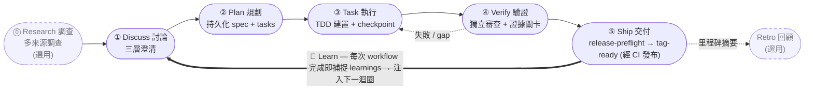
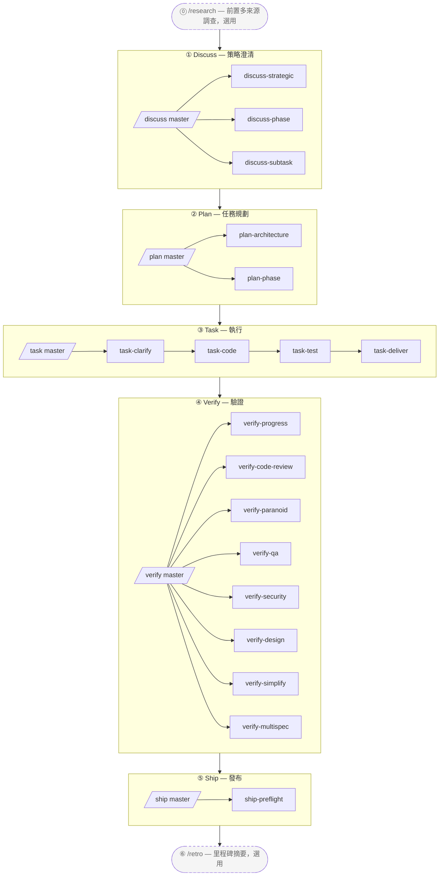

# harnessed

[English](./README.md) | [简体中文](./README-cn.md) | **繁體中文** | [日本語](./README-ja.md) | [한국어](./README-ko.md) | [Português (Brasil)](./README-pt-BR.md) | [Türkçe](./README-tr.md) | [Русский](./README-ru.md) | [Tiếng Việt](./README-vi.md) | [ไทย](./README-th.md)

> **Note (best-effort translation):** This translation is generated/best-effort and may lag behind the English [README.md](./README.md). For the latest and authoritative content, refer to the English version.

> **將原始的 Claude Code 變成一支紀律嚴明的資深工程團隊。** 一次安裝，就把治理 (governance)、規劃 (planning)、TDD、審查 (review) 織進一條 Discuss→Ship 工作流 —— 進度與證據落在磁碟上，而非消散在對話裡。

> _AI coding harness 套件管理器 + composition orchestrator_ —— 將三層架構協作方法論 (gstack 治理 + GSD 專案管理 + superpowers 資深工程師 + karpathy 原則 + mattpocock 招式) 作為可運行的 engine 機器化執行

[](https://npmjs.com/package/harnessed)
[](./LICENSE)
[](https://github.com/sponsors/easyinplay)

> 本專案與 Harness Inc. 無關聯、未獲其背書或贊助（詳見 [NOTICE](./NOTICE)）

---

## ✨ TL;DR

**運作方式**：harnessed **裝配** 市面上最優秀的開源 Claude Code agent（gstack、GSD、superpowers、planning-with-files），再透過帶有主見的 composition skill 將其 **編排** 成一條工作流。它 **不** vendor 上游程式碼 —— manifest 描述 install/check，composition skill 則指揮多上游的協作（所以上游升級只是一次 re-install，永遠不需要手動 sync code）。

### 🔁 運轉迴圈 (operating loop)

> **Discuss → Plan → Build → Verify → Ship**，由一個 **Learn** 迴圈閉合 —— 跨三層架構機器化執行（gstack 治理 · GSD 編排 · superpowers TDD · checkpoint 證據）。原始 agent 工作會漂移；harnessed 將它變成一條 source-of-truth 路徑，進度與證據落盤留存，而非活在對話裡。**學習是自動的**：每條完成的 workflow 都會把它的 failure/loop/reject 訊號附加進 `.planning/LEARNINGS.md`，並注入下一輪迴圈 —— 這是 always-on 的，**不** 取決於選用的 Retro。Retro (`/retro`) 是獨立、選用的里程碑摘要。



---

## 🧱 什麼是三層架構？

harnessed 的三層架構方案是軟體工程上既有的 **BDD → SDD → TDD** 巢狀的實作：三個巢狀的回饋迴圈，各回答一個不同的問題。**三層就是這三個迴圈**（穩定的理論）；harnessed 將開源生態 **組合 (compose)** 進每個迴圈 —— 而這些元件 **彼此重疊**，這正是 composition orchestrator 要去仲裁的地方。

| 層 | 迴圈 | 它回答的問題 | 組合自（彼此重疊） |
|---|---|---|---|
| **① Behavior** | BDD | 做 *什麼* + 怎麼算做完 | gstack `/office-hours` 治理 · GSD discuss · superpowers brainstorming → 驗收標準 |
| **② Spec** | SDD | *如何* 組織結構 | GSD plan-phase → requirements / design / tasks · 契約（Spec Kit / ECC patterns） |
| **③ Implementation** | TDD | 它到底能不能 *跑* | superpowers TDD red-green · subagent 執行 · GSD verify-work · ralph-loop completion |

這些迴圈是 **巢狀的鏡頭，不是階段** —— 經典的 Cucumber BDD-外環 + TDD-內環雙環，在 GenAI 時代再加一道 SDD spec 環擴展成三環。harnessed 將預設的外→內遍歷跑成它的 5-stage cadence，外加 **它今天就已經落地的 back-edge**：Verify 將失敗工作踢回 Task，撞上灰色地帶的 subagent 在繼續前先 round-trip 回澄清，每條 shipped 的迴圈將 learnings 餵回下一輪 Discuss。（更細粒度的結構化 back-edge —— 例如契約矛盾直接路由回 Spec、模糊需求回 Behavior —— 在 roadmap 上，尚未 ship。harnessed 是三環的線性-cadence 實作；完整的 routed graph 是它的演進路徑。）

**元件重疊 —— 這正是重點。** **GSD** 作為編排骨幹貫穿全部三個迴圈，**gstack** 橫跨 Behavior + Review，**superpowers** 橫跨 Behavior（brainstorm）+ Implementation（TDD）。harnessed 將它們接線 —— 並仲裁重疊 —— 進一個 engine。兩條 **橫切紀律 (cross-cutting disciplines)** 貫穿每一層：**karpathy 原則**（*怎麼* 寫程式碼 —— simplicity-first、surgical diff）+ **mattpocock 招式**（按需的戰術工具，如 `/diagnose`、`/zoom-out`）。

對應到上面的 runtime 迴圈：**Discuss = Behavior (BDD) · Plan = Spec (SDD) · Build = Implementation (TDD)**，然後 **Verify + Ship** 以證據關卡閉合。

---

> 等等 — harnessed 真的能和 superpowers / gstack / GSD 這些上游巨頭分庭抗禮嗎？
> 當然 — 我們**站在巨人的肩膀上**。牛頓說：站得高，看得遠。🧐
> ... *（悄悄話）* 但仔細一看，比較像是趴在那肩膀上的鸚鵡。
> 呃 — 鸚鵡只是學舌；我們是在**編排**。🦜

---

## 🎯 關鍵差異化

- **三層架構機器化執行** —— 即 **BDD→SDD→TDD 巢狀三環**（[那是什麼？](#-什麼是三層架構)），組合自 `gstack` + `GSD` + `superpowers`（彼此重疊，GSD 作骨幹），並以 `karpathy 4 原則` + `mattpocock 23 招式` 作為橫切紀律
- **不 vendor 上游** —— manifest 描述 install/check；上游升級時，使用者只需 re-install 即可取得最新版本
- **Composition Skill** —— 自製 workflow skill 作為指揮棒，協調多個上游協同演奏。**1 個超級主控 `/auto` + 5 個階段主控 + 19 個 sub-workflow + 2 個獨立工具 = 27 個命名空間分層 workflow**，完整 5-stage 機器化執行（`/auto` 跨階段一鍵完成 / `/discuss /plan /task /verify /ship` 單一階段 / 19 個三層架構 sub / `/research /retro` 2 個獨立工具）
- **L0 Discipline Substrate** —— 全域跨階段行為基準（karpathy 原則 + output-style + language + operational + priority + protocols），普遍套用
- **套件管理思維** —— 安裝相依圖自動解析、doctor 健康檢查、install-base 一鍵完整安裝
- **統一進入點** —— 使用者只需面對 `/discuss /plan /task /verify /ship` 主指令，無需學習各上游的術語；子指令可明確呼叫單一階段（例如 `/discuss-strategic` 只執行策略層澄清）
- **Forward continuation（前向接續）** —— `harnessed next` / `harnessed advance` 帶你跨越 task 與 phase：一個完成時，下一個 **從 `.planning/` 磁碟狀態派生**（一個 phase 完成 = 它的 `PLAN` 有了相符的 `SUMMARY`）—— 沒有佇列要維護，所以中途新增的 phase 會被自動拾取，resume 時從磁碟重新派生。每一輪的 `NEXT-UNIT` breadcrumb 指向下一步該做什麼

---

## 🆚 harnessed vs 原生 Claude Code / Codex

原生 agent 給你原語 (primitive)；harnessed 將它們接線成方法論。原生那一格說某個原語「存在」的地方，你仍要每個專案自己去設計、接線、維護它 —— harnessed 將它預先組合好、由 engine 驅動地交付。

| 維度 | 原生 Claude Code | 原生 Codex | harnessed |
|---|---|---|---|
| **工作流 / 方法論** | 只有原語 —— 每次自己設計流程 | 原語更少 —— 每條 prompt 即興發揮 | 編碼化的 **Discuss→Ship** 5-stage 三層架構 engine —— BDD + SDD + TDD 迴圈 + 2 橫切（Review + Ship） |
| **指令注入** | `CLAUDE.md` + skill + hook 存在，但靜態、得手工接線 | 只有 `AGENTS.md` —— 無 skill/hook | 每輪 breadcrumb hook + task-scoped 路由 + 每輪注入 learnings |
| **狀態 / 進度** | 對話 context —— `/clear` / compaction 即遺失 | 對話 context —— 無持久化層 | 落盤 `.planning/` + `current-workflow.json` ledger + checkpoint 證據 |
| **跨 session 回復** | 手工重新解釋 context | 手工重新解釋 context | `harnessed status --recover`：you-are-here + 下一步 |
| **驗證 /「完成」** | agent 自報「完成」 | agent 自報「完成」 | 獨立審查 subagent + **fail-CLOSED 證據 guard**（缺產物 = 沒完成） |
| **Subagent 編排** | 有 subagent + Agent Teams，但得手工編排 | 無 subagent/team 原語 | `gates → prompt → spawn → checkpoint`；Agent Teams 依任務自動啟用 |
| **學習迴圈** | 無 | 無 | `LEARNINGS.md` 自動捕捉 + 注入下一輪 |
| **平台覆蓋** | 僅 Claude Code | 僅 Codex | **Cross-harness** —— Claude Code 主力，Codex 經 platform 層 |

> 原生 agent 在零設定、零開銷的瑣碎一次性改動上取勝。一旦工作跨越多步驟、多 session 或多 subagent —— 即興漂移與迷失在對話裡的狀態開始讓你付出代價 —— harnessed 就開始掙回它的價值。

---

## 📦 快速安裝

```bash
npm install -g harnessed && harnessed setup
```

> Windows PowerShell 5.x 不支援 `&&` 串連 —— 請改用 `;` 或分兩行執行（`npm install -g harnessed; harnessed setup`）。bash / zsh / PowerShell 7+ / cmd.exe 皆可正常使用。

🤖 **或者讓 AI 幫你安裝** —— 將這句話貼給 Claude Code（或任何 AI 助理）：

> Install harnessed for me following the guide at `https://github.com/easyinplay/harnessed/blob/main/INSTALL-WITH-AI.md`

AI 會自動抓取文件並執行安裝，處理作業系統 / 權限 / PATH / corepack 等邊緣情況 —— 無需複製大段文字。

> [!TIP]
> 🚀 **備受喜愛的 Agent Teams 與 Subagent 功能在 harnessed 中會根據任務自動啟用！**
> 無需手動設定 `CLAUDE_CODE_EXPERIMENTAL_AGENT_TEAMS` —— `harnessed setup` 會自動將其寫入 `~/.claude/settings.json`。Pattern A 全端三路協同 / Pattern C 四專家審查等多 agent workflow 皆可直接使用。

---

## ⏱️ First 5 Minutes

從零到一條運轉中的 workflow，最短路徑：

```bash
# 1. 安裝（一行）
npm install -g harnessed && harnessed setup
```

```
# 2. 在 Claude Code 內 —— 啟動你的第一條 workflow
/auto "你的第一個需求"               # 新手預設：端到端跑完所有 stage
```

```bash
# 3. 迷路了？不帶參數執行 harnessed —— 它會告訴你身在何處 + 下一步是什麼
harnessed
#   → you-are-here 儀表板（active phase + 每步狀態）+ 一行 NEXT: auto|manual|done
#   不必記 status / next / resume —— 一個指令（comet `/comet` 類比，read-only）
#   加 --json 輸出機器可讀格式
```

```bash
# 4. 中斷後隨時回復
harnessed            # 同一個 you-are-here 視圖
harnessed resume     # 從最近 checkpoint 繼續
```

> 想更精細地控制哪個 stage 何時跑？看下面 3 種模式。

---

## 🚀 快速上手 — 3 種選擇

依使用者介入程度由低至高排列：

### 🎯 Auto Mode（推薦給新手 / 不想費腦筋的人）

```
/auto "需求 X"

# 對於大型需求可明確分階段執行（通常不需要 —— AI 會自動判斷並路由進入；
# 若你認為需求較大，可強制使用）：
/auto "需求 X" --staged
```

> 不想費腦筋，或剛開始上手 —— 讓 harnessed 全權處理。執行完整 6 個階段（research conditional → discuss → plan → task → verify → retro mandatory），中途不停頓。AI 一鍵自動判斷需求複雜度，針對大型需求建議切換至 `--staged` 模式（每個階段後暫停供審查）；開始前提示「你對需求是否有清楚的理解？」—— 若否 → 自動執行 `/research` 多來源調查；以強制執行的 `/retro` 摘要作結。遇到失敗立即中止，可透過 `harnessed resume` 繼續。

### 📂 Stage Mode（推薦給進階使用者 / 想審查中間結果的人）

```
/discuss "需求 X"          # 策略 + Phase + 子任務三層澄清
/plan "需求 X"             # 架構（conditional）+ 計畫持久化
/task "子任務-1"           # 4 個子項串行執行（clarify → code → test → deliver）
/verify "phase-1"          # 7 個子項條件驗證
```

> 想自行決定從哪個階段開始 / 審查中間輸出 —— 5 個主控可獨立呼叫，每個主控內部仍會自動展開該階段的所有子項。

### 🔬 Surgical Mode（專家模式 / 你清楚自己要什麼）

```
/discuss-phase "..."        # 僅執行 Phase 層澄清
/plan-architecture "..."    # 僅執行架構審查
/verify-paranoid "..."      # 僅執行 Paranoid Staff Engineer 審查
# ... 從其他 19 個 sub-workflow 中任選
```

> 「我是專家，我自己決定」—— 跳過主控，直接呼叫 sub-workflow。適合知道自己需要哪個子項的進階使用者，或單步驟的複用場景。

---

## 📐 5-stage 流程圖



> 虛線框 = 選用獨立工具（`/research` 前置策略調查 / `/retro` 里程碑後摘要）；實線框 = 主要 5-stage 流程（Ship 停在 tag-ready；由 `publish.yml` CI 完成真正的 publish）。

### 27 個 Workflow 總覽表

| 指令 | 階段 | 類型 | 能力 / 上游 | 簡介 |
|-----------|-------|------|----------------------|-------|
| `/auto` | 全部 | **超級主控** | masterOrchestrator（跨 6 個階段） | 一鍵完整執行 6 個階段（research conditional → discuss → plan → task → verify → retro mandatory）；AI 一鍵複雜度判斷 + 理解確認 + 強制 retro；`--staged` 選擇性啟用階段關卡 |
| `/discuss` | ① Discuss | 主控 | masterOrchestrator | 3 個子項平行關卡評估（chain-isolation 規則） |
| `/discuss-strategic` | ① Discuss | 子項 | gstack `/office-hours` + `/plan-ceo-review` + planning-with-files | 策略層 —— 新功能 / 新里程碑 / 產品方向的強制治理關卡（findings.md 持久化） |
| `/discuss-phase` | ① Discuss | 子項 | GSD `/gsd-discuss-phase` + planning-with-files | Phase 層 —— ≥2 個待決定事項 / 灰色地帶澄清（findings.md + knowledge.md 持久化） |
| `/discuss-subtask` | ① Discuss | 子項 | superpowers brainstorming + `/grill-with-docs` | 子任務層 —— ≥2 種實作方案 / 核心演算法 / API contract（短暫討論，不持久化） |
| `/plan` | ② Plan | 主控 | masterOrchestrator | 串行呼叫 2 個子項（architecture conditional → phase 永遠執行） |
| `/plan-architecture` | ② Plan | 子項 | gstack `/plan-eng-review` | 架構層 —— 複雜架構的強制治理關卡 |
| `/plan-phase` | ② Plan | 子項 | GSD `/gsd-plan-phase` + planning-with-files `/plan` | 計畫層 —— 持久化 `task_plan.md` + `progress.md` |
| `/task` | ③ Task | 主控 | masterOrchestrator | 每個子任務串行呼叫 4 個子項（clarify → code → test → deliver） |
| `/task-clarify` | ③ Task | 子項 | superpowers brainstorming + `/grill-with-docs` conditional | 子任務啟動澄清關卡 |
| `/task-code` | ③ Task | 子項 | karpathy 4 原則 + `/zoom-out` / `/improve-codebase-architecture` / `/diagnose` conditional | 子任務編碼 + 跨 session 的 progress.md 同步 |
| `/task-test` | ③ Task | 子項 | superpowers TDD red-green-refactor + `/diagnose` conditional | 核心邏輯 TDD 強制執行（別名 mattpocock `/tdd`） |
| `/task-deliver` | ③ Task | 子項 | `ralph-loop` SDK 包裝器 + Agent Teams conditional | 直到逐字輸出 `COMPLETE` + R20.10 max_iter 退路 |
| `/verify` | ④ Verify | 主控 | masterOrchestrator | 7 個子項依情境條件分派 |
| `/verify-progress` | ④ Verify | 子項 | GSD `/gsd-verify-work` + `/gsd-progress` | 強制串行起點 —— UAT 驗收 + 狀態同步 |
| `/verify-code-review` | ④ Verify | 子項 | `code-review` 多 subagent 展開 | 平行高置信度發現 |
| `/verify-paranoid` | ④ Verify | 子項 | gstack `/review`（Paranoid Staff Engineer） | 關鍵模組 pre-PR 強制執行 |
| `/verify-qa` | ④ Verify | 子項 | gstack `/qa` + playwright-cli / `@playwright/test` / webapp-testing | 端對端 QA（has_ui_changes conditional） |
| `/verify-security` | ④ Verify | 子項 | gstack `/cso` | OWASP / 身份驗證 / 機密（has_auth_or_secrets conditional） |
| `/verify-design` | ④ Verify | 子項 | gstack `/design-review` + ui-ux-pro-max + frontend-design | 設計系統一致性（has_design_changes conditional） |
| `/verify-simplify` | ④ Verify | 子項 | `code-simplifier` | 最終串行簡化 |
| `/verify-multispec` | ④ Verify | 子項 | 四專家 Agent Team Pattern C | 關鍵發布 / 大型重構 PR 升級（相互 SendMessage 交叉審查） |
| `/ship` | ⑤ Ship | 主控 | masterOrchestrator | Verify 之後的發布階段 —— preflight → 委派 PR/deploy 給 gstack `/ship` → 經 CI publish（tag-ready 邊界） |
| `/ship-preflight` | ⑤ Ship | 子項 | `harnessed release-preflight` | Read-only 發布就緒關卡（CHANGELOG `[Unreleased]` / version / git-clean / tag-absent）；失敗即 block |
| `/research` | 獨立 | 獨立工具 | Tavily / Exa MCP + ctx7 + GSD `/gsd-discuss-phase` | 多來源調查（階段 ① 替代方案） |
| `/retro` | 獨立 | 獨立工具 | gstack `/retro` + planning-with-files RETROSPECTIVE.md | 專案 / 里程碑結束摘要 |

> 主控 Orchestrator 自動關卡路由至正確的子項（chain-isolation 規則 —— 未觸發的子項會透明聲明跳過）。
> 直接呼叫子項也能繞過主控，執行單一階段，例如 `/discuss-strategic "新功能 X"`。

---

## ⚡ 使用流程

5-stage 三層架構方法論 —— 建議依序使用 5 個主控 Orchestrator 驅動：

```
/discuss  →  /plan  →  /task  →  /verify  →  /ship
   ①         ②        ③         ④           ⑤
```

| 階段 | 主控 | 主要 sub-workflow | 上游協作 |
| ---- | ---- | ---- | ---- |
| ① **Discuss** | `/discuss` | strategic / phase / subtask（3 個平行） | gstack `/office-hours` + GSD `/gsd-discuss-phase` + superpowers brainstorming |
| ② **Plan** | `/plan` | architecture（conditional）→ phase | gstack `/plan-eng-review` + GSD `/gsd-plan-phase` + planning-with-files |
| ③ **Task** | `/task` | clarify → code → test → deliver（每個子任務 4 個串行） | karpathy 原則 + mattpocock 招式 + superpowers TDD + `ralph-loop` |
| ④ **Verify** | `/verify` | progress → 5 個平行 conditional → simplify（+ multispec 關鍵時） | GSD `/gsd-verify-work` + code-review + gstack `/review` / `/qa` / `/cso` / `/design-review` + code-simplifier |
| ⑤ **Ship** | `/ship` | preflight（發布就緒關卡）→ 委派 PR/deploy | `harnessed release-preflight` + gstack `/ship` + `publish.yml` CI（tag-ready 邊界） |

實際範例：

```bash
# 1. 安裝 workflow 上游（一行指令安裝 gstack + GSD + superpowers + planning-with-files）
harnessed setup

# 2. 在 Claude Code 內執行 5-stage 流程
/discuss "新功能 X"               # 策略 + Phase + 子任務三層澄清
/plan "新功能 X"                  # 架構（conditional）+ 計畫（任務圖持久化）
/task "子任務-1: API contract"    # 每個子任務 4 個子項串行執行
/verify "phase-1"                 # 7 個子項條件觸發
/ship                             # release-preflight 關卡 → PR/deploy（tag-ready；經 CI publish）

# 3. 中斷後繼續（任何時候）
harnessed resume
```

> 也可以直接呼叫子項來繞過主控，僅執行單一層，例如 `/verify-paranoid` 只執行 Paranoid Staff Engineer 審查。

📊 詳細 mermaid + 完整階段說明：[docs/WORKFLOW.md](./docs/WORKFLOW.md)

---

## 🗂️ 架構（5-stage 命名空間分層）

### 1. 目錄結構

```
harnessed/
├── manifests/                  # L1：上游描述層（NOT vendored）
├── workflows/                  # L6：composition skill（5-stage 指揮棒）
│   ├── discuss/                # 階段 ① 3 層（strategic + phase + subtask）
│   │   ├── auto/               # /discuss 主控關卡路由
│   │   ├── strategic/          # /discuss-strategic（gstack /office-hours + /plan-ceo-review）
│   │   ├── phase/              # /discuss-phase（GSD /gsd-discuss-phase）
│   │   └── subtask/            # /discuss-subtask（superpowers brainstorming）
│   ├── plan/                   # 階段 ②（architecture + phase 任務圖）
│   ├── task/                   # 階段 ③（clarify + code + test + deliver）
│   ├── verify/                 # 階段 ④（progress + code-review + paranoid + qa + cso + design + simplify + multispec）
│   ├── ship/                   # 階段 ⑤（preflight 發布就緒關卡 → 委派 PR/deploy 給 gstack /ship；tag-ready）
│   ├── research/               # 獨立 階段 ① 替代方案
│   ├── retro/                  # 獨立 階段 ⑤ 後里程碑結束
│   ├── capabilities.yaml       # L5a：~100 條目，7 個分類 SoT
│   ├── defaults.yaml           # 每個 workflow phase 的 ralph_max_iterations
│   ├── judgments/              # L5a：三層架構判據 + 平行機制 + tdd + fallback + rules-routing
│   │   ├── strategic-gate.yaml
│   │   ├── phase-gate.yaml
│   │   ├── subtask-gate.yaml
│   │   ├── parallelism-gate.yaml         # L5b 執行機制路由
│   │   ├── tdd-gate.yaml
│   │   ├── fallback.yaml                 # 3 條規則：skip_with_transparency + override + chain_isolation
│   │   ├── web-design-routing.yaml       # UI 設計工具路由
│   │   ├── web-testing-routing.yaml      # E2E / 瀏覽器測試工具路由
│   │   ├── web-search-routing.yaml       # 網路搜尋 / 文件抓取路由
│   │   └── stage-routing.yaml            # 主控 Orchestrator 子階段路由
│   └── disciplines/            # L0：全域跨階段行為基準
│       ├── karpathy.yaml       # 4 原則 + ≤200L
│       ├── output-style.yaml   # BLUF + no-emoji + no-em-dash
│       ├── language.yaml       # zh-Hans 預設 + 英文保留
│       ├── operational.yaml    # biome preempt + A7 + commit safety
│       ├── priority.yaml       # skill 衝突仲裁
│       └── protocols.yaml      # cc-handoff 設計文件自包含
├── routing/                    # L4：路由引擎 SSOT（decision_rules.yaml）
├── schemas/                    # L3：JSON Schema（IDE / CI 使用）
├── src/                        # L4：TS 引擎（workflow + routing + cli + installers + checkpoint + audit + state）
├── tests/                      # vitest 單元 + 整合 + dogfood（R8.1 dogfood-first）
├── scripts/                    # CI 關卡（check-workflow-schema, transparency-verdict, state-archive）
├── .planning/                  # 專案記憶（STATE + ROADMAP + REQUIREMENTS + 每個 phase + milestones）
└── docs/adr/                   # 架構決策記錄
```

### 2. 邏輯分層（8 層）

```
┌────────────────────────────────────────────────────────────┐
│ L7 使用者面向指令 + harnessed CLI                            │
│   /discuss /plan /task /verify /ship（主控）+ 19 個子項 + /research /retro + /auto 超級主控
│   + 直接呼叫 gstack（30+ 個選用）: /office-hours /review /qa /...
├────────────────────────────────────────────────────────────┤
│ L6 Workflow 編排（workflows/<stage>/<sub>/）                  │
├────────────────────────────────────────────────────────────┤
│ L5b 執行機制（正交）: subagent / Agent Teams                  │
│   / 主 session + ralph-loop 包裝器                           │
│   parallelism-gate.yaml: 預設 subagent → 5 個觸發條件升級    │
│   Pattern A 全端三路 / B 對立假設 / C 多維度審查              │
├────────────────────────────────────────────────────────────┤
│ L5a 能力 + 判斷 + 預設值 SoT                                  │
│   capabilities.yaml（7 個分類）+ judgments/（10 個檔案）+     │
│   defaults.yaml                                              │
├────────────────────────────────────────────────────────────┤
│ L4  執行期引擎（workflow / routing / handlers）               │
├────────────────────────────────────────────────────────────┤
│ L3  TypeBox schema + CI 關卡                                 │
├────────────────────────────────────────────────────────────┤
│ L2  安裝器 + Manifest 引擎                                    │
├────────────────────────────────────────────────────────────┤
│ L1  上游元件（NOT vendored）                                  │
├────────────────────────────────────────────────────────────┤
│ L0  Discipline Substrate（全域套用）                          │
│   karpathy 原則 + output-style + language + operational +    │
│   priority + protocols（普遍套用於 L1-L7）                   │
└────────────────────────────────────────────────────────────┘
```

### 3. 橫切能力（capabilities.yaml — 7 個分類，~100 條目）

```
behavioral (6):       karpathy-guidelines + output-style + language + operational + priority + protocols
tool-slash-cmd (~60): gstack 30+ optional + gsd 10+ + mattpocock 12 高頻 + 等
tool-mcp (3):         chrome-devtools-mcp / tavily-mcp / exa-mcp
tool-cli (2):         ctx7 / gws
tool-plugin (2):      planning-with-files / @playwright/test
tool-bundled (3):     ralph-loop / webapp-testing / playwright-cli
agent-platform (3):   agent-teams-create / send-message / shutdown
```

### 4. 資料流範例（使用者呼叫 `/discuss "新功能 X"`）

```
[L7] 使用者呼叫 /discuss "新功能 X"
  ↓
[L6] workflows/discuss/auto/workflow.yaml 主控 Orchestrator
  ↓
[L5a] judgments.strategic-gate.fires + phase-gate.fires + subtask-gate.fires（三路平行評估）
  ↓
[L4] judgmentResolver.ts（4 層 ref 分割）+ exprBuilder.ts（expr-eval 求值）
  ↓
[L0] discipline.priority-hierarchy 仲裁工具衝突 / output-style 格式化輸出
  ↓
[fires=true 子項] → 呼叫 sub-workflow（/discuss-strategic / /discuss-phase / /discuss-subtask）
  ↓ 對每個子項：
      ├─ behavioral_layer: karpathy-guidelines（永遠開啟）
      ├─ tools_available: planning-with-files / ctx7 / mattpocock 依條件觸發
      ├─ parallelism: judgments.parallelism-gate.<route>.fires（L5b 機制）
      └─ phase 呼叫透過能力模板插值執行
  ↓
[fallback.yaml chain-isolation] 3 層獨立判斷，非串行相依
[跳過透明聲明] 未觸發子項 → "⚠️ Skipped <sub> because <reason>"
  ↓
planning-with-files /plan（橫切工具）→ 將產出物寫入 .planning/<phase-id>/
  ↓
[L4] state.ts writeCurrentWorkflow（proper-lockfile）+ audit.append（12 欄位 JSONL）
```

### 5. 決策路由矩陣（基於規則，以 judgments + capabilities 編碼）

| 情境 | 預設 → 升級 |
|------|---------------------|
| 平行機制 | subagent → Agent Teams Pattern A/B/C（5 個觸發條件） |
| UI 設計主方案 | ui-ux-pro-max → frontend-design（使用者明確要求風格） |
| E2E 瀏覽器探查 | playwright-cli（單行 Bash，token 效率高） |
| E2E 可提交 TS 測試 | @playwright/test 預設 |
| E2E Python 後端串接 | webapp-testing |
| 效能 / a11y / 記憶體診斷 | chrome-devtools-mcp |
| 網路搜尋（關鍵字） | Tavily MCP 預設 |
| 網路搜尋（描述性 / 學術） | Exa MCP |
| 函式庫 API 文件 | ctx7 CLI |
| GitHub URL | gh CLI |
| 單一 URL 抓取 | WebFetch 內建 |
| Gmail / Drive / Calendar | gws CLI |
| 架構審查（複雜） | gstack /plan-eng-review |
| TDD 強制執行（核心演算法） | superpowers TDD 或 mattpocock /tdd |
| 關鍵模組 PR | gstack /review |
| 大型重構 PR 多維度審查 | 四專家 Agent Team Pattern C |
| 跨 session 交接 | discipline.protocols 自包含設計文件 |
| `/auto` 大型需求複雜度 | AI 一鍵判斷 → 自動建議 `--staged`（n 中止建議手動 `/discuss`） |
| `/auto` 需求理解 | 開始前提示 → n 自動新增 `/research` 多來源調查 |

---

## 🛠️ 操作指令

> 以下是 harnessed 自身的維護指令（設定 / 健康檢查 / 備份還原 / 狀態回復等）。日常功能開發直接使用上方的指令即可，通常不需要這些指令。

**v4.0 — 編排大腦。** slash command 在 Claude Code 主 session 內執行澄清（讓問題能觸達你），再 spawn CC-native subagent（啟用 Agent Teams + 澄清 round-trip）。harnessed 負責 gate 評估（`harnessed gates`）與 spawn-ready prompt（`harnessed prompt`），由主 session 完成 spawn。`harnessed run` 保留供 CI/headless 使用。

### CLI 指令

| 指令 | 說明 |
| ---- | ---- |
| `harnessed setup` | 一次性設定；將 workflow skills 安裝至 `~/.claude/skills/` + MCP 安裝至 `~/.claude.json` |
| `harnessed gates <master>` | 評估某 master stage 下哪些 sub-workflow 會觸發（JSON: fire/skip/parallelism）。供 slash command 編排 native spawn |
| `harnessed prompt <sub>` | 輸出某 sub-workflow 的 spawn-ready prompt（role + checklist + disciplines + completion/clarification 協議） |
| `harnessed checkpoint <action> <sub>` | 記錄 sub-workflow 的 start/complete/fail 至 `~/.claude/harnessed/checkpoints/` |
| `harnessed`（無參數） | Zero-arg you-are-here：active-workflow 儀表板 + `NEXT: auto\|manual\|done` + run hint；`--json` 機器可讀；無 active workflow → onboarding hint（comet `/comet` 類比，read-only） |
| `harnessed next` | 確定性的下一步契約。workflow 內：`NEXT: auto\|manual\|done`。當 workflow 的所有子項都已解決，它會落到下一 **cross-unit**（下一 phase/task，從 `.planning/` 磁碟狀態派生），帶 exit-code 契約（`0` advance · `2` done · `10` blocked） |
| `harnessed advance` | Forward continuation —— 列印跨 milestone 的下一工作單元（下一 phase/task）及執行它的指令。Print-only（由主 session 執行下一個 `/auto`）；拒絕越過未完成的較早 phase（`--force` 覆蓋）；`--json` 驅動 `while harnessed advance --json; do :; done` 迴圈 |
| `harnessed reject <sub>` | 標記某 sub 為 user-rejected（terminal，與 `failed` 不同） |
| `harnessed compact [--tokens <n>]` | 彙總+逐出已解決的 ledger 條目（G6-safe：`fail_count>0` 永不逐出）；`checkpoint complete --tokens` 時自動觸發 |
| `harnessed workflows` | 列出 in-flight workflow（每倉庫一條） |
| `harnessed learn "<lesson>"` | 將一條 prose learning 附加到本倉庫的 `.planning/LEARNINGS.md` |
| `harnessed run <name>` | 透過 in-process SDK spawn 執行 workflow（CI/headless 模式）。slash command 改用 CC-native spawn |
| `harnessed resume` | session 中斷後從最近的 checkpoint 繼續 |
| `harnessed status` | 目前 phase + 鎖定持有者 |
| `harnessed doctor` | 14 項健康檢查（Node / MCP / jq / Win bash / routing / token budget / mattpocock / CodeGraph / update-available 等） |
| `harnessed update [--check\|--upstreams\|--migration-report]` | Self-update（`npm i -g harnessed@latest`）；`--check` 報告最新版本；`--upstreams` 重跑 base manifest；`--migration-report` 是 read-only 的陳舊狀態盤點 |
| `harnessed release-preflight` | Read-only 發布就緒關卡（CHANGELOG `[Unreleased]` / version / git-clean / tag-absent）；未就緒則 exit 1。即 Ship-stage 關卡 |
| `harnessed retro --done` | 執行完 `/retro` 後重置 retro-reminder phase 計數器（清除每輪的 RETRO-DUE 提醒） |
| `harnessed install <name>` | 安裝上游 manifest |
| `harnessed uninstall [name]` | 反向解除安裝 |
| `harnessed backup` | 快照備份管理 |
| `harnessed rollback <timestamp>` | 一行還原（EOL 保留 + sha1 驗證） |
| `harnessed gc` | 清除過期備份 |
| `harnessed audit-log` | 路由透明度日誌查詢（支援 `--filter` jq 運算式） |

### 旗標

> 所有指令預設**立即套用（直接寫入）** —— 無需額外旗標。進階使用者可加入 `--dry-run` 預覽。

| 旗標 | 說明 |
| ---- | ---- |
| `--dry-run` | 預覽而不寫入磁碟（進階選用） |
| `--non-interactive` | CI / 腳本化場景 |
| `--system` | 允許 L4 全域安裝（否則降級為 L1 npx 短暫執行） |
| `--yes` | 解除安裝時跳過互動確認 |
| `--full-diff` | 展開超過 200 行的折疊差異 |
| `--no-color` | 強制無色彩輸出（即使在 TTY 中） |
| `--task <text>` | `run` 子命令 —— 任務描述（傳入 workflow `gateContext.task`） |
| `--task-stdin` | `run` 子命令 —— 從 stdin 讀取任務描述直到 EOF（避免 shell 轉義引號/$/`） |


---

## ❓ 常見問題

<details>
<summary><b>Q1. 安裝 harnessed 後，我還需要另外安裝 superpowers / gstack / GSD 上游嗎？</b></summary>

<br>

需要，但**使用者體驗 = 一個指令**：

```bash
harnessed setup  # 自動安裝 gstack + GSD + superpowers + planning-with-files；26 個 workflow skill 部署至 ~/.claude/skills/ + Agent Teams 環境變數自動寫入 ~/.claude.json
```

想像 `brew install <formula>` 拉取完整相依集合 —— 你不需要對每個相依套件分別執行 `brew install`。

</details>

<details>
<summary><b>Q2. 為什麼不直接把 superpowers / gstack 的程式碼 vendor 進 harnessed 儲存庫？</b></summary>

<br>

4 個原因：

1. **差異化哲學** —— harnessed 是「裝配主義套件管理器」，與「大一統自建」陣營相對。vendor = 失去差異化優勢 → 淪為又一個 plugin 包
2. **授權 + 歸屬噩夢** —— vendor 4-5 個活躍維護的上游 = 複雜的授權拼湊問題
3. **上游升級方向逆轉** —— 目前的 manifest 描述方式讓使用者重新安裝即可取得最新版本；vendor 則強迫手動同步程式碼，永遠落後上游
4. **單點故障（bus factor 1）** —— 一個維護者同步維護 4-5 個 vendor 上游 = 加速 burnout

</details>

<details>
<summary><b>Q3. gstack / GSD / superpowers 看起來都是計畫 / 討論工具 —— 它們不是重疊了嗎？</b></summary>

<br>

**沒有**。它們是三層架構的不同階段：

| 階段 | 上游 | 職責 |
| ---- | ---- | ---- |
| 治理 | gstack | 多角色決策關卡（CEO / EM / Designer / Paranoid Engineer） |
| Brainstorming | superpowers | 子任務設計澄清、方案比較 |
| 編排 | GSD | 高層 phase 任務圖 + 相依分析 |
| 持久化 | planning-with-files | 持久化 `task_plan.md` / `progress.md` / `findings.md` |

`/discuss /plan /task /verify /ship` —— 5 個主控將 5 個階段串接起來；每個主控在內部委派給對應的子項。每個階段做不同的事，並為下一個階段提供輸入。**不合併**。

</details>

<details>
<summary><b>Q4. Workflow phase 是自動執行還是等待使用者？</b></summary>

<br>

取決於 `workflows/<name>/SKILL.md` frontmatter 中的 `pause` 欄位：

- `pause: human_review` → 阻塞等待使用者核准（治理關卡 / 最終鎖定，例如 `/discuss-strategic` gstack `/office-hours` + `/plan-architecture` `/plan-eng-review` 鎖定關卡）
- 無 `pause` → 自動串接到下一個 phase

每個 phase 的輸出會寫入 `.harnessed/checkpoints/`；session 中斷後，`harnessed resume` 從最近的 checkpoint 繼續。

</details>

<details>
<summary><b>Q5. harnessed 本身是 CC plugin 嗎？</b></summary>

<br>

兩者兼具：

- `npx harnessed@latest setup` 執行 **Node.js CLI**（`bin/harnessed`）
- setup 將 **workflow skills**（Markdown）安裝至 `~/.claude/skills/`，由 Claude Code 執行期載入
- `/discuss` / `/plan` / `/task` / `/verify` 等是 CC 內部的指令，觸發 skill 執行
- CLI 與 CC skills 共用 `.harnessed/checkpoints/` 狀態目錄

</details>

---


## 授權條款

[Apache-2.0](./LICENSE) —— 詳見 [NOTICE](./NOTICE)（包含 Harness Inc. 商標免責聲明）

支持開發：[](https://github.com/sponsors/easyinplay)
