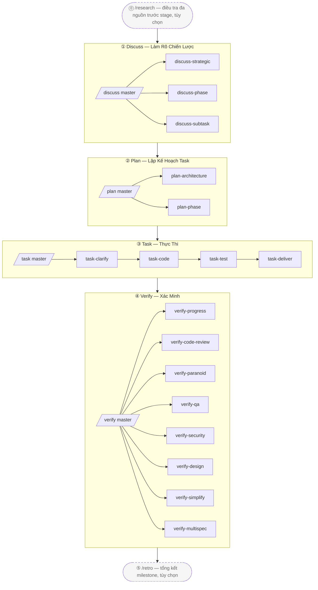

# harnessed

[English](./README.md) | [简体中文](./README-cn.md) | [繁體中文](./README-tw.md) | [日本語](./README-ja.md) | [한국어](./README-ko.md) | [Português (Brasil)](./README-pt-BR.md) | [Türkçe](./README-tr.md) | [Русский](./README-ru.md) | **Tiếng Việt** | [ไทย](./README-th.md)

> Package manager + composition orchestrator cho AI coding harness
> Thực thi máy phương pháp cộng tác three-layer-stack (gstack governance + GSD project manager + superpowers senior engineer + karpathy principles + mattpocock moves) như một engine có thể chạy được

[](https://npmjs.com/package/harnessed)
[](./LICENSE)
[](https://github.com/sponsors/easyinplay)

> Không có liên kết, không được xác nhận, không được tài trợ bởi Harness Inc. (xem [NOTICE](./NOTICE))

---

## ✨ TL;DR

**Orchestration theo best-practice cho Harness Engineering trên Claude Code** — tập hợp những thành phần open-source tốt nhất của hệ sinh thái Claude Code, kết nối chúng thành một workflow thống nhất thông qua các composition skill có định kiến; không vendor code từ upstream — manifest mô tả install/check, và composition skill điều phối sự cộng tác đa-upstream.

---

> Khoan — harnessed thực sự có thể so vai với các upstream khổng lồ như superpowers / gstack / GSD không?
> Tất nhiên — chúng tôi **đứng trên vai những người khổng lồ**. Nhìn xa hơn, Newton từng nói vậy. 🧐
> ... *(thì thầm)* Dù nhìn kỹ hơn, thực ra giống con vẹt đậu trên cái vai đó hơn.
> Thôi kệ — vẹt thì nhại; còn chúng tôi thì **orchestrate**. 🦜

---

## 🎯 Key Differentiators

- **Three-layer stack được thực thi máy** — `gstack governance` + `GSD project manager` + `superpowers senior engineer` + `karpathy 4 principles` + `mattpocock 23 moves`, 5 trụ cột với độ bao phủ 100%
- **Không vendor upstream** — manifest mô tả install/check; khi upstream nâng cấp, người dùng chỉ cần re-install để lấy phiên bản mới nhất
- **Composition Skill** — workflow skill nội bộ đóng vai trò cây đũa chỉ huy, điều phối nhiều upstream hoạt động cùng nhau. **1 super-master `/auto` + 4 stage masters + 18 sub-workflows + 2 standalones = 25 workflow phân tầng namespace**, thực thi máy đầy đủ 4 stage (`/auto` one-shot qua các stage / `/discuss /plan /task /verify` từng stage / 18 three-layer-stack subs / `/research /retro` 2 standalones)
- **L0 Discipline Substrate** — baseline hành vi toàn cục xuyên suốt các stage (karpathy principles + output-style + language + operational + priority + protocols), áp dụng cho tất cả
- **Tư duy package manager** — đồ thị phụ thuộc install tự phân giải, doctor health check, install-base cài toàn bộ một lần
- **Điểm vào thống nhất** — người dùng chỉ cần đối mặt với các master slash command `/discuss /plan /task /verify` mà không phải học thuật ngữ riêng của từng upstream; sub command gọi rõ ràng một stage cụ thể (ví dụ `/discuss-strategic` chỉ chạy phần clarification ở tầng strategic)

---

## 📦 Quick Install

```bash
npm install -g harnessed && harnessed setup
```

> Windows PowerShell 5.x không hỗ trợ chuỗi `&&` — dùng `;` hoặc hai dòng riêng (`npm install -g harnessed; harnessed setup`). bash / zsh / PowerShell 7+ / cmd.exe đều hoạt động bình thường.

**Để gỡ cài đặt:**
```bash
harnessed uninstall    # Xóa các file của harnessed (không ảnh hưởng đến upstream components)
```

> `harnessed uninstall` dọn dẹp commands, workflow skills, biến môi trường settings và thư mục trạng thái. Các upstream component (npm packages, MCP servers, CC plugins, git-cloned repos, npx skills) được giữ nguyên. Chạy `harnessed uninstall <name>` để gỡ một upstream riêng lẻ. Thêm `--dry-run` để xem trước.

🤖 **Hoặc nhờ AI cài giúp** — dán câu này vào Claude Code (hoặc bất kỳ AI assistant nào):

> Install harnessed for me following the guide at `https://github.com/easyinplay/harnessed/blob/main/INSTALL-WITH-AI.md`

AI sẽ tự fetch tài liệu + chạy install, xử lý các edge case về OS / permissions / PATH / corepack — không cần sao chép những đoạn văn bản dài.

> [!TIP]
> 🚀 **Các tính năng Agent Teams và Subagent được yêu thích đã được harnessed tự động bật dựa trên task!**
> Không cần cấu hình thủ công `CLAUDE_CODE_EXPERIMENTAL_AGENT_TEAMS` — `harnessed setup` tự ghi vào `~/.claude/settings.json`. Pattern A full-stack ba chiều / Pattern C 4-specialist và các workflow multi-agent khác hoạt động ngay lập tức.

---

## 🚀 Quick Start — 3 Lựa Chọn

Theo thứ tự can thiệp của người dùng tăng dần:

### 🎯 Auto Mode (Khuyến nghị cho người mới / không muốn nghĩ nhiều)

```
/auto "yêu cầu X"

# Với yêu cầu lớn có thể tách stage rõ ràng (thường không cần — AI tự phán đoán và điều hướng;
# ép stage nếu bạn cho rằng đây là yêu cầu lớn):
/auto "yêu cầu X" --staged
```

> Không muốn nghĩ nhiều, hoặc mới bắt đầu — để harnessed xử lý tất cả. Chạy đầy đủ 6 stage (research có điều kiện → discuss → plan → task → verify → retro bắt buộc) không dừng. AI one-shot tự phán đoán độ phức tạp yêu cầu, gợi ý chuyển sang chế độ `--staged` cho yêu cầu lớn (dừng sau mỗi stage để review); trước khi bắt đầu hỏi "Bạn đã hiểu rõ yêu cầu chưa?" — nếu không → tự chạy `/research` điều tra đa nguồn; kết thúc bằng `/retro` bắt buộc. Fail-fast khi có lỗi, tiếp tục qua `harnessed resume`.

### 📂 Stage Mode (Khuyến nghị cho power user / muốn review kết quả trung gian)

```
/discuss "yêu cầu X"          # Làm rõ 3 tầng: Strategic + Phase + Subtask
/plan "yêu cầu X"             # Architecture (có điều kiện) + plan persistence
/task "subtask-1"             # 4 sub nối tiếp (clarify → code → test → deliver)
/verify "phase-1"             # 7 sub verification có điều kiện
```

> Muốn tự quyết định bắt đầu từ stage nào / review output trung gian — 4 master có thể gọi độc lập, và mỗi master vẫn tự động fan-out tất cả sub của stage đó.

### 🔬 Surgical Mode (Chế độ chuyên gia / bạn biết mình muốn gì)

```
/discuss-phase "..."        # Chỉ chạy clarification tầng Phase
/plan-architecture "..."    # Chỉ chạy architecture review
/verify-paranoid "..."      # Chỉ chạy review của Paranoid Staff Engineer
# ... chọn bất kỳ sub-workflow nào trong số 18 cái còn lại
```

> "Tôi là chuyên gia, tôi tự quyết" — bỏ qua master, gọi thẳng sub-workflow. Phù hợp với advanced user biết chính xác sub nào mình cần, hoặc tái sử dụng một bước duy nhất.

---

## 📐 Sơ Đồ Luồng 4 Stage



> Ô nét đứt = standalone tùy chọn (`/research` điều tra trước strategic / `/retro` tổng kết sau milestone); ô nét liền = cadence 4 stage chính.

### Bảng Tổng Quan 25 Workflow

| Slash cmd | Stage | Loại | Khả năng / Upstream | Mô tả ngắn |
|-----------|-------|------|----------------------|-------|
| `/auto` | All | **Super-master** | masterOrchestrator (qua 6 stage) | Chạy đầy đủ 6 stage one-shot (research có điều kiện → discuss → plan → task → verify → retro bắt buộc); AI one-shot phán đoán độ phức tạp + kiểm tra mức độ hiểu + retro bắt buộc; opt-in `--staged` để dừng tại từng stage |
| `/discuss` | ① Discuss | Master | masterOrchestrator | 3 sub đánh giá gate song song (quy tắc chain-isolation) |
| `/discuss-strategic` | ① Discuss | Sub | gstack `/office-hours` + `/plan-ceo-review` + planning-with-files | Tầng Strategic — governance bắt buộc cho tính năng mới / milestone mới / hướng sản phẩm (findings.md được lưu) |
| `/discuss-phase` | ① Discuss | Sub | GSD `/gsd-discuss-phase` + planning-with-files | Tầng Phase — ≥2 quyết định mở / làm rõ vùng xám (findings.md + knowledge.md được lưu) |
| `/discuss-subtask` | ① Discuss | Sub | superpowers brainstorming + `/grill-with-docs` | Tầng Subtask — ≥2 cách tiếp cận / thuật toán cốt lõi / API contract (thảo luận ngắn tạm thời, không lưu) |
| `/plan` | ② Plan | Master | masterOrchestrator | Gọi nối tiếp 2 sub (architecture có điều kiện → phase luôn luôn) |
| `/plan-architecture` | ② Plan | Sub | gstack `/plan-eng-review` | Tầng Architecture — governance gate bắt buộc cho kiến trúc phức tạp |
| `/plan-phase` | ② Plan | Sub | GSD `/gsd-plan-phase` + planning-with-files `/plan` | Tầng Plan — lưu `task_plan.md` + `progress.md` |
| `/task` | ③ Task | Master | masterOrchestrator | Gọi nối tiếp 4 sub cho mỗi subtask (clarify → code → test → deliver) |
| `/task-clarify` | ③ Task | Sub | superpowers brainstorming + `/grill-with-docs` có điều kiện | Gate làm rõ khi bắt đầu subtask |
| `/task-code` | ③ Task | Sub | karpathy 4 principles + `/zoom-out` / `/improve-codebase-architecture` / `/diagnose` có điều kiện | Coding subtask + đồng bộ progress.md xuyên session |
| `/task-test` | ③ Task | Sub | superpowers TDD red-green-refactor + `/diagnose` có điều kiện | TDD bắt buộc cho logic cốt lõi (alias mattpocock `/tdd`) |
| `/task-deliver` | ③ Task | Sub | `ralph-loop` SDK wrapper + Agent Teams có điều kiện | Đến khi verbatim `COMPLETE` + R20.10 max_iter fallback |
| `/verify` | ④ Verify | Master | masterOrchestrator | 7 sub dispatch có điều kiện theo scenario |
| `/verify-progress` | ④ Verify | Sub | GSD `/gsd-verify-work` + `/gsd-progress` | Điểm bắt đầu nối tiếp bắt buộc — chấp nhận UAT + đồng bộ state |
| `/verify-code-review` | ④ Verify | Sub | `code-review` multi-subagent fan-out | Các phát hiện độ tin cậy cao theo song song |
| `/verify-paranoid` | ④ Verify | Sub | gstack `/review` (Paranoid Staff Engineer) | Bắt buộc cho critical-module trước PR |
| `/verify-qa` | ④ Verify | Sub | gstack `/qa` + playwright-cli / `@playwright/test` / webapp-testing | QA end-to-end (điều kiện has_ui_changes) |
| `/verify-security` | ④ Verify | Sub | gstack `/cso` | OWASP / auth / secrets (điều kiện has_auth_or_secrets) |
| `/verify-design` | ④ Verify | Sub | gstack `/design-review` + ui-ux-pro-max + frontend-design | Tính nhất quán design system (điều kiện has_design_changes) |
| `/verify-simplify` | ④ Verify | Sub | `code-simplifier` | Bước đơn giản hóa nối tiếp cuối cùng |
| `/verify-multispec` | ④ Verify | Sub | 4-specialist Agent Team Pattern C | Leo thang cho critical release / large refactor PR (cross-examination qua SendMessage lẫn nhau) |
| `/research` | Standalone | Standalone | Tavily / Exa MCP + ctx7 + GSD `/gsd-discuss-phase` | Điều tra đa nguồn (phương án thay thế Stage ①) |
| `/retro` | Standalone | Standalone | gstack `/retro` + planning-with-files RETROSPECTIVE.md | Tổng kết đóng project / milestone |

> Master orchestrator tự động gate-route đến sub phù hợp (quy tắc chain-isolation — sub không kích hoạt được khai báo minh bạch là đã bỏ qua).
> Gọi trực tiếp sub cũng bỏ qua master để chạy một stage duy nhất, ví dụ `/discuss-strategic "tính năng mới X"`.

---

## ⚡ Luồng Sử Dụng

Phương pháp three-layer-stack 4 stage — khuyến nghị chạy qua 4 master orchestrator theo thứ tự:

```
/discuss  →  /plan  →  /task  →  /verify
   ①         ②        ③         ④
```

| Stage | Master | Sub-workflow chính | Cộng tác upstream |
| ---- | ---- | ---- | ---- |
| ① **Discuss** | `/discuss` | strategic / phase / subtask (3 song song) | gstack `/office-hours` + GSD `/gsd-discuss-phase` + superpowers brainstorming |
| ② **Plan** | `/plan` | architecture (có điều kiện) → phase | gstack `/plan-eng-review` + GSD `/gsd-plan-phase` + planning-with-files |
| ③ **Task** | `/task` | clarify → code → test → deliver (4 nối tiếp mỗi subtask) | karpathy principles + mattpocock moves + superpowers TDD + `ralph-loop` |
| ④ **Verify** | `/verify` | progress → 5 song song có điều kiện → simplify (+ multispec critical) | GSD `/gsd-verify-work` + code-review + gstack `/review` / `/qa` / `/cso` / `/design-review` + code-simplifier |

Ví dụ thực tế:

```bash
# 1. Cài workflow upstream (một dòng cài gstack + GSD + superpowers + planning-with-files)
harnessed setup

# 2. Chạy cadence 4 stage trong Claude Code
/discuss "tính năng mới X"        # Làm rõ 3 tầng: Strategic + Phase + Subtask
/plan "tính năng mới X"           # Architecture (có điều kiện) + plan (task graph được lưu)
/task "subtask-1: API contract"   # 4 sub nối tiếp mỗi subtask
/verify "phase-1"                 # 7 sub có điều kiện

# 3. Tiếp tục sau khi bị gián đoạn (bất cứ lúc nào)
harnessed resume
```

> Bạn cũng có thể gọi sub trực tiếp để bỏ qua master và chỉ chạy một tầng, ví dụ `/verify-paranoid` chỉ chạy review của Paranoid Staff Engineer.

📊 Mermaid chi tiết + hướng dẫn từng stage đầy đủ: [docs/WORKFLOW.md](./docs/WORKFLOW.md)

---

## 🗂️ Kiến Trúc (phân tầng namespace 4 stage)

### 1. Cấu Trúc Thư Mục

```
harnessed/
├── manifests/                  # L1: tầng mô tả upstream (KHÔNG vendor)
├── workflows/                  # L6: composition skill (cây đũa chỉ huy 4 stage)
│   ├── discuss/                # Stage ① 3 tầng (strategic + phase + subtask)
│   │   ├── auto/               # /discuss master gate-route
│   │   ├── strategic/          # /discuss-strategic (gstack /office-hours + /plan-ceo-review)
│   │   ├── phase/              # /discuss-phase (GSD /gsd-discuss-phase)
│   │   └── subtask/            # /discuss-subtask (superpowers brainstorming)
│   ├── plan/                   # Stage ② (architecture + phase task graph)
│   ├── task/                   # Stage ③ (clarify + code + test + deliver)
│   ├── verify/                 # Stage ④ (progress + code-review + paranoid + qa + cso + design + simplify + multispec)
│   ├── research/               # standalone phương án thay thế Stage ①
│   ├── retro/                  # standalone đóng milestone sau ④
│   ├── capabilities.yaml       # L5a: ~100 mục, 7 danh mục SoT
│   ├── defaults.yaml           # ralph_max_iterations theo workflow phase
│   ├── judgments/              # L5a: tiêu chí three-layer-stack + parallelism + tdd + fallback + rules-routing
│   │   ├── strategic-gate.yaml
│   │   ├── phase-gate.yaml
│   │   ├── subtask-gate.yaml
│   │   ├── parallelism-gate.yaml         # L5b định tuyến cơ chế thực thi
│   │   ├── tdd-gate.yaml
│   │   ├── fallback.yaml                 # 3 quy tắc: skip_with_transparency + override + chain_isolation
│   │   ├── web-design-routing.yaml       # Định tuyến công cụ UI design
│   │   ├── web-testing-routing.yaml      # Định tuyến công cụ E2E / browser testing
│   │   ├── web-search-routing.yaml       # Định tuyến web search / fetch tài liệu
│   │   └── stage-routing.yaml            # Định tuyến sub-stage của master orchestrator
│   └── disciplines/            # L0: baseline hành vi toàn cục xuyên suốt stage
│       ├── karpathy.yaml       # 4 nguyên tắc + ≤200L
│       ├── output-style.yaml   # BLUF + no-emoji + no-em-dash
│       ├── language.yaml       # zh-Hans mặc định + giữ nguyên tiếng Anh
│       ├── operational.yaml    # biome preempt + A7 + commit safety
│       ├── priority.yaml       # phân xử xung đột skill
│       └── protocols.yaml      # cc-handoff design doc self-contained
├── routing/                    # L4: routing engine SSOT (decision_rules.yaml)
├── schemas/                    # L3: JSON Schema (IDE / CI sử dụng)
├── src/                        # L4: TS engine (workflow + routing + cli + installers + checkpoint + audit + state)
├── tests/                      # vitest unit + integration + dogfood (R8.1 dogfood-first)
├── scripts/                    # CI gate (check-workflow-schema, transparency-verdict, state-archive)
├── .planning/                  # project memory (STATE + ROADMAP + REQUIREMENTS + per-phase + milestones)
└── docs/adr/                   # kiến trúc decision records
```

### 2. Phân Tầng Logic (8 tầng)

```
┌────────────────────────────────────────────────────────────┐
│ L7 Slash cmd và harnessed CLI hướng người dùng              │
│   /discuss /plan /task /verify (master) + 18 sub + /research /retro + /auto super-master
│   + gọi gstack trực tiếp (30+ tùy chọn): /office-hours /review /qa /...
├────────────────────────────────────────────────────────────┤
│ L6 Workflow orchestration (workflows/<stage>/<sub>/)         │
├────────────────────────────────────────────────────────────┤
│ L5b Cơ chế thực thi (trực giao): subagent / Agent Teams /   │
│   main session + ralph-loop wrapper                         │
│   parallelism-gate.yaml: subagent mặc định → leo thang 5 trigger │
│   Pattern A full-stack ba chiều / B giả thuyết đối lập / C review đa chiều │
├────────────────────────────────────────────────────────────┤
│ L5a Capability + Judgment + Defaults SoT                    │
│   capabilities.yaml (7 danh mục) + judgments/ (10 file) +  │
│   defaults.yaml                                              │
├────────────────────────────────────────────────────────────┤
│ L4  Runtime engine (workflow / routing / handlers)           │
├────────────────────────────────────────────────────────────┤
│ L3  TypeBox schema + CI gate                                 │
├────────────────────────────────────────────────────────────┤
│ L2  Installer + Manifest engine                              │
├────────────────────────────────────────────────────────────┤
│ L1  Upstream components (KHÔNG vendor)                       │
├────────────────────────────────────────────────────────────┤
│ L0  Discipline Substrate (áp dụng toàn cục)                  │
│   karpathy principles + output-style + language + operational + │
│   priority + protocols (áp dụng cho L1-L7)                  │
└────────────────────────────────────────────────────────────┘
```

### 3. Khả Năng Xuyên Suốt (capabilities.yaml — 7 danh mục, ~100 mục)

```
behavioral (6):       karpathy-guidelines + output-style + language + operational + priority + protocols
tool-slash-cmd (~60): gstack 30+ tùy chọn + gsd 10+ + mattpocock 12 tần suất cao + v.v.
tool-mcp (3):         chrome-devtools-mcp / tavily-mcp / exa-mcp
tool-cli (2):         ctx7 / gws
tool-plugin (2):      planning-with-files / @playwright/test
tool-bundled (3):     ralph-loop / webapp-testing / playwright-cli
agent-platform (3):   agent-teams-create / send-message / shutdown
```

### 4. Ví Dụ Luồng Dữ Liệu (người dùng gọi `/discuss "tính năng mới X"`)

```
[L7] Người dùng gọi /discuss "tính năng mới X"
  ↓
[L6] workflows/discuss/auto/workflow.yaml master orchestrator
  ↓
[L5a] judgments.strategic-gate.fires + phase-gate.fires + subtask-gate.fires (đánh giá song song 3 chiều)
  ↓
[L4] judgmentResolver.ts (tách ref 4 cấp) + exprBuilder.ts (expr-eval evaluate)
  ↓
[L0] discipline.priority-hierarchy phân xử xung đột công cụ / output-style định dạng output
  ↓
[fires=true sub] → gọi sub-workflow (/discuss-strategic / /discuss-phase / /discuss-subtask)
  ↓ cho mỗi sub:
      ├─ behavioral_layer: karpathy-guidelines (luôn bật)
      ├─ tools_available: planning-with-files / ctx7 / mattpocock theo điều kiện
      ├─ parallelism: judgments.parallelism-gate.<route>.fires (cơ chế L5b)
      └─ phase invocations thực thi qua capability template interpolation
  ↓
[fallback.yaml chain-isolation] 3 tầng được phán đoán độc lập, không phụ thuộc nối tiếp
[Khai báo bỏ qua minh bạch] sub không kích hoạt → "⚠️ Skipped <sub> because <reason>"
  ↓
planning-with-files /plan (công cụ xuyên suốt) → ghi artifact vào .planning/<phase-id>/
  ↓
[L4] state.ts writeCurrentWorkflow (proper-lockfile) + audit.append (12-field JSONL)
```

### 5. Ma Trận Định Tuyến Quyết Định (dựa trên quy tắc, được mã hóa trong judgments + capabilities)

| Scenario | Mặc định → Leo thang |
|------|---------------------|
| Cơ chế parallelism | subagent → Agent Teams Pattern A/B/C (5 trigger) |
| Kế hoạch chính UI design | ui-ux-pro-max → frontend-design (người dùng yêu cầu rõ phong cách) |
| Khám phá browser E2E | playwright-cli (một dòng Bash, tiết kiệm token) |
| E2E TS có thể commit | @playwright/test mặc định |
| E2E liên kết Python backend | webapp-testing |
| Chẩn đoán performance / a11y / memory | chrome-devtools-mcp |
| Web search (từ khóa) | Tavily MCP mặc định |
| Web search (mô tả / học thuật) | Exa MCP |
| Tài liệu API thư viện | ctx7 CLI |
| URL GitHub | gh CLI |
| Fetch một URL | WebFetch tích hợp sẵn |
| Gmail / Drive / Calendar | gws CLI |
| Architecture review (phức tạp) | gstack /plan-eng-review |
| TDD bắt buộc (thuật toán cốt lõi) | superpowers TDD HOẶC mattpocock /tdd |
| Critical module PR | gstack /review |
| Large refactor PR review đa chiều | 4-specialist Agent Team Pattern C |
| Cross-session hand-off | discipline.protocols design doc self-contained |
| Độ phức tạp `/auto` cho yêu cầu lớn | AI one-shot phán đoán → tự gợi ý `--staged` (n abort gợi ý `/discuss` thủ công) |
| Mức độ hiểu yêu cầu `/auto` | Hỏi trước khi bắt đầu → n tự thêm `/research` điều tra đa nguồn |

---

## 🛠️ Lệnh Vận Hành

> Đây là các lệnh bảo trì riêng của harnessed (setup / health check / backup-rollback / state recovery, v.v.). Để phát triển tính năng hàng ngày chỉ cần dùng các slash command ở trên — thường bạn không cần những lệnh này.

**v4.0 — bộ não điều phối.** Slash command chạy việc làm rõ trong session chính của Claude Code (để câu hỏi đến được với bạn), sau đó spawn các subagent CC-native (kích hoạt Agent Teams + round-trip làm rõ). harnessed cung cấp đánh giá gate (`harnessed gates`) và prompt sẵn sàng spawn (`harnessed prompt`); session chính thực hiện việc spawn. `harnessed run` được giữ lại cho mục đích CI/headless.

### Lệnh CLI

| Lệnh | Mô tả |
| ---- | ---- |
| `harnessed setup` | Cài đặt một lần; cài workflow skill vào `~/.claude/skills/` + MCP vào `~/.claude.json` |
| `harnessed gates <master>` | Đánh giá sub-workflow nào kích hoạt cho một master stage (JSON: fire/skip/parallelism). Được slash command dùng để điều phối các native spawn. |
| `harnessed prompt <sub>` | Xuất ra prompt sẵn sàng spawn (role + checklist + disciplines + giao thức completion/clarification) cho một sub-workflow. |
| `harnessed checkpoint <action> <sub>` | Ghi lại start/complete/fail của sub-workflow vào `~/.claude/harnessed/checkpoints/`. |
| `harnessed run <name>` | Chạy một workflow qua in-process SDK spawn (chế độ CI/headless). Slash command dùng CC-native spawn thay thế. |
| `harnessed resume` | Tiếp tục từ checkpoint gần nhất sau khi session bị gián đoạn |
| `harnessed status` | Phase hiện tại + lock holder |
| `harnessed doctor` | Health check 8 mục (Node / MCP / jq / Win bash / routing / token budget, v.v.) |
| `harnessed install <name>` | Cài một upstream manifest |
| `harnessed uninstall [name]` | Gỡ cài đặt thống nhất — không tên: xóa file của harnessed (upstream được giữ nguyên); có tên: gỡ một upstream riêng lẻ |
| `harnessed backup` | Quản lý backup snapshot |
| `harnessed rollback <timestamp>` | Rollback một dòng lệnh (giữ EOL + xác minh sha1) |
| `harnessed gc` | Dọn dẹp backup đã hết hạn |
| `harnessed audit-log` | Truy vấn log minh bạch routing (hỗ trợ biểu thức jq `--filter`) |

### Flags

> Tất cả lệnh **áp dụng ngay (ghi ngay)** theo mặc định — không cần flag. Advanced user có thể thêm `--dry-run` để xem trước.

| Flag | Mô tả |
| ---- | ---- |
| `--dry-run` | Xem trước mà không ghi vào disk (opt-in cho advanced user) |
| `--non-interactive` | CI / kịch bản scripted |
| `--system` | Cho phép cài L4 toàn cục (nếu không sẽ hạ xuống L1 npx ephemeral) |
| `--full-diff` | Mở rộng diff bị gấp khi vượt quá 200 dòng |
| `--no-color` | Buộc không màu (kể cả trên TTY) |
| `--task <text>` | Subcommand `run` — mô tả task (truyền vào `gateContext.task` của workflow) |
| `--task-stdin` | Subcommand `run` — đọc mô tả task từ stdin tới EOF (tránh shell-escape cho dấu ngoặc/$/`) |


---

## ❓ FAQ

<details>
<summary><b>Q1. Sau khi cài harnessed tôi có còn cần cài upstream superpowers / gstack / GSD không?</b></summary>

<br>

Có, nhưng **trải nghiệm người dùng = một lệnh duy nhất**:

```bash
harnessed setup  # Tự động cài gstack + GSD + superpowers + planning-with-files; 25 workflow skill đến ~/.claude/skills/ + biến môi trường Agent Teams tự động ghi vào ~/.claude.json
```

Hãy nghĩ như `brew install <formula>` kéo toàn bộ dependency — bạn không cần `brew install` từng dependency riêng lẻ.

</details>

<details>
<summary><b>Q2. Tại sao không vendor superpowers / gstack vào repo harnessed cho tiện?</b></summary>

<br>

4 lý do:

1. **Triết lý khác biệt** — harnessed là "package manager theo chủ nghĩa lắp ráp" đối lập với trường phái "tự xây dựng tất-cả-trong-một". Vendor = mất đi lợi thế cạnh tranh → trở thành một plugin pack bình thường nữa
2. **Nightmare về license + attribution** — vendor 4-5 upstream đang tích cực được bảo trì = một mớ license phức tạp chắp vá
3. **Hướng nâng cấp upstream bị đảo ngược** — manifest mô tả hiện tại cho phép người dùng re-install để lấy phiên bản mới nhất khi upstream nâng cấp; vendor buộc phải đồng bộ code thủ công và liên tục tụt hậu
4. **Bus factor 1** — một maintainer duy nhất giữ 4-5 upstream được vendor đồng bộ = burnout nhanh hơn

</details>

<details>
<summary><b>Q3. gstack / GSD / superpowers trông đều như công cụ plan/discuss — chúng không chồng chéo nhau sao?</b></summary>

<br>

**Không**. Chúng là các stage khác nhau trong three-layer-stack:

| Stage | Upstream | Trách nhiệm |
| ---- | ---- | ---- |
| Governance | gstack | Gate quyết định đa vai (CEO / EM / Designer / Paranoid Engineer) |
| Brainstorming | superpowers | Làm rõ thiết kế subtask, so sánh các phương án |
| Orchestration | GSD | Task graph phase cấp cao + phân tích phụ thuộc |
| Persistence | planning-with-files | Lưu `task_plan.md` / `progress.md` / `findings.md` |

`/discuss /plan /task /verify` — 4 master kết nối 4 stage lại; mỗi master ủy quyền nội bộ cho sub của nó. Mỗi stage làm một việc khác nhau và cung cấp đầu vào cho stage tiếp theo. **Không gộp chung**.

</details>

<details>
<summary><b>Q4. Các workflow phase chạy tự động hay chờ người dùng?</b></summary>

<br>

Phụ thuộc vào trường `pause` trong frontmatter `workflows/<name>/SKILL.md`:

- `pause: human_review` → chặn lại chờ người dùng phê duyệt (governance gate / khóa cuối, ví dụ `/discuss-strategic` gstack `/office-hours` + `/plan-architecture` gate khóa `/plan-eng-review`)
- Không có `pause` → tự động nối tiếp sang phase tiếp theo

Output của mỗi phase được ghi vào `.harnessed/checkpoints/`; sau khi session bị gián đoạn, `harnessed resume` tiếp tục từ checkpoint mới nhất.

</details>

<details>
<summary><b>Q5. Bản thân harnessed có phải là một CC plugin không?</b></summary>

<br>

Là hybrid:

- `npx harnessed@latest setup` chạy **Node.js CLI** (`bin/harnessed`)
- setup cài **workflow skill** (markdown) vào `~/.claude/skills/`, được Claude Code runtime tải lên
- `/discuss` / `/plan` / `/task` / `/verify` v.v. là slash command trong CC kích hoạt thực thi skill
- CLI và CC skill chia sẻ thư mục state `.harnessed/checkpoints/`

</details>

---


## License

[Apache-2.0](./LICENSE) — xem [NOTICE](./NOTICE) (bao gồm tuyên bố từ chối nhãn hiệu của Harness Inc.)

Ủng hộ phát triển: [](https://github.com/sponsors/easyinplay)
