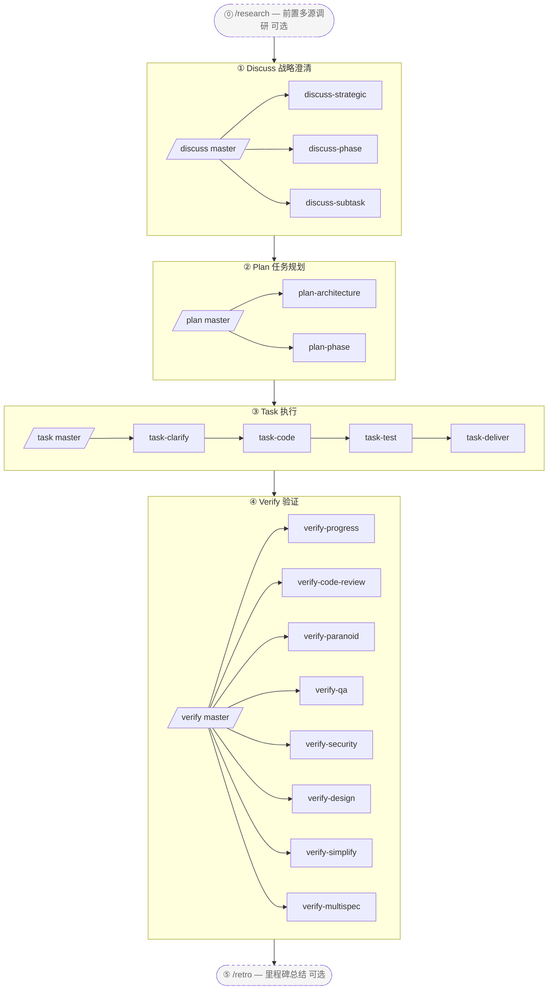

# harnessed

> AI coding harness 包管理器 + composition orchestrator
> 把三层栈协作方法论 (gstack 决策 + GSD 项目经理 + superpowers 资深工程师 + karpathy 心法 + mattpocock 招式) 机器化为可执行 engine

[](https://npmjs.com/package/harnessed)
[](./LICENSE)
[](https://github.com/sponsors/easyinplay)

> Not affiliated with, endorsed by, or sponsored by Harness Inc. (见 [NOTICE](./NOTICE))

---

## ✨ 一句话定位

装配市面上最优秀的开源 Claude Code 生态组件,用强意见 composition skill 织成统一工作流;不 vendor 上游代码,通过 manifest 描述 install/check + composition skill 编排多上游协作。

---

## 🎯 关键差异化

- **三层栈机器化** — `gstack 决策` + `GSD 项目经理` + `superpowers 资深工程师` + `karpathy 4 心法` + `mattpocock 23 招式`,5 支柱 100% capture
- **不 vendor 上游** — manifest describe install/check;上游升级用户 re-install 即获最新版
- **Composition Skill** — 自家 workflow skill 当指挥棒,调度多个上游协同。**4 master orchestrator + 18 sub-workflow + 2 standalone = 24 namespace-layered workflow**,完整 4-stage 机器化 (`/discuss /plan /task /verify` 4 master + 三层栈 18 sub + `/research /retro` 2 standalone)
- **L0 Discipline Substrate** — 全局 cross-stage 行为基准 (karpathy 心法 + output-style + language + operational + priority + protocols),applied universally
- **包管理器思维** — install dependency graph 自动解析, doctor 健康检查, install-base 一键装齐
- **统一入口** — 用户面对 `/discuss /plan /task /verify` 等 master slash command,不需学每家上游术语;sub command 显式调用单 stage (例如 `/discuss-strategic` 只跑战略层澄清)

---

## 📦 快速安装

```bash
npm install -g harnessed
harnessed setup
```

> Windows PowerShell 5.x 不支持 `&&` 链接,需分两行执行。bash / zsh / PowerShell 7+ 可合并为 `npm install -g harnessed && harnessed setup`。

🤖 **或让 AI 帮你装** — 复制 [INSTALL-WITH-AI.md](./INSTALL-WITH-AI.md) 整段粘贴进 Claude Code (或任何 AI 助手),AI 自动处理 OS / 权限 / PATH / corepack 等 edge case。

---

## 📐 4-stage 流程图



> 虚框 = 可选 standalone (`/research` 战略前调研 / `/retro` 里程碑后总结);实框 = 主流程 4-stage cadence。

### 24 workflow 总览表

| Slash cmd | Stage | Type | Capability / Upstream | Brief |
|-----------|-------|------|----------------------|-------|
| `/discuss` | ① Discuss | Master | masterOrchestrator | 3 sub 并行 gate-eval (chain-isolation 铁律) |
| `/discuss-strategic` | ① Discuss | Sub | gstack `/office-hours` + `/plan-ceo-review` | 战略层 — 新功能 / 新 milestone / 产品方向强制治理 |
| `/discuss-phase` | ① Discuss | Sub | GSD `/gsd-discuss-phase` | Phase 层 — ≥2 open decisions / 灰色地带澄清 |
| `/discuss-subtask` | ① Discuss | Sub | superpowers brainstorming + `/grill-with-docs` | 子任务层 — ≥2 approach / 核心算法 / API contract |
| `/plan` | ② Plan | Master | masterOrchestrator | 串行 invoke 2 sub (architecture conditional → phase always) |
| `/plan-architecture` | ② Plan | Sub | gstack `/plan-eng-review` | 架构层 — 复杂架构强制治理关卡 |
| `/plan-phase` | ② Plan | Sub | GSD `/gsd-plan-phase` + planning-with-files `/plan` | 计划层 — 持久化 `task_plan.md` + `progress.md` |
| `/task` | ③ Task | Master | masterOrchestrator | 串行 invoke 4 sub per subtask (clarify → code → test → deliver) |
| `/task-clarify` | ③ Task | Sub | superpowers brainstorming + `/grill-with-docs` conditional | 子任务起步澄清 gate |
| `/task-code` | ③ Task | Sub | karpathy 4 心法 + `/zoom-out` / `/improve-codebase-architecture` / `/diagnose` conditional | 子任务编码 + 跨 session progress.md 同步 |
| `/task-test` | ③ Task | Sub | superpowers TDD red-green-refactor + `/diagnose` conditional | 核心逻辑 TDD 强制 (alias mattpocock `/tdd`) |
| `/task-deliver` | ③ Task | Sub | `ralph-loop` SDK wrapper + Agent Teams conditional | 至 verbatim `COMPLETE` + R20.10 max_iter fallback |
| `/verify` | ④ Verify | Master | masterOrchestrator | 7 sub 按场景 conditional dispatch |
| `/verify-progress` | ④ Verify | Sub | GSD `/gsd-verify-work` + `/gsd-progress` | 必跑串行起点 — UAT 验收 + 状态同步 |
| `/verify-code-review` | ④ Verify | Sub | `code-review` 多 subagent fan-out | 高置信度 finding 并行 |
| `/verify-paranoid` | ④ Verify | Sub | gstack `/review` (Paranoid Staff Engineer) | 关键模块 PR 前强制 |
| `/verify-qa` | ④ Verify | Sub | gstack `/qa` + playwright-cli / `@playwright/test` / webapp-testing | 端到端 QA (has_ui_changes conditional) |
| `/verify-security` | ④ Verify | Sub | gstack `/cso` | OWASP / auth / secrets (has_auth_or_secrets conditional) |
| `/verify-design` | ④ Verify | Sub | gstack `/design-review` + ui-ux-pro-max + frontend-design | 设计系统一致性 (has_design_changes conditional) |
| `/verify-simplify` | ④ Verify | Sub | `code-simplifier` | 末尾串行简化 |
| `/verify-multispec` | ④ Verify | Sub | 4-specialist Agent Team Pattern C | 关键发布 / 大重构 PR 升级 (互相 SendMessage 质询) |
| `/research` | Standalone | Standalone | Tavily / Exa MCP + ctx7 + GSD `/gsd-discuss-phase` | 多源调研 (Stage ① alternate) |
| `/retro` | Standalone | Standalone | gstack `/retro` + planning-with-files RETROSPECTIVE.md | 项目 / 里程碑结束总结 |

> Master orchestrator 自动 gate-route 到合适的 sub (chain-isolation 铁律 — 不 fire 的 sub 透明声明跳过)。
> 直接调用 sub 也可绕过 master 单跑某 stage,例如 `/discuss-strategic "新功能 X"`。

---

## 🚩 命令一览

### 主命令

| 命令 | 说明 |
| ---- | ---- |
| `harnessed setup` | 一次性 setup,装 workflow skills 到 `~/.claude/skills/` |
| `harnessed install <name>` | 装上游 manifest (默认 dry-run) |
| `harnessed uninstall <name>` | 反向卸载 (默认 dry-run) |
| `harnessed audit-log` | 路由透明日志 query (支持 `--filter` jq 表达式) |
| `harnessed status` | 当前 phase + lock holder |
| `harnessed resume` | session 中断后恢复至最近 checkpoint |
| `harnessed doctor` | 8-check 健康检查 (Node / MCP / jq / Win bash / 路由 / token budget 等) |
| `harnessed backup` | snapshot 备份管理 |
| `harnessed rollback <timestamp>` | 一行回滚 (EOL preserve + sha1 verify) |
| `harnessed gc` | 清理过期 backups |

### 参数 (Flags)

> 所有命令默认 **apply (immediate write)**,无需加 flag。高级用户可加 `--dry-run` 预览。

| Flag | 说明 |
| ---- | ---- |
| `--dry-run` | 预览不写盘 (高级用户 opt-in) |
| `--non-interactive` | CI / 脚本场景 |
| `--system` | L4 全局装允许 (否则降级 L1 npx ephemeral) |
| `--yes` | uninstall 跳过交互 confirm |
| `--full-diff` | 展开 > 200 行的 diff 折叠 |
| `--no-color` | 强制 nocolor (即使 TTY) |

> `--apply` flag 仍保留为向后兼容 alias (no-op, 旧脚本不破)。

---

## ⚡ 使用流程

4-stage 三层栈方法论 — 推荐 4 个 master orchestrator 串行驱动:

```
/discuss  →  /plan  →  /task  →  /verify
   ①         ②        ③         ④
```

| Stage | Master | 主要 sub-workflow | 上游协同 |
| ---- | ---- | ---- | ---- |
| ① **Discuss** | `/discuss` | strategic / phase / subtask (3 并行) | gstack `/office-hours` + GSD `/gsd-discuss-phase` + superpowers brainstorming |
| ② **Plan** | `/plan` | architecture (conditional) → phase | gstack `/plan-eng-review` + GSD `/gsd-plan-phase` + planning-with-files |
| ③ **Task** | `/task` | clarify → code → test → deliver (4 串行 per subtask) | karpathy 心法 + mattpocock 招式 + superpowers TDD + `ralph-loop` |
| ④ **Verify** | `/verify` | progress → 5 parallel conditional → simplify (+ multispec critical) | GSD `/gsd-verify-work` + code-review + gstack `/review` / `/qa` / `/cso` / `/design-review` + code-simplifier |

实操示例:

```bash
# 1. 装 workflow 上游 (一行装齐 gstack + GSD + superpowers + planning-with-files)
harnessed setup

# 2. 在 Claude Code 内跑 4-stage cadence
/discuss "新功能 X"           # 战略 + Phase + 子任务 3 层澄清
/plan "新功能 X"              # 架构 (conditional) + 计划 (任务图持久化)
/task "subtask-1: API contract"  # 4 sub 串行 per subtask
/verify "phase-1"             # 7 sub conditional

# 3. 中断后恢复 (任何时候)
harnessed resume
```

> 也可直接调 sub 绕过 master 单跑某一层,例如 `/verify-paranoid` 只跑 Paranoid Staff Engineer 审查。

📊 详细 mermaid + 各 stage 完整说明:[docs/WORKFLOW.md](./docs/WORKFLOW.md)

---

## 🗂️ 架构 (4-stage namespace-layered)

### 1. 目录结构

```
harnessed/
├── manifests/                  # L1: 上游描述层 (NOT vendored)
├── workflows/                  # L6: composition skill (4-stage 指挥棒)
│   ├── discuss/                # Stage ① 3 layer (strategic + phase + subtask)
│   │   ├── auto/               # /discuss master gate-route
│   │   ├── strategic/          # /discuss-strategic (gstack /office-hours + /plan-ceo-review)
│   │   ├── phase/              # /discuss-phase (GSD /gsd-discuss-phase)
│   │   └── subtask/            # /discuss-subtask (superpowers brainstorming)
│   ├── plan/                   # Stage ② (architecture + phase 任务图)
│   ├── task/                   # Stage ③ (clarify + code + test + deliver)
│   ├── verify/                 # Stage ④ (progress + code-review + paranoid + qa + cso + design + simplify + multispec)
│   ├── research/               # standalone Stage ① alternate
│   ├── retro/                  # standalone post-④ milestone close
│   ├── capabilities.yaml       # L5a: ~70 entry, 7 category SoT
│   ├── defaults.yaml           # ralph_max_iterations per workflow phase
│   ├── judgments/              # L5a: 三层栈判据 + parallelism + tdd + fallback + rules-routing
│   │   ├── strategic-gate.yaml
│   │   ├── phase-gate.yaml
│   │   ├── subtask-gate.yaml
│   │   ├── parallelism-gate.yaml         # L5b execution mechanism routing
│   │   ├── tdd-gate.yaml
│   │   ├── fallback.yaml                 # 3 铁律: skip_with_transparency + override + chain_isolation
│   │   ├── web-design-routing.yaml       # UI 设计工具路由
│   │   ├── web-testing-routing.yaml      # E2E / 浏览器测试工具路由
│   │   ├── web-search-routing.yaml       # 网页搜索 / 文档抓取路由
│   │   └── stage-routing.yaml            # master orchestrator sub-stage 路由
│   └── disciplines/            # L0: 全局 cross-stage 行为基准
│       ├── karpathy.yaml       # 4 心法 + ≤200L
│       ├── output-style.yaml   # BLUF + no-emoji + no-em-dash
│       ├── language.yaml       # zh-Hans default + English preserve
│       ├── operational.yaml    # biome preempt + A7 + commit safety
│       ├── priority.yaml       # skill conflict 仲裁
│       └── protocols.yaml      # cc-handoff design doc 自包含
├── routing/                    # L4: routing engine SSOT (decision_rules.yaml)
├── schemas/                    # L3: JSON Schema (IDE / CI consume)
├── src/                        # L4: TS engine (workflow + routing + cli + installers + checkpoint + audit + state)
├── tests/                      # vitest unit + integration + dogfood (R8.1 dogfood-first)
├── scripts/                    # CI gate (check-workflow-schema, transparency-verdict, state-archive)
├── .planning/                  # project memory (STATE + ROADMAP + REQUIREMENTS + per-phase + milestones)
└── docs/adr/                   # 架构决策记录
```

### 2. 逻辑分层 (8 层)

```
┌────────────────────────────────────────────────────────────┐
│ L7 User-facing slash cmd + harnessed CLI                    │
│   /discuss /plan /task /verify (master) + 14 sub + /research /retro
│   + direct gstack invoke (30+ optional): /office-hours /review /qa /...
├────────────────────────────────────────────────────────────┤
│ L6 Workflow orchestration (workflows/<stage>/<sub>/)         │
├────────────────────────────────────────────────────────────┤
│ L5b Execution Mechanism (orthogonal): subagent / Agent Teams │
│   / 主 session + ralph-loop wrapper                         │
│   parallelism-gate.yaml: 默认 subagent → escalate 5 触发     │
│   Pattern A 全栈三路 / B 对立假设 / C 多维度审查              │
├────────────────────────────────────────────────────────────┤
│ L5a Capability + Judgment + Defaults SoT                    │
│   capabilities.yaml (7 category) + judgments/ (10 file) +    │
│   defaults.yaml                                              │
├────────────────────────────────────────────────────────────┤
│ L4  Runtime engine (workflow / routing / handlers)           │
├────────────────────────────────────────────────────────────┤
│ L3  TypeBox schema + CI gate                                 │
├────────────────────────────────────────────────────────────┤
│ L2  Installer + Manifest engine                              │
├────────────────────────────────────────────────────────────┤
│ L1  Upstream components (NOT vendored)                       │
├────────────────────────────────────────────────────────────┤
│ L0  Discipline Substrate (全局生效)                          │
│   karpathy 心法 + output-style + language + operational +    │
│   priority + protocols (applied universally to L1-L7)       │
└────────────────────────────────────────────────────────────┘
```

### 3. Cross-cutting Capabilities (capabilities.yaml 7 category, ~83 entry)

```
behavioral (6):       karpathy-guidelines + output-style + language + operational + priority + protocols
tool-slash-cmd (~60): gstack 30+ optional + gsd 10+ + mattpocock 12 高频 + 等
tool-mcp (3):         chrome-devtools-mcp / tavily-mcp / exa-mcp
tool-cli (2):         ctx7 / gws
tool-plugin (2):      planning-with-files / @playwright/test
tool-bundled (3):     ralph-loop / webapp-testing / playwright-cli
agent-platform (3):   agent-teams-create / send-message / shutdown
```

### 4. 数据流示例 (用户调用 `/discuss "新功能 X"`)

```
[L7] User invokes /discuss "新功能 X"
  ↓
[L6] workflows/discuss/auto/workflow.yaml master orchestrator
  ↓
[L5a] judgments.strategic-gate.fires + phase-gate.fires + subtask-gate.fires (3-way 并行 eval)
  ↓
[L4] judgmentResolver.ts (4-level ref split) + exprBuilder.ts (expr-eval evaluate)
  ↓
[L0] discipline.priority-hierarchy 仲裁工具冲突 / output-style 格式化输出
  ↓
[fires=true sub] → invoke sub-workflow (/discuss-strategic / /discuss-phase / /discuss-subtask)
  ↓ for each sub:
      ├─ behavioral_layer: karpathy-guidelines (always-on)
      ├─ tools_available: planning-with-files / ctx7 / mattpocock by-condition
      ├─ parallelism: judgments.parallelism-gate.<route>.fires (L5b mechanism)
      └─ phase invocations execute via capability template interpolation
  ↓
[fallback.yaml chain-isolation] 三层独立判断, 不串行依赖
[Skip 透明声明] 不 fire 的 sub → "⚠️ 跳过 <sub>, 因为 <reason>"
  ↓
planning-with-files /plan (cross-cutting tool) → write artifacts to .planning/<phase-id>/
  ↓
[L4] state.ts writeCurrentWorkflow (proper-lockfile) + audit.append (12-field JSONL)
```

### 5. 抉择路由矩阵 (rules-based, codified in judgments + capabilities)

| 场景 | Default → Escalate |
|------|---------------------|
| 并行机制 | subagent → Agent Teams Pattern A/B/C (5 触发) |
| UI 设计主方案 | ui-ux-pro-max → frontend-design (用户明示风格) |
| E2E 浏览器探查 | playwright-cli (Bash 一行 token 省) |
| E2E commit-able TS | @playwright/test 默认 |
| E2E Python 后端联动 | webapp-testing |
| 性能 / a11y / 内存诊断 | chrome-devtools-mcp |
| Web 搜索 (关键词) | Tavily MCP 默认 |
| Web 搜索 (描述式 / 学术) | Exa MCP |
| 库 API 文档 | ctx7 CLI |
| GitHub URL | gh CLI |
| 单 URL 抓取 | WebFetch 内置 |
| Gmail / Drive / Calendar | gws CLI |
| 架构审查 (复杂) | gstack /plan-eng-review |
| TDD 强制 (核心算法) | superpowers TDD OR mattpocock /tdd |
| 关键模块 PR | gstack /review |
| 大重构 PR 多维度审查 | 4-specialist Agent Team Pattern C |
| 跨 session hand-off | discipline.protocols self-contained design doc |

---

## ❓ FAQ

<details>
<summary><b>Q1. 装了 harnessed 还需要装 superpowers / gstack / GSD 上游吗?</b></summary>

<br>

需要,但**用户感知 = 一行命令**:

```bash
harnessed setup --apply  # 自动装齐 gstack + GSD + superpowers + planning-with-files,24 workflow skill 一并落到 ~/.claude/skills/
```

类比 `brew install <formula>` 装全套依赖 — 你不需要单独 `brew install` 每个依赖项。

</details>

<details>
<summary><b>Q2. 为什么不直接 vendor superpowers / gstack 进 harnessed 仓库?</b></summary>

<br>

4 条理由:

1. **差异化哲学** — harnessed 是「装配主义包管理器」对位「all-in-one 自建派」。vendor = 失去 wedge → 沦为又一个 plugin pack
2. **License + attribution 噩梦** — vendor 4-5 个主动维护的上游 = 复杂 license 拼盘
3. **上游升级反向** — 当前 manifest 描述,上游升级用户 re-install 即得新版;vendor 后手动 sync code 永远落后
4. **Bus factor 1** — 单 maintainer 维护 vendor 4-5 上游 = 加速 burnout

</details>

<details>
<summary><b>Q3. gstack / GSD / superpowers 看起来都是 plan/discuss 类,是不是重叠?</b></summary>

<br>

**不是**。它们是三层栈的不同阶段:

| 阶段 | 上游 | 职责 |
| ---- | ---- | ---- |
| Governance | gstack | 多角色决策关卡 (CEO / EM / Designer / Paranoid Engineer) |
| Brainstorming | superpowers | 子任务设计澄清、方案对比 |
| Orchestration | GSD | 高层 phase 任务图 + 依赖分析 |
| Persistence | planning-with-files | 持久化 `task_plan.md` / `progress.md` / `findings.md` |

`/discuss /plan /task /verify` 4 个 master 把 4 阶段串起来,每个 master 内部再 delegate 到对应 sub。每个阶段做不同事,输出喂给下一阶段。**没有合并**。

</details>

<details>
<summary><b>Q4. workflow phase 之间是自动跑还是等用户?</b></summary>

<br>

看 `workflows/<name>/SKILL.md` frontmatter 的 `pause` 字段:

- `pause: human_review` → 阻塞等用户 approve (governance gate / final lock,如 `/discuss-strategic` gstack `/office-hours` + `/plan-architecture` `/plan-eng-review` 锁定关卡)
- 无 `pause` → 自动 chain 到下一 phase

每个 phase 输出写到 `.harnessed/checkpoints/`,session 中断后 `harnessed resume` 从最近 checkpoint 继续。

</details>

<details>
<summary><b>Q5. harnessed 自己是 CC plugin 吗?</b></summary>

<br>

混合体:

- `npx harnessed@latest setup` 跑的是 **Node.js CLI** (`bin/harnessed`)
- setup 装的 **workflow skills** (markdown) 进 `~/.claude/skills/`,由 Claude Code 运行时加载
- `/discuss` / `/plan` / `/task` / `/verify` 等是 CC 内的 slash command,触发 skill 执行
- CLI 和 CC skill 共享 `.harnessed/checkpoints/` 状态目录

</details>

---

## License

[Apache-2.0](./LICENSE) — 见 [NOTICE](./NOTICE) (含 Harness Inc. 商标 disclaimer)

支持开发: [](https://github.com/sponsors/easyinplay)
