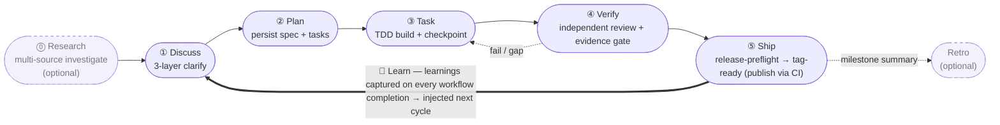
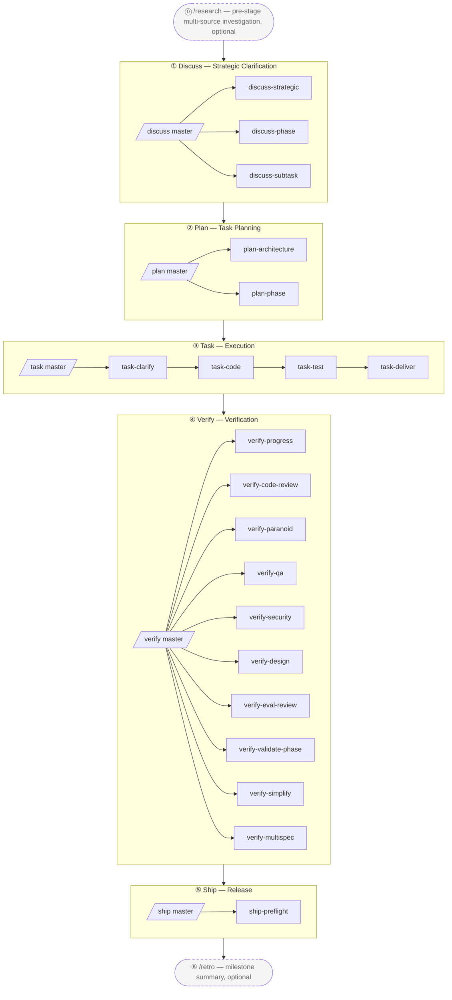

<p align="center">
  
</p>

**English** | [简体中文](./README-cn.md) | [繁體中文](./README-tw.md) | [日本語](./README-ja.md) | [한국어](./README-ko.md) | [Português (Brasil)](./README-pt-BR.md) | [Türkçe](./README-tr.md) | [Русский](./README-ru.md) | [Tiếng Việt](./README-vi.md) | [ไทย](./README-th.md)

> _AI coding harness package manager + composition orchestrator_ — it assembles the best of the open-source ecosystem into one executable engine, wired by the three-layer **BDD → SDD → TDD** methodology.

> **harnessed is an orchestration brain + prompt library**, driving native subagent spawn through three fast, pure-function CLIs — `harnessed gates` (which sub-workflows fire), `harnessed prompt` (spawn-ready prompt for a sub), and `harnessed checkpoint` (record progress).

[](https://npmjs.com/package/harnessed)
[](./LICENSE)
[](https://github.com/sponsors/easyinplay)

> Not affiliated with, endorsed by, or sponsored by Harness Inc. (see [NOTICE](./NOTICE))

---

## ✨ TL;DR

**How it works**: harnessed **assembles** the best open-source Claude Code agents (gstack, GSD, superpowers, planning-with-files) and **orchestrates** them into one workflow via opinionated composition skills. It does **not** vendor upstream code — manifests describe install/check, and composition skills conduct the multi-upstream collaboration (so an upstream upgrade is just a re-install, never a manual code sync).

### 🔁 The operating loop

> **Discuss → Plan → Build → Verify → Ship**, closed by a **Learn** loop — machine-executed across the three-layer stack (gstack governance · GSD orchestration · superpowers TDD · checkpoint evidence). Raw agent work drifts; harnessed turns it into a source-of-truth path where progress and evidence persist instead of living in chat. **Learning is automatic**: every completed workflow appends its failure/loop/reject signals to `.planning/LEARNINGS.md`, which are injected into the next cycle — this is always-on, **not** gated on the optional Retro. Retro (`/retro`) is a separate, optional milestone summary.



---

## 🧱 What is the three-layer stack?

harnessed's three-layer stack is a software-engineering implementation of the established **BDD → SDD → TDD** nesting: three nested feedback loops, each answering a different question. The **three layers are the loops** (the stable theory); harnessed **composes** the open-source ecosystem into each loop — and the components **overlap**, which is exactly what a composition orchestrator arbitrates.

| Layer | Loop | Question it answers | Composed from (overlapping) |
|---|---|---|---|
| **① Behavior** | BDD | *What* to build + how we know it's done | gstack `/office-hours` governance · GSD discuss · superpowers brainstorming → acceptance criteria |
| **② Spec** | SDD | *How* it's structured | GSD plan-phase → requirements / design / tasks · contracts (Spec Kit / ECC patterns) |
| **③ Implementation** | TDD | Does it actually *work* | superpowers TDD red-green · subagent execution · GSD verify-work · ralph-loop completion |

The loops are **nested lenses, not phases** — the classic Cucumber BDD-outer + TDD-inner double-loop, extended with a GenAI-era SDD spec ring into a triple-loop. harnessed runs the default outer→inner traversal as its 5-stage cadence, plus the **back-edges it ships today**: Verify kicks failing work back to Task, a subagent that hits a gray area round-trips to clarification before continuing, and every shipped cycle feeds learnings back into the next Discuss. (Finer-grained structured back-edges — e.g. a contract contradiction routing straight to Spec, an ambiguous requirement to Behavior — are on the roadmap, not shipped. harnessed is the linear-cadence realization of the triple-loop; the full routed graph is its evolution path.)

**The components overlap — that's the point.** **GSD** threads through all three loops as the orchestration backbone, **gstack** spans Behavior + Review, **superpowers** spans Behavior (brainstorm) + Implementation (TDD). harnessed wires them — and arbitrates the overlap — into one engine. Two **cross-cutting disciplines** run through every layer: **karpathy principles** (*how* to code — simplicity-first, surgical diffs) + **mattpocock moves** (on-demand tactical tools like `/diagnose`, `/zoom-out`).

Mapped to the runtime loop above: **Discuss = Behavior (BDD) · Plan = Spec (SDD) · Build = Implementation (TDD)**, then **Verify + Ship** close it with evidence gates.

---

> Wait — can harnessed really go toe-to-toe with upstream giants like superpowers / gstack / GSD?
> Of course — we **stand on the shoulders of giants**. See further, Newton said. 🧐
> ... *(whispers)* Though on closer look, more like the parrot perched on said shoulder.
> Eh — parrots mimic; we **orchestrate**. 🦜

---

## 🎯 Key Differentiators

- **Three-layer stack machine-executed** — the **BDD→SDD→TDD nested triple-loop** ([what's that?](#-what-is-the-three-layer-stack)), composed from `gstack` + `GSD` + `superpowers` (overlapping, GSD as the backbone) with `karpathy 4 principles` + `mattpocock 23 moves` as cross-cutting disciplines
- **No vendoring of upstream** — manifests describe install/check; on upstream upgrade users just re-install to get the latest version
- **Composition Skill** — in-house workflow skills act as the conductor's baton, orchestrating multiple upstreams in concert. **1 super-master `/auto` + 5 stage masters + 20 sub-workflows + 2 standalones = 28 namespace-layered workflows**, full 5-stage machine-execution (`/auto` one-shot across stages / `/discuss /plan /task /verify /ship` single stage / 20 three-layer-stack subs / `/research /retro` 2 standalones)
- **L0 Discipline Substrate** — global cross-stage behavior baseline (karpathy principles + output-style + language + operational + priority + protocols), applied universally
- **Package manager mindset** — install dependency graph auto-resolves, doctor health check, install-base one-shot full install
- **Unified entry point** — users face `/discuss /plan /task /verify /ship` master slash commands without learning each upstream's terminology; sub commands explicitly invoke a single stage (e.g. `/discuss-strategic` runs only the strategic-layer clarification)
- **Forward continuation** — `harnessed next` / `harnessed advance` carry you across tasks and phases: when one finishes, the next is **derived from `.planning/` disk state** (a phase is done when its `PLAN` has a matching `SUMMARY`) — no queue to maintain, so a mid-stream new phase is picked up automatically, and resume re-derives from disk. A per-turn `NEXT-UNIT` breadcrumb points at what's next

---

## 🆚 vs Native Claude Code / Codex

Native agents give you primitives; harnessed wires them into a methodology. Where a native cell says a primitive "exists," you still design, wire, and maintain it yourself per project — harnessed ships it pre-composed and engine-driven.

| Dimension | Native Claude Code | Native Codex | harnessed |
|---|---|---|---|
| **Workflow / methodology** | Primitives only — you design the flow each time | Fewer primitives — freestyle per prompt | Codified **Discuss→Ship** 5-stage three-layer-stack engine — BDD + SDD + TDD loops + 2 cross-cutting (Review + Ship) |
| **Instruction injection** | `CLAUDE.md` + skills + hooks exist, but static & wired by hand | `AGENTS.md` only — no skills/hooks | Per-turn breadcrumb hook + task-scoped routing + learnings injected each cycle |
| **State / progress** | Chat context — lost on `/clear` / compaction | Chat context — no persistence layer | On-disk `.planning/` + `current-workflow.json` ledger + checkpoint evidence |
| **Cross-session recovery** | Re-explain the context by hand | Re-explain the context by hand | `harnessed status --recover`: you-are-here + next step |
| **Verification / "done"** | Agent self-reports "done" | Agent self-reports "done" | Independent review subagents + **fail-CLOSED evidence guard** (missing artifact = not done) |
| **Subagent orchestration** | Subagents + Agent Teams available, but orchestrated by hand | No subagent/team primitive | `gates → prompt → spawn → checkpoint`; Agent Teams auto-enabled per task |
| **Learning loop** | None | None | `LEARNINGS.md` auto-captured + injected into the next cycle |
| **Platform reach** | Claude Code only | Codex only | **Cross-harness** — Claude Code primary, Codex via platform layer |

> Native agents win on zero-setup, zero-overhead for trivial one-off edits. harnessed earns its keep the moment work spans multiple steps, sessions, or subagents — where freestyle drift and lost-in-chat state start costing you.

**Don't take our word for it — we ran the experiment.** A published A/B evidence pack ([docs/evidence/2026-07-b1/](./docs/evidence/2026-07-b1/)) compares `/auto` against bare Claude Code on 4 machine-graded tasks, full transcripts included. Honest headline: on small, fully-specified tasks both arms score 100% and bare is 4-5× cheaper — use bare (or auto-lite) there. The orchestration value claim lives in fuzzy-spec / multi-session territory, which that experiment deliberately does not cover; bring us a real task from that territory and we'll run the same protocol on it.

---

## 📦 Quick Install

**Via npm** (recommended — both channels are first-class and stay in sync):

```bash
npm install -g harnessed && harnessed setup
```

> Windows PowerShell 5.x does not support `&&` chaining — use `;` or two lines (`npm install -g harnessed; harnessed setup`). bash / zsh / PowerShell 7+ / cmd.exe all work normally.

**No Node.js? Standalone binary** — per-platform, self-updates via `harnessed update`:

```bash
# macOS (Apple Silicon) / Linux (x64)
curl -fsSL https://raw.githubusercontent.com/easyinplay/harnessed/main/install.sh | bash
```

```powershell
# Windows (x64)
irm https://raw.githubusercontent.com/easyinplay/harnessed/main/install.ps1 | iex
```

🤖 **Or have an AI install it for you** — paste this sentence to Claude Code (or any AI assistant):

> Install harnessed for me following the guide at `https://github.com/easyinplay/harnessed/blob/main/INSTALL-WITH-AI.md`

The AI will auto-fetch the doc + run the install, handling OS / permissions / PATH / corepack edge cases — no need to copy large chunks of text.

> [!TIP]
> 🚀 **The much-loved Agent Teams and Subagent features are auto-enabled in harnessed based on the task!**
> No need to manually configure `CLAUDE_CODE_EXPERIMENTAL_AGENT_TEAMS` — `harnessed setup` writes it to `~/.claude/settings.json` automatically. Pattern A full-stack three-way / Pattern C 4-specialist and other multi-agent workflows work out of the box.

---

## ⏱️ First 5 Minutes

The shortest path from zero to a running workflow:

```bash
# 1. Install (pick a channel — see Quick Install above)
npm install -g harnessed && harnessed setup
# or binary (no Node.js): curl -fsSL https://raw.githubusercontent.com/easyinplay/harnessed/main/install.sh | bash && harnessed setup
```

```
# 2. Inside Claude Code — kick off your first workflow
/auto "your first requirement"        # newcomer default: runs all stages end-to-end
```

```bash
# 3. Lost? Run harnessed with no arguments — it tells you where you are + what's next
harnessed
#   → you-are-here dashboard (active phase + per-step status) + a NEXT: auto|manual|done line
#   no need to remember status / next / resume — one command (comet `/comet` analog, read-only)
#   add --json for machine-readable output
```

```bash
# 4. Resume any time after an interruption
harnessed            # same you-are-here view
harnessed resume     # continue from the latest checkpoint
```

> Want finer control over which stage runs and when? See the 3 modes below.

---

## 🚀 Quick Start — 3 Options

In order of increasing user intervention:

### 🎯 Auto Mode (Recommended for newcomers / don't want to think hard)

```
/auto "requirement X"

# For large requirements you can explicitly stage (usually not needed — AI auto-judges and routes in;
# force it if you believe it's a large requirement):
/auto "requirement X" --staged
```

> Don't want to think hard, or just getting started — let harnessed handle everything. Runs the full 6 stages (research conditional → discuss → plan → task → verify → retro mandatory) without stopping. AI 1-shot auto-judges requirement complexity, suggests switching to `--staged` mode for large requirements (stops after each stage for review); before starting prompts "Do you have a clear understanding of the requirement?" — if no → auto-runs `/research` multi-source investigation; ends with mandatory `/retro` summary. Fail-fast on failure, resume via `harnessed resume`.

### 📂 Stage Mode (Recommended for power users / want to review intermediate results)

```
/discuss "requirement X"          # Strategic + Phase + Subtask 3-layer clarification
/plan "requirement X"             # Architecture (conditional) + plan persistence
/task "subtask-1"                 # 4 subs serial (clarify → code → test → deliver)
/verify "phase-1"                 # 10 subs conditional verification
```

> Want to decide which stage to start from / review intermediate outputs — 5 masters callable independently, and each master still auto-fans-out all of that stage's subs internally.

### 🔬 Surgical Mode (Expert mode / you know what you want)

```
/discuss-phase "..."        # Run only Phase-layer clarification
/plan-architecture "..."    # Run only architecture review
/verify-paranoid "..."      # Run only the Paranoid Staff Engineer review
# ... pick any of the other 20 sub-workflows
```

> "I'm an expert, I'll decide myself" — skip the master, invoke a sub-workflow directly. Suits advanced users who know exactly which sub they need, or reuse of a single step.

---

## 📐 5-Stage Flow Diagram



> Dashed boxes = optional standalones (`/research` pre-strategic investigation / `/retro` post-milestone summary); solid boxes = main 5-stage cadence (Ship stops at tag-ready; `publish.yml` CI does the actual publish).

### 28-Workflow Overview Table

| Slash cmd | Stage | Type | Capability / Upstream | Brief |
|-----------|-------|------|----------------------|-------|
| `/auto` | All | **Super-master** | masterOrchestrator (across 6 stages) | One-shot full 6-stage run (research conditional → discuss → plan → task → verify → retro mandatory); AI 1-shot complexity judge + understanding check + mandatory retro; `--staged` opt-in stage gate |
| `/discuss` | ① Discuss | Master | masterOrchestrator | 3 subs parallel gate-eval (chain-isolation rule) |
| `/discuss-strategic` | ① Discuss | Sub | gstack `/office-hours` + `/plan-ceo-review` + planning-with-files | Strategic layer — mandatory governance for new features / new milestones / product direction (findings.md persisted) |
| `/discuss-phase` | ① Discuss | Sub | GSD `/gsd-discuss-phase` + planning-with-files | Phase layer — ≥2 open decisions / gray-area clarification (findings.md + knowledge.md persisted) |
| `/discuss-subtask` | ① Discuss | Sub | superpowers brainstorming + `/grill-with-docs` | Subtask layer — ≥2 approaches / core algorithm / API contract (ephemeral short discussion, not persisted) |
| `/plan` | ② Plan | Master | masterOrchestrator | Serial invoke of 2 subs (architecture conditional → phase always) |
| `/plan-architecture` | ② Plan | Sub | gstack `/plan-eng-review` | Architecture layer — mandatory governance gate for complex architecture |
| `/plan-phase` | ② Plan | Sub | GSD `/gsd-plan-phase` + planning-with-files `/plan` | Plan layer — persists `task_plan.md` + `progress.md` |
| `/task` | ③ Task | Master | masterOrchestrator | Serial invoke of 4 subs per subtask (clarify → code → test → deliver) |
| `/task-clarify` | ③ Task | Sub | superpowers brainstorming + `/grill-with-docs` conditional | Subtask startup clarification gate |
| `/task-code` | ③ Task | Sub | karpathy 4 principles + `/zoom-out` / `/improve-codebase-architecture` / `/diagnose` conditional | Subtask coding + cross-session progress.md sync |
| `/task-test` | ③ Task | Sub | superpowers TDD red-green-refactor + `/diagnose` conditional | TDD mandatory for core logic (alias mattpocock `/tdd`) |
| `/task-deliver` | ③ Task | Sub | `ralph-loop` SDK wrapper + Agent Teams conditional | Until verbatim `COMPLETE` + R20.10 max_iter fallback |
| `/verify` | ④ Verify | Master | masterOrchestrator | 10 subs conditional dispatch by scenario |
| `/verify-progress` | ④ Verify | Sub | GSD `/gsd-verify-work` + `/gsd-progress` | Mandatory serial starting point — UAT acceptance + state sync |
| `/verify-code-review` | ④ Verify | Sub | `code-review` multi-subagent fan-out | High-confidence findings in parallel |
| `/verify-paranoid` | ④ Verify | Sub | gstack `/review` (Paranoid Staff Engineer) | Mandatory for critical-module pre-PR |
| `/verify-qa` | ④ Verify | Sub | gstack `/qa` + playwright-cli / `@playwright/test` / webapp-testing | End-to-end QA (has_ui_changes conditional) |
| `/verify-security` | ④ Verify | Sub | gstack `/cso` | OWASP / auth / secrets (has_auth_or_secrets conditional) |
| `/verify-design` | ④ Verify | Sub | gstack `/design-review` + ui-ux-pro-max + design-taste-frontend | Design system consistency (has_design_changes conditional) |
| `/verify-eval-review` | ④ Verify | Sub | GSD `/gsd-eval-review` | AI phase eval coverage audit (has_ai_phase conditional; pairs with plan-side gsd-ai-integration-phase) |
| `/verify-validate-phase` | ④ Verify | Sub | GSD `/gsd-validate-phase` | Nyquist requirement→test coverage backfill (requires_coverage_audit conditional) |
| `/verify-simplify` | ④ Verify | Sub | `code-simplifier` | Final serial simplification |
| `/verify-multispec` | ④ Verify | Sub | 4-specialist Agent Team Pattern C | Critical release / large refactor PR escalation (mutual SendMessage cross-examination) |
| `/ship` | ⑤ Ship | Master | masterOrchestrator | Release stage after Verify — preflight → delegate PR/deploy to gstack `/ship` → publish via CI (tag-ready boundary) |
| `/ship-preflight` | ⑤ Ship | Sub | `harnessed release-preflight` | Read-only release-readiness gate (CHANGELOG `[Unreleased]` / version / git-clean / tag-absent); blocks on failure |
| `/research` | Standalone | Standalone | Tavily / Exa MCP + ctx7 + GSD `/gsd-discuss-phase` | Multi-source investigation (Stage ① alternate) |
| `/retro` | Standalone | Standalone | gstack `/retro` + planning-with-files RETROSPECTIVE.md | Project / milestone close-out summary |

> Master orchestrator auto gate-routes to the right sub (chain-isolation rule — non-firing subs are transparently declared skipped).
> Direct sub invocation also bypasses the master to run a single stage, e.g. `/discuss-strategic "new feature X"`.

---

## ⚡ Usage Flow

5-stage three-layer-stack methodology — recommended driving via the 5 master orchestrators in series:

```
/discuss  →  /plan  →  /task  →  /verify  →  /ship
   ①         ②        ③         ④           ⑤
```

| Stage | Master | Main sub-workflows | Upstream collaboration |
| ---- | ---- | ---- | ---- |
| ① **Discuss** | `/discuss` | strategic / phase / subtask (3 in parallel) | gstack `/office-hours` + GSD `/gsd-discuss-phase` + superpowers brainstorming |
| ② **Plan** | `/plan` | architecture (conditional) → phase | gstack `/plan-eng-review` + GSD `/gsd-plan-phase` + planning-with-files |
| ③ **Task** | `/task` | clarify → code → test → deliver (4 serial per subtask) | karpathy principles + mattpocock moves + superpowers TDD + `ralph-loop` |
| ④ **Verify** | `/verify` | progress → 5 parallel conditional → simplify (+ multispec critical) | GSD `/gsd-verify-work` + code-review + gstack `/review` / `/qa` / `/cso` / `/design-review` + code-simplifier |
| ⑤ **Ship** | `/ship` | preflight (release-readiness gate) → delegate PR/deploy | `harnessed release-preflight` + gstack `/ship` + `publish.yml` CI (tag-ready boundary) |

Practical example:

```bash
# 1. Install workflow upstreams (one line installs gstack + GSD + superpowers + planning-with-files)
harnessed setup

# 2. Run the 5-stage cadence inside Claude Code
/discuss "new feature X"          # Strategic + Phase + Subtask 3-layer clarification
/plan "new feature X"             # Architecture (conditional) + plan (task graph persisted)
/task "subtask-1: API contract"   # 4 subs serial per subtask
/verify "phase-1"                 # 10 subs conditional
/ship                             # release-preflight gate → PR/deploy (tag-ready; publish via CI)

# 3. Resume after interruption (any time)
harnessed resume
```

> You can also invoke subs directly to bypass the master and run just one layer, e.g. `/verify-paranoid` runs only the Paranoid Staff Engineer review.

📊 Detailed mermaid + full stage walkthroughs: [docs/WORKFLOW.md](./docs/WORKFLOW.md)

---

## 🗂️ Architecture (5-stage namespace-layered)

### 1. Directory Structure

```
harnessed/
├── manifests/                  # L1: upstream description layer (NOT vendored)
├── workflows/                  # L6: composition skills (5-stage conductor's baton)
│   ├── discuss/                # Stage ① 3 layers (strategic + phase + subtask)
│   │   ├── auto/               # /discuss master gate-route
│   │   ├── strategic/          # /discuss-strategic (gstack /office-hours + /plan-ceo-review)
│   │   ├── phase/              # /discuss-phase (GSD /gsd-discuss-phase)
│   │   └── subtask/            # /discuss-subtask (superpowers brainstorming)
│   ├── plan/                   # Stage ② (architecture + phase task graph)
│   ├── task/                   # Stage ③ (clarify + code + test + deliver)
│   ├── verify/                 # Stage ④ (progress + code-review + paranoid + qa + cso + design + simplify + multispec)
│   ├── ship/                   # Stage ⑤ (preflight release-readiness gate → delegate PR/deploy to gstack /ship; tag-ready)
│   ├── research/               # standalone Stage ① alternate
│   ├── retro/                  # standalone post-⑤ milestone close
│   ├── capabilities.yaml       # L5a: ~100 entries, 7 categories SoT
│   ├── defaults.yaml           # ralph_max_iterations per workflow phase
│   ├── judgments/              # L5a: three-layer-stack criteria + parallelism + tdd + fallback + rules-routing
│   │   ├── strategic-gate.yaml
│   │   ├── phase-gate.yaml
│   │   ├── subtask-gate.yaml
│   │   ├── parallelism-gate.yaml         # L5b execution mechanism routing
│   │   ├── tdd-gate.yaml
│   │   ├── fallback.yaml                 # 3 rules: skip_with_transparency + override + chain_isolation
│   │   ├── web-design-routing.yaml       # UI design tool routing
│   │   ├── web-testing-routing.yaml      # E2E / browser testing tool routing
│   │   ├── web-search-routing.yaml       # Web search / doc fetch routing
│   │   └── stage-routing.yaml            # master orchestrator sub-stage routing
│   └── disciplines/            # L0: global cross-stage behavior baseline
│       ├── karpathy.yaml       # 4 principles + ≤200L
│       ├── output-style.yaml   # BLUF + no-emoji + no-em-dash
│       ├── language.yaml       # zh-Hans default + English preserve
│       ├── operational.yaml    # biome preempt + A7 + commit safety
│       ├── priority.yaml       # skill conflict arbitration
│       └── protocols.yaml      # cc-handoff design doc self-contained
├── routing/                    # L4: routing engine SSOT (decision_rules.yaml)
├── schemas/                    # L3: JSON Schema (IDE / CI consume)
├── src/                        # L4: TS engine (workflow + routing + cli + installers + checkpoint + audit + state)
├── tests/                      # vitest unit + integration + dogfood (R8.1 dogfood-first)
├── scripts/                    # CI gate (check-workflow-schema, transparency-verdict, state-archive)
├── .planning/                  # project memory (STATE + ROADMAP + REQUIREMENTS + per-phase + milestones)
└── docs/adr/                   # architecture decision records
```

### 2. Logical Layering (8 layers)

```
┌────────────────────────────────────────────────────────────┐
│ L7 User-facing slash cmd + harnessed CLI                    │
│   /discuss /plan /task /verify /ship (master) + 20 sub + /research /retro + /auto super-master
│   + direct gstack invoke (30+ optional): /office-hours /review /qa /...
├────────────────────────────────────────────────────────────┤
│ L6 Workflow orchestration (workflows/<stage>/<sub>/)         │
├────────────────────────────────────────────────────────────┤
│ L5b Execution Mechanism (orthogonal): subagent / Agent Teams │
│   / main session + ralph-loop wrapper                       │
│   parallelism-gate.yaml: default subagent → escalate 5 triggers │
│   Pattern A full-stack three-way / B opposing hypotheses / C multi-dim review │
├────────────────────────────────────────────────────────────┤
│ L5a Capability + Judgment + Defaults SoT                    │
│   capabilities.yaml (7 categories) + judgments/ (10 files) + │
│   defaults.yaml                                              │
├────────────────────────────────────────────────────────────┤
│ L4  Runtime engine (workflow / routing / handlers)           │
├────────────────────────────────────────────────────────────┤
│ L3  TypeBox schema + CI gate                                 │
├────────────────────────────────────────────────────────────┤
│ L2  Installer + Manifest engine                              │
├────────────────────────────────────────────────────────────┤
│ L1  Upstream components (NOT vendored)                       │
├────────────────────────────────────────────────────────────┤
│ L0  Discipline Substrate (applies globally)                  │
│   karpathy principles + output-style + language + operational + │
│   priority + protocols (applied universally to L1-L7)       │
└────────────────────────────────────────────────────────────┘
```

### 3. Cross-cutting Capabilities (capabilities.yaml — 7 categories, ~100 entries)

```
behavioral (6):       karpathy-guidelines + output-style + language + operational + priority + protocols
tool-slash-cmd (~60): gstack 30+ optional + gsd 10+ + mattpocock 12 high-frequency + etc.
tool-mcp (3):         chrome-devtools-mcp / tavily-mcp / exa-mcp
tool-cli (2):         ctx7 / gws
tool-plugin (2):      planning-with-files / @playwright/test
tool-bundled (3):     ralph-loop / webapp-testing / playwright-cli
agent-platform (3):   agent-teams-create / send-message / shutdown
```

### 4. Data Flow Example (user invokes `/discuss "new feature X"`)

```
[L7] User invokes /discuss "new feature X"
  ↓
[L6] workflows/discuss/auto/workflow.yaml master orchestrator
  ↓
[L5a] judgments.strategic-gate.fires + phase-gate.fires + subtask-gate.fires (3-way parallel eval)
  ↓
[L4] judgmentResolver.ts (4-level ref split) + exprBuilder.ts (expr-eval evaluate)
  ↓
[L0] discipline.priority-hierarchy arbitrates tool conflicts / output-style formats output
  ↓
[fires=true sub] → invoke sub-workflow (/discuss-strategic / /discuss-phase / /discuss-subtask)
  ↓ for each sub:
      ├─ behavioral_layer: karpathy-guidelines (always-on)
      ├─ tools_available: planning-with-files / ctx7 / mattpocock by-condition
      ├─ parallelism: judgments.parallelism-gate.<route>.fires (L5b mechanism)
      └─ phase invocations execute via capability template interpolation
  ↓
[fallback.yaml chain-isolation] 3 layers judged independently, not serially dependent
[Skip transparency declaration] non-firing subs → "⚠️ Skipped <sub> because <reason>"
  ↓
planning-with-files /plan (cross-cutting tool) → write artifacts to .planning/<phase-id>/
  ↓
[L4] state.ts writeCurrentWorkflow (proper-lockfile) + audit.append (12-field JSONL)
```

### 5. Decision Routing Matrix (rules-based, codified in judgments + capabilities)

| Scenario | Default → Escalate |
|------|---------------------|
| Parallelism mechanism | subagent → Agent Teams Pattern A/B/C (5 triggers) |
| UI design primary plan | **two-stage**: ui-ux-pro-max (audience / interaction logic / design axis — structure) → design-taste-frontend (anti-slop visual polish overlay, cross-agent taste-skill) |
| E2E browser exploration | playwright-cli (one-line Bash, token-efficient) |
| E2E commit-able TS | @playwright/test default |
| E2E Python backend linkage | webapp-testing |
| Performance / a11y / memory diagnostics | chrome-devtools-mcp |
| Web search (keyword) | Tavily MCP default |
| Web search (descriptive / academic) | Exa MCP |
| Library API docs | ctx7 CLI |
| GitHub URL | gh CLI |
| Single URL fetch | WebFetch built-in |
| Gmail / Drive / Calendar | gws CLI |
| Architecture review (complex) | gstack /plan-eng-review |
| TDD mandatory (core algorithm) | superpowers TDD OR mattpocock /tdd |
| Critical module PR | gstack /review |
| Large refactor PR multi-dim review | 4-specialist Agent Team Pattern C |
| Cross-session hand-off | discipline.protocols self-contained design doc |
| `/auto` complexity for large requirements | AI 1-shot judge → auto-suggest `--staged` (n abort suggests manual `/discuss`) |
| `/auto` requirement understanding | prompt before start → n auto-adds `/research` multi-source investigation |

---

## 🛠️ Operational Commands

> These are harnessed's own maintenance commands (setup / health check / backup-rollback / state recovery, etc.). For day-to-day feature development just use the slash commands above — you usually don't need these.

**v4.0 — orchestration brain.** Slash commands run clarification in the main Claude Code session (so questions reach you), then spawn CC-native subagents (enabling Agent Teams + clarification round-trips). harnessed provides the gate evaluation (`harnessed gates`) and spawn-ready prompts (`harnessed prompt`); the main session does the spawning. `harnessed run` remains for CI/headless use.

### CLI Commands

| Command | Description |
| ---- | ---- |
| `harnessed setup` | One-time setup; installs workflow skills to `~/.claude/skills/` + MCP to `~/.claude.json` |
| `harnessed gates <master>` | Evaluate which sub-workflows fire for a master stage (JSON: fire/skip/parallelism). Used by slash commands to orchestrate native spawns. |
| `harnessed prompt <sub>` | Output a spawn-ready prompt (role + checklist + disciplines + completion/clarification protocols) for a sub-workflow. |
| `harnessed checkpoint <action> <sub>` | Record sub-workflow start/complete/fail to `~/.claude/harnessed/checkpoints/`. |
| `harnessed` (no args) | Zero-arg you-are-here: active-workflow dashboard + `NEXT: auto\|manual\|done` + run hint; `--json` machine-readable; no active workflow → onboarding hint (comet `/comet` analog, read-only). |
| `harnessed next` | Deterministic next-step contract. Within a workflow: `NEXT: auto\|manual\|done`. When the workflow's subs are all resolved it falls through to the next **cross-unit** (next phase/task derived from `.planning/` disk state) with an exit-code contract (`0` advance · `2` done · `10` blocked). |
| `harnessed advance` | Forward continuation — print the next work unit (next phase/task) across the milestone and the command to run it. Print-only (the main session runs the next `/auto`); refuses to step past an incomplete earlier phase (`--force` overrides); `--json` drives a `while harnessed advance --json; do :; done` loop. |
| `harnessed reject <sub>` | Mark a sub as user-rejected (terminal, distinct from `failed`). |
| `harnessed compact [--tokens <n>]` | Summarize+evict resolved ledger entries (G6-safe: `fail_count>0` never evicted); auto-triggers on `checkpoint complete --tokens`. |
| `harnessed workflows` | List in-flight workflows (one per repo). |
| `harnessed learn "<lesson>"` | Append a prose learning to this repo's `.planning/LEARNINGS.md`. |
| `harnessed run <name>` | Run a workflow via in-process SDK spawn (CI/headless mode). Slash commands use CC-native spawn instead. |
| `harnessed resume` | Resume from the most recent checkpoint after a session interruption |
| `harnessed status` | Current phase + lock holder |
| `harnessed doctor` | Health check (Node / MCP / jq / Win bash / routing / token budget / skill integrity / GateGuard conflict / update-available, etc.) |
| `harnessed update [--check\|--upstreams\|--migration-report]` | Self-update, channel-aware: binary installs replace themselves in place from GitHub releases (sha256-verified, previous version kept for rollback); npm installs run `npm i -g harnessed@latest`. `--check` reports the latest version; `--upstreams` re-runs the base manifests; `--migration-report` is a read-only stale-state inventory |
| `harnessed release-preflight` | Read-only release-readiness gate (CHANGELOG `[Unreleased]` / version / git-clean / tag-absent); exits 1 if not ready. The Ship-stage gate. |
| `harnessed retro --done` | Reset the retro-reminder phase counter after running `/retro` (clears the per-turn RETRO-DUE nudge). |
| `harnessed install <name>` | Install an upstream manifest |
| `harnessed uninstall [name]` | Reverse uninstall |
| `harnessed backup` | Snapshot backup management |
| `harnessed rollback <timestamp>` | One-line rollback (EOL preserve + sha1 verify) |
| `harnessed gc` | Clean up expired backups |
| `harnessed audit-log` | Routing transparency log query (supports `--filter` jq expression) |

### Flags

> All commands **apply (immediate write)** by default — no flag needed. Advanced users can add `--dry-run` to preview.

| Flag | Description |
| ---- | ---- |
| `--dry-run` | Preview without writing to disk (advanced opt-in) |
| `--non-interactive` | CI / scripted scenarios |
| `--system` | Allow L4 global install (otherwise downgrade to L1 npx ephemeral) |
| `--yes` | Skip interactive confirm on uninstall |
| `--full-diff` | Expand diffs folded above 200 lines |
| `--no-color` | Force nocolor (even on TTY) |
| `--task <text>` | `run` — task description (passed as workflow `gateContext.task`) |
| `--task-stdin` | `run` — read task description from stdin until EOF (avoids shell-escape on quotes/$/`) |


---

## ❓ FAQ

<details>
<summary><b>Q1. Do I still need to install superpowers / gstack / GSD upstreams after installing harnessed?</b></summary>

<br>

Yes, but **the user experience = one command**:

```bash
harnessed setup  # Auto-installs gstack + GSD + superpowers + planning-with-files; 28 workflow skills land in ~/.claude/skills/ + Agent Teams env var auto-written to ~/.claude/settings.json
```

Think `brew install <formula>` pulling the full dependency set — you don't need to `brew install` each dependency separately.

</details>

<details>
<summary><b>Q2. Why not just vendor superpowers / gstack into the harnessed repo?</b></summary>

<br>

4 reasons:

1. **Differentiation philosophy** — harnessed is the "assembly-ist package manager" counterposed to the "all-in-one self-built" camp. Vendoring = losing the wedge → becoming yet another plugin pack
2. **License + attribution nightmare** — vendoring 4-5 actively maintained upstreams = a complex license patchwork
3. **Upstream upgrades flip direction** — current manifest description lets users re-install for the latest version on upstream upgrade; vendoring forces manual code sync and falls perpetually behind
4. **Bus factor 1** — a single maintainer keeping 4-5 vendored upstreams in sync = accelerated burnout

</details>

<details>
<summary><b>Q3. gstack / GSD / superpowers all look like plan/discuss tools — aren't they overlapping?</b></summary>

<br>

**No**. They are different stages of the three-layer stack:

| Stage | Upstream | Responsibility |
| ---- | ---- | ---- |
| Governance | gstack | Multi-role decision gates (CEO / EM / Designer / Paranoid Engineer) |
| Brainstorming | superpowers | Subtask design clarification, alternative comparison |
| Orchestration | GSD | High-level phase task graph + dependency analysis |
| Persistence | planning-with-files | Persists `task_plan.md` / `progress.md` / `findings.md` |

`/discuss /plan /task /verify /ship` — the 5 masters string the 5 stages together; each master internally delegates to its sub. Each stage does a different thing and feeds the next. **No merging**.

</details>

<details>
<summary><b>Q4. Do workflow phases run automatically or wait for the user?</b></summary>

<br>

Depends on the `pause` field in `workflows/<name>/SKILL.md` frontmatter:

- `pause: human_review` → blocks waiting for user approval (governance gate / final lock, e.g. `/discuss-strategic` gstack `/office-hours` + `/plan-architecture` `/plan-eng-review` lock-in gate)
- No `pause` → auto-chains to the next phase

Each phase output is written to `~/.claude/harnessed/checkpoints/`; after a session interruption `harnessed resume` continues from the latest checkpoint.

</details>

<details>
<summary><b>Q5. Is harnessed itself a CC plugin?</b></summary>

<br>

A hybrid:

- `npx harnessed@latest setup` runs the **Node.js CLI** (`bin/harnessed`) — or use the standalone binary from the one-line installer (no Node.js required)
- setup installs **workflow skills** (markdown) into `~/.claude/skills/`, loaded by the Claude Code runtime
- `/discuss` / `/plan` / `/task` / `/verify` etc. are slash commands inside CC that trigger skill execution
- The CLI and the CC skills share the `~/.claude/harnessed/checkpoints/` state directory

</details>

---


## License

[Apache-2.0](./LICENSE) — see [NOTICE](./NOTICE) (includes Harness Inc. trademark disclaimer)

Support development: [](https://github.com/sponsors/easyinplay)
