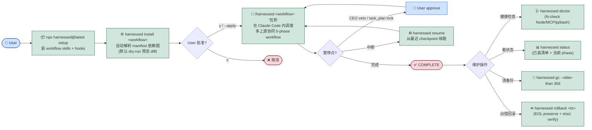

# harnessed

> **完整三层栈方法论的可执行 engine** — 6+ 虚拟角色（gstack 决策层 + GSD 项目经理 + superpowers 资深工程师）/ 双职责治理 / 4 心法 always-on / 23 招式 phase 路由 / 6 skill category，把 CLAUDE.md 协作规则机器化
> 在装配主义 base 之上：不 vendor 上游代码，用 manifest 描述 install/check，用 composition skill 编排多上游工作流（详 [ADR 0006](./docs/adr/0006-architecture-wedge-revision-v3.md)）

[](./LICENSE)
[](./.planning/ROADMAP.md)
[](https://github.com/sponsors/easyinplay)

> Not affiliated with, endorsed by, or sponsored by Harness Inc.（见 [NOTICE](./NOTICE)）

## 一句话定位

别人造轮子（如 ECC 自家 30 agents/135 skills），我们做"指挥棒"——装配市面上最优秀的开源 Claude Code 生态组件，用强意见的 composition skill 织成统一工作流；上层把 CLAUDE.md 里写的"gstack 决策 → GSD 项目经理 → superpowers 资深工程师"三层栈方法论机器化为可执行 engine。

## 关键差异化

- **三层栈机器化**（[ADR 0006](./docs/adr/0006-architecture-wedge-revision-v3.md)）：gstack（决策层 / 6+ 虚拟角色 / 治理关卡） + GSD（项目经理 / phase orchestration / 状态持久化） + superpowers（资深工程师 / 子任务执行质量） + andrej-karpathy-skills（4 心法 always-on baseline） + mattpocock-skills（23 招式 by-phase routing） — 8 支柱 100% capture，把 CLAUDE.md 协作规则机器化为可执行 engine
- **不 vendor**（base layer）：上游代码不进我们仓库，靠 manifest 描述 install/check（schema v1 frozen — see [ADR 0001](./docs/adr/0001-manifest-schema-v1.md)；phase 1.3 加 categorization 3 字段 errata see [ADR 0007](./docs/adr/0007-categorization-schema-extension.md)）
- **Composition Skill**：自家 workflow skill 当指挥棒，调度多个上游协同（research / execute-task / plan-feature 三 MVP workflow）
- **包管理器思维**：`harnessed install <workflow>` 自动解析依赖图、`doctor` 健康检查、`install-base` 一键装齐 base profile（10 固定 manifest）
- **强意见 vs all-in-one**：用户面对 `/harnessed:*` 统一入口，不需学每家上游术语

## Repo Structure

```
harnessed/
├── manifests/           # 上游描述层（不 vendor）
│   ├── tools/          # cc-plugin / mcp-npm / cli-npm
│   └── skill-packs/    # cc-skill-pack
├── workflows/          # composition skill（指挥棒）
├── routing/            # B+C 混合路由 SSOT
├── config-templates/   # 配置注入层（hooks 等）
├── schemas/            # JSON Schema artifact (publish 给 IDE / CI)
├── src/                # TS 源码（installer / validator / router / checkpoint）
├── tests/              # vitest 单测 + 集成 + bench
└── docs/adr/           # 架构决策记录
```

## Status

- **Current**: v0.3.0 SHIPPED 2026-05-17 (manifest 引擎 / installer runtime / routing engine / plan-feature workflow / checkpoint engine 全 GA)
- **In progress**: v0.4.0 milestone 2/3 — Phase 4.1 (dogfooding benchmark) + Phase 4.2 (co-maintainer onboarding + stale-bot + Sponsors) SHIPPED 2026-05-18; Phase 4.3 (audit log + ADR 全集 + v1.0-RC 收尾) pending
- **Full phase history + release plan + per-milestone audits**: [.planning/ROADMAP.md](./.planning/ROADMAP.md) / [.planning/milestones/](./.planning/milestones/)

## Install Quick Start（phase 1.2 ready）

`harnessed install <name>` **默认 dry-run**——列出将装的上游 / 改的文件，必须 `y` / `--apply` 才执行。详见 [docs/INSTALLER-CONTRACT.md](./docs/INSTALLER-CONTRACT.md) 6 条用户视角硬契约。

```bash
# 默认 dry-run（看 diff，不写盘）
harnessed install ctx7

# 显式 apply（交互场景）
harnessed install ctx7 --apply

# 自动化场景（CI 流水线）— 双 flag 必须
harnessed install tavily-mcp --non-interactive --apply

# 看已装状态 / 备份 / 清理
harnessed status
harnessed backup list
harnessed gc --older-than 30d --apply

# 出错恢复（一行回滚 + EOL preserve + sha1 verify）
harnessed rollback 2026-05-12T15:30:00Z

# 健康检查（4-check：Node ≥ 22 / MCP scope / jq present / Win bash flavor）
harnessed doctor
```

### Flags

| Flag | 说明 |
| ---- | ---- |
| `--apply` | 显式执行（默认 dry-run） |
| `--dry-run` | 永不写盘（即使加 `--apply` 也优先 dry-run） |
| `--system` | L4 全局装允许（否则自动降级 L1 npx ephemeral） |
| `--non-interactive` | 自动化场景；必须配合 `--apply` 或 `--dry-run` 否则 exit 2 |
| `--full-diff` | 展开 > 200 行的 diff 折叠 |
| `--no-color` | 强制 nocolor（即使 TTY） |

## 使用流程（phase 1.2 实装后启用）

harnessed 是 **CLI + CC skill 混合体**——CLI 管装/检/恢复，skill 管编排：



```bash
# 1. 一次性 setup（装 workflow skills 到 ~/.claude/skills/、配置 hooks）
npx harnessed@latest setup

# 2. 装某个 workflow 用到的所有上游 plugin（一行装齐 4-5 个上游）
harnessed install plan-feature
# → 自动装 gstack + superpowers + GSD + planning-with-files

# 3. 跑 workflow（在 Claude Code 内输入 slash command）
/harnessed:plan-feature "新功能 X"
# → 调度 5 phase: gstack governance → superpowers brainstorm → GSD discuss/plan → planning-with-files persist
# → 暂停点等用户 approve（CEO veto / final task_plan lock）

# 4. 中断后恢复
harnessed status   # 看当前 phase
harnessed resume   # 从最近 checkpoint 继续

# 5. 健康检查
harnessed doctor   # 检测上游 stale / Windows ACL / 配置漂移
```

## FAQ — 常见疑问

**Q1. 装了 harnessed，还需要装 superpowers/gstack/GSD 等上游 plugin 吗？**

需要，但**用户感知 = 一行命令**：`harnessed install <workflow>` 自动解析 manifest 依赖图、装齐所有上游。类比 `brew install <formula>` 装全套依赖——你不需要单独 `brew install` 每个依赖项。

**Q2. 为什么不把 superpowers/gstack 的相关 skill 直接 vendor 进 harnessed 仓库？**

4 条理由：

1. **差异化哲学**（[ADR 0001](./docs/adr/0001-manifest-schema-v1.md) + PROJECT-SPEC § 6 wedge）：harnessed 是「装配主义包管理器」对位 ECC 的「all-in-one 自建派」。vendor = 失去 wedge → 沦为又一个 plugin pack
2. **License + attribution 噩梦**：vendor 4-5 个主动维护的上游 = 复杂 license 拼盘 + 违反 [vendor/ENTRY-CRITERIA.md](./vendor/ENTRY-CRITERIA.md)（要求"上游已停摆"才允许 vendor）
3. **上游升级反向**：当前 manifest 描述 → 上游升级用户重 install 即得新版；vendor 后必须手动 sync code → 永远落后
4. **Bus factor 1**：单 maintainer 维护 vendor 4-5 上游 = 加速 burnout（Avelino 论文实证 OSS 单 maintainer 年掉队率 36%）

**Q3. gstack 的 `/office-hours`、GSD 的 `/gsd-discuss-phase`、superpowers 的 brainstorming 看起来都是"plan/discuss"类，是不是重叠？**

不是。它们是**三层栈的不同阶段**（PROJECT-SPEC § 10 phases schema 显式编排）：

| 阶段 | 上游 | 职责 |
|------|------|------|
| Governance | gstack | 多角色决策关卡（CEO/EM/Designer/Paranoid Engineer） |
| Brainstorming | superpowers | 子任务设计澄清、方案对比 |
| Orchestration | GSD | 高层 phase 任务图 + 依赖分析 |
| Persistence | planning-with-files | 持久化 task_plan / progress / findings 到 markdown |

`/harnessed:plan-feature` 把这 4 个阶段串起来——每个阶段做不同事，输出喂给下一阶段。**没有合并**。

**Q4. workflow phase 之间是自动跑还是等用户？**

看 `workflows/<name>/SKILL.md` frontmatter 的 `pause` 字段：

- `pause: human_review` → 阻塞等用户 approve（governance gate / final lock 用，如 plan-feature 的 phase 01 + 05）
- 无 `pause` → 自动 chain 到下一 phase（中间步骤）

每个 phase 输出写到 `.harnessed/checkpoints/`，session 中断后 `harnessed resume` 从最近 checkpoint 继续。

**Q5. harnessed 自己是 CC plugin 吗？**

混合体：

- `npx harnessed@latest setup` 跑的是 **Node.js CLI**（`bin/harnessed`）
- setup 装的 **workflow skills**（markdown）进 `~/.claude/skills/`，由 Claude Code 在运行时加载
- `/harnessed:*` 是 CC 内的 slash command，触发 skill 执行
- CLI 和 CC skill 共享 `.harnessed/checkpoints/` 状态目录

## 文档导航

- [PROJECT-SPEC.md](./PROJECT-SPEC.md) — 立项参数 spec sheet（v2.1）
- [WORKFLOWS-MVP.md](./WORKFLOWS-MVP.md) — 3 个 MVP workflow 展开（v2.1）
- [docs/adr/](./docs/adr/) — 架构决策记录（17 ADRs 0001-0017）｜[docs/WORKFLOW.md](./docs/WORKFLOW.md) — 项目实际 dev 工作流 mermaid + 16-phase cadence 模式表 + CLAUDE.md gap 分析
- [.planning/ROADMAP.md](./.planning/ROADMAP.md) — 4 milestones × 3-5 phases 路线图
- [.planning/STATE.md](./.planning/STATE.md) — 跨 session 项目记忆 SSOT
- [CONTRIBUTING.md](./CONTRIBUTING.md) — 贡献指南（含 Windows corepack ACL workaround）
- [SECURITY.md](./SECURITY.md) — 漏洞披露通道

## Sponsor / Co-maintainer

GitHub Sponsors **已启用** (Phase 4.2 SHIPPED v0.4.0) — [](https://github.com/sponsors/easyinplay). Co-maintainer 6 月招募窗口已开启 — 完整入门指引参考 [docs/MAINTAINER-ONBOARDING.md](./docs/MAINTAINER-ONBOARDING.md)（30 分钟可跑通 dev 环境 per R8.2 验收）.

stale-bot 已上线 — 90 天无活动 issue/PR 自动关闭 (`.github/workflows/stale.yml`); issue 模板见 `.github/ISSUE_TEMPLATE/`。

## License

[Apache-2.0](./LICENSE) — 见 [NOTICE](./NOTICE)（含 Harness Inc. 商标 disclaimer）
