# harnessed Project Workflow

**Status**: SHIPPED & validated across 16 phases (Phase 1.1 → 4.2, 2026-05-12 ~ 2026-05-18)
**Source of truth for**: actual dev cadence used to ship v0.1.0 → v0.3.0 milestones + v0.4.0 2/3 progress

---

## Per-phase cadence (the actual workflow)

```mermaid
flowchart TD
    Start([New Phase X.Y]) --> Discuss["/gsd-discuss-phase X.Y"]
    Discuss --> Batch[4-question batch<br/>AskUserQuestion 1 call]
    Batch --> Lock[4 D-decisions LOCKED<br/>sneak-block 守门]
    Lock --> DShip[Ship discuss-phase:<br/>KICKOFF + CONTEXT + DISCUSSION-LOG]

    DShip --> Plan["/gsd-plan-phase X.Y"]
    Plan --> WaveA[Wave A 并行 background]
    WaveA --> R1[R1 gsd-pattern-mapper<br/>→ PATTERNS.md<br/>N targets + reuse %]
    WaveA --> R2[R2 gsd-phase-researcher<br/>→ RESEARCH.md<br/>~18 sections HIGH confidence]
    R1 --> WaveB
    R2 --> WaveB[Wave B gsd-planner<br/>single dispatch]
    WaveB --> PArt[PLAN.md + task_plan.md<br/>N atomic tasks × 3 waves]
    PArt --> WaveC[Wave C gsd-plan-checker<br/>iter 1, max 3]
    WaveC --> Pass{0 BLOCKER<br/>+ 0 WARNING?}
    Pass -- No --> Tier{Orchestrator<br/>tier-call}
    Tier -- FIX --> Revise[Planner revision iter N+1]
    Tier -- REJECT --> RiskNote[Risk note + ship anyway]
    Revise --> WaveC
    Pass -- Yes --> PShip[Ship plan-phase]
    RiskNote --> PShip

    PShip --> Execute["/gsd-execute-phase X.Y"]
    Execute --> W0[Wave 0: backlog absorb<br/>sister carry-forward<br/>STRICT path dep if dependent]
    W0 --> W1[Wave 1: main scope<br/>per-task atomic commit<br/>biome preempt MANDATORY]
    W1 --> W2[Wave 2: ship close]
    W2 --> Docs[5-doc 续编<br/>STATE + RETRO + ROADMAP<br/>+ README + PROJECT-SPEC]
    Docs --> Verify[Gate verify<br/>transparency-verdicts<br/>+ state-archive-stale<br/>+ pnpm test]
    Verify --> Dogfood[DOGFOOD-T2.X.md<br/>PASS N/N axes]
    Dogfood --> Tag[Baseline tag LOCAL CREATE<br/>NO push]
    Tag --> Approval{User PP<br/>push approval}
    Approval -- Yes --> Push[git push origin main<br/>+ tags]
    Push --> CI[CI 3-OS watch<br/>ubuntu / windows / macos]
    CI --> Green{CI green?}
    Green -- No --> Hotfix[Same-day hotfix<br/>commit + re-push]
    Hotfix --> CI
    Green -- Yes --> Sister[Sister review post-ship]

    Sister --> Tiered{Severity tier}
    Tiered -- H --> Inline[Inline absorb<br/>same-cycle commit]
    Tiered -- M+L --> Carry[Carry to next phase<br/>W0 prereq backlog]
    Inline --> Carry
    Carry -.next phase.-> Start

    classDef ship fill:#9be4a1,stroke:#2d8a3f
    classDef gate fill:#ffd966,stroke:#bf9000
    classDef hard fill:#f4cccc,stroke:#cc0000
    class DShip,PShip,Push ship
    class Pass,Approval,Green,Tier,Tiered gate
    class Hotfix,Tag hard
```

---

## Project-wide load-bearing patterns (cross-phase invariants)

| Pattern | Origin | Stability signal |
|---------|--------|------------------|
| **4-question batch all-Recommended** | Phase 3.1 → cadence locked | 7 phases 连续 (3.1→3.2→3.3→3.4→4.1→4.2 + 4.3 candidate) |
| **D-decision sneak-block 守门** | Phase 3.1 D-01~D-04 | 6 phases 连续 frozen contract |
| **Wave 0 sister carry-forward 一次根治** | Phase 2.3 → 2.4 (1st) | 9 iters (2.3→2.4→3.1→3.2→3.3→3.4→4.1→4.2→4.3) |
| **A7 守恒 ADR main body 0 diff** | Phase 1.1.1 | 11 phases 累积 0 false +/- |
| **PRIMARY helper family ≤50L** | Phase 3.1 W3 engineHook 49L | 4-member family (3.1+3.2+3.3+3.4) |
| **D2 ship-time T6.N cadence** | Phase 3.4 W2 T2.2 (1st) | ≥3-iter terminus stable (3.4 + 4.1 + 4.2) |
| **D3 STATE size gate ENFORCE** | Phase 3.4 W0.1 (warn-only) → 4.1 W0.2 (ENFORCE=true) | Round 1 ≤200L active; round 2 ≤175L pending |
| **Karpathy ≤200L source / ≤150L docs hard cap** | CLAUDE.md global rule | enforced in every Wave 1 commit |
| **biome preempt MANDATORY pre-commit** | Project memory `feedback_biome-preempt.md` | 3 CI-red recurrences resolved root cause |
| **Sister review tier absorb (H inline / M+L → next phase W0)** | Project memory `feedback_workflow-cadence.md` | 9 iters cadence延袭 |
| **PATTERNS § 5 R-5 "3 NO 守门"** | Phase 4.1 (publish-only phase exception) | NO ADR + NO ci.yml A7 iter + NO triple tag for non-architectural publish phases |

---

## Actual vs CLAUDE.md prescribed (gap analysis)

CLAUDE.md prescribes a richer multi-tier stack (gstack `/office-hours` + `/plan-ceo-review` 强制 → `superpowers:brainstorming` per sub-task → mattpocock 招式 → `ralph-loop` per task → `code-review` + gstack `/review` + `code-simplifier` post-ship). The actual project workflow above is a **simplified GSD-only cadence** that omits these layers because:

| CLAUDE.md prescribed | Actual project use | Reason omitted |
|---------------------|-------------------|----------------|
| gstack `/office-hours` + `/plan-ceo-review` pre-phase | NOT used | 1-person solo project; CEO/Eng-Manager review = self-review absorbed into discuss-phase 4-question batch |
| `superpowers:brainstorming` per sub-task | NOT used | atomic task acceptance criteria in task_plan.md already encode design clarity |
| `superpowers:test-driven-development` per sub-task | NOT used | tests written same-commit as feature (sister Phase 3.4 W1 T1.3 + T1.6 cadence) |
| `ralph-loop` per task COMPLETE promise | NOT used | gsd-executor agent ships atomic commits with grep-verifiable acceptance — equivalent guarantee, lower overhead |
| `code-review` multi-agent + gstack `/review` post-phase | NOT used routinely | sister review absorb cycle (manual + structured) serves equivalent function |
| `code-simplifier` post-phase | NOT used | Karpathy ≤200L hard cap + biome preempt = continuous simplification pressure |

**Verdict**: project uses CLAUDE.md as **philosophy + escalation menu**, not literal call sequence. When a task warrants the heavier stack (e.g., security-critical change, complex algorithm, UI work), the user invokes individual tools (e.g., `/diagnose`, `/security-review`, `ui-ux-pro-max`) on-demand rather than baking them into every phase cadence.

---

## When to use which workflow tier

| Trigger | Recommended layer |
|---------|-------------------|
| New phase ship (default) | this doc's mermaid cadence |
| Security-critical change | + `/security-review` post-W2 |
| Complex algorithm / data structure | + `superpowers:brainstorming` at task_plan authoring time |
| UI / frontend work | + `ui-ux-pro-max` (primary) + `frontend-design` (style supplement) |
| Hard bug | `/diagnose` (skill) or `/gsd-debug` |
| Library/API question | `/find-docs` (ctx7 routing) |
| Cross-AI peer review needed | `/gsd-review` (external AI consultation) |
| Milestone close | + full ship cadence: ADR N + ci.yml A7 iter + triple tag (NOT R-5 mitigation) |

---

## References

- [.planning/STATE.md](../.planning/STATE.md) — single SoT for current phase position
- [.planning/ROADMAP.md](../.planning/ROADMAP.md) — 17 phases × 4 milestones plan
- [.planning/RETROSPECTIVE.md](../.planning/RETROSPECTIVE.md) — historical lessons + § ARCHIVED FROM STATE
- [CLAUDE.md](../CLAUDE.md) — global per-user workflow philosophy + escalation menu
- [.planning/phase-*/PATTERNS.md](../.planning/) — per-phase reuse mapping (sister-cadence input)
