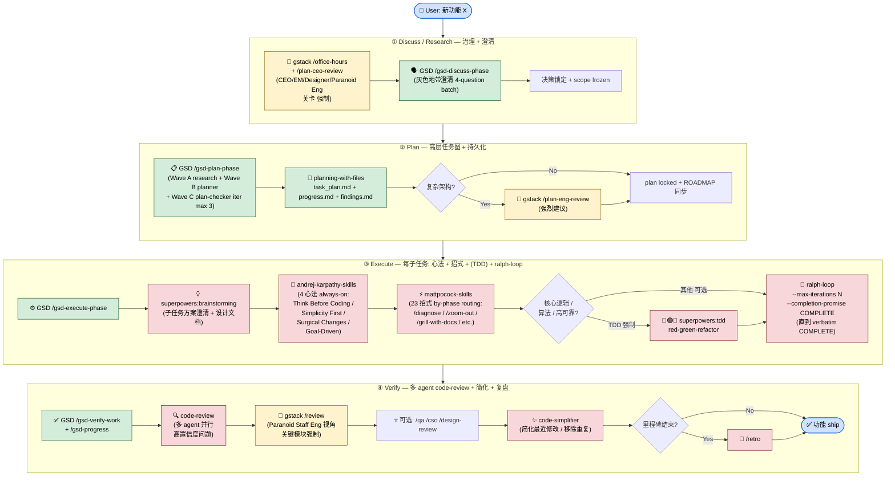

# harnessed-Enabled User Development Workflow

**Purpose**: 用户装完 harnessed 后, 用 `/harnessed:<workflow>` 启动的项目开发工作流详图 + CLAUDE.md detailed prescribed workflow 与 harnessed-shipped 实装能力的 gap 分析。

**Scope**: 这是 **end user 用 harnessed 开发自己项目** 的工作流 (NOT project-internal dev cadence for shipping harnessed itself — 那是 sister review absorb 模式, 不在此 doc 范围)。

---

## 4-stage 工作流总览 (CLAUDE.md prescribed cadence)

**Legend**: 🟦 User input / 🟨 gstack 治理层 / 🟩 GSD 项目经理 / 🟥 superpowers 资深工程师 + karpathy 心法 + mattpocock 招式 / 🟦 Done

---

## CLAUDE.md prescribed vs harnessed-shipped (v0.4) gap analysis

| Stage | CLAUDE.md prescribed | harnessed v0.4 shipped | Gap status |
|-------|---------------------|----------------------|-----------|
| ① Discuss governance | gstack `/office-hours` + `/plan-ceo-review` 强制 | `/harnessed:plan-feature` 5-phase 编排 phase 1 调度 gstack governance | ✅ FULL (Phase 3.2 W2 governance.json PUSH veto halt_workflow) |
| ① Discuss clarification | GSD `/gsd-discuss-phase` 灰色澄清 | 5-phase 编排 phase 2-3 调度 GSD discuss/plan | ✅ FULL (Phase 3.2 plan-feature WIRED reference) |
| ② Plan 任务图 | GSD `/gsd-plan-phase` 高层任务 | 5-phase 编排 phase 4 调度 GSD plan | ✅ FULL |
| ② Plan persist | planning-with-files task_plan.md | 5-phase 编排 phase 5 调度 planning-with-files persist | ✅ FULL |
| ② Plan eng-review | gstack `/plan-eng-review` (复杂架构强制) | 装齐 gstack 上游 (manifest install) 但 5-phase workflow NOT 编排进 | ⚠️ MANUAL invoke (用户自行 `/plan-eng-review`) |
| ③ Execute orchestration | GSD `/gsd-execute-phase` 高层调度 | 装齐 GSD 上游 + checkpoint 引擎 (Phase 3.1 SHIPPED) | ⚠️ MANUAL invoke (5-phase plan-feature ends at planning-with-files persist; 用户手动 `/gsd-execute-phase` 续跑) |
| ③ Execute brainstorming | superpowers `brainstorming` 每子任务 | 装齐 superpowers 上游 | ⚠️ MANUAL invoke (子任务级编排推 v0.5+) |
| ③ Execute karpathy | 4 心法 always-on baseline | 装齐 karpathy-skills 上游 (Phase 2.3 W3 注入引擎) | ✅ FULL (always-on per ADR 0012) |
| ③ Execute mattpocock | 23 招式 by-phase routing | 装齐 mattpocock-skills 上游 + routing 30/30 100% (Phase 3.4) | ✅ FULL (Phase 1.5 + 3.4 SHIPPED) |
| ③ Execute TDD | superpowers `tdd` (核心逻辑强制) | 装齐 superpowers 上游 | ⚠️ MANUAL invoke (用户自行 `/tdd`) |
| ③ Execute ralph-loop | `/ralph-loop --completion-promise COMPLETE` per task | 装齐 ralph-loop 上游 + execute-task workflow (Phase 2.2 SHIPPED) | ✅ FULL (Phase 2.2 ralph-loop full SDK integration) |
| ④ Verify GSD | GSD `/gsd-verify-work` + `/gsd-progress` | 装齐 GSD 上游 | ⚠️ MANUAL invoke |
| ④ Verify code-review | code-review 多 agent | 装齐 code-review skill | ⚠️ MANUAL invoke |
| ④ Verify gstack /review | gstack `/review` (Paranoid Staff Eng 关键模块强制) | 装齐 gstack 上游 | ⚠️ MANUAL invoke |
| ④ Verify code-simplifier | code-simplifier 修改后简化 | 装齐 simplify skill | ⚠️ MANUAL invoke |
| ④ Verify retro | `/retro` 里程碑复盘 | 装齐 | ⚠️ MANUAL invoke |

**Verdict**: harnessed v0.4 已装齐所有 4-stage 上游 (manifest install 100% coverage), 但 `/harnessed:plan-feature` 当前自动编排范围 = Stage ① + ② 的 5-phase (gstack governance → superpowers brainstorm → GSD discuss/plan → planning-with-files persist + governance PUSH veto halt_workflow per Phase 3.2 W2 SHIPPED)。Stage ③ Execute + ④ Verify 的子任务级编排为 **reference 调用** (workflow.run.ts ≤80L mock + 5 SKILL.md stubs per Phase 3.2 W2 plan-feature 5-phase WIRED reference), 用户在 Claude Code 内手动按需 `/gsd-execute-phase` / `/gsd-verify-work` / `/code-review` / `/gstack:review` / `/code-simplifier` / `/retro` 等 — **完整 4-stage 自动化推 v0.5+ dogfood 信号触发** (per ROADMAP R8 deferred ideas)。

---

## Special-purpose tools (按需召唤)

CLAUDE.md prescribes additional tools for specific scenarios; harnessed manifests support all:

| 场景 | 工具 | harnessed manifest |
|------|------|---------------------|
| UI/UX 主方案 | `ui-ux-pro-max` (数据驱动 / 标准化) | ✅ ui-ux-pro-max |
| UI 风格补充 | `frontend-design` (创意 / 装饰) | ✅ frontend-design |
| 浏览器探查 / 调试 | `playwright-cli` (Bash 一行) | ✅ playwright |
| E2E 功能测试 commit | `@playwright/test` (TS) OR `webapp-testing` (Python) | ✅ playwright |
| 性能 / a11y / 内存 | `chrome-devtools-mcp` (LCP/Core Web Vitals/ARIA) | ✅ chrome-devtools |
| 系统化排错 | mattpocock `/diagnose` OR GSD `/gsd-debug` | ✅ |
| 陌生模块导航 | mattpocock `/zoom-out` | ✅ |
| 规格澄清 | mattpocock `/grill-with-docs` | ✅ |
| 架构健康 | mattpocock `/improve-codebase-architecture` | ✅ |
| 节省 token | mattpocock `/caveman` | ✅ |
| 库 / API 文档 | `/find-docs` (ctx7 routing) | ✅ |
| Web 搜索 | Tavily MCP (默认) OR Exa MCP (描述式 / 学术) | ✅ |
| 跨 AI peer review | GSD `/gsd-review` (外部 AI consultation) | ✅ |

---

## Coverage 路线图 (v0.5+ 完整自动化目标)

- **v0.4 NOW**: Stage ① + ② 5-phase 自动化 `/harnessed:plan-feature`; Stage ③ + ④ reference + manual invoke
- **v0.5**: plan-feature 真接外部 gsd-* spawn dogfood, Stage ③ 子任务级自动 `gsd-* spawn`
- **v0.6**: Stage ④ Verify 子任务级自动 (`code-review` + `gstack /review` + `code-simplifier` + `/retro` 编排进 5-phase 后置)
- **v1.0**: 完整 4-stage 自动化, 用户只需 `/harnessed:<workflow> "task"` 一行触发 + 关键 checkpoint approval

---

## 引用

- [CLAUDE.md (user global)](../CLAUDE.md) — 详细 prescribed workflow 来源
- [PROJECT-SPEC.md](../PROJECT-SPEC.md) — § 10 phases schema 显式编排
- [WORKFLOWS-MVP.md](../WORKFLOWS-MVP.md) — 3 MVP workflow (research / execute-task / plan-feature) 设计
- [.planning/ROADMAP.md](../.planning/ROADMAP.md) — v0.5/v0.6/v1.0 完整自动化目标
- [docs/MAINTAINER-ONBOARDING.md](./MAINTAINER-ONBOARDING.md) — 外部 contributor 30 分钟入门指南
