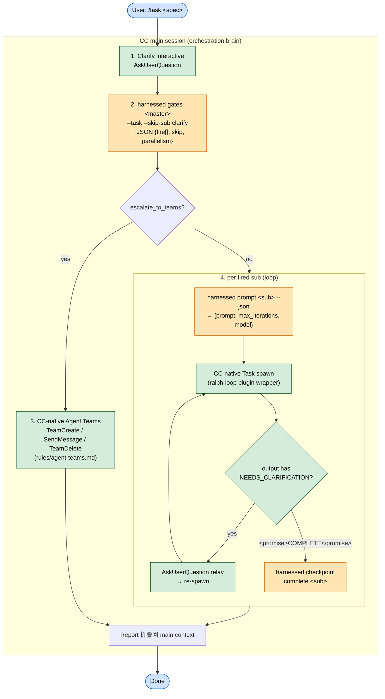

# harnessed v4.0 — 4-Stage Namespace-Layered Workflow Architecture (orchestration-brain architecture)

**Purpose**: harnessed v4.0 用户开发工作流详图 — 4-stage cadence + 8-layer architecture + 24 workflow + L0 Discipline Substrate + L5b Execution Mechanism + 12 judgments yaml routing + 102 capabilities 7-category 分布。**v4.0 核心转向**: harnessed 从 "execution engine"(in-process SDK spawn 整条 workflow)转为 "orchestration brain + prompt library" — slash command 指挥 CC main session 编排 **CC-native subagent spawn**,详 § 1.5。

> **Count note** (2026-06-11): 本 doc v4.0 撰写,计数已刷新至 v6.0 实测 — **24 workflow.yaml / 12 judgments yaml / 102 capabilities / 7 L0 disciplines**(v6.0 加 `doc-discipline` 第 7 个 discipline + Phase 12 哨兵 `checkPlanningSync`)。下方明细表多为 v3.0 era 结构,headline 计数以本 note 为准。**v13.0 update (2026-07-01)**: +2 verify conditional sub(`/verify-eval-review` GSD gsd-eval-review has_ai_phase + `/verify-validate-phase` GSD gsd-validate-phase requires_coverage_audit)→ workflow.yaml 现 **28**(check-workflow-schema v3=28); capabilities +4(buckets 1-5+7 total 35→39, +verification-before-completion/gsd-eval-review/diagram/gsd-validate-phase, +systematic-debugging alias); 详 ADR-0035。

**Scope**: 这是 **end user 用 harnessed 开发自己项目** 的工作流 (NOT project-internal dev cadence for shipping harnessed itself)。v3.0 完全替换 v2.0 `/plan-feature` + `/execute-task` + `/verify-work` 3-workflow prose;v4.0 在 v3.0 8-layer architecture 之上**仅替换 EXECUTION mechanism**(命令如何 spawn),yaml SoT(disciplines / judgments / capabilities)不变。

**Status**: v4.0 orchestration-brain refactor — slash command body 由 `harnessed setup` 生成为 3 种 type(INTERACTIVE / ORCHESTRATOR / EXECUTION),通过 `harnessed gates` + `harnessed prompt` + `harnessed checkpoint` 三个秒级 CLI 驱动 CC-native spawn;`harnessed run` 保留为 CI/headless ONLY。底座沿 v3.0 namespace-layered architecture(BREAKING per CHANGELOG [3.0.0]),Sister Obsidian doc 4-stage cadence verbatim 机器化 + ~/.claude/CLAUDE.md 全 codify。

---

## 1. 4-stage cadence (CLAUDE.md prescribed verbatim)

```mermaid
flowchart TB
    Start([User: 新功能 X]) --> S1

    subgraph S1["Stage 1 Discuss — 治理 + 澄清 (3 layer 独立判断)"]
        direction LR
        D1["/discuss master<br/>gate-route 3 sub"]
        D1 --> Ds["/discuss-strategic<br/>gstack /office-hours +<br/>/plan-ceo-review<br/>(strategic-gate.fires)"]
        D1 --> Dp["/discuss-phase<br/>GSD /gsd-discuss-phase +<br/>planning-with-files findings.md<br/>(phase-gate.fires)"]
        D1 --> Dt["/discuss-subtask<br/>superpowers brainstorming<br/>(subtask-gate.fires)"]
    end

    S1 --> S2

    subgraph S2["Stage 2 Plan — 任务图 + 持久化"]
        direction LR
        P1["/plan master<br/>串行 invoke"]
        P1 --> Pa["/plan-architecture<br/>gstack /plan-eng-review<br/>(phase.is_complex_architecture)"]
        P1 --> Pp["/plan-phase<br/>GSD /gsd-plan-phase +<br/>planning-with-files task_plan.md"]
    end

    S2 --> S3

    subgraph S3["Stage 3 Execute — per subtask"]
        direction LR
        T1["/task master<br/>串行 invoke 4 sub"]
        T1 --> Tc["/task-clarify<br/>superpowers brainstorm +<br/>mattpocock /grill-with-docs<br/>(gate: 不熟 OR ≥2 approach)"]
        T1 --> Tcode["/task-code<br/>karpathy 心法 +<br/>mattpocock /zoom-out /improve-arch +<br/>planning-with-files progress.md"]
        T1 --> Tt["/task-test<br/>superpowers TDD OR<br/>mattpocock /tdd<br/>(tdd-gate.fires)"]
        T1 --> Td["/task-deliver<br/>ralph-loop COMPLETE wrapper<br/>(parallelism-gate.fires)"]
    end

    S3 --> S4

    subgraph S4["Stage 4 Verify — multi-agent 审查 + 简化"]
        direction LR
        V1["/verify master<br/>5-9 sub conditional"]
        V1 --> Vp["/verify-progress<br/>GSD /gsd-verify-work +<br/>/gsd-progress (必跑串行)"]
        V1 --> Vcr["/verify-code-review<br/>multi-agent parallel"]
        V1 --> Vpr["/verify-paranoid<br/>gstack /review<br/>(关键模块强制)"]
        V1 --> Vqa["/verify-qa<br/>(conditional has_ui_changes)"]
        V1 --> Vs["/verify-security<br/>(conditional has_auth_or_secrets)"]
        V1 --> Vd["/verify-design<br/>(conditional has_design_changes)"]
        V1 --> Ve["/verify-eval-review<br/>GSD /gsd-eval-review<br/>(conditional has_ai_phase)"]
        V1 --> Vv["/verify-validate-phase<br/>GSD /gsd-validate-phase<br/>(conditional requires_coverage_audit)"]
        V1 --> Vsi["/verify-simplify<br/>code-simplifier (末尾)"]
        V1 --> Vmu["/verify-multispec<br/>4-specialist Agent Team Pattern C<br/>(关键发布)"]
    end

    S4 --> S5([Done OR milestone close → /retro])

    classDef user fill:#cfe2ff,stroke:#0a58ca,color:#000
    classDef master fill:#ffe5b4,stroke:#cc6600,color:#000
    classDef sub fill:#d4edda,stroke:#155724,color:#000
    class Start,S5 user
    class D1,P1,T1,V1 master
    class Ds,Dp,Dt,Pa,Pp,Tc,Tcode,Tt,Td,Vp,Vcr,Vpr,Vqa,Vs,Vd,Vsi,Vmu sub
```



**Legend**:
- 🟧 Master orchestrator (auto gate-route per `judgments.*-gate.fires` 独立判断)
- 🟩 Sub workflow (独立 slash cmd 可单独 invoke)
- 🟦 User input / milestone marker

---

## 1.5 v4.0 Execution Model — orchestration brain + CC-native spawn

**v3.x 旧机制 (superseded)**: slash command (`~/.claude/commands/<x>.md`) pipe 到 `harnessed run` → **in-process SDK spawn 整条 workflow**。问题: (a) 阻塞当前 session(整个 workflow 在 harnessed 进程内跑); (b) bypass CC-native Agent Teams(harnessed 自己的 SDK spawn 无法用 CC 平台层编队); (c) **无法做 clarification round-trip**(headless subagent 不能向 user 提问)。

**v4.0 新机制**: slash command 不再直接 `run`,而是**指挥 CC main session 编排 CC-NATIVE subagent spawn**。harnessed 退居为 "决策大脑 + prompt 库",由三个秒级 CLI 暴露纯函数式查询(gate 路由 / prompt 生成 / checkpoint 记录),实际 spawn / Agent Teams / ralph-loop / AskUserQuestion 全部由 CC main session 用 **CC 原生工具**执行。流程:

1. **Clarify interactively** — main session 用 `AskUserQuestion` 当面澄清(subagent 不能向 user 提问的根因解)。
2. **Gate route** — `harnessed gates <master> --task "<spec>" --skip-sub clarify` → JSON `{fire:[{sub,order,mode}], skip, parallelism:{escalate_to_teams}}`。
3. **Teams 分支** — 若 `escalate_to_teams` 为 true → CC-native Agent Teams(`TeamCreate` / `SendMessage` / `TeamDelete`,per `~/.claude/rules/agent-teams.md`)。
4. **per fired sub** — else 对每个 fired sub:`harnessed prompt <sub> --json` → `{prompt, max_iterations, model}` → **CC-native `Task` spawn** 外层套 ralph-loop plugin → 若 output 含 `STATUS: NEEDS_CLARIFICATION` → `AskUserQuestion` relay 给 user → re-spawn → 直到 output 含 `<promise>COMPLETE</promise>` → `harnessed checkpoint complete <sub>` 记录。
5. **`harnessed run` 保留** — 仅 CI / headless 场景(无 interactive main session 可编排时)。

### 1.5.1 v4.0 orchestration flow (mermaid)



### 1.5.2 三个新秒级 CLI (v4.0)

| CLI | Purpose | Output shape |
|---|---|---|
| `harnessed gates <master> --task "<spec>" --skip-sub <s>` | 对 master orchestrator 跑 gate-eval,返回应激活 / 跳过的 sub 列表 + parallelism 路由 | JSON `{fire:[{sub,order,mode}], skip:[...], parallelism:{escalate_to_teams:bool, ...}}` |
| `harnessed prompt <sub> --json` | 为单个 fired sub 生成自包含 spawn prompt + 执行参数(供 CC-native `Task` 用) | JSON `{prompt:string, max_iterations:number, model:string}` |
| `harnessed checkpoint complete <sub>` | 记录某 sub 收到 `<promise>COMPLETE</promise>` 后的完成状态(cross-session 持久化) | text 确认行(写 `.planning/` checkpoint 状态) |

三者皆纯查询 / 记录,秒级返回,**不 spawn 任何 subagent**(spawn 由 CC main session 用原生 `Task` / Agent Teams 执行)。

### 1.5.3 三种 command body type (由 `harnessed setup` 生成)

| Body type | Workflows | Behavior |
|---|---|---|
| **INTERACTIVE** | discuss family (`/discuss*`) + `/task-clarify` | main-session dialogue — `AskUserQuestion` 当面澄清,不 spawn |
| **ORCHESTRATOR** | `/auto` + `/plan` + `/task` + `/verify` (4 master) | `harnessed gates` → CC-native spawn(loop per fired sub OR Agent Teams 分支) |
| **EXECUTION** | 其余 sub workflow(`/task-code` `/verify-paranoid` 等) | `harnessed prompt <sub>` → 单次 CC-native `Task` spawn(ralph-loop wrapper) |

### 1.5.4 Why (v4.0 转向动机)

- **Keeps session responsive** — workflow 不再在 harnessed 进程内阻塞跑;main session 持续可交互,spawn 由 CC 原生异步执行。
- **Enables Agent Teams** — 编排权回到 CC main session 后,可直接用 CC 平台层 `TeamCreate` / `SendMessage`(v3.x in-process SDK spawn 做不到)。
- **Enables clarification round-trips** — subagent 遇 gray area 返回 `STATUS: NEEDS_CLARIFICATION`,main session `AskUserQuestion` relay 给 user 再 re-spawn — subagent 借 main session 之手"够到" user(headless 模式根本不可能)。

---

## 2. 8-layer architecture (L0-L7)

v3.0 = harnessed = **8-layer namespace-layered architecture**。每 layer 单一职责, 上层 references 下层 by name:

```
┌─────────────────────────────────────────────────────────────┐
│ L7  User Entry         /discuss /plan /task /verify (master) │
│                        + 16 sub slash cmd + /research /retro │
├─────────────────────────────────────────────────────────────┤
│ L6  Workflow           24 workflow.yaml (4 master + sub +    │
│                        2 standalone) — phases[] orchestration │
├─────────────────────────────────────────────────────────────┤
│ L5b Execution          subagent (default) / Agent Teams      │
│     Mechanism          (Pattern A/B/C escalate) / 主 session  │
│                        / ralph-loop (orthogonal wrapper)     │
├─────────────────────────────────────────────────────────────┤
│ L5a Workflow SoT       workflows/capabilities.yaml (102) +   │
│                        workflows/judgments/ (10 yaml routing)│
├─────────────────────────────────────────────────────────────┤
│ L4  Runtime            judgmentResolver + exprBuilder +      │
│                        phaseFactContext (47 field v3) +      │
│                        sdkReconcile + fallbackHandlers       │
│                        (v4.0: sdkReconcile/in-process spawn  │
│                         path 仅 CI/headless `harnessed run`; │
│                         interactive 走 gates+native spawn)   │
├─────────────────────────────────────────────────────────────┤
│ L3  TypeBox Schema     workflow.v3 + capability.v3 +         │
│                        discipline.v1 + judgment.v1 (16+1     │
│                        SCHEMA_VERSIONS surface)              │
├─────────────────────────────────────────────────────────────┤
│ L2  Installer          MCP / Plugin / NPM / Skill installer  │
│                        idempotent contract per ADR 0004      │
├─────────────────────────────────────────────────────────────┤
│ L1  Upstream Component gstack / GSD / superpowers /          │
│                        planning-with-files / mattpocock /    │
│                        karpathy / ralph-loop / etc.          │
├─────────────────────────────────────────────────────────────┤
│ L0  Discipline         workflows/disciplines/ 7 yaml          │
│     Substrate          (karpathy / output-style / language /  │
│                        operational / priority / protocols)   │
│                        — universal applies L1-L7             │
└─────────────────────────────────────────────────────────────┘
```

**关键 layer 说明**:
- **L0 Discipline** — global cross-stage behavioral norms (auto-enforce via hook); 详 § 3
- **L5a SoT** — capabilities + judgments yaml = single source of truth, NO code 内 hardcode
- **L5b Execution Mechanism** — orthogonal to L6 workflow; 详 § 4
- **L6 Workflow** — 20 workflow.yaml phases[] 编排 capabilities; 详 § 5

---

## 3. L0 Discipline Substrate (6 yaml universal-apply)

**位置**: `workflows/disciplines/*.yaml` (D-09 Phase v3.0-3.3 W0.4 SHIPPED)

**机制**: 6 yaml = global cross-stage behavioral norms。Runtime engine pre-phase loads + 通过 4 hook helper enforce:
- `before-phase-execute` — pre-load discipline rules for current phase
- `before-spawn` — sort fired capabilities by `priority.priority_hierarchy` rank
- `before-commit` — biome preempt auto-fix + A7 ADR conservation check
- `after-output` — BLUF / strip-sycophantic / em-dash / emoji validation

**Auto-enforce vs warn semantics**:
| Enforcement | 行为 |
|---|---|
| `halt` | 阻断 (e.g., file > 200L / `git push` 无 approval / `--no-verify` flag) |
| `auto-fix` | 自动修复 (e.g., biome `--write` / strip-sycophantic / replace em-dash) |
| `warn` | 提示 (e.g., BLUF missing / single commit > 300 lines diff) |
| `info` | 记录 only (e.g., 量词精确 llm-judge) |

### 7 Disciplines 详表

| # | Discipline | enforcement_layer | auto_enforce | 核心 rules (verbatim CLAUDE.md) | Sister source |
|---|---|---|---|---|---|
| 1 | `karpathy.yaml` | `code-writing` | true | think-before-coding (warn) / simplicity-first (warn) / surgical-changes (warn) / goal-driven (warn) / **file-length-200-hard-limit (halt)** | `~/.claude/CLAUDE.md` andrej-karpathy-skills 心法 |
| 2 | `output-style.yaml` | `output` | true | bluf-conclusion-first (warn) / **no-sycophantic-open-close (auto-fix)** / no-emoji-unless-requested (warn) / **no-em-dash (auto-fix)** / precise-quantifier (info) / no-end-recap (warn) / no-empty-continuation-question (warn) | CLAUDE.md 对话回答风格 |
| 3 | `language.yaml` | `output` | true | default-language-zh-hans (warn) / preserve-english-categories 8 类 (warn) / lang-request-override (info) | CLAUDE.md 语言与输出规范 |
| 4 | `operational.yaml` | `commit` | true | **biome-preempt (auto-fix)** / a7-adr-conservation (warn) / **no-push-without-approval (halt)** / **no-skip-hooks (halt)** / **destructive-ops-explicit (halt)** / authorization-not-transitive (warn) | project CLAUDE.md commit safety + `~/.claude/CLAUDE.md` |
| 5 | `priority.yaml` | `workflow` | true | multi-capability-arbitration (warn) — priority_hierarchy: gstack > gsd > superpowers > planning-with-files > karpathy > mattpocock > parallel | CLAUDE.md 响应规范与优先级 |
| 6 | `protocols.yaml` | `workflow` | false | cc-handoff-ideation-to-onboarding / plan-execute-cc-ready-metadata / **file-ownership-strict (halt)** | `~/.claude/rules/cc-handoff.md` |
| 7 | `doc-discipline.yaml` (v6.0) | `commit` | true | **state-digest-line-limit (halt + `HARNESSED_ALLOW_LONG_STATE` override)** / one-fact-per-file (warn) / overview-pointer-no-inline-narrative (warn) / transient-consume-then-archive (warn) / status-derived-from-artifacts (warn) / responsibility-matrix-one-home (info) | CLAUDE.md 文档纪律节 |

**snapshot policy** (K7 mitigation): 6 yaml = snapshot of CLAUDE.md as of v3.0 ship date, NOT live-load。CLAUDE.md update → harnessed patch release iterate snapshot。

---

## 4. L5b Execution Mechanism (orthogonal to L6 workflow)

**位置**: routing SoT = `workflows/judgments/parallelism-gate.yaml` (D-10 Phase 2.3 W0.2 SHIPPED, v3.0 extend)

**核心原则** (per `~/.claude/rules/agent-teams.md` verbatim):

```
任 phase 执行 = 选 1 mechanism (subagent OR Teams OR 主 session) + 可选 ralph-loop wrapper

每 phase yaml: parallelism: judgments.parallelism-gate.<route>.fires
```

### 4.1 Mechanism 路由表

| Mechanism | Default? | 触发条件 (any-OR-chain) | 用例 |
|---|---|---|---|
| **主 session 直跑** | downgrade | `lines < 20` OR `single_command_query` | 单 grep / 单 read / trivial edit |
| **subagent fan-out** | ✅ default | `file_independent` AND `parallel_count ≤ 3` AND `NO communication` | research / verify 单文件 / 跑测试 / 抓 doc |
| **Agent Teams escalate** | upgrade | `teammate_send_message_needed` OR `subagent_context_overflow` OR `shared_task_list` OR `opposing_hypothesis_debate` OR `fullstack_three_way` | 见下方 Pattern A/B/C |
| **ralph-loop wrapper** | orthogonal | 任 mechanism 外层套 `--completion-promise COMPLETE` | 完成 promise 保证 (sister Phase 2.4 W1.1 wire) |

### 4.2 Agent Teams 3 Pattern (verbatim from `~/.claude/rules/agent-teams.md`)

| Pattern | 用例 | Teammates | 通信 | harnessed wire 点 |
|---|---|---|---|---|
| **Pattern A** 全栈三路 | 前端 + 后端 + 测试同步推进 + API contract 对齐 | 3 (frontend / backend / test) | SendMessage cross-deps | Phase 2.4 W1 first-use validated |
| **Pattern B** 对立假设辩论 | root cause 调试 / 架构决策对立 | 2 teammate + 1 lead 裁判 | lead 给 evidence, 2 teammate 互怼 | task-clarify / verify-paranoid (option) |
| **Pattern C** 多维度审查 | 关键发布 / 大重构 PR (≥3 specialist 互相质询) | ≥3 specialist + 1 lead 委派 | lead 分发, specialist 互怼 finding 真伪 | `/verify-multispec` (W2.2 wire, gate `is_critical_release`) |

### 4.3 Cleanup 防呆铁律

- Session-scoped — Team 只活在当前 session, `/resume` 会丢 teammates
- 必须 `SendMessage shutdown_request` + `TeamDelete` cleanup
- Token cost estimation: `doctor check` + workflow runtime warn 当 `estimated team_cost > 2 × subagent fan-out cost`
- Brief 自包含 — teammate 启动时无主 session 上下文

---

## 5. 20 Workflow 全表 (4 master + 14 sub + 2 standalone)

**位置**: `workflows/<stage>/<sub>/{workflow.yaml + SKILL.md}` (D-03 nested 2-level)

| # | Slash cmd | Stage | Type | Capability / upstream | Brief description |
|---|---|---|---|---|---|
| 1 | `/discuss` | ① Discuss | **master** | (gate-route 3 sub via `judgments.{strategic,phase,subtask}-gate.fires`) | Auto orchestrator — 3 layer 独立判断激活 |
| 2 | `/discuss-strategic` | ① Discuss | sub | gstack `/office-hours` + `/plan-ceo-review` | 战略层澄清 (new project / milestone / 产品方向) |
| 3 | `/discuss-phase` | ① Discuss | sub | GSD `/gsd-discuss-phase` + planning-with-files findings.md | Phase 层澄清 (≥2 open decisions / 跨 phase 数据流) |
| 4 | `/discuss-subtask` | ① Discuss | sub | superpowers `brainstorming` | 子任务层澄清 (≥2 approach / 核心算法 / API contract) |
| 5 | `/plan` | ② Plan | **master** | (串行: architecture conditional → phase always) | Auto orchestrator — 持久化任务图 |
| 6 | `/plan-architecture` | ② Plan | sub | gstack `/plan-eng-review` | 复杂架构强烈建议 (fires when `phase.is_complex_architecture`) |
| 7 | `/plan-phase` | ② Plan | sub | GSD `/gsd-plan-phase` + planning-with-files `task_plan.md` | 高层任务拆分 + 持久化 (always) |
| 8 | `/task` | ③ Execute | **master** | (串行 invoke 4 sub per subtask) | Auto orchestrator — per subtask 全链路 |
| 9 | `/task-clarify` | ③ Execute | sub | superpowers `brainstorming` + mattpocock `/grill-with-docs` | 子任务澄清 (fires when 不熟 OR ≥2 approach) |
| 10 | `/task-code` | ③ Execute | sub | karpathy 心法 + mattpocock `/zoom-out` `/improve-arch` + planning-with-files `progress.md` | 编码执行 (心法 always-on + 招式 by-condition) |
| 11 | `/task-test` | ③ Execute | sub | superpowers TDD OR mattpocock `/tdd` | 测试 (fires when `tdd-gate.fires` 核心逻辑强制) |
| 12 | `/task-deliver` | ③ Execute | sub | ralph-loop COMPLETE wrapper | Completion-promise (`parallelism-gate.fires` mechanism 外层) |
| 13 | `/verify` | ④ Verify | **master** | (5-9 sub conditional per `judgments.stage-routing`) | Auto orchestrator — multi-agent + 简化 |
| 14 | `/verify-progress` | ④ Verify | sub | GSD `/gsd-verify-work` + `/gsd-progress` + planning-with-files `progress.md` | 必跑串行 (always) |
| 15 | `/verify-code-review` | ④ Verify | sub | code-review skill multi-agent parallel | 多 agent 高置信度问题 |
| 16 | `/verify-paranoid` | ④ Verify | sub | gstack `/review` (Paranoid Staff Engineer) | 关键模块强制 |
| 17 | `/verify-qa` | ④ Verify | sub | gstack `/qa` | Conditional `has_ui_changes` |
| 18 | `/verify-security` | ④ Verify | sub | gstack `/cso` | Conditional `has_auth_or_secrets` |
| 19 | `/verify-design` | ④ Verify | sub | gstack `/design-review` | Conditional `has_design_changes` |
| 20 | `/verify-simplify` | ④ Verify | sub | code-simplifier skill | 末尾简化 (`is_final_step` fires) |
| 21 | `/verify-multispec` | ④ Verify | sub | 4-specialist Agent Team Pattern C | 关键发布大重构 PR (`is_critical_release` fires) |
| 22 | `/research` | ① alternate | **standalone** | Tavily/Exa/ctx7 多源 + GSD synth | 多源调研 (v2.0 carry-over reuse) |
| 23 | `/retro` | post-④ | **standalone** | milestone close + lessons learned | Milestone retro (`is_milestone_close` fires) |

(实际 ship 20 workflow.yaml file — master 4 + sub 14 + standalone 2; 表中 23 row 含 master overview row 编号方便引用。)

**Master orchestrator behavior** (per D-01 auto gate-route):
- Master invoke → 并行 gate-eval per sub via `judgments.<sub>.fires` *(v3.0 描述的是 `harnessed run` in-process gate-eval+spawn 路径; v4.0: 现由 `harnessed gates` 返回 fire/skip JSON,再由 CC main session native spawn — `harnessed run` 仅 CI/headless,详 § 1.5)*
- 满足 condition 的 sub → 激活
- 不 fire 的 sub → **透明声明跳过** (sister `fallback.yaml` 铁律 1 `skip_with_transparency`)
- User 仍可独立 invoke 任 sub (sub 本身是独立 slash cmd)

---

## 6. 12 Judgments yaml routing map (verbatim Appendix B)

**位置**: `workflows/judgments/*.yaml` (D-11 ship; 6 v2 + 4 NEW v3)

| # | File | Root key | Status | Sister source |
|---|---|---|---|---|
| 1 | `strategic-gate.yaml` | triggers | v2 SHIPPED, v3 no change | CLAUDE.md 战略层 (3 ✅ + 4 ❌) |
| 2 | `phase-gate.yaml` | triggers | v2 SHIPPED, v3 no change | CLAUDE.md Phase 层 |
| 3 | `subtask-gate.yaml` | triggers | v2 SHIPPED, v3 no change | CLAUDE.md 子任务层 |
| 4 | `parallelism-gate.yaml` | triggers | v2 SHIPPED, v3 no change (4 route + ralph wrapper 已含) | `~/.claude/rules/agent-teams.md` |
| 5 | `tdd-gate.yaml` | triggers | v2 SHIPPED, v3 no change | CLAUDE.md TDD 强烈建议节 |
| 6 | `fallback.yaml` | rules | v2 SHIPPED, v3 no change (3 铁律) | CLAUDE.md fallback 3 铁律 |
| 7 | `web-design-routing.yaml` | triggers | **NEW v3** (两段式 3 trigger: ui-ux-pro-max-structure + design-taste-polish + design-review-post) | `~/.claude/rules/web-design.md` |
| 8 | `web-testing-routing.yaml` | triggers | **NEW v3** (4 trigger: playwright-test-default + playwright-cli-probe + webapp-testing-python-backend + chrome-devtools-mcp-diagnostic) | `~/.claude/rules/web-testing.md` |
| 9 | `web-search-routing.yaml` | triggers | **NEW v3** (5 trigger: tavily-default + exa-descriptive + tavily-crawl + ctx7-lib-docs + webfetch-single-url) | `~/.claude/rules/web-search.md` + `context7.md` + `google-workspace.md` |
| 10 | `stage-routing.yaml` | triggers | **NEW v3** (12+ trigger: master orchestrator sub delegation per D-01) | CLAUDE.md 4-stage + D-07 20 workflow |
| 11 | `user-overrides.yaml` | overrides | **v3.6.0** (keyword → trigger ref 覆盖, fallback 铁律 2 "用户明示 → 覆盖判据") | CLAUDE.md fallback 三铁律 |
| 12 | `stage-phase-gate.yaml` | triggers | **v5.1** (4 design-contract phase: spec / ui / secure / ai-integration, GSD Core 1.4.1) | GSD design-contract phase skills |

**Schema confirm**: 全 10 file 沿用 `judgment.ts` v1 schema (`JudgmentTriggersFile` 或 `JudgmentRulesFile`), schema_version 不 bump。

**3 铁律** (fallback.yaml, verbatim CLAUDE.md):
1. **拿不准 → 倾向跳过**, 但 transparent declare 跳过原因
2. **用户明示 → 覆盖判据** (用户说 "先 brainstorm" / "跑 office-hours" → 无条件激活)
3. **链式互不前置** (跳过战略层 ≠ 必须跳过 phase 层; 每层独立判断)

---

## 7. 102 Capabilities 7-category 分布表 (Appendix A verbatim)

**位置**: `workflows/capabilities.yaml` (v2 39 entry → v3 ~75 entry; D-08 + D-12 ship Phase 3.3 + 3.4)

| Category | Count | v2 SHIPPED | NEW v3 | 范围 |
|---|---|---|---|---|
| `behavioral` | **6** | 1 (karpathy-guidelines reclass) | 5 NEW | L0 discipline-ref (NOT slash cmd invoke) |
| `tool-slash-cmd` | **56** | 21 (11 matt + 6 gstack-core + 4 supp) | 35 (33 gstack optional + 2 gsd-W2 + 1 superpowers-subagent backfill) | mattpocock 11 / gstack 6 core + 33 optional / gsd 7 / superpowers 3 / design 2 |
| `tool-mcp` | **3** | 3 | 0 | chrome-devtools / tavily / exa |
| `tool-cli` | **2** | 1 (ctx7) | 1 (gws) | ctx7 / gws |
| `tool-plugin` | **2** | 1 (planning-with-files) | 1 (@playwright/test reclass) | Claude Code plugin / npm-cli |
| `tool-bundled-skill` | **3** | 2 (ralph-loop + webapp-testing reclass) | 1 (playwright-cli reclass) | sdk_ref bundled |
| `agent-platform` | **3** | 3 | 0 | TeamCreate / SendMessage / TeamDelete |
| **TOTAL** | **75** | **32** | **43** | (含 reclass 调整) |

### 7.1 category=behavioral (6 entry — D-09 L0 discipline-ref)

| # | Entry name | impl | cmd | discipline_ref |
|---|---|---|---|---|
| 1 | `karpathy-guidelines` | harnessed-bundled | `<virtual>` | `workflows/disciplines/karpathy.yaml` |
| 2 | `output-style-discipline` | harnessed-bundled | `<virtual>` | `workflows/disciplines/output-style.yaml` |
| 3 | `language-convention` | harnessed-bundled | `<virtual>` | `workflows/disciplines/language.yaml` |
| 4 | `operational-discipline` | harnessed-bundled | `<virtual>` | `workflows/disciplines/operational.yaml` |
| 5 | `priority-hierarchy` | harnessed-bundled | `<virtual>` | `workflows/disciplines/priority.yaml` |
| 6 | `conceptual-protocols` | harnessed-bundled | `<virtual>` | `workflows/disciplines/protocols.yaml` |

### 7.2 category=tool-slash-cmd (56 entry — 5 sub-bucket)

**mattpocock 11** (v2 SHIPPED):
`grill-with-docs` / `zoom-out` / `diagnose` / `caveman` / `grill-me` / `to-spec`(原 to-prd)/ `to-tickets`(原 to-issues,v15.0 上游改名)/ `improve-codebase-architecture` / `code-review` / `code-simplifier` / `investigate`

**gstack 6 core wrapped** (v2 SHIPPED — wrapped in 6 sub-workflow):
`gstack-office-hours` (discuss-strategic) / `gstack-plan-ceo-review` (discuss-strategic) / `gstack-review` (verify-paranoid) / `gstack-qa` (verify-qa) / `gstack-cso` (verify-security) / `gstack-design-review` (verify-design)

**gstack 33 optional** (NEW v3 D-12 register-only): 33 entry (e.g., `gstack-plan-eng-review` `gstack-design-consultation` `gstack-autoplan` `gstack-investigate` `gstack-codex` `gstack-benchmark` `gstack-design-shotgun` `gstack-design-html` `gstack-browse` `gstack-ship` `gstack-land-and-deploy` `gstack-canary` `gstack-document-release` `gstack-retro` `gstack-careful` `gstack-freeze` `gstack-gstack-upgrade` `gstack-learn` `gstack-plan-tune` `gstack-health` `gstack-make-pdf` ... 全集 33) — fires_when conditional per phase context

**gsd 7** (v2 5 SHIPPED + 2 W2 NEW):
`gsd-discuss-phase` / `gsd-plan-phase` / `gsd-review` / `gsd-debug` / `gsd-progress` / `gsd-verify-work` / `gsd-research-phase`

**superpowers 3**: `tdd` (alias `/tdd`) / `superpowers-brainstorming` / `superpowers-subagent-driven-development`

**special-purpose design 2**: `ui-ux-pro-max` / `design-taste-frontend`

### 7.3 category=tool-mcp (3)

| Entry | impl | cmd |
|---|---|---|
| `chrome-devtools-mcp` | mcp | chrome-devtools |
| `tavily-mcp` | mcp | `tavily_search` |
| `exa-mcp` | mcp | `web_fetch_exa` |

### 7.4 category=tool-cli (2)

| Entry | impl | cmd | sister |
|---|---|---|---|
| `ctx7` | cli | `ctx7` | `~/.claude/rules/context7.md` SOP |
| `gws` | cli | `gws` | `~/.claude/rules/google-workspace.md` (cond fires `subtask.needs_google_workspace`) |

### 7.5 category=tool-plugin (2)

| Entry | impl | cmd | requires |
|---|---|---|---|
| `planning-with-files` | claude-code-plugin | `/plan` | plugin `planning-with-files >=2.2.0` |
| `playwright-test` | npm-cli | `@playwright/test` | v3 reclassify from special-purpose |

### 7.6 category=tool-bundled-skill (3)

| Entry | impl | cmd | sdk_ref / plugin |
|---|---|---|---|
| `ralph-loop` | bundled-skill | `ralph-loop` | `src/routing/lib/ralphLoop.ts` |
| `webapp-testing` | gstack | `/webapp-testing` | v3 reclass (sister gstack 起源, paradigm 非 plugin) |
| `playwright-cli` | npm-cli | `playwright` | v3 reclass (AI-probe paradigm 非 plugin 非 CLI 标准) |

### 7.7 category=agent-platform (3 — L5b Execution Mechanism backbone)

`agent-teams-create` (TeamCreate) / `agent-teams-send-message` (SendMessage) / `agent-teams-shutdown` (TeamDelete)

---

## 8. CLAUDE.md / Obsidian doc / rules/ 全 codify 映射 (D-13 superset commitment)

harnessed v3.0 = **superset of user manual**:

| Source | harnessed codify 位置 |
|---|---|
| CLAUDE.md 4-stage cadence | 20 workflow (4 master + 14 sub + 2 standalone) |
| CLAUDE.md 三层栈判据 | `judgments/{strategic,phase,subtask}-gate.yaml` |
| CLAUDE.md 子任务并行机制 | `judgments/parallelism-gate.yaml` + L5b execution mechanism |
| CLAUDE.md fallback 3 铁律 | `judgments/fallback.yaml` |
| CLAUDE.md 语言/风格/priority/纪律 | L0 `disciplines/*.yaml` 6 file |
| CLAUDE.md mattpocock 23 招式 | `capabilities` category=tool-slash-cmd (v3 ship 11 高频, 23 全集 v3.x patch defer) |
| CLAUDE.md ralph-loop completion | `capabilities.ralph-loop` + workflow `/task-deliver` wrapper |
| Obsidian doc gstack 介入节点 | 6 core workflow + 33 optional capabilities |
| Obsidian doc 测试 3-layer + Pattern A/B/C | `judgments/web-testing-routing.yaml` + L5b 3 pattern |
| `rules/agent-teams.md` | `judgments/parallelism-gate.yaml` + L5b + doctor token cost check |
| `rules/web-design.md` | `judgments/web-design-routing.yaml` + capabilities entries |
| `rules/web-testing.md` | `judgments/web-testing-routing.yaml` + capabilities entries |
| `rules/web-search.md` | `judgments/web-search-routing.yaml` + capabilities entries |
| `rules/context7.md` | `judgments/web-search-routing.yaml` (lib-docs trigger 合并) + `capabilities.ctx7` |
| `rules/google-workspace.md` | `capabilities.gws` (cond fires_when) |
| `rules/cc-handoff.md` | `disciplines/protocols.yaml` (conceptual, NOT slash cmd) |

**harnessed > user manual via**:
- Auto gate-route (mechanized judgments eval, NOT user 手动判断 every layer)
- Pure bundled (1-command install vs user 手动 setup CLAUDE.md + rules)
- Cross-session memory (state.ts + `.planning/` persistence)
- ADR audit trail (vs user manual decision tracking)
- Token cost estimation built-in (vs user 心算)
- Real-time discipline enforcement (biome preempt auto-fire / BLUF auto-format / etc.)

---

## 9. v2.0 → v3.0 migration (BREAKING)

**DROP** (v2 slash cmd removed):
- `/plan-feature` (5-phase conflated; → use `/plan` master OR `/plan-phase` sub)
- `/execute-task` (单体; → use `/task` master OR `/task-{clarify,code,test,deliver}` sub)
- `/verify-work` (单体; → use `/verify` master OR `/verify-{paranoid,code-review,qa,...}` sub)

**KEEP** (carry-over):
- `/research` standalone (名字不变)

**NEW** (v3 added):
- `/retro` standalone (milestone close)
- 4 master orchestrator + 14 sub workflow + 4 NEW judgments yaml + 6 disciplines yaml

**User 升级**:
```bash
npm install -g harnessed@3.0
harnessed setup --apply
# 手动 remove ~/.claude/skills/{plan-feature,execute-task,verify-work}/ (K12 mitigation per Phase 3.6 W1.4 README block)
```

**Alias map** (CHANGELOG [3.0.0] BREAKING section):
| v2 cmd | v3 replacement | Note |
|---|---|---|
| `/plan-feature` | `/plan` OR `/plan-phase` | master auto-route OR sub direct |
| `/execute-task` | `/task` OR `/task-{clarify,code,test,deliver}` | master 串行 4 sub OR sub direct |
| `/verify-work` | `/verify` OR `/verify-{paranoid,code-review,qa,security,design,eval-review,validate-phase,simplify,multispec,progress}` | master conditional 5-9 sub OR sub direct |
| `/research` | `/research` | unchanged |
| (NEW) | `/retro` | NEW standalone |

---

## 10. References

- **`~/.claude/CLAUDE.md`** — 4-stage cadence prose 原型 (Discuss / Plan / Execute / Verify) + 三层栈判据
- **Obsidian Vault doc** `我的 Claude Code 开发方案（gstack + GSD + Superpowers 三层栈式组合，结合 Planning with Files、andrej-karpathy-skills、Ralph Loop 等顶级技能）.md` — 176L 完整开发方案 (user authored)
- **`~/.claude/rules/`** — agent-teams.md / web-design.md / web-testing.md / web-search.md / context7.md / google-workspace.md / cc-handoff.md (special-purpose tools routing)
- **`.planning/phase-v3.0-3.1/3.1-CONTEXT.md`** — 1 milestone + 13 D-decision LOCKED batch
- **`.planning/phase-v3.0-3.2/RESEARCH-capabilities.md`** — ~75 entry final registry + 10 judgments map + 47-field phaseFactContext.ts v3 delta
- **`.planning/phase-v3.0-3.2/PLAN.md`** — 6-phase wave plan + ~80 task
- **`docs/adr/0030-namespace-policy-bare-slash-cmd-lock.md`** (v3.0 NEW)
- **`docs/adr/0031-v3-4-stage-namespace-layered-architecture.md`** (v3.0 NEW)
- **`docs/adr/0032-cross-cutting-discipline-substrate-l0.md`** (v3.0 NEW)
- **`README.md`** — v3.0 highlight 节 (20 workflows + 4-stage diagram)
- **`CHANGELOG.md`** [3.0.0] BREAKING section + alias map

---

*Document: harnessed v3.0 4-Stage Namespace-Layered Workflow Architecture*
*Rewrite date: 2026-05-21 (Phase v3.0-3.6 T3.6.W1.5)*
*Sister: v2.0 SHIPPED docs/WORKFLOW.md prose REPLACED — v3.0 major refactor per D-04 pure ship deprecate v2*
